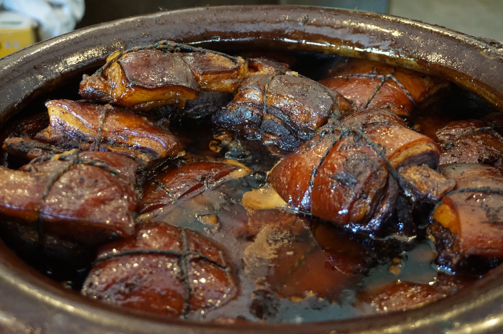
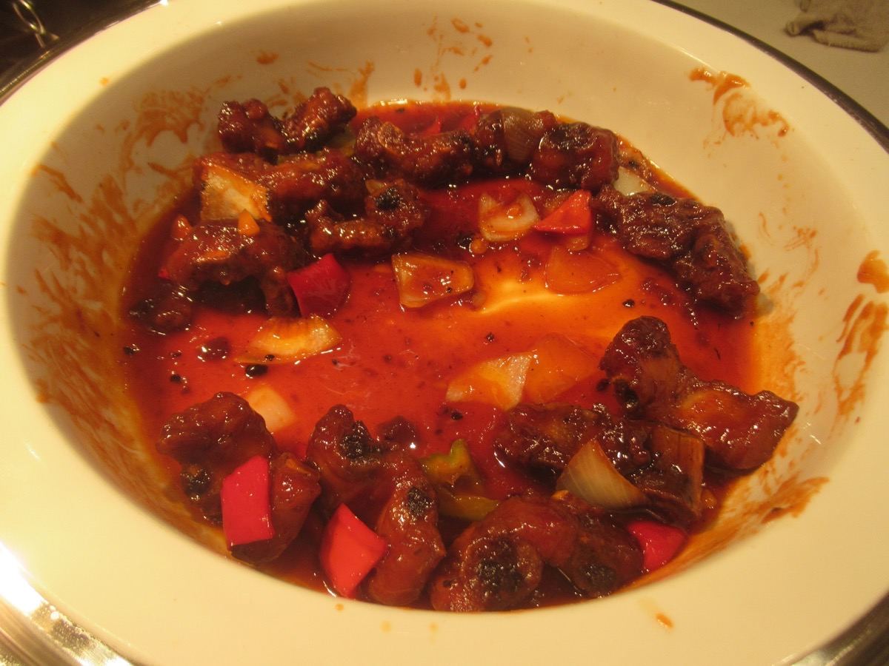
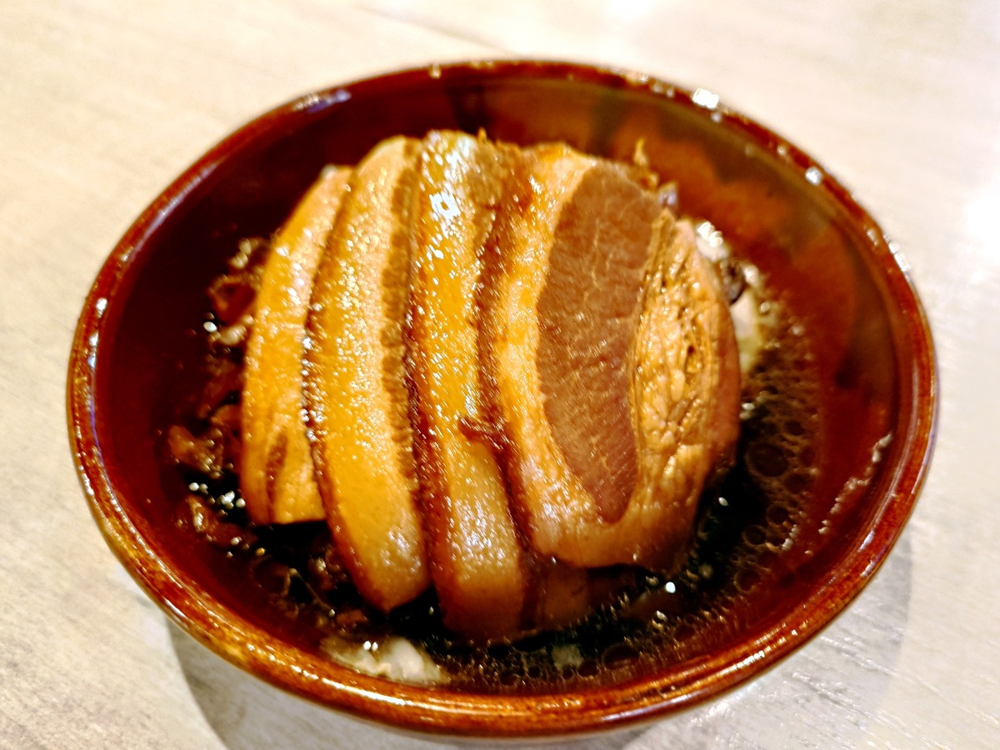
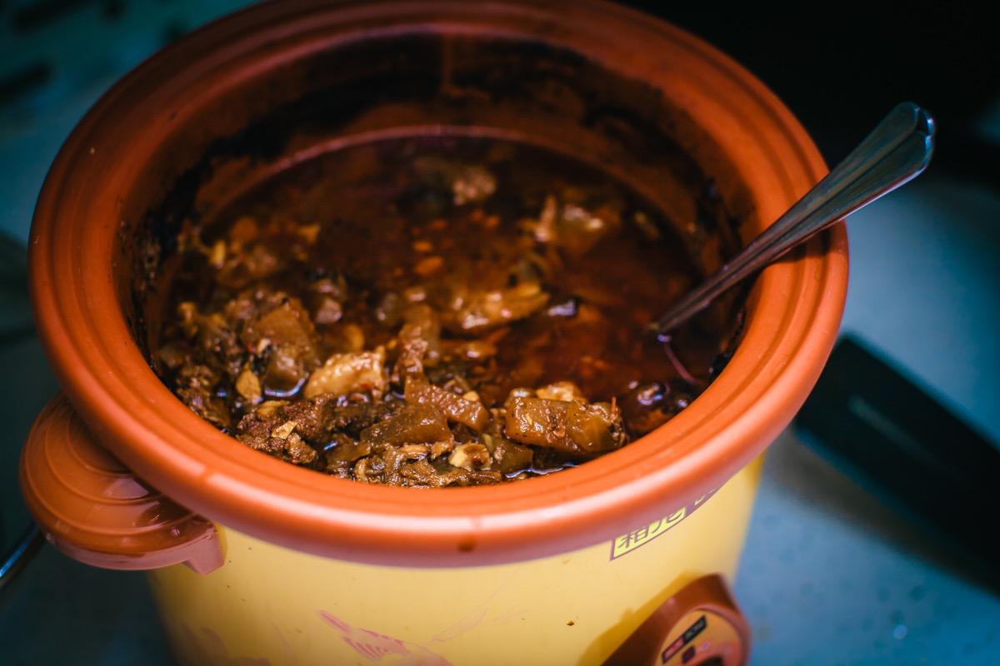
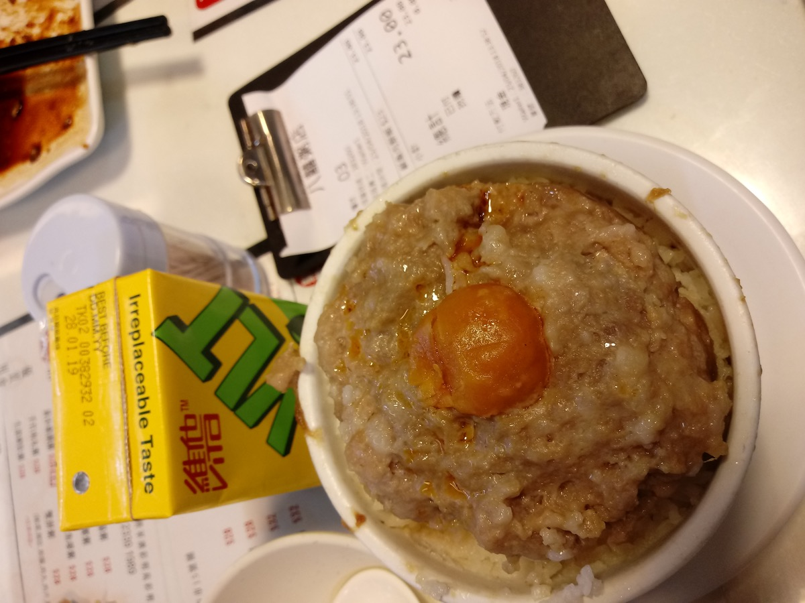

# 第二部 - 杭州

这章写的是杭州人在家**真正天天做的菜**，不是楼外楼菜单上的招牌。西湖醋鱼、东坡肉、龙井虾仁、叫花鸡、宋嫂鱼羹这些是宴客 / 招待外地朋友的菜，杭州人自己一年也做不了几次。

家里灶头每周都做的，是腌笃鲜、家常红烧肉、糖醋排骨、雪菜笋丝肉丝、番茄炒蛋、油焖春笋、肉饼蛋汤这些。这章按这个标准选了 14 道。

{ width="480" .center }

## 历史与地理

杭州坐在钱塘江口，背靠西湖，前面是江南最密的水网。这块地方的物产从来不缺：江里的鲚鱼、鲥鱼，湖里的鲫鱼、河虾，水田边的莼菜、菱角，山坡上的春笋、冬笋。富庶的鱼米之乡是基础，决定了这里的菜系不需要靠重味去掩盖食材，本味就够撑场面。这是"清鲜"两个字的物理来源。

真正把杭州菜推到独立菜系位置的，是 1138 年宋室南渡定都临安。北方政权整体迁来，带来的不只是皇帝和官员，还有数十万跟着南下的开封人口。临安城在十二世纪后半叶常住人口超过百万，是当时全世界最大的城市之一。北方的面食、羊肉、汴梁宫廷做法，跟江南本地的鱼鲜、笋蔬、米食在同一座城里合流。"鱼羊鲜"这种搭配能在杭州站住脚，跟这场南北融合直接相关。

西湖周边在南宋形成密集的酒楼和市食，加上漕运、海运在钱塘江口交汇，临安既是首都也是商业中心。这种环境催出了"南食"传统：清淡而不寡，甜咸交织，重时令，讲究食材的当季当地。河鲜、笋、莼菜在这套体系里地位最高，因为它们最经不起久放，也最能体现"清鲜"。

杭州菜归在江浙菜系下，跟苏州、宁波、绍兴是一支同源的兄弟。但因为有过临安那一百多年的首都身份，杭州菜比周边几支多带一点宫廷路线的工整：刀工讲究、火候讲究、调味克制。这不是地理决定的，是历史层叠出来的。

---

## 家常红烧肉

### 起源

红烧这种做法在江南普及，跟宋代以后江浙一带酱园发达、酱油成为家庭常备调料直接相关，没有便宜稳定的酱油就谈不上"红烧"。东坡肉相传跟苏轼任杭州知州时疏浚西湖、犒赏民工有关，是大块整块文火慢炖一两个小时、用酒不用水、端整块上桌的宴客菜，做法被楼外楼这一路的酒楼固定下来。家常红烧肉是另一回事：切小块、半小时上桌、为的是配一碗白米饭，杭州人家一周能做两三回。两者用的都是带皮三层五花，但家常版靠冰糖炒糖色给颜色和回甘，黄酒提香，老抽只用一点点点色，最后大火收汁让酱汁裹在肉块表面发亮，跟东坡肉那种汤汁丰盈、肉皮颤巍巍的状态完全不同。每家配方略有出入，有的加八角桂皮，有的只用姜葱，这是家常菜的常态。

### 食材

2-3 人份：

- 五花肉 500 g（带皮三层，切 2.5 cm 见方小块）
- 冰糖 25 g（炒糖色）
- 油 10 ml
- 生抽 25 ml
- 老抽 8 ml
- 黄酒 30 ml
- 姜 4 片、葱白 2 段、八角 1 颗（可省）
- 热水 适量（没过肉）
- 鹌鹑蛋 8 个（可选，提前煮熟剥壳）
- 盐 先不放，最后尝过再决定

### 步骤

1. 五花肉冷水下锅，加几片姜、5 ml 黄酒，水开焯 3 分钟，捞出温水冲净浮沫，沥干
2. 锅里下油 + 冰糖，小火炒糖色：冰糖慢慢化，颜色从透明变浅黄变焦糖色（**变红棕色冒小泡时立刻下肉**，慢一秒就糊苦）
3. 肉块入锅快速翻炒裹上糖色（10 秒内完成）
4. 倒黄酒（沿锅边淋）、生抽、老抽，下姜葱八角，倒**热水**没过肉
5. 大火烧开，转小火加盖炖 30 分钟
6. 鹌鹑蛋（如果加）此时下锅，再炖 10 分钟
7. 开盖大火收汁，**全程颠锅别用铲翻**（铲会把肉戳烂），收到汁挂在肉上发亮即可
8. 尝一下，咸了不用动，淡了再加几滴生抽

### 关键

- **冰糖炒糖色**这步是颜色和回甘的来源，白糖代替会发腻，酱油上色发黑
- 焯水后**温水冲洗**，冷水冲会让肉收紧发柴
- 烧的时候用**热水**，冷水会让肉骤冷收紧
- 收汁要快、要颠锅，慢慢炖糊在锅底就败了

### 常见错误

- 糖色炒过头：发黑发苦，整锅毁
- 焯水冷水冲：肉发柴
- 烧的时候加冷水：肉缩紧
- 老抽放太多：颜色发黑不亮
- 全程用铲翻：肉碎成渣

---

## 腌笃鲜

### 起源

腌笃鲜这道汤的根在绍兴和宁波一带，杭州、上海、苏州都跟着做。"腌"指咸肉，"鲜"指鲜肉，"笃"是绍兴话里小火慢炖咕嘟咕嘟那种状态，三个字把这道菜的食材结构和做法都讲清楚了。这套做法的成立，依赖江南农家冬天腌咸肉过冬的传统：每到岁末腌一缸咸肉吊在屋檐下，留到来年春天慢慢吃。等到清明前后春笋破土，咸肉还没吃完，新鲜五花肉又随时能买到，三样凑一块儿炖一锅就是腌笃鲜。咸肉的氨基酸吊出鲜肉的鲜，鲜肉的油脂又吊出春笋的鲜，三者互相成全。所以这道菜严格意义上是季节限定的，过了春笋季用冬笋或者罐头笋做，纤维粗、味道发苦，就不是这个汤了。杭州人家做这道汤往往再加一把百叶结进去吸汤，是本地化的细节。

### 食材

4 人份：

- 咸肉 200 g（金华或杭州咸肉，提前泡 1 小时去咸）
- 五花肉或里脊 250 g（鲜的）
- 春笋 400 g（**必须春笋，冬笋不对**）
- 百叶结 100 g（杭州人喜欢加，可省）
- 姜 3 片
- 黄酒 15 ml
- 葱花少许（最后撒）
- 盐 几乎不用，咸肉自己出咸

### 步骤

1. 咸肉切 2 cm 厚片，温水泡 1 小时去多余盐分（中途换水一次）
2. 鲜肉切大块（4 cm 见方），冷水下锅 + 姜片 + 5 ml 黄酒，焯 3 分钟，捞出冲净
3. 春笋去壳切滚刀块，**冷水下锅煮 5 分钟去涩**，捞出沥干
4. 砂锅放鲜肉、咸肉、春笋、姜片、10 ml 黄酒，加水没过 4 cm
5. 大火烧开，转最小火**炖 1.5 小时**（咸肉的咸要慢慢出来，急不得）
6. 1.5 小时后下百叶结，再煮 10 分钟
7. 关火前尝汤，淡了加一小撮盐（一般不用）
8. 撒葱花上桌

### 关键

- **必须春笋**，冬笋纤维粗、味道发苦，不是这个汤的味
- 咸肉要**先泡**，不泡会齁咸，整锅毁
- 全程**最小火**，大火汤会浊，小火汤清亮见底
- 春笋焯水去涩，直接下锅汤会有麻嘴感
- 盐**几乎不用**，咸肉的咸足够，先尝再决定

### 常见错误

- 用冬笋：味道差一截
- 咸肉不泡：齁咸到没法喝
- 大火炖：汤浊
- 加大葱大蒜：纯净的鲜被盖掉
- 笋不焯水：发涩麻

---

## 糖醋排骨

{ width="360" .center }

### 起源

糖醋这一路菜在江浙一带流行得早，跟镇江香醋的产销网有直接关系。镇江恒顺香醋自清代以来就是江南最普及的醋，长江一线的家厨都用它，糖醋里脊、糖醋小排、糖醋黄鱼这些菜都是在这套醋的味型上长出来的。杭州、上海、苏州、无锡的糖醋排骨做法只在甜酸比例上有差异：无锡偏甜得多，上海居中，杭州做法甜咸更均衡，醋香突出但不至于呛。这道菜本来就是为家庭灶头设计的，半小时一锅出，比东坡肉省事，又比红烧排骨多一道亮汪汪的酸甜挂浆，适合家里来客人或者给小孩做。糖比醋稍多，前期糖醋一起焖入味、出锅前再补一次醋拉香气，是这道菜避免"光剩酸"的核心思路，也是它跟北方那种勾芡浇汁的糖醋小排区别所在。

### 食材

2-3 人份：

- 猪小排 500 g（剁 4 cm 段，肋排部分最佳）
- 镇江香醋 50 ml
- 白糖 50 g（或冰糖 60 g）
- 生抽 20 ml
- 老抽 5 ml
- 黄酒 15 ml
- 油 15 ml
- 姜 3 片、葱白 2 段
- 白芝麻 少许（撒面，可省）

### 步骤

1. 排骨冷水下锅，加姜片 + 5 ml 黄酒，水开焯 3 分钟，捞出冲净沥干
2. 锅烧热下油，下排骨**煎到表面金黄**（每面 2 分钟，皮面焦香了再翻）
3. 加生抽、老抽、黄酒、姜葱、糖（**先不放醋**），加热水没过排骨
4. 大火烧开，转小火加盖**焖 25 分钟**
5. 开盖，加入醋的 **2/3**（约 35 ml），大火收汁
6. 汁快收干时淋入剩下的 **1/3 醋**（**这步是醋香的关键**），颠两下出锅
7. 撒白芝麻

### 关键

- **醋分两次下**，前期 2/3 焖煮入味（醋本身入肉）、后期 1/3 出锅前淋（醋香气）。一次性下醋香气全飞
- 排骨**先煎再炖**，煎过的排骨表面焦香、油脂香，水煮的排骨腥味重
- 糖比醋稍多 50:50 或 50:60，糖醋里脊的甜咸比例，杭州偏酸甜均衡
- 收汁不能太干，有汁挂着才亮，干了发暗

### 常见错误

- 醋一次全下：醋香没了只剩酸
- 排骨不煎直接炖：腥
- 收汁过头：发黑不亮
- 糖太少：不像糖醋排骨，像红烧排骨
- 用米醋：酸味单薄，必须香醋

---

## 梅干菜烧肉

{ width="360" .center }

### 起源

梅干菜是绍兴一带的看家干货，用芥菜或雪里蕻经过腌、晒、焐多道工序做成，能存一两年不坏。绍兴山多地少，过去农家一到冬天就得靠这种耐放的咸菜过日子，梅干菜跟霉千张、霉豆腐、糟卤一道构成绍兴的"霉腌"体系。梅干菜烧肉这道菜的逻辑很朴素：梅干菜本身咸而耐煮，跟肥腻的五花肉同锅慢炖，菜吸油、肉吃咸香，互相成全。这是典型的穷人智慧，半斤肉配一把梅干菜就能撑一桌饭，也因此从绍兴向外扩散到整个江浙，杭州人家冬天饭桌上几乎离不开。梅干菜扣肉是这道菜的宴席版，五花肉切大片码碗里再蒸；家常版直接切小块烧，省事得多，而且第二天回锅味道更浓，是江南冬天少数几道越放越好吃的家常菜。

### 食材

2-3 人份：

- 五花肉 400 g（切 1.5 cm 见方小块）
- 梅干菜 60 g（**温水泡 30 分钟去沙**，挤干切碎）
- 冰糖 15 g
- 生抽 15 ml
- 老抽 5 ml
- 黄酒 20 ml
- 姜 3 片、葱白 2 段
- 八角 1 颗
- 油 10 ml
- 热水 适量

### 步骤

1. 梅干菜温水泡 30 分钟，**期间换水 2 次**（去掉沙土），挤干切碎
2. 五花肉冷水下锅 + 姜片，焯 3 分钟，捞出冲净沥干
3. 锅里下油 + 冰糖小火炒糖色，红棕色冒小泡时下肉块翻炒
4. 加黄酒、生抽、老抽、姜葱八角，下梅干菜炒匀
5. 加热水没过 2 cm，大火烧开转小火**焖 45 分钟**
6. 开盖大火收汁，留一点底汁不要全干

### 关键

- **梅干菜必须泡 + 换水**，市售梅干菜里沙很多，没泡干净吃出沙
- 梅干菜要**挤得很干**再下锅，不挤干水分会稀释酱汁
- 炒糖色给颜色 + 回甘，直接老抽上色发黑
- 收汁留一点底，隔夜回锅时这点汁是关键

### 常见错误

- 梅干菜不泡：吃出沙，整盘毁
- 不挤干：汤汁稀，颜色淡
- 收汁太干：第二天回锅没汁，肉硬
- 肉块切太大：不入味，半小时焖不透

---

## 萝卜烧肉

{ width="360" .center }

### 起源

萝卜烧肉是全国都做的炖菜，但在杭州人家里有一套自己的脾气。江南冬天产白萝卜，霜打过的萝卜糖分上来变得清甜，过去蔬菜大棚没普及的年月，整个冬天饭桌上的青蔬就靠白菜、青菜、萝卜撑着，肉跟萝卜同烧是最自然的搭配。这道菜的逻辑跟梅干菜烧肉相反：梅干菜是干货，吸的是肉的油和咸；萝卜是水分大的鲜蔬菜，吸的是肉的鲜味同时把自己的清甜还回去，肥肉的腻被萝卜化掉，肉味又渗进萝卜里。北方做法常用大酱、酱油下得重，整锅颜色发黑发咸，杭州做法老抽只放几滴点色，靠冰糖给回甘和油亮，要的是萝卜半透明那种清润感，不抢萝卜本味。萝卜要后下保形状、先焯水去辣味，是这道菜跟北方土豆烧肉那种粗放路数不同的地方。

### 食材

2-3 人份：

- 五花肉 400 g（切 2 cm 见方）
- 白萝卜 600 g（切滚刀块 3 cm）
- 冰糖 15 g
- 生抽 15 ml
- 老抽 3 ml（少，颜色不要发黑）
- 黄酒 20 ml
- 姜 3 片、葱白 2 段
- 油 10 ml
- 热水 适量

### 步骤

1. 五花肉焯水（冷水下锅 + 姜 + 5 ml 黄酒，开后 3 分钟），冲净沥干
2. 萝卜切块，**冷水下锅煮 3 分钟**去萝卜辣味，捞出沥干
3. 锅烧热下油 + 冰糖炒糖色，下肉翻炒裹色
4. 加黄酒、生抽、老抽、姜葱，加热水没过肉
5. 大火烧开转小火炖 30 分钟（先炖肉，萝卜后下保持形状）
6. 下萝卜，再炖 25 分钟，**萝卜变半透明**就是入味了
7. 大火收汁到挂汁状态

### 关键

- **萝卜先焯水**去辣味，直接下锅萝卜带麻嘴感
- **肉先炖再下萝卜**，同时下萝卜会煮烂成泥
- 老抽用量小，这道菜要红润不要发黑，靠萝卜的清色
- 萝卜半透明 = 入味，还白心说明没透

### 常见错误

- 萝卜不焯：辣味麻嘴
- 萝卜跟肉同时下：炖 1 小时萝卜烂成泥
- 老抽放多：颜色发黑，丢失清甜
- 不收汁：汤太多没主次

---

## 韭黄炒蛋

### 起源

韭黄是软化栽培的韭菜，把韭菜根部用稻草或瓦罐遮光覆盖，叶子在见不到光的环境下长出来就是黄色，这种做法在中国至少能追到唐宋。江浙一带韭黄的主产地一直是杭嘉湖平原和苏南，冬春两季最盛，过去是江南人家招待客人才舍得买的"细菜"，比绿韭菜贵不少。颜色嫩黄、纤维软、香气也比绿韭菜柔和很多，没有那股冲鼻的辛辣，所以特别适合配蛋这种本味温和的食材，绿韭菜的味会把蛋盖过去。韭黄炒蛋是江浙家常菜里炒蛋的最高搭配，跟番茄炒蛋一甜一鲜是两条路：番茄那道靠酱汁，这道全靠食材本味，调料只有盐，几乎不放生抽，多一点酱油就毁了韭黄的清香。10 分钟一道菜，下饭下面都行。

### 食材

2 人份：

- 韭黄 150 g（切 3 cm 段）
- 鸡蛋 3 个
- 盐 2 g
- 油 20 ml（分两次）
- 黄酒 5 ml（打入蛋液，可省）

### 步骤

1. 韭黄洗净，**白色根部和黄叶分开切**，根部硬下锅早，叶子软下锅晚
2. 鸡蛋打散，加 1 g 盐 + 黄酒搅匀
3. 锅烧到冒烟，下油 10 ml，**油热到冒烟**倒入蛋液
4. 蛋液下锅立刻用筷子快速划散（**5 秒内成型**），蛋液还有点流动时铲出
5. 锅里再下 10 ml 油，下韭黄根白快炒 20 秒
6. 下韭黄叶 + 鸡蛋回锅，撒 1 g 盐
7. 颠 3 下出锅

### 关键

- **油要冒烟**才下蛋，温度不够蛋会粘锅
- 蛋液**5 秒内划散就铲出**，再炒 10 秒就老了，韭黄回锅时蛋会再加热一次
- 韭黄根白和叶**分开下锅**，同时下叶会软掉根白还硬
- 全程大火，慢了出水成炒蛋汤

### 常见错误

- 油不够热：蛋粘锅、铲不起来
- 蛋炒过头：再回锅二次加热成蛋皮干
- 韭黄一次下：根白没熟叶子已经塌
- 加生抽老抽：调味抢戏，毁了韭黄的香

---

## 番茄炒蛋

### 起源

番茄是明末清初从美洲传入中国的，但真正进入家常菜是民国以后的事，北方叫西红柿、南方多数叫番茄。番茄炒蛋作为一道菜在二十世纪三四十年代以后才在城市家庭里普及，到现在不过几十年，全国各地版本都有。北方做法偏咸，会下生抽、葱姜，番茄炒到出汁就行；杭州做法的特点是番茄要熬出沙，把番茄细胞壁完全炒散，跟蛋液融合成酱状再回锅，最后端出来是带汤汁能拌饭的状态，不是干炒那种番茄块跟蛋块各管各的版本。另一个杭州特征是放一小撮糖，平衡番茄的酸，让甜味回来提鲜，这跟江浙一带菜系普遍带一点甜的口味是同源的。所以这道菜的成败一半在番茄选熟透发软的、一半在火候要熬到出沙，差一步就成了"番茄块炒蛋块"。

### 食材

2 人份：

- 番茄 2 个（约 350 g，**完全熟透发软的那种**）
- 鸡蛋 3 个
- 白糖 5 g（**杭州做法的灵魂，不能省**）
- 盐 3 g（先放一半）
- 油 20 ml（分两次）
- 葱花 少许（最后撒）

### 步骤

1. 番茄顶部划十字刀，**开水烫 30 秒**，剥皮（热水从切口处把皮撑开），切小块
2. 鸡蛋打散加 1 g 盐
3. 锅烧热下 10 ml 油，油热下蛋液，5 秒划散，蛋液半凝固立刻盛出（比韭黄炒蛋更早出锅，因为后续还要回锅炒）
4. 锅里再下 10 ml 油，下番茄块大火炒
5. 番茄出汁后转中火，**用铲子按压番茄**让它出沙，加糖、剩余盐
6. 炒到番茄完全成酱状（约 5 分钟），加 30 ml 水或鸡汤增加汁水
7. 蛋回锅，**关火**用余温拌匀（关火后还烫，蛋继续熟，不能再开火）
8. 撒葱花

### 关键

- **番茄必须剥皮**，皮在嘴里会卡牙，毁口感
- **白糖是杭州做法的关键**，平衡番茄的酸，让甜味提鲜（不是甜到发腻，是回甘）
- 番茄要**熬出沙**，半生半熟的番茄块跟蛋分家，不是这个菜
- 蛋第二次入锅**关火靠余温**，再开火炒蛋就老成蛋皮

### 常见错误

- 番茄不剥皮：嘴里卡皮
- 不放糖：酸到发涩，没杭州味
- 番茄炒得不够：成"番茄块炒蛋块"
- 蛋第二次开火炒：老成蛋皮
- 番茄不够熟：硬芯出不了沙，整道菜失败

---

## 油焖春笋

### 起源

杭州西边山区是浙江雷竹笋的主产带，临安、富阳、安吉一线春天三四月份雷笋大量上市，价格便宜量又大，杭州人家这两个月几乎天天有笋上桌。油焖春笋是这堆笋菜里最朴素的一道，没有肉、没有海鲜，只靠油糖酱油成菜，所以最考验笋本身的质量和厨子对火候的掌握。这道菜的"重油"特征是有由来的：素菜要好吃必须靠脂肪带味，笋本身寡淡又含水，油少了笋干瘪缩水，油多了笋面会被油浸润，糖色和酱油挂在笋表面才亮。冰糖在这里既是甜味也是回甘的来源，白糖代替会发死。这道菜冷热都好吃，江浙人家常一锅多做一点，第二天早上常温就着粥吃，是老杭州早饭桌上很常见的一道冷菜。跟北方那种用蚝油烧的笋是两码事，蚝油盖了笋的清甜，江浙做法只用酱油糖。

### 食材

2-3 人份：

- 春笋 500 g（嫩头部分最好，老根部分切掉）
- 油 30 ml（这道菜真的需要这么多）
- 冰糖 25 g
- 生抽 20 ml
- 老抽 5 ml
- 黄酒 10 ml
- 葱白 2 段（最后捞出）
- 水 50 ml

### 步骤

1. 春笋去壳，老根切掉，切**滚刀块**（不规则块状面更多吸味）
2. **冷水下锅煮 5 分钟**去涩，捞出沥干
3. 锅烧热下油，**油多但热度不要太高**（5 成热），下笋块**翻炒 5 分钟**让笋吸油（笋块表面会变得油亮）
4. 加冰糖、生抽、老抽、黄酒、葱白、50 ml 水
5. 大火烧开转中小火加盖焖 10 分钟
6. 开盖大火收汁，颠锅让笋裹满酱汁（汁要收到亮但不干）

### 关键

- **油多是这道菜的灵魂**，少油的版本叫水煮笋，不是油焖笋
- **滚刀块**比方块好，切面多，吸味多
- 笋必须**先煮去涩**，直接下锅麻嘴
- **冰糖不要换白糖**，冰糖回甘柔，白糖直白甜

### 常见错误

- 油放少：笋干瘪不油亮，毁了这道菜
- 切方块或片：吸味面少
- 不去涩直接炒：吃起来麻嘴
- 用蚝油代替生抽：味道发腥不对

---

## 雪菜笋丝肉丝

### 起源

雪菜是雪里蕻腌过的简称，江浙一带从宁波到杭州到上海家家都腌，每年立冬前后买一捆雪里蕻回来洗净晾干，揉盐入瓮压石头压实，半个月就能开缸吃。腌雪菜原本也是穷人家过冬储菜的办法，但因为它咸鲜里带一丝发酵的酸香，跟肉、笋、豆腐都搭，慢慢成了江南家常菜里最重要的咸菜。雪菜笋丝肉丝可以看作雪菜炒肉丝的升级版：雪菜炒肉丝是日常版，没有笋，一年到头能做；加了笋丝就只能在春笋季做，三丝合炒，雪菜的咸鲜、笋的清甜、肉的油润互相提味，是一碗白米饭的绝配。杭州人家春天这两个月里会反复做，做法上几乎不放盐，因为雪菜本身够咸，多了就齁。糖要放一点点，不是为了甜，是托底回甘，这是江浙菜的常见手法，不放就少了那点圆润感。

### 食材

2 人份：

- 里脊肉 100 g（切细丝，加 5 ml 生抽、3 g 淀粉、几滴水抓匀腌 10 分钟）
- 春笋 200 g（切细丝）
- 雪菜（雪里蕻）80 g（**温水洗一遍去咸**，挤干切碎）
- 油 20 ml
- 生抽 5 ml
- 白糖 3 g
- 黄酒 5 ml
- 姜末 3 g
- 盐 几乎不用（雪菜带咸）

### 步骤

1. 笋丝**冷水下锅煮 3 分钟**去涩，捞出沥干
2. 雪菜温水洗一遍，挤干切碎
3. 锅烧热下 10 ml 油，下肉丝**滑散立刻盛出**（5 秒，肉变白即可）
4. 锅里再下 10 ml 油，下姜末爆香，下笋丝炒 30 秒
5. 下雪菜炒 1 分钟，加白糖、黄酒、生抽
6. 肉丝回锅，颠 3 下出锅

### 关键

- 肉丝**先滑炒后回锅**，直接跟笋雪菜一起炒会老
- **雪菜挤干**，不挤干会出大量水，变成炒一锅汤
- 笋丝煮过去涩，直接炒麻嘴
- 全程大火快炒，慢了肉老菜出水

### 常见错误

- 雪菜不洗不挤干：齁咸 + 出水
- 肉丝跟着炒到底：老硬
- 不放糖：少了那点回甘
- 笋丝切太粗：跟肉丝口感不协调

---

## 萝卜丝鲫鱼汤

### 起源

鲫鱼是江南内陆水域最常见的鱼，西湖、京杭运河、各处水塘里随便撒一网都能捞到，过去渔家最不值钱的就是这种小鱼，反而成了家常汤底。鲫鱼汤奶白这件事是物理学问题，不是玄学：鱼皮和鱼肉里的脂肪经过煎制后断成小油滴，再倒入沸水大火滚煮，水的剧烈翻腾把油滴打散，跟鱼骨溶出的胶原蛋白和卵磷脂形成稳定的乳化体系，这就是奶白色的来源，所以这道汤必须先煎再用沸水冲，小火慢炖出来的只能是清汤。萝卜丝鲫鱼汤的搭配也跟季节挂钩，冬天霜打的白萝卜清甜，跟鱼汤这种重脂的味底正好平衡，萝卜吸鲜，鱼汤被萝卜降油，整碗下去又轻又满足。在江南民间这道汤一直被认为养人，尤其家里有月子里的、生病的、小孩消瘦的，妈妈基本都会熬这一锅。

### 食材

3-4 人份：

- 鲫鱼 1 条 500 g（让鱼贩刮鳞去内脏处理好）
- 白萝卜 300 g（切细丝）
- 姜 5 片
- 油 20 ml
- 黄酒 10 ml
- 盐 3 g（最后调）
- 白胡椒粉 1 g
- 葱花 少许

### 步骤

1. 鲫鱼洗净，**两面用厨房纸彻底擦干**（这步是煎不破皮的关键），鱼身两侧各划 2 刀
2. 锅烧到冒烟，下油 + 几片姜煸香（姜抹一遍锅，防粘）
3. 鱼下锅**中火煎 2 分钟一面**，**不要立刻翻**（皮没结壳一翻就破），翻面再煎 2 分钟
4. 倒入**沸水**没过鱼 3 cm，**大火烧开**（沸水入锅是汤奶白的关键）
5. 加黄酒，盖盖大火滚 10 分钟（汤会变奶白）
6. 下萝卜丝，再煮 8 分钟到萝卜丝变透明
7. 加盐、白胡椒粉，撒葱花

### 关键

- **鱼皮擦干 + 锅烧到冒烟 + 姜抹锅**，三招防粘破皮
- **沸水入锅**，冷水会让鱼蛋白凝固成块，奶白色就出不来了
- **大火滚煮**，奶白汤是脂肪乳化形成的，小火炖只能得清汤
- 盐**最后放**，前面放盐鱼肉会发紧

### 常见错误

- 鱼皮没擦干：煎的时候皮粘锅破裂
- 加冷水：汤是清汤不是奶白
- 小火炖：不会奶白
- 早放盐：鱼肉柴
- 萝卜丝下太早：煮烂成泥

---

## 红烧带鱼

### 起源

带鱼是东海冬汛的当家鱼，每年农历十一月到春节前后舟山渔场带鱼大量上岸，宁波象山沈家门一线的渔船一夜能拉几吨，是过去江浙沿海最便宜也最普及的海鱼。但带鱼出水即死、不耐运输，过去内陆吃不到鲜带鱼，只能吃腌的或冻的，所以红烧带鱼的传统重镇一直是宁波，杭州是因为离宁波近、铁路通了之后才普及开来。这道菜的做法是冬季海鱼家常处理的标准路数：煎加红烧。带鱼银膜里有一层脂肪和呈味物质，腥气其实主要在内脏和血水里，银膜不要刮太干净，那层焦香煎出来是带鱼特有的味。拍一层薄薄的玉米淀粉再煎，皮不容易破也更脆，这是江南厨房处理软皮鱼的常见手法。出锅前沿锅边淋一点镇江醋，醋遇到锅气瞬间气化只留香气不剩酸，是江浙红烧海鱼的通用收尾，跟糖醋排骨的醋分两次下是同一个思路。

### 食材

2-3 人份：

- 带鱼 500 g（切 6 cm 段，**银膜不要刮太干净**，那层是营养也是香气）
- 油 30 ml
- 姜 4 片、葱白 2 段、蒜 3 瓣（拍裂）
- 干辣椒 1 个（可省）
- 生抽 20 ml
- 老抽 5 ml
- 冰糖 15 g
- 黄酒 15 ml
- 镇江醋 5 ml（最后淋）
- 热水 200 ml
- 玉米淀粉 适量（拍粉用）

### 步骤

1. 带鱼洗净，**用厨房纸彻底擦干**，两面薄薄拍一层玉米淀粉
2. 锅烧热下油，油 6 成热下带鱼**煎到两面金黄**（每面 2-3 分钟），盛出
3. 锅里留底油，下姜葱蒜干辣椒爆香
4. 带鱼回锅，加黄酒、生抽、老抽、冰糖、热水
5. 大火烧开转中小火**焖 12 分钟**
6. 开盖大火收汁，沿锅边淋醋
7. 装盘

### 关键

- 带鱼**擦干 + 拍粉**，防止煎的时候皮粘锅破
- **银膜留着**，很多人刮得干干净净，那层其实是味道
- 醋**沿锅边淋**，遇热气化，香气出来
- 收汁不要太干，带鱼皮容易焦糊

### 常见错误

- 带鱼没擦干：煎的时候油溅 + 皮破
- 银膜全刮：失去带鱼特有的香
- 醋直接倒：失香只剩酸
- 焖太久：肉散

---

## 炒青菜

### 起源

江南人家饭桌上有"无菜不成饭"一说，每顿至少要一盘绿叶菜，杭州、上海、苏州都一样，多数时候是鸡毛菜，也就是小白菜的嫩苗，或者上海青、矮脚青。这个习惯跟江南气候有关，杭州一带四季都能种青菜，冬天有霜打过的塌棵菜更甜，夏天有空心菜苋菜，从来不缺新鲜绿叶菜，所以家庭饭桌习惯每天都吃，不像北方冬天要靠白菜萝卜过日子。炒青菜简单到一句话能讲完，但简单的菜最考验功夫，油量、火候、时间错一样就败，是检验家庭主厨手艺的常用题目。杭州做法跟上海做法几乎一样，但杭州人有个隐藏习惯是出锅前撒一小撮糖，不是为了甜，是托底回甘、压一下青菜的青涩感。猪油有就好没有就算，但有了那一勺猪油，整盘菜的香气会上一档，这是过去油荤稀缺年代留下来的味觉记忆，植物油普及之后还是有人坚持。

### 食材

2 人份：

- 鸡毛菜或上海青 400 g（**摘洗甩干**，不要切只整棵下锅）
- 蒜 3 瓣（切片）
- 油 15 ml（**比一般炒菜多一点**）
- 盐 2 g（最后撒）
- 白糖 1 小撮（**杭州做法的隐藏key**，去青菜的涩）
- 一点点猪油（5 g，可选但有就香一倍）

### 步骤

1. 青菜洗净后**用沥水篮甩干**，湿的下锅会出大量水成煮的
2. 锅烧到冒烟，下油 + 猪油（如果有）+ 蒜片
3. 蒜片刚冒小泡时下青菜，**大火快翻 30 秒**
4. 青菜叶子开始塌时撒糖、盐
5. 再翻 10 秒出锅，**汁不要多**，盘底有一点点汤就够，多了就成菜汤

### 关键

- **青菜必须甩干**，这是炒青菜成败的第一关
- 锅烧到冒烟再下油，温度够才能"炒"不是"煮"
- 一点点白糖，杭州做法去青菜的青涩感，回甘
- **40 秒内全程结束**，慢一秒就出水成菜汤
- 一次别炒太多，一锅 400 g 是上限，多了温度下降出水

### 常见错误

- 青菜没甩干：成菜汤
- 火不够大：成煮青菜
- 加生抽蚝油：盖了青菜本味
- 时间太长：颜色发黄不绿
- 一次炒一斤半：温度跟不上，必出水

---

## 葱油拌面

### 起源

葱油拌面的根在上海，民国年间上海弄堂里就有，早先是面摊上的便宜早餐，一勺自家熬的葱油加点酱油糖拌一碗细面，几分钱一碗。后来上海老牌面馆把葱油拌面做成招牌，沪上几代人吃的都是这个味，慢慢传到杭州、苏州、宁波，整个江南都有。这道面的灵魂全在葱油上，用大量小香葱冷油下锅小火慢熬，葱白先下熬出深香，葱绿后下点缀香气，葱熬到深棕酥脆，油里就有了浓郁的葱香，这一锅葱油是这道面的全部。江浙版本跟广式葱油面不同，广式偏淡偏咸，江浙版必须有猪油，猪油在碗底被生抽的热水化开，跟葱油一起裹住面条，香味厚一档，这是上海杭州做法的关键标志。家里十分钟一碗，早餐午餐宵夜都能上，是江南人最日常的吃面方式之一。

### 食材

1 人份：

- 细面（生面或手擀面）100 g
- 香葱 50 g（**葱白 1/3、葱绿 2/3 分开切段**）
- 油 60 ml（这道菜的灵魂，不能少）
- 猪油 5 g（**有就好，没有不强求但味道差一档**）
- 生抽 12 ml
- 老抽 3 ml
- 白糖 5 g
- 一点点鸡汤或开水（5 ml）

### 步骤

1. 香葱洗净彻底**晾干**，葱白切 3 cm 段、葱绿切 3 cm 段，分开放
2. 锅里下 60 ml 油，**冷油**下葱白，**小火**慢慢熬 5 分钟到葱白金黄微焦
3. 下葱绿继续小火熬 3 分钟到葱绿微焦但不黑，葱白和葱绿都呈深棕色就关火
4. 葱油过滤，葱酥单独留（**葱酥别扔**，撒面上）
5. 碗里调料：生抽、老抽、糖、猪油、5 ml 开水/鸡汤，搅匀（猪油要被生抽热的水融化）
6. 另起锅烧水煮面，面煮到刚熟（**别煮过**，咬下去面芯有 1 mm 白心就捞）
7. 面入碗，倒 2 大勺葱油，撒葱酥，拌匀

### 关键

- **葱必须晾干**，湿葱熬油会爆，油温也起不来
- **冷油下葱小火慢熬**，大火葱黑了油不香，小火葱慢慢释放香气进油里
- 葱白先下葱绿后下，葱白耐熬出深香、葱绿点缀香气
- **猪油是杭州 / 上海版的灵魂**，纯植物油版差一档
- 面**别煮过**，拌面靠面本身的弹，软面拌成糊

### 常见错误

- 葱湿着下油：爆油 + 不香
- 大火熬：葱外焦里没出香
- 不用猪油：薄一档
- 面煮过头：糊烂
- 葱酥扔了：白白浪费

---

## 肉饼蛋汤

{ width="360" .center }

### 起源

肉饼蒸蛋这一类菜在江浙家常里有个共通的脉络：把肉糜调味后蒸成饼或羹，是过去物资紧的年代家家都会的吃法，半两肉就能撑一道菜，肉糜里再打个蛋既能黏住肉饼不散又能多一份蛋白。肉饼蛋汤是这套思路的家庭升级版，肉饼蒸出汁，再下到清水或鸡汤里，淋一颗蛋花打散成汤喝，一道菜变成了一道汤一道菜，性价比高到极致。这种吃法在杭州、上海、苏州、宁波的家庭里几十年传下来都是同一个味，妈妈做给小孩、小孩长大做给老人，是那种不拿来招待客人但每周都做的真家常菜。这道汤的核心技术点其实跟广式蒸肉饼一脉相承：肉要手剁不要机器绞，机器绞的肉断纤维太碎，蒸出来散成肉沫；调好后必须朝一个方向搅打上劲，蛋白质纤维拉开才能蒸成块状不散。肉饼中间挖个浅坑这一招，是为了让肉汁聚集在那里，蒸出来是带汁的肉饼，倒进汤锅时连汁一起下，汤底就有了底味。

### 食材

3 人份：

- 猪肉糜 200 g（三分肥七分瘦，**手剁的比机器绞的好**）
- 鸡蛋 2 个（1 个进肉饼、1 个最后打花）
- 葱花 5 g
- 姜末 2 g
- 生抽 10 ml
- 黄酒 5 ml
- 玉米淀粉 5 g
- 盐 2 g
- 白胡椒粉 1 g
- 鸡汤或清水 600 ml
- 葱花 少许（撒面）

### 步骤

1. 肉糜放大碗，加 1 个蛋（先打散）、葱姜、生抽、黄酒、淀粉、盐 1 g、白胡椒粉，**朝一个方向搅 3 分钟**到上劲（肉变粘）
2. 肉饼填入深盘，按平成 2 cm 厚饼，**中间挖个小坑**（蒸的时候汤汁会聚在那里）
3. 上锅大火蒸 12 分钟
4. 蒸的同时，砂锅或炒锅烧 600 ml 水（或鸡汤），加 1 g 盐
5. 蒸好的肉饼连汁倒进汤锅
6. 第二个蛋打散，**汤大火滚时缓缓淋入**，用筷子轻拨成蛋花
7. 关火，撒葱花

### 关键

- **手剁肉**比机器绞的有筋，蒸出来是块状不是渣
- 朝一个方向搅 3 分钟**上劲**，这步是肉饼成型不散的关键
- 肉饼**中间挖坑**，汤汁聚集，蒸出来是带汁的肉饼不是干饼
- 蛋花要**汤大火滚时下**，温度低蛋会沉成蛋羹

### 常见错误

- 肉糜不上劲：蒸出来散成肉沫
- 不挖坑：汁全跑外面
- 蛋花温度不够：成蛋羹不是蛋花
- 调味过重：这道汤要清不要浓

---

## 油爆虾

### 起源

江南河虾产量大、价格亲民，西湖、太湖、京杭运河沿线水网密布，过去杭州人家清明前后到入夏这一段最常吃的就是河虾。油爆虾这道菜在杭州、宁波、上海都有自己的版本，做法和味型略有不同：宁波偏咸鲜，糖下得很克制；上海居中；杭州做法明显偏甜，糖比上海版多三成左右，最后挂在虾壳上是亮汪汪的甜咸糖汁，这是杭州菜系普遍带糖的味觉特征延续到河鲜上的结果。这道菜原本是江南酒楼的下酒菜，后来传到家庭灶头，名字里带"爆"是因为要两次过油，一次定型把虾壳炸红，第二次复炸把壳炸到酥脆，复炸是壳能整只嚼下去的关键，少了这步壳软咬不动。这是一道考验家庭灶火的菜，油温、时间、调味全靠手感，火候差一点壳脆不起来，糖少一点又不像杭州做法。出锅前沿锅边淋一点醋是江浙红烧路数的通用收尾，醋香压住油腥味，跟糖醋排骨、红烧带鱼的醋淋是同一手法。

### 食材

2 人份：

- 河虾 300 g（中等大小，太大壳厚不脆）
- 油 200 ml（炸虾用，可重复利用）
- 生抽 15 ml
- 老抽 3 ml
- 白糖 25 g（杭州做法偏甜）
- 镇江醋 5 ml
- 黄酒 10 ml
- 姜末 3 g
- 葱花 少许

### 步骤

1. 虾剪须、剪头部尖刺，从背部剪开 1/3 深度（便于入味），冲洗沥干
2. 锅里油烧到 7-8 成（200°C，油面冒烟前一刻），下虾**炸 30 秒**虾壳变红
3. 捞出，油温升到 8 成（210°C，烟很明显），虾**复炸 15 秒**壳脆
4. 捞出沥油，锅里留 10 ml 底油
5. 下姜末爆香，下糖、生抽、老抽、黄酒、3 大勺水，烧开
6. 虾回锅，大火快炒收汁，沿锅边淋醋，撒葱花

### 关键

- **复炸是壳脆的关键**，一次炸壳软，二次炸壳脆
- 虾下锅前一定要沥干，不然油会爆溅
- 醋**沿锅边淋**，醋遇到热锅边瞬间气化，香气出来
- 收汁要快，糖汁挂在壳上不能滴下来

### 常见错误

- 不复炸：壳软不脆，咬不下去
- 糖少了：杭州油爆虾偏甜，糖少就成宁波做法（另一种菜）
- 虾不剪开背：调料只挂壳上，虾肉没味
- 油不够热：虾下去油温暴跌，虾肉煮老壳还没脆

---

## 文化与场景

### 时令与节气

杭州人吃菜跟着节气走，这跟江南农耕传统有关，本地不长保鲜，吃的都是当时当地的东西。开春第一波是春笋，清明前后笋鲜价廉，油焖春笋、笋丝肉丝、腌笃鲜全是这一两个月里上桌频率最高的菜。过了清明吃螺蛳、马兰头、香椿，这些都是江南春菜的标志。

入夏吃河鲜，河虾、鲫鱼、塘鳢都是这时候肥。油爆虾、萝卜丝鲫鱼汤是夏初家常，配新米饭。再往后吃莲藕、鸡头米、菱角，杭州人讲"水八仙"，西湖周边水网密布，水生时令菜种类比山区菜系丰富。

秋天进入红烧季，糖醋排骨、红烧带鱼、家常红烧肉这一类酱色重的菜在凉下来之后才吃得动，夏天太腻吃不下。到了冬天上腌笃鲜、咸肉菜饭、萝卜烧肉，腊货从立冬开始挂出来，过年前后到顶峰。冬储的萝卜、咸菜、笋干这时候开始唱主角，新鲜蔬菜断档就靠这些撑过去。

### 餐桌格局

杭州家常餐桌讲"一汤三菜"或"一汤四菜"，三菜里通常一荤一素一半荤（比如雪菜笋丝肉丝就是半荤），汤是收尾不是开场，跟广东菜先喝汤的逻辑相反。主食是白米饭，长江下游产稻米，杭州人不大吃面食做正餐，葱油拌面这种是点心或夜宵，不上正餐桌。

动筷子的顺序是长辈先夹，小辈再上，这套规矩在杭州老派家庭还在用。配饮品方面，正餐配茶不配酒，绿茶为主，龙井、毛峰这一带本地茶居多。酒只在宴客或节日才上，黄酒为主，绍兴老酒离杭州不到一百公里，是默认选项。

跟邻近菜系比，杭州餐桌的甜度明显高于宁波，苏州也偏甜但走清雅路线，杭州偏浓油赤酱里带糖。上海菜把甜度推到更高，糖醋排骨上海版的糖比杭州还多两成。

### 节庆与仪式

春节杭州人桌上必有红烧肉、糖醋排骨、八宝饭，鱼是必上的，取"年年有余"，红烧鳜鱼或红烧带鱼最常见，整条上桌头朝长辈。年夜饭还要有腌笃鲜，咸肉、鲜肉、春笋三样合炖，象征"陈年与新春"汇在一锅。

清明前后吃青团、螺蛳、笋，这是江南清明的标配，跟北方寒食吃冷食的传统不一样。端午吃咸肉粽、咸蛋黄粽，杭州粽子偏咸口，跟广东粽子放豆沙、苏州粽子放猪油白米的路数都不同。中秋吃鲜肉月饼、桂花糖藕，桂花是杭州的市花，中秋这一周桂花开得最盛。

婚宴是"十大碗"或"十二碗"的格局，必有红烧蹄髈（象征圆满）、整鸡（取"吉"音）、整鱼、八宝饭（甜口收尾）。丧宴菜单刻意素淡，不上糖醋、不上整鱼，以炖菜、素菜为主。

### 跟邻近菜系的边界

杭州、苏州、上海三家菜系挨得近，但分工很明确。同样是红烧肉，杭州做法糖比苏州多但比上海少，块切得比苏州大、比上海小，颜色介于两者之间。苏州红烧肉走清雅，糖少酱色淡，吃起来有酱香没糖香；上海本帮红烧肉糖重酱色深亮，吃起来甜味先来；杭州在中间，咸甜平衡。

油爆虾也分三派。宁波版几乎不放糖，咸鲜见长；上海版糖最多，挂壳上是甜糖汁；杭州版糖比上海少三成，介于咸鲜和甜口之间。这种"杭州在中间"的位置反映了它的地理位置，太湖以西、宁波以北、上海以南，三方菜系都对它有影响，但杭州自己保留了糖加得克制、酱色不过重的中间路线。
