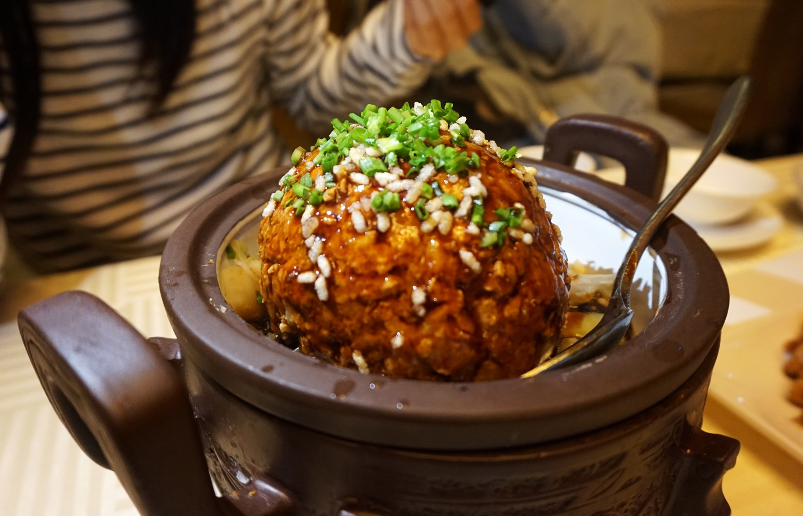
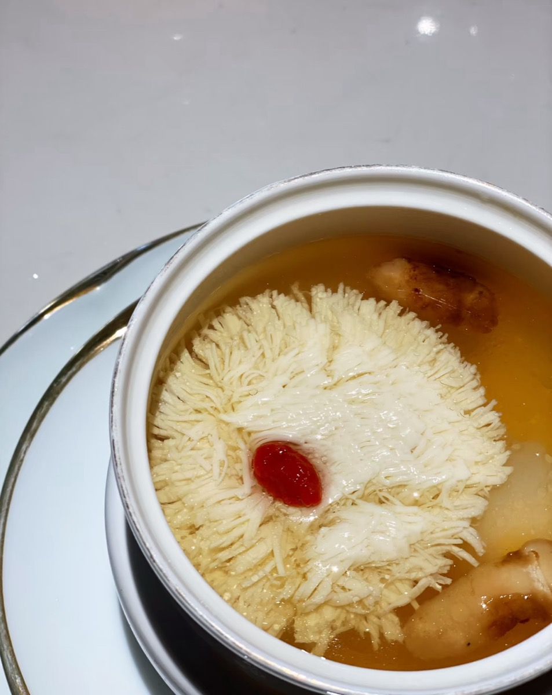
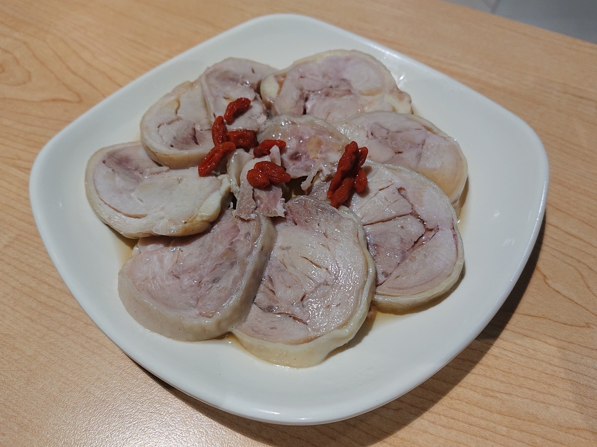
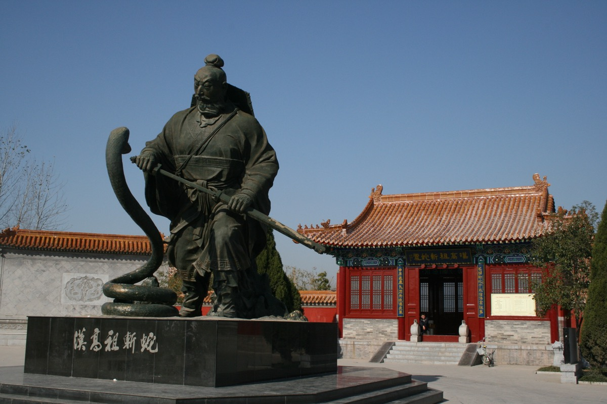
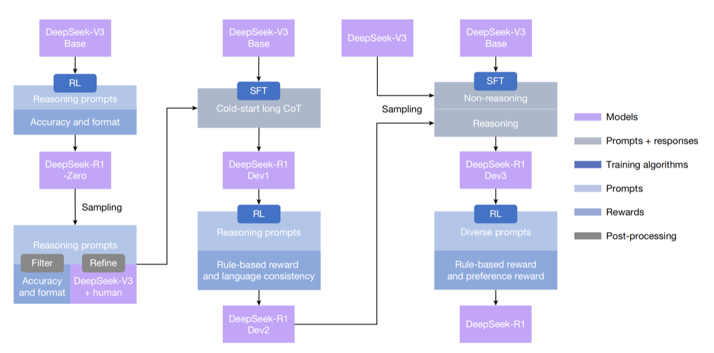

# 第三部 - 江浙

江浙菜不是一个统一的菜系，是淮扬、本帮、苏州、绍兴、宁波几路做法各自演化、互相借鉴出来的家族。共通的底色是鲜与清，落地到每一路又分了岔：淮扬讲究刀工和清炖、本帮重浓油赤酱里的甜、苏州偏精致甜润、绍兴靠黄酒和咸物吊味、宁波贴海，鱼鲜海蜇是主角。

这章选的 10 道是各路里家里能做、且做出来真不一样的代表。重点不在"地道"两个字，而在每道菜的味觉骨架是什么、家庭灶头怎么把那个骨架立起来。蟹粉狮子头的清炖、文思豆腐的刀工、松鼠桂鱼的造型这些看着唬人，拆开看每一步都是常规手艺，怕的是不知道哪步是关键、哪步可以将就。

{ width="480" .center }

## 历史与地理

江浙这块版图的轮廓是水画出来的：长江下游的冲积平原、太湖周围的水网圩田、钱塘江与杭州湾的入海口，以及把它们串起来的京杭大运河。平原地势低、河网密、土壤肥，自南朝以后北方移民南迁开垦，到宋代已经稳定成「鱼米之乡」，南宋定都临安直接把全国的财赋和饮食重心压在了这块地上。

运河决定了城市的命运。扬州在唐宋是漕运咽喉，明清又是两淮盐运使司驻地，全国一半的食盐税从这里走。盐商手里有钱、没事可干，比着养厨子、办家宴，淮扬菜的清炖、刀工、精致路数就是被这种宴客需求一道一道催出来的：蟹粉狮子头、大煮干丝、文思豆腐都是盐商家厨的产物。苏州、无锡靠运河南段，路数跟扬州近，多了点甜润和精巧。

上海是另一条线。1843 年五口通商开埠之前，上海菜还是郊县的本地家常菜（浦东三林的「铲刀帮」），开埠之后江浙、广东、徽州移民涌入，各帮菜馆抢市场，原先的本地菜在徽菜的浓油赤酱、淮扬的精致、宁波的咸鲜里反复融合，到二十世纪二三十年代才定型成「本帮菜」这个概念。响油鳝糊、葱烤鲫鱼、葱油海蜇这些今天算本帮的菜，骨子里都是徽帮和苏锡帮的技法借过来再加重糖色。

浙北和苏南有差别。杭州、绍兴靠山吃酒，黄酒入菜重，宁波贴海，鱼鲜海蜇是主角，咸齑（雪菜）腌物压味；苏南在内陆水网里，鱼虾蟹和河鲜是主线，调味更甜。整个江浙偏甜不是天生的，是富庶的副产品：糖在古代是奢侈品，能日常下糖说明这地方有钱，盐商和士绅家里先甜起来，再下沉成普通人家的口味。

---

## 蟹粉狮子头

{ width="360" .center }

### 起源

淮扬名菜，源头在扬州，旧志里记到隋炀帝下扬州一带就有「葵花斩肉」的雏形，到清代两淮盐商家厨手里定型成今天的形态。盐商财大气粗、宴客讲排场，家厨为了显手艺把斩肉团做得又大又松，蒸出来形似雄狮鬃毛绒起，这才有了「狮子头」的名字。淮扬版走的是**清炖**路子，汤清肉嫩，靠猪肉与高汤本身的鲜，不靠酱色压味，跟北方红烧、鲁菜的四喜丸子是两个完全不同的东西。蟹粉是秋冬大闸蟹上市的加料版，江南有蟹的地方才做得起来，平时换成白菜或河蚌也成立。家常版要害在于肉**手工剁不能机器绞**，机器绞出的是肉糜，纤维断光，蒸出来是结实肉丸，松不起鬃毛感。

### 食材

3-4 人份（4 个狮子头）：

- 猪前腿肉 500 g（**肥三瘦七**，手剁成石榴粒大小，不是肉糜）
- 蟹粉 80 g（蟹肉 + 蟹黄，自己拆或买现成的）
- 马蹄 60 g（去皮切碎丁，**不能省**，是肉团松的关键）
- 鸡蛋清 1 个
- 姜末 3 g、葱白末 5 g
- 黄酒 15 ml
- 生抽 10 ml
- 白糖 3 g
- 盐 3 g
- 玉米淀粉 10 g
- 高汤或清水 800 ml（高汤更好）
- 大白菜叶 4-5 片（垫底）
- 葱姜各几片（汤里）

### 步骤

1. 猪肉**手剁**：先切薄片、再切丝、再切丁、最后剁到石榴粒大小，**别剁成泥**
2. 剁好的肉放大碗，加蟹粉一半、马蹄丁、姜葱末、黄酒、生抽、糖、盐、淀粉、蛋清
3. **朝一个方向搅 5 分钟到上劲**，肉变粘手能成团（这步是肉团蒸不散的关键）
4. 手沾凉水，把肉分 4 份，每份在两手间**轻轻拍打 20 下**团成球（拍出空气，肉团才松）
5. 团好的球**顶部按一个小坑**，填入剩下蟹粉
6. 砂锅底铺白菜叶，放葱姜，狮子头**轻轻摆上**（别叠），倒入高汤刚好没过
7. 大火烧开，**撇净浮沫**，转最小火加盖**炖 1.5 小时**
8. 关火前尝汤，淡了加几粒盐，撒几粒葱花

### 关键

- **手剁石榴粒**是这道菜的灵魂，机器绞出来吃起来像肉丸不松不嫩
- **肥三瘦七**比例不能动，太瘦发柴、太肥腻
- 马蹄丁让肉团内部有空隙、口感清爽，没有马蹄团子又紧又腻
- **拍打成团而不是揉**，拍是把空气拍进肉里，揉是把空气挤出来
- 全程**最小火慢炖**，大火汤就浊了不再清

### 常见错误

- 用机器绞肉：成肉丸不是狮子头
- 全瘦肉：发柴，咬下去渣感
- 不放马蹄：肉团死实
- 大火滚煮：汤浊肉散
- 没撇浮沫：汤面浑浊不清亮

---

## 大煮干丝

### 起源

淮扬早茶头牌，源出扬州，前身是清代盐商家宴上的「九丝汤」，乾隆六下江南到扬州，地方官献的就是这道。富春、冶春这些百年茶社把它从宴席菜搬到早茶台面，配一壶魁龙珠就是扬州人一天的开头。这道菜本身没什么浓味，全靠**干丝细如发**和**清汤吊鲜**两件事撑场面，是淮扬刀工传统的代表作之一，跟文思豆腐、蟹粉狮子头一起并称扬州功夫菜。它跟苏锡一带的甜润干丝不同，淮扬版咸鲜清亮，汤底必须见底见色。家常版 30 分钟搞定，用现成的薄百叶或机切干丝即可，不必非从大方豆腐干自己片到 36 层。

### 食材

3 人份：

- 白干丝（细豆腐丝）250 g（菜场或超市有现成，**越细越好**）
- 鸡丝 80 g（熟鸡胸撕细丝）
- 火腿丝 30 g（金华火腿，蒸软撕丝）
- 笋丝 60 g（春笋或冬笋，切细丝焯水）
- 香菇丝 20 g（干香菇泡发切丝，可省）
- 高汤 700 ml（鸡汤或猪骨汤，**清汤不是浓汤**）
- 姜片 3 片
- 黄酒 5 ml
- 盐 3 g（最后调）
- 白胡椒粉 0.5 g
- 葱花 少许（最后撒）
- 香菜 少许（可省）

### 步骤

1. 干丝**沸水汆 2 次**：第一次开水下锅 1 分钟捞出，换水再汆 1 分钟（去豆腥、去碱味）
2. 笋丝冷水下锅煮 3 分钟去涩，捞出
3. 鸡丝、火腿丝、香菇丝准备好
4. 砂锅倒入高汤 + 姜片 + 黄酒，烧开
5. 下干丝、笋丝、香菇丝**中火煮 10 分钟**（让干丝吸汤味，干丝从硬变软）
6. 下鸡丝、火腿丝再煮 3 分钟
7. 尝汤调盐，撒白胡椒粉、葱花、香菜

### 关键

- 干丝**汆水两次**去豆腥和碱味，这步省掉汤就有怪味
- **高汤是底**，清水版不是这道菜，最次也要鸡汤块兑水
- 火腿丝**最后下**，煮久了发柴失香
- 汤要**清亮见底**，看到火腿的红、鸡的白、笋的嫩黄、葱的绿才是好

### 常见错误

- 干丝不汆：豆腥重，整碗废
- 用浓汤：变成奶汤干丝，不是大煮干丝
- 火腿丝跟着煮 10 分钟：发柴
- 调味放生抽老抽：汤色发暗，干丝染色

---

## 文思豆腐

{ width="360" .center }

### 起源

淮扬刀工菜的极致，相传清乾隆年间扬州天宁寺一位法号文思的和尚善用豆腐做素斋，把一块嫩豆腐切成发丝细，乾隆南巡尝过列入宫廷膳单，菜名跟着传开。扬州自古是南北漕运枢纽和盐运重镇，寺院素斋和盐商家宴互相影响，逼出了这种把素材做出极致刀工和形态的传统。这道菜的味觉骨架其实极简，鸡汤加菌菇笋丝吊一勺鲜，全靠**豆腐丝细如云絮**这一件事撑住整碗的卖相和口感。它跟广东的菊花豆腐、川菜的麻婆豆腐都是豆腐菜，但只有淮扬把豆腐做成「漂在汤里像一团云」这一路。家庭版本不必追求一根丝挑起来不断的境界，**切到 1 mm 见方的细丝**就够，吃口和卖相都到位。

### 食材

3 人份：

- 内酯豆腐 1 盒 380 g（**必须内酯豆腐**，老豆腐切不细）
- 香菇 1 朵（切细丝）
- 笋 30 g（切细丝）
- 火腿 15 g（切细丝）
- 青菜叶 30 g（菠菜叶或鸡毛菜叶，切细丝）
- 高汤 600 ml（鸡汤）
- 盐 2 g
- 白胡椒粉 0.5 g
- 水淀粉 15 ml（玉米淀粉 + 水）
- 麻油 几滴（可省）

### 步骤

1. 内酯豆腐**带盒倒扣**到深盘里轻轻脱出，**不要直接拿出来切**（会碎）
2. 平刀**先片成 1 mm 薄片**：刀蘸凉水、左手轻按豆腐顶部、刀贴着砧板片下去，片完不要散开
3. 转 90 度**直刀切 1 mm 细丝**：还是刀蘸凉水、轻轻切，切好整块豆腐还是方的
4. **冷水盆里轻轻一推**，豆腐丝散开漂浮（这步可以看刀工成不成）
5. 高汤烧开，下香菇丝、笋丝、火腿丝煮 3 分钟
6. 加盐、白胡椒粉调味
7. 用漏勺托起豆腐丝**滑入汤中**（别倒，倒下去断成段），轻推一下散开
8. 下青菜丝煮 30 秒
9. 淋水淀粉勾薄芡（汤略稠不黏稠），淋几滴麻油出锅

### 关键

- **内酯豆腐**比老豆腐 / 嫩豆腐都软，是切得细的前提
- 刀**要蘸凉水**，干刀切豆腐会粘连断裂
- 切完**整块还是方形不要散**，放冷水里散开才漂亮
- 豆腐丝入汤**用漏勺托入不要直接倒**，倒下去全断
- 芡要**薄**，稠了像羹不是汤

### 常见错误

- 用老豆腐：切不细，切出来是粗丝
- 刀不蘸水：豆腐粘刀断丝
- 直接拿手抓豆腐丝：全部碎掉
- 芡勾太稠：成豆腐羹
- 大火滚煮：豆腐丝煮散

---

## 红烧划水

### 起源

本帮硬菜，原型来自杭帮和绍兴一带的家常烧鱼，到了上海被本帮馆子改造成浓油赤酱的招牌。「划水」专指草鱼靠尾鳍那一截，因为鱼在水里游动时全靠尾巴划水，这段肌肉运动量大、纤维细、胶质厚，胶汁烧出来能挂在筷子上拉出丝。一条草鱼一年只切得出两段划水，本帮馆子有时一桌客人订满就早早卖完，这才有了它的稀罕地位。本帮做法跟杭州西湖醋鱼那种清鲜糖醋路数不同，走的是浓油赤酱加冰糖收浓汁的上海路子，糖色厚、酱色亮，跟葱烤鲫鱼、红烧肉是一个味觉家族。是江浙人冬天饭桌的硬菜，也是上海老饭店点单率最高的鱼菜之一。

### 食材

2-3 人份：

- 草鱼尾 500 g（**带尾鳍那段**，不要中段）
- 油 30 ml
- 姜 5 片、葱白 3 段、蒜 4 瓣（拍裂）
- 干辣椒 1 个（可省）
- 生抽 25 ml
- 老抽 8 ml
- 冰糖 20 g
- 黄酒 25 ml
- 镇江醋 10 ml（分两次）
- 热水 350 ml
- 葱花 少许

### 步骤

1. 鱼尾洗净，**两面用厨房纸彻底擦干**，鱼身两侧各划 2 刀深至骨头
2. 锅烧到冒烟，下油 + 几片姜煸香（姜抹一遍锅防粘）
3. 鱼尾下锅**中火煎 3 分钟一面**，**不要翻**（皮没结壳一翻就破），翻面再煎 3 分钟
4. 锅里推开鱼尾，下姜葱蒜干辣椒爆香
5. 沿锅边淋黄酒、加生抽、老抽、冰糖、5 ml 醋、热水（水要没过鱼身一半）
6. 大火烧开转中小火加盖**焖 12 分钟**（中途用勺子把汤汁浇鱼身两次）
7. 开盖大火收汁，剩 1/3 汤时**沿锅边淋剩下 5 ml 醋**
8. 收到汁浓挂鱼起锅，撒葱花

### 关键

- **划水要带尾鳍那段**，胶质足、烧出来汁浓
- 鱼**擦干 + 锅冒烟 + 姜抹锅**三招防粘破皮
- **煎 3 分钟一面再翻**，翻早了皮破前功尽弃
- 醋分两次：**焖煮入味 + 出锅前增香**
- 中途**浇汁两次**让上半身也入味（家里锅小，鱼尾常半浸半露）

### 常见错误

- 鱼皮没擦干：煎的时候皮粘锅破裂
- 急着翻面：皮破鱼散
- 醋一次性下：香气全飞
- 焖太久：肉散 / 胶汁糊
- 用中段不用尾段：胶质少汁不浓

---

## 绍兴醉鸡

{ width="360" .center }

### 起源

绍兴菜的代表凉菜，骨子里是绍兴黄酒文化的延伸。绍兴自春秋起就是越国都城，鉴湖水加糯米酿出的黄酒到南宋已是贡品，明清盛在锡瓶里走漕运到全国，本地人喝酒之余把酒拿去腌、糟、醉，发展出整套「酒入菜」的做法，醉鸡、醉虾、糟鸡、糟毛豆都是这条路上长出来的。「醉」这个字在绍兴菜里专指生酒香浸入熟料，跟「糟」用酒糟、「霉」用霉变的咸物一起，构成绍兴菜区别于其他江浙分支的标志性技法。家常醉鸡讲究花雕生浸不下锅煮，鸡肉吸的是冷酒的清香，跟杭州一带的盐水鸡、白斩鸡是两个东西，区别就在于酒。家里做要提前一天，泡过夜入味才到位，急不得。

### 食材

3-4 人份：

- 三黄鸡腿 2 只 500 g（**带骨鸡腿**，鸡胸版口感发柴）
- 花雕酒 200 ml（**绍兴五年陈以上**，二十年陈最好但不必）
- 鸡汤 200 ml（煮鸡的汤过滤后留用）
- 生抽 15 ml
- 盐 5 g
- 冰糖 5 g
- 姜 4 片
- 葱白 2 段
- 枸杞 10 粒（可省）

### 步骤

1. 鸡腿洗净，**冷水下锅** + 姜葱 + 5 ml 黄酒，水开撇浮沫，**保持微滚煮 12 分钟**（不能大火滚，肉会柴）
2. 关火**加盖闷 8 分钟**（余温让鸡肉中心熟透）
3. 捞出鸡腿**立刻泡入冰水 5 分钟**（皮收紧、肉变 Q）
4. 煮鸡的汤过滤留 200 ml
5. 调醉汁：花雕 200 ml + 鸡汤 200 ml + 生抽 + 盐 + 冰糖 + 姜片 + 枸杞，**糖盐搅化即可不用煮**（煮过酒香飞掉）
6. 鸡腿擦干水分，整只放保鲜盒，**倒入醉汁完全没过**
7. 盖盖**冰箱冷藏 24 小时**（最少 12 小时，过夜更好）
8. 吃前取出**斩块装盘**，浇一点醉汁

### 关键

- 鸡**煮 + 闷**两段法：煮 12 分钟肉八成熟，闷 8 分钟靠余温熟透，肉嫩不柴
- **冰水浸**让皮收紧、肉发 Q，温水版皮发软
- 醉汁**不能煮**，花雕一煮酒香就飞，醉鸡靠的是生酒香
- **冷藏 24 小时**少不得，6 小时只是表面入味咬下去鸡肉还是淡的
- 花雕年份**至少五年陈**，普通料酒做出来是料酒鸡不是醉鸡

### 常见错误

- 大火滚煮鸡：肉柴
- 不冰水浸：皮软口感差
- 醉汁煮过：成黄酒鸡，没醉味
- 泡 6 小时就吃：皮入味肉还淡
- 用普通料酒：酒精味重无陈香

---

## 葱烤鲫鱼

{ width="360" .center }

### 起源

本帮经典凉菜，源出上海老城厢的家常菜，二十世纪二三十年代各帮厨子在上海抢市场时被本帮馆子吸收成招牌之一。鲫鱼在江南河网里产量大、价钱低，但小骨多腥味重，旧时做家常下饭菜，用大量葱段垫底加冰糖酱油慢焖，把骨头焖酥、把腥味盖掉、把甜味吃进去，成了典型的上海人家做法。它的味觉骨架是**葱香、酱色、回甘**三件事，跟苏州一带的葱油鲫鱼追求清淡葱香不同，本帮版糖色重得多，跟红烧肉、本帮熏鱼共用同一套酱色甜味。冷吃热吃都行，冷吃更香，因为放凉后葱和鱼的味道在胶质里融透。上海人家里冰箱常备一盒，配粥配面都行，是典型的「过夜更入味」的本帮冷菜。

### 食材

2-3 人份（4 条小鲫鱼）：

- 小鲫鱼 4 条 共 600 g（每条 150 g 左右，太大入味难）
- 香葱 200 g（**整大把**，葱白葱绿都用，切 5 cm 段）
- 姜 4 片
- 油 60 ml（这道菜的油不能省）
- 生抽 30 ml
- 老抽 10 ml
- 冰糖 30 g（本帮做法偏甜）
- 黄酒 30 ml
- 镇江醋 10 ml
- 八角 1 颗
- 桂皮 1 小块（可省）
- 热水 400 ml

### 步骤

1. 鲫鱼刮鳞去内脏，**两面用厨房纸彻底擦干**，鱼身两侧划 2 刀
2. 锅烧到冒烟下油 30 ml，鱼**中火煎到两面金黄**（每面 3 分钟），煎好盛出
3. 锅里再下 30 ml 油，下**一半葱段** + 姜片，中火**煸到葱发软发黄**（约 3 分钟）
4. 葱铺平作底，鱼摆在葱上，**剩下一半葱盖在鱼上**
5. 加八角、桂皮、生抽、老抽、冰糖、黄酒、5 ml 醋、热水（水到鱼身一半）
6. 大火烧开转小火加盖**焖 30 分钟**
7. 开盖大火收汁，沿锅边淋剩下 5 ml 醋
8. 收到汁浓亮挂鱼，**整锅连葱带鱼装盘**，常温放凉更香

### 关键

- 葱**用一大把**，一半垫底一半盖面，葱量够才出葱香
- 葱要**先煸软发黄**再垫底，生葱直接垫底烧出来是生葱味
- **冰糖要够**，本帮葱烤鲫鱼偏甜，糖少了不像本帮味
- 焖 30 分钟让小鱼骨酥透，**家常版咬骨头不扎嘴**
- **冷吃比热吃香**，放凉后葱和鱼味道融合

### 常见错误

- 葱量不够：少了葱香的灵魂
- 葱不煸直接铺底：生葱味重
- 糖太少：成红烧鲫鱼不是葱烤
- 焖不够：骨头硬扎嘴
- 鱼煎不到位：腥味重

---

## 响油鳝糊

{ width="360" .center }

### 起源

苏锡和本帮共有的夏季招牌，源头在无锡和苏州一带，到上海开埠后被本帮馆子吃下，成了上海老饭店和德兴馆的招牌之一。江南有「小暑黄鳝赛人参」一说，黄鳝从端午到小暑这段最肥，旧时苏锡农家挖到野生黄鳝就划丝热炒，本帮馆子改造成浓芡版本，给汁里加糖加酱，配生姜蒜末葱花临上桌浇热油激香。「响油」两个字就是从那勺最后浇下去的滚油里来的，滋啦一声同时爆出葱姜蒜的生香，是这道菜的命名点也是味觉关键。它跟川菜的爆鳝、淮扬的炝虎尾走的是不同路子，本帮版甜咸浓芡，糖比生抽多，是浓油赤酱在水产菜里的典型表现。在家做要让鱼贩**杀好划丝**，自己处理鳝鱼太费事。

### 食材

2 人份：

- 鳝丝 300 g（鱼贩划好的熟鳝丝，回家自己再焯一下）
- 油 30 ml + 30 ml（最后浇用）
- 姜末 5 g、蒜末 8 g（**生的**，不下锅）
- 香葱花 8 g（**生的**，不下锅）
- 香菜末 5 g（可省）
- 生抽 20 ml
- 老抽 5 ml
- 白糖 15 g
- 黄酒 10 ml
- 镇江醋 5 ml
- 白胡椒粉 1 g
- 玉米淀粉 8 g + 水 30 ml（调水淀粉）
- 高汤或清水 100 ml

### 步骤

1. 鳝丝沸水**焯 30 秒**捞出沥干（去黏液和腥味）
2. 锅烧热下油 30 ml，鳝丝下锅大火**炒 1 分钟**
3. 加黄酒、生抽、老抽、糖、白胡椒粉、高汤，烧开
4. 转中火**焖 3 分钟**让鳝丝入味
5. 沿锅边淋醋
6. 淋水淀粉勾**浓芡**（汁裹鳝丝挂得起来），盛入深盘
7. 在鳝丝**正中间堆一小堆生姜末 + 蒜末 + 葱花 + 香菜末**
8. 另起小锅烧 30 ml 油到冒烟（**8 成热**），**滋啦一声浇在姜蒜葱堆上**
9. 立刻上桌，吃前拌匀

### 关键

- 鳝丝**焯水去黏液**这步省了腥味重
- **芡要浓**，响油鳝糊的"糊"靠这个芡，稀了是炒鳝丝
- 姜蒜葱**生的最后浇热油激香**，是这道菜的灵魂
- 浇油**油温要够 8 成热**，温油浇上去激不出香
- 上桌**立刻拌匀**，等久了热油凉了少一截香气

### 常见错误

- 鳝丝不焯：腥黏
- 芡稀：成汤鳝丝
- 姜蒜葱炒了再撒：失生鲜激香的意义
- 浇的油不够热：没有滋啦一声
- 端上桌不立刻拌：热油凉了

---

## 松鼠桂鱼

{ width="360" .center }

### 起源

苏州名菜，姑苏菜的造型代表，旧志记乾隆下江南至苏州松鹤楼，菜单上有「松鼠鱼」，最早用的是鲤鱼，后来改用太湖桂鱼。苏州自古是江南鱼米之乡，太湖、阳澄湖一带鱼鲜丰富，姑苏菜传统就在于把河鲜做出形态、做出甜润、做出文气，松鼠桂鱼是这一传统里最炫技的一道。它的核心动作是**改花刀、拍干粉、两次炸、浇糖醋汁**四件事，鱼身改成菱形花刀炸开后形如松鼠竖起，浇汁那一瞬「滋滋」声响似松鼠吱叫，名字便从此而来。它跟杭帮的西湖醋鱼同属糖醋鱼，但西湖醋鱼是清水汆熟浇酸甜汁，重清，松鼠桂鱼是干炸浇浓汁，重形重甜，是苏州菜偏甜润这一路的最高表现。家庭版用桂鱼或鲈鱼都行，难点不在味道在**改刀和炸**：花刀切到位是造型基础，油温对是壳脆的关键。

### 食材

3-4 人份：

- 桂鱼或鲈鱼 1 条 700 g（**让鱼贩去鳃去内脏，鱼身完整不破**）
- 玉米淀粉 100 g（拍粉用，生粉也行）
- 鸡蛋 1 个
- 油 1 L（炸用，可重复利用）
- 盐 3 g、白胡椒粉 1 g、黄酒 10 ml（腌鱼）

糖醋汁：
- 番茄酱 60 ml
- 白糖 60 g
- 镇江香醋 30 ml
- 生抽 5 ml
- 水 80 ml
- 玉米淀粉 8 g + 水 20 ml（水淀粉）
- 油 15 ml

配料：
- 青豆 30 g、玉米粒 30 g、胡萝卜丁 30 g（焯熟）
- 葱白末 5 g、蒜末 5 g

### 步骤

1. 鱼**去骨保留头尾**：从鱼鳃后切下不要切断鱼皮、沿脊骨片到尾巴、鱼骨整根抽出（让鱼贩做更省事）
2. 鱼身肉面**改菱形花刀**：先 45 度斜刀切到鱼皮不断、再反 45 度切，深度到皮，间距 1 cm
3. 鱼用盐、白胡椒粉、黄酒抹匀腌 10 分钟
4. 鱼蘸蛋液，**两面包括花刀缝隙都裹满玉米淀粉**（花刀里的粉要塞进去，炸完才能"开花"）
5. 鱼头单独裹粉
6. 油烧到 7 成热（200°C），**提鱼尾把鱼身先入油**炸 1 分钟定型，再下鱼头
7. 中火**炸 4 分钟**到金黄外脆，捞出沥油
8. 油升到 8 成（210°C）**复炸 30 秒**壳脆
9. 装盘：鱼身竖立呈松鼠造型，鱼头朝上
10. 调汁：锅下 15 ml 油，下蒜末爆香，加番茄酱炒 30 秒出红油
11. 加糖、醋、生抽、水烧开
12. 淋水淀粉勾芡到亮稠，撒青豆玉米胡萝卜丁
13. **趁热浇在鱼身上**，撒葱花，滋啦一声上桌

### 关键

- 花刀**深至鱼皮不断**，浅了炸不开花深了切断鱼皮散架
- 拍粉**花刀缝隙都要塞进**，没塞粉的地方炸完是平的不是开花
- **两次炸**：定型 + 脆壳，一次炸壳软
- 提鱼尾入油**先入鱼身**让花刀立起来定型
- 糖醋汁**最后浇**，浇早了壳软掉

### 常见错误

- 花刀切断鱼皮：鱼炸时散架
- 粉没塞进缝隙：炸完不开花
- 不复炸：壳软
- 汁早浇：壳全软
- 糖醋比例失衡：本帮 / 苏州偏甜，糖比醋多 2:1

---

## 雪菜黄鱼

{ width="360" .center }

### 起源

宁波家常菜的代表，是宁波咸鲜传统的标准模板。宁波贴东海，舟山渔场是中国四大渔场之一，黄鱼自古是宁波人最熟的海鱼，明清时整条沿海产业链就建在黄鱼汛期上。雪菜（雪里蕻）则是江南腌菜里最家常的一种，宁波人冬天家家自腌，叫「咸齑」，是配饭吊汤的万能压味料。**鱼鲜配腌菜**是宁波菜最核心的味觉公式，从这道雪菜黄鱼到雪菜大汤黄鱼、咸齑笋丝汤、雪菜豆瓣，一路用的都是同一个骨架：用腌菜的咸和发酵风味去托海鱼的鲜，让两种味道在汤里互相借力。它跟广东的清蒸黄鱼、本帮的红烧黄鱼是不同路子，宁波版必须做成奶白汤，靠大火滚煮把鱼脂乳化，雪菜末翠绿浮着，咸鲜见底。家里做用小黄鱼或冰鲜大黄鱼都行，**新鲜度比品种重要**。

### 食材

2-3 人份：

- 小黄鱼 2 条 共 500 g（或大黄鱼 1 条切段）
- 雪菜（雪里蕻）100 g（**温水洗一遍去咸**，挤干切碎）
- 春笋 80 g（切片，焯水去涩）
- 油 25 ml
- 姜 5 片
- 葱白 2 段
- 黄酒 15 ml
- 沸水 600 ml
- 盐 1 g（最后调，雪菜带咸）
- 白胡椒粉 0.5 g
- 葱花 少许

### 步骤

1. 黄鱼洗净，**两面用厨房纸彻底擦干**，鱼身划 2 刀
2. 锅烧到冒烟下油 + 姜片煸香（姜抹锅防粘）
3. 黄鱼下锅**中火煎 2 分钟一面**，翻面再煎 2 分钟到两面金黄
4. 加黄酒**沿锅边淋**激香
5. **倒入沸水**没过鱼（沸水入锅是奶白汤的关键）
6. 大火滚煮 5 分钟（汤变奶白）
7. 下雪菜、笋片、葱白
8. 转中火再煮 5 分钟
9. 尝汤调盐（一般不用，雪菜自带咸）+ 白胡椒粉
10. 撒葱花出锅

### 关键

- 黄鱼**擦干 + 锅冒烟 + 姜抹锅**三招防粘
- **沸水入锅**是奶白汤的核心，冷水煮出清汤
- **大火滚煮**让脂肪乳化，小火炖不会奶白
- 雪菜**先洗一遍 + 挤干**，没洗会齁咸、没挤干汤会稀
- 盐**几乎不用**，雪菜的咸够了

### 常见错误

- 鱼皮粘锅破：擦干这步省不得
- 加冷水：清汤不是奶白
- 雪菜没洗：齁咸
- 笋不焯：麻嘴
- 早放盐：鱼肉柴 / 汤过咸

---

## 葱油海蜇

{ width="360" .center }

### 起源

本帮和宁波共有的夏季冷盘，源头在浙东沿海，宁波、舟山一带渔民处理捕捞上来的海蜇，用石灰和盐反复腌渍脱水做成海蜇皮，是中国最早成规模的海产腌制品之一。海蜇运到上海后被本帮馆子改造成佐酒冷盘，加生抽镇江醋糖调汁，再浇一勺烧到 8 成热的葱油激香，成了上海宴席上几乎必出的一道开胃菜。它的味觉骨架是**爽脆口感 + 葱油激香 + 糖醋平衡**三件事，跟北方的拌海蜇头那种纯靠麻油醋蒜泥的家常路子不同，本帮版讲究葱油这一勺的火候和糖醋的回甘。10 分钟搞定，难点全在海蜇的泡发：盐分没去净就齁，泡过头就软没脆度，这两件事是这道菜成败的分水岭。

### 食材

3-4 人份：

- 即食海蜇皮 200 g（**已泡发的**，菜场有卖；干货自己泡发耗时长）
- 香葱 30 g（葱白 1/3、葱绿 2/3 切段）
- 姜 3 片（切丝）
- 油 30 ml
- 生抽 20 ml
- 镇江香醋 15 ml
- 白糖 8 g
- 麻油 5 ml
- 蒜末 5 g（生的，可省）
- 香菜段 少许（可省）

### 步骤

1. 即食海蜇皮**用流水冲洗 5 分钟**去多余盐分
2. 锅烧水到 70°C（**冒小泡不冒大泡**），海蜇下锅**烫 5 秒立刻捞出**（早一秒晚一秒都不对，5 秒是脆的关键）
3. 海蜇**立刻浸冰水 3 分钟**收紧
4. 沥干水分装盘
5. 调汁：生抽、醋、糖、麻油搅匀（糖要化）
6. 调汁淋在海蜇上拌匀
7. 蒜末（如用）撒海蜇上
8. 锅下 30 ml 油，下姜丝煸到金黄捞出，**油温烧到 8 成冒烟**，下葱白小火 30 秒、葱绿 10 秒，葱微焦关火
9. **立刻把烫油带葱浇在海蜇上**，滋啦一声
10. 撒香菜段拌匀上桌

### 关键

- **70°C 烫 5 秒**是海蜇脆爽的关键，温度高了或时间长了海蜇会缩成一团硬橡皮
- **冰水浸**收紧，不浸海蜇会回软
- 葱油**8 成热浇上**激香，温油浇等于没浇
- 即食海蜇**还要冲洗 5 分钟**去盐，不冲会齁
- 调味汁**糖要先化**在汁里，干撒糖拌不开

### 常见错误

- 海蜇用沸水烫：缩成硬橡皮
- 烫久了：脆度全无
- 不冲盐：齁咸
- 葱油温度不够：没有激香的滋啦
- 凉油慢熬葱：葱油是凉的，浇上去寡淡
