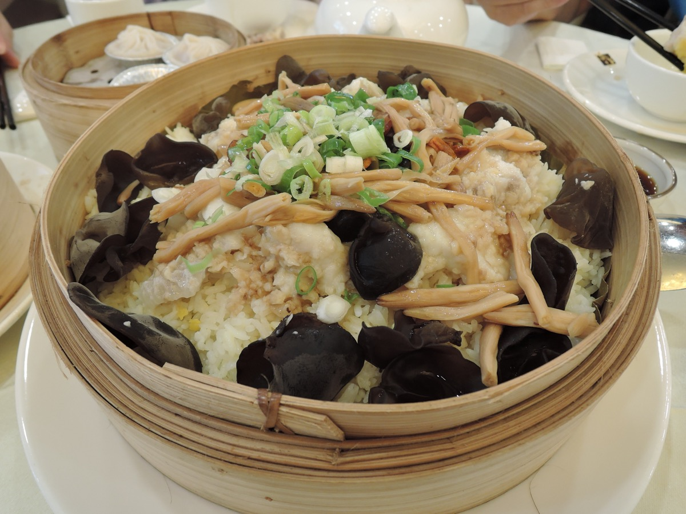
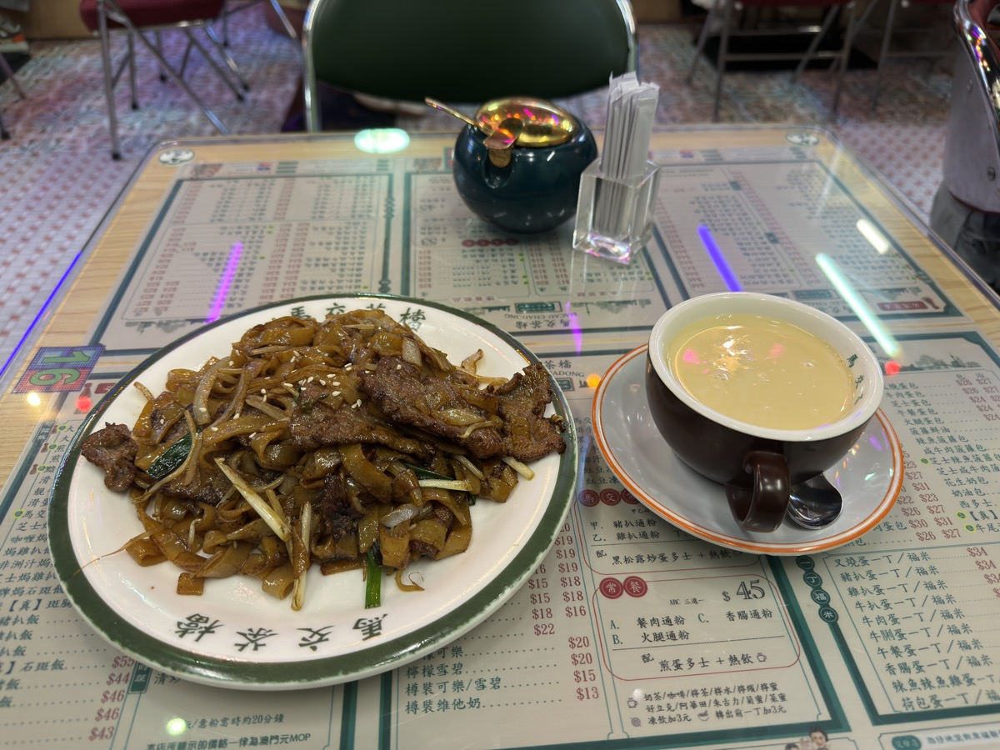
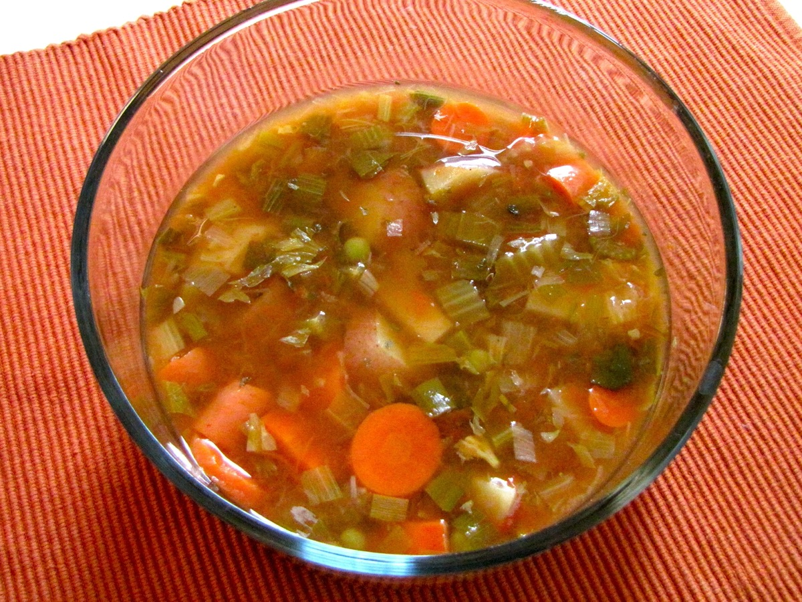
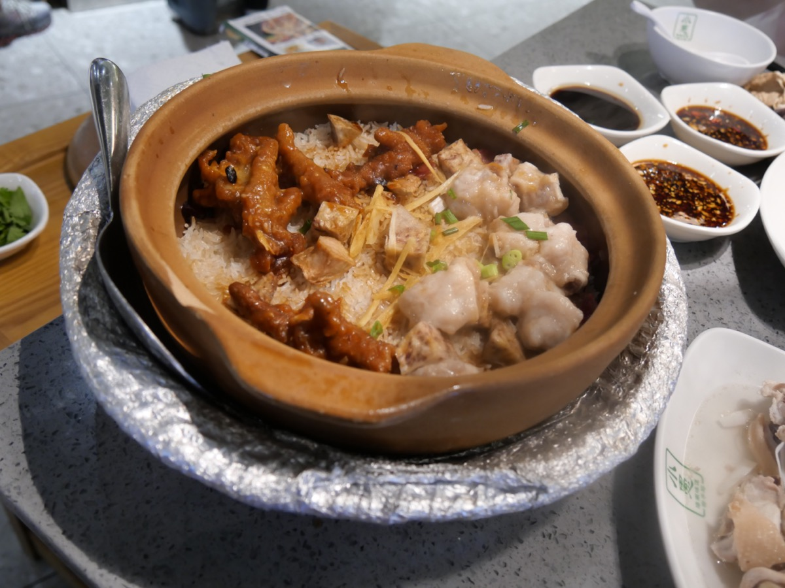

# 第四部 - 粤菜

粤菜本身就讲究「鲜、清、嫩、滑」，跟杭州口味的基线天然合拍。这章选的 10 道菜，是广东人家里饭桌上每周都会出现的，不是早茶酒楼那一套虾饺、烧鹅、点心。

杭州人做粤菜要注意两件事：一是烧腊（叉烧、烧肉、烧鸭）家庭版要降油，馆子那种油亮油亮的家里吃不消；二是老火汤别真按广东人三四个小时炖，1.5 小时足够，再久就汤浊味闷。

{ width="480" .center }

## 历史与地理

岭南这块地方先天有两个底色：一是地理隔绝，南岭横在北边阻断中原寒流，珠江三角洲又冲出一片亚热带湿地，物产丰富到用「四脚不吃桌子，两脚不吃父母」形容也不算夸张；二是海。从汉代徐闻、合浦的南海航线，到唐代广州被列为全国第一通商大港，岭南人一千多年没断过跟外面世界做生意。这两件事加起来，决定了粤菜的两个特征：食材种类最多、对外来调味最开放。

粤菜不是一支，而是三支。**广府菜**以广州、佛山为核心，是城市中产阶层和茶楼文化的产物，重清蒸、白灼、煲汤，讲究"镬气"。**潮汕菜**在韩江流域独立发展了上千年，跟闽菜共享卤水、鱼饭、粥这些底子，调味比广府还淡。**客家菜**是中原南迁汉人在山区聚居的产物，盐重、油重、保存性高，跟前两支几乎是反方向。

早茶这件事是清末民初广州茶楼业的副产品。十九世纪广州沿江码头工人和商人需要早上吃顿热的，茶楼供"一盅两件"（一壶茶 + 两笼点心）。1927 年陶陶居、1935 年莲香楼这一批老字号定型了点心师傅的体系，今天在港澳新马吃到的虾饺烧麦，技法基本是那一代人传下来的。

为什么粤菜整体追求清淡，根本原因是食材好到不需要靠重味去救。广州市场一年到头的鲜活海鱼、河鲜、放养鸡、当季蔬菜，本身味道就够。粤菜厨师评价一道菜的最高标准叫"鲜"和"嫩"，这两个字都是减法。

---

## 清蒸鱼

{ width="360" .center }

### 起源

清蒸鱼是珠江三角洲水网地带的产物。岭南河汊纵横、珠江口又接外海，广府人家自唐宋起就一年四季有活鱼供应，鱼到厨房还在跳，不需要靠重盐重酱压腥。气候湿热，重口味吃不下，厨师慢慢把做法减到只剩葱姜豉油和一勺滚油，让鱼肉本身的甜度顶在舌头上。这跟江浙的糖醋、川菜的豆瓣鱼是反方向，后两者都是水产不够新鲜的内陆传统下逼出来的解法。粤菜行内把清蒸鱼当作考厨师的最低门槛，正是因为没有调味遮丑，火候差 30 秒鱼肉就柴。

### 食材

2-3 人份：

- 鲈鱼或多宝鱼 1 条 600 g（让鱼贩处理好，去鳞去内脏去鳃）
- 姜 30 g（一半切片垫盘，一半切细丝）
- 葱 50 g（葱白切段垫盘，葱绿切细丝）
- 香菜 1 根（点缀，可省）
- 蒸鱼豉油 25 ml（李锦记或六月鲜）
- 食用油 25 ml（淋热油用，花生油最香）
- 黄酒 10 ml
- 盐 1 g

### 步骤

1. 鱼洗净，**两面用厨房纸擦干**，鱼身两侧各划 2 刀（深至骨头，便于熟透）
2. 鱼身内外抹一层薄盐 + 黄酒，腌 5 分钟
3. 盘底铺姜片 + 葱白段，鱼放上面，**鱼肚里塞 2 片姜**
4. 蒸锅水大滚后放鱼，**大火蒸 8 分钟**（600 g 鱼的标准时间，每多 100 g 加 1 分钟）
5. 蒸好立刻取出，**倒掉盘底所有汁水**（这水带腥）
6. 拣掉垫底的姜葱，铺上新切的姜丝、葱丝、香菜
7. 沿鱼身淋蒸鱼豉油
8. 另起锅烧 25 ml 油到**冒烟**（200°C），淋在葱姜丝上（滋啦一声，香气全出来）

### 关键

- 鱼必须**新鲜**，最好活鱼现杀，冰鲜的差一档
- **大火足汽蒸**，水没滚透就放鱼，鱼肉发柴
- 时间死守 8 分钟，宁早不晚，过了肉就老
- 蒸出的盘底汁要**倒掉**，那是腥水不是鲜汁
- 油要烧到**冒烟**再淋，温度不够葱姜的香出不来

### 常见错误

- 鱼不擦干：盘底全是水，淋豉油被稀释
- 蒸过头：肉柴肉散，整条毁
- 不倒蒸出的水：腥味盖鲜
- 油温不够淋葱姜：葱姜半生不熟、味道发青
- 提前淋豉油再蒸：豉油咸味钻进鱼肉，鱼本身的鲜没了

---

## 白切鸡

{ width="360" .center }

### 起源

白切鸡相传出自清末广州西关，跟粤北清远的走地三黄鸡产区直接相关。岭南人评价鸡的标准是「皮爽肉滑骨带血」，要做到这三点，鸡本身必须是放养肌肉紧实的本地品种，再用浸而不煮的方法保住肉汁。北方常见的清水鸡是整锅滚煮，肉一定柴；广府人改成微沸浸熟加冰水激皮，靠的是岭南地下水井水冬天够凉这个条件，井水激出来的皮才能脆。同属粤菜的潮汕一脉做法又不同，潮汕人偏好用卤水浸鸡，调味比广府重一档；广府坚持白切，是因为本地三黄鸡的鸡味本来就够，再调反而盖味。这道菜在广州酒楼里属于检验师傅的招牌，火候差一分肉就老。

### 食材

4 人份：

- 三黄鸡或清远鸡 1 只 1.2 kg（**整鸡，不要切块**）
- 姜 50 g（一半拍裂入水，一半剁蓉）
- 葱 80 g（一半整段入水，一半切葱花）
- 盐 5 g（蘸料用）
- 花生油 30 ml（蘸料用）
- 一锅水（够整鸡浸没）
- 一大盆冰水（冰块 + 凉白开）

### 步骤

1. 鸡洗净，去掉脖子上的淋巴和屁股的尾脂腺
2. 大锅烧水，下姜块 + 葱段，**水大滚后**抓鸡腿提起鸡身，**整鸡浸入水中 5 秒**再提起，重复 3 次（让鸡腔内外温度均匀，皮不破）
3. 鸡完全下锅，**关到最小火保持微沸**（水面只有小泡冒），盖盖**浸 25 分钟**（1.2 kg 鸡的标准时间）
4. 用筷子戳鸡腿最厚处，**流出的汁水清亮无血**就是熟了（带粉色没问题，带红血必须再煮）
5. 立刻捞出，**整只浸入冰水 10 分钟**（这步是皮爽脆的关键）
6. 取出沥干，刷一层薄花生油（皮更亮），切件装盘
7. 蘸料：姜蓉 + 葱花 + 1 g 盐，淋 30 ml 烧到冒烟的花生油，搅匀

### 关键

- **三浸三提**：鸡腔内外温度均匀，整只熟得一致
- **微沸浸熟**不是大火滚煮：滚煮的鸡肉柴，浸的鸡肉嫩
- **冰水激**是皮脆的关键：温水冲不行，必须冰水
- 时间按鸡的重量算：1.2 kg 浸 25 分钟，1.5 kg 浸 30 分钟
- 蘸料的油要**冒烟**再淋姜葱，姜的辛、葱的香才能炸出来

### 常见错误

- 大火煮：鸡肉柴、皮破
- 不冰水激：皮软不脆
- 浸太久：肉过熟柴老
- 浸不够：腿骨带红血，不能吃
- 蘸料油温不够：姜葱生味重

---

## 豉油鸡

{ width="360" .center }

### 起源

豉油鸡是广府卤水体系里的家常版，跟珠三角发达的酱园业绑在一起。明清两代广州、佛山一带的豆豉、生抽、老抽作坊密集，普通人家也用得起品质稳定的酱油，于是出现了用生抽老抽加冰糖香料反复煮浸一锅鸡的做法。这跟潮汕白卤、客家盐焗走的是不同路子，潮汕卤偏咸鲜带药材味，客家盐焗靠粗盐封锁水分，广府豉油鸡的核心是甜咸平衡加酱香。一锅卤水可以养上几年，每用一次旧卤补一点新生抽冰糖，老卤越用越醇，这是岭南酒楼师徒传承的资产。家庭做不到几年的老卤，就靠 24 小时腌不到的香料熬足时间和煮浸结合的火候来凑。

### 食材

4 人份：

- 三黄鸡 1 只 1.2 kg
- 生抽 200 ml
- 老抽 30 ml
- 冰糖 50 g
- 黄酒 50 ml
- 水 800 ml
- 姜 30 g（拍裂）
- 葱 3 根（打结）
- 八角 2 颗
- 桂皮 1 小段
- 香叶 2 片
- 草果 1 颗（拍裂，可省）
- 干辣椒 1 个（可省）

### 步骤

1. 鸡洗净，去脖子淋巴和尾脂腺，沥干
2. 大锅放所有调料 + 香料 + 水，大火烧开转小火**熬 15 分钟**让香料出味
3. 抓鸡腿提鸡身，**整鸡浸入卤水 5 秒提起**，重复 3 次（同白切鸡的三浸三提）
4. 鸡完全下锅，**保持微沸煮 8 分钟**（一面），用大勺不断把卤水浇到露出水面的鸡身上
5. 鸡翻面，再煮 8 分钟
6. 关火，鸡留在卤水中**加盖浸 20 分钟**（靠余温浸透）
7. 取出鸡，挂起晾 5 分钟（皮收紧），刷一层薄花生油
8. 切件装盘，淋 2 大勺卤水

### 关键

- **煮 + 浸**的组合：煮让皮上色定型，浸让肉熟透入味
- 浸的时候**关火靠余温**：开火煮老
- 卤水**留下次用**：滤掉香料，冷却冷藏，下次加 50 ml 生抽 + 10 g 冰糖补足
- 鸡身要**淋卤水**：露出水面的部分不上色就花了
- 切件前**晾 5 分钟**：皮才不黏刀

### 常见错误

- 全程大火煮：肉柴、皮破
- 不浸只煮：肉外层咸，里面寡淡
- 卤水不熬香料就下鸡：香料味没出来
- 鸡刚出锅就切：皮粘刀、汁流光
- 卤水扔掉：第二锅本来更好的味没了

---

## 蜜汁叉烧（家庭烤箱版）

### 起源

叉烧的「叉」原本是指穿肉的长铁叉，源自广府烧腊铺挂炉烤肉的工具。明清以来广州西关一带的烧腊店把整条猪肉串在铁叉上斜插进炭炉，肉汁滴下来在炉底起烟回熏，外焦里嫩带蜜糖光泽。这种做法之所以在岭南普及，是因为广府人有「烧味斩料加饭」的快食传统，码头工人和茶楼伙计中午要一份能立刻下饭的硬菜，烧腊铺一斩一淋汁就走，比炒菜快得多。家庭烤箱做不出明火滴油那种焦边，只能用 24 小时长腌加最后高温焦化糖蜜来妥协，颜色和香气接近七八成，但少了烧腊店那股炭气。这道菜跟北方的红烧肉、江浙的东坡肉路数完全不同，前两者靠汤汁慢炖，叉烧靠干烤起壳。

### 食材

3-4 人份：

- 猪梅花肉 600 g（**带点肥的部分，太瘦发柴**），切成 4 cm 厚长条
- 李锦记叉烧酱 60 ml
- 海鲜酱 15 ml
- 生抽 15 ml
- 老抽 5 ml
- 蜂蜜 30 ml（**收尾刷面，不进腌料**）
- 麦芽糖 20 g（可用蜂蜜代）
- 黄酒 15 ml
- 蒜 3 瓣（剁蓉）
- 姜末 3 g
- 五香粉 1 g
- 白胡椒粉 1 g
- 红曲粉 2 g（上色用，可省，自然颜色会偏褐）

### 步骤

1. 梅花肉切条后用厨房纸擦干，用叉子在肉上**戳很多小洞**（便于入味）
2. 调腌料：叉烧酱、海鲜酱、生抽、老抽、黄酒、蒜蓉、姜末、五香粉、白胡椒粉、红曲粉，搅匀
3. 肉条放保鲜袋，倒入腌料，揉匀，**冰箱冷藏腌 24 小时**（少于 12 小时味道不透）
4. 取出，回温 30 分钟
5. 烤箱预热 220°C，烤盘铺锡纸 + 烤架（让油滴下去），肉条放架上
6. **220°C 烤 15 分钟**，取出**刷一层蜂蜜 + 麦芽糖（融化后混合）**
7. 翻面，再烤 10 分钟，再刷一次糖蜜
8. 翻面，**调到 230°C 烤 5 分钟**让糖蜜焦化（紧盯，糊得很快）
9. 取出晾 5 分钟切片

### 关键

- **24 小时腌制**：这是家庭版能不能做出味的关键，省时间就别做了
- **梅花肉带点肥**：纯瘦肉烤出来发柴
- 蜂蜜麦芽糖**烤中后期才刷**：早刷糖直接烤糊
- 最后高温焦化是**焦糖外壳**的来源：少了这步就是甜烤肉不是叉烧
- 烤架 + 锡纸接油：油滴下不会冒烟、肉不浸在油里

### 常见错误

- 用里脊瘦肉：柴
- 腌不到 24 小时：味道没入肉芯
- 刷蜂蜜太早：直接烤焦黑
- 没焦化那一步：表面寡淡
- 烤完立刻切：汁全流光，肉发干

---

## 滑蛋虾仁

### 起源

滑蛋虾仁是民国年间广州茶楼小炒里成型的，后来在香港茶餐厅普及成家常菜。珠江口的白虾、沙井蚝这些近海河虾资源充沛，鸡蛋又是岭南农村最稳定的蛋白来源，两者都是广府市井阶层每天能买到的食材。粤菜师傅讲究「镬气」，但滑蛋走的是反方向，靠低油温慢推让蛋液停在半凝固状态，这跟北方的炒鸡蛋追求蓬松、西式 scrambled eggs 加奶油追求绵密都不一样。之所以广府人能想到加牛奶加淀粉水保住湿润，是因为十九世纪开埠后广州人对西式奶制品接触最早，把牛奶引进炒蛋是中西混搭的产物。这道菜的难点全在火候，七八分熟关火让余温收尾，多 5 秒就成蛋干。

### 食材

2 人份：

- 鲜虾仁 200 g（剥壳去虾线，**用厨房纸彻底擦干**）
- 鸡蛋 4 个
- 牛奶 30 ml（**滑蛋的关键，不能省**）
- 玉米淀粉 5 g（先用 10 ml 水化开）
- 盐 3 g（分两次）
- 白胡椒粉 1 g
- 葱花 5 g
- 油 25 ml（分两次）
- 黄酒 5 ml（虾仁腌用）

### 步骤

1. 虾仁擦干，加 1 g 盐 + 黄酒 + 一点白胡椒粉抓匀，腌 10 分钟
2. 蛋液：4 个蛋打散，加牛奶、化开的淀粉水、剩余盐、白胡椒粉，**搅匀但不要打出泡**
3. 锅烧热下 12 ml 油，下虾仁**滑炒 30 秒**到虾身刚变红弯成 C 形，盛出
4. 虾仁倒入蛋液中，搅匀
5. 锅擦干净，下 13 ml 油，烧到中油温（150°C，不要冒烟）
6. **倒入虾仁蛋液**，**用筷子从锅底向上轻推**（不是炒），让蛋液一层层凝固
7. 蛋液**七八分凝固**还有点流动时**立刻关火**，靠余温推 5 秒到全部凝固
8. 撒葱花，出锅

### 关键

- **牛奶 + 淀粉水**：滑蛋的两个关键，让蛋液凝固后还能保持湿润
- **虾仁先单独炒**：跟蛋液一起下锅虾会过熟
- **油温不要太高**：太热蛋液一下锅就老
- **筷子轻推不要铲翻**：保持蛋液一层层的滑嫩
- **七八分熟关火**：余温会继续把蛋焖到全熟，开火炒到全熟就老了

### 常见错误

- 蛋液不加牛奶不加淀粉：成普通炒蛋，不滑
- 虾不擦干：蛋液被稀释，凝固后水汪汪
- 油太热：蛋一下锅就成蛋皮
- 用铲翻炒：蛋液成块状不滑
- 炒到全熟才出锅：余温再焖 10 秒成蛋干

---

## 干炒牛河

{ width="360" .center }

### 起源

干炒牛河相传起于二十世纪四十年代广州沙河镇的「沙河粉」铺，后来随移民潮传到香港茶餐厅成了招牌。沙河粉是用本地稻米加白云山泉水磨浆蒸成的薄米皮，柔韧不易断，是这道菜的物理基础，外地用干河粉泡发口感就废了。粤菜大部分菜走清淡路线，但干炒牛河是少有的镬气重头戏，全靠大火快炒逼出酱色和焦香，原因是茶餐厅炉头火力够猛，一份牛河从下锅到出锅不超过一分钟，慢一点河粉就糊。这跟北方的炒面、福建的炒粿条路数不同，前者靠水分炖，后者靠汤汁润，干炒牛河追求的是干、爽、有焦边。家里灶头火力出不来，做不出馆子那种镬气，只能在牛肉嫩度和酱色均匀上找补。

### 食材

2 人份：

- 沙河粉（鲜河粉）400 g（**鲜的，干河粉口感差很多**）
- 牛里脊或牛霖 200 g（逆纹切薄片）
- 韭黄 80 g（切 4 cm 段）
- 绿豆芽 100 g
- 洋葱 50 g（切丝）
- 葱白 20 g（切段）
- 生抽 15 ml
- 老抽 10 ml
- 蚝油 8 ml
- 白糖 5 g
- 油 30 ml（分两次）
- 黄酒 5 ml

牛肉腌料：

- 生抽 5 ml
- 玉米淀粉 5 g
- 小苏打 1 g（**让牛肉嫩的关键**）
- 水 10 ml
- 油 5 ml（最后封油）

### 步骤

1. 牛肉片加生抽、淀粉、小苏打、水，**抓匀腌 20 分钟**，最后淋 5 ml 油封住（防止下锅粘连）
2. 河粉**用手轻轻抖散**（不要用刀切，会断），如果粉条粘连可以微波炉中火 30 秒
3. 调好碗汁：生抽 + 老抽 + 蚝油 + 白糖 + 黄酒搅匀
4. 锅烧到冒烟，下 15 ml 油，下牛肉**滑炒 15 秒**到表面变色立刻盛出（**别全熟**）
5. 锅里再下 15 ml 油，下洋葱 + 葱白爆香 10 秒
6. 下河粉，**先不要翻**让底面贴锅 20 秒（出焦香），再用筷子或长铲**从底向上挑翻**（不要切碎）
7. 沿锅边淋入碗汁，快速翻匀让酱色均匀
8. 下豆芽 + 韭黄 + 牛肉，颠 5 下出锅（**全程别超过 1 分钟**）

### 关键

- **鲜河粉**是这道菜的根本：干粉泡发口感发糊
- 牛肉**小苏打腌 + 滑炒不全熟**：嫩的两个秘诀
- **筷子或长铲挑翻**不要切：粉条断了就废
- **酱色靠老抽**：加的是 10 ml，再多发黑，再少颜色不出
- 全程**大火快炒**：慢了粉糊、菜出水

### 常见错误

- 用干河粉：泡过的口感跟鲜的差一截
- 牛肉炒到全熟：硬柴
- 河粉用铲来回翻：碎成小段
- 酱汁分次倒：颜色不均，有的地方咸有的淡
- 一锅炒太多：温度起不来，最后成炖牛河

---

## 上汤娃娃菜

{ width="360" .center }

### 起源

「上汤」是粤菜厨房的核心资产，指用老母鸡、火腿、瑶柱、猪骨吊出的清汤底，本来是给鱼翅鲍鱼这些高档食材打底用的。广府酒楼自清末就有专门的「上汤师傅」，每天早上吊一大锅汤供全店一天的菜用，把这锅汤淋在普通蔬菜上是后来师傅们物尽其用的家常做法。岭南气候湿热，居民习惯喝清汤润燥，加上珠三角金华火腿贸易便利、皮蛋咸蛋这些本地腌制蛋类常备，三鲜配清汤煮娃娃菜就成了酒楼到家庭都通行的菜式。这跟北方的烧白菜靠酱油糖色、淮扬菜的开水白菜靠去油提纯走的是不同路子，粤式上汤菜要的是汤味厚但颜色清。这道菜的成败不在菜，在那锅汤底有没有真材料。

### 食材

3-4 人份：

- 娃娃菜 4 棵（约 400 g），每棵竖切 4 瓣
- 鸡汤或浓鸡汤 500 ml（**家里没鸡汤可以用 350 ml 水 + 一小块鸡架熬 30 分钟代替**）
- 皮蛋 1 个（切 8 瓣）
- 咸鸭蛋 1 个（蒸熟切瓣）
- 金华火腿 30 g（切丁，可用普通火腿代但味道差点）
- 蒜 4 瓣（**整粒不切**）
- 姜 3 片
- 枸杞 5 g
- 盐 2 g（先放一半）
- 白胡椒粉 1 g
- 玉米淀粉水 适量（最后勾薄芡）
- 油 15 ml

### 步骤

1. 娃娃菜洗净，竖切 4 瓣，**冷水下锅焯 1 分钟**（去生味），捞出沥干
2. 锅烧热下油，**整粒蒜 + 姜片煸到金黄**（蒜出香，但不要切碎，整粒煸更香）
3. 下火腿丁炒 30 秒出油
4. 倒入鸡汤，下皮蛋瓣 + 咸鸭蛋瓣 + 枸杞，烧开
5. 下娃娃菜，**中小火煮 5 分钟**到娃娃菜变软透
6. 尝汤，咸度调整（火腿和咸蛋都带咸，盐先少放）
7. 加白胡椒粉，淋入薄淀粉水勾芡（汤略浓但还能流动）
8. 出锅

### 关键

- **鸡汤是骨架**：水煮娃娃菜不是这道菜
- **整粒蒜煸金黄**：切碎容易糊，整粒煸出蒜香进汤里
- 皮蛋 + 咸蛋 + 火腿是**三鲜**：少一样味道就薄一档
- 娃娃菜先焯水：去生苦味
- 勾芡**薄而不稠**：让汤包裹住菜，但不能成糊

### 常见错误

- 用清水煮：成水煮娃娃菜
- 蒜切碎：糊锅、口感差
- 不焯水直接煮：汤里有生菜苦味
- 勾芡太稠：汤糊成一团，掩盖鲜
- 火腿放少：缺一层鲜

---

## 莲藕排骨汤

### 起源

广东老火汤的传统跟岭南湿热气候直接相关。中医讲究「祛湿润燥」，珠三角夏天暑湿冬天回南，本地人一年四季要靠汤水调理，于是发展出煲三四小时让食材彻底出味的老火汤体系。莲藕排骨是其中最家常的一组，珠三角番禺、佛山一带种的粉藕入秋后淀粉饱满，跟带骨猪肋一起慢炖能炖出乳白色汤底，藕的清甜把骨的油香压住。这跟北方的酸菜白肉汤、江浙的腌笃鲜路子不同，前两者短炖快煮还要喝肉，老火汤喝的是被炖了几小时的汤水本身，肉只是配角。粤式正宗炖三小时，杭州口味喝着太闷，这本书改到 1.5 小时，汤已经够鲜但不浊不腻。

### 食材

4 人份：

- 猪肋排 500 g（剁 4 cm 段）
- 莲藕 600 g（粉藕，**不是脆藕**，切滚刀块 3 cm）
- 姜 5 片
- 葱白 2 段
- 黄酒 15 ml
- 红枣 3 颗（去核）
- 枸杞 5 g（最后 5 分钟下）
- 盐 3 g（最后调）
- 白胡椒粉 1 g
- 水 1.8 L

### 步骤

1. 排骨冷水下锅 + 姜 + 5 ml 黄酒，**水开焯 3 分钟**，捞出温水冲净浮沫
2. 莲藕去皮切块，**冷水浸泡**（防氧化变黑）
3. 砂锅放排骨、莲藕、姜片、葱白、红枣、10 ml 黄酒、1.8 L 水
4. 大火烧开**撇净浮沫**，转小火**保持微沸**
5. 加盖**慢炖 1.5 小时**（粤式正宗炖 3 小时，杭州口味 1.5 小时刚好）
6. 最后 5 分钟下枸杞
7. 关火前加盐、白胡椒粉调味

### 关键

- **粉藕不要脆藕**：脆藕越炖越脆，粉藕炖到入口即化
- **温水冲洗**焯过的排骨：冷水冲发柴
- **撇浮沫**这步不能省：浮沫是腥味来源
- 全程**微沸**：滚煮汤会浊
- **盐最后放**：早放排骨发柴、莲藕变硬
- 1.5 小时刚好：再久汤色变深、藕的清香消失

### 常见错误

- 用脆藕：炖完还是脆的，没有那种粉糯
- 不焯水：汤里全是浮沫，腥
- 大火滚煮：汤浊
- 早放盐：排骨柴
- 炖到 3 小时：汤太重，喝着累

---

## 番茄炖牛腩

### 起源

番茄炖牛腩是十九世纪末二十世纪初广州、香港被开埠后中西合璧的产物。番茄原本是美洲作物，明末传入中国但一直没普及，是十九世纪末通过广州、香港的洋行进入华南菜场后才被本地厨师拿来入菜的。同一时期香港茶餐厅吸收了西餐的炖牛肉做法，加上华人偏好的酱油冰糖香料，把法式 ragoût 改造成酸甜咸鲜兼备的港式炖牛腩，配饭配面都好下口。这跟北方的红烧牛肉靠酱油糖色、川式番茄牛肉靠豆瓣辣味是不同路子，港式版的核心是番茄分两次下加番茄膏垫底，让酸味成主调。这道菜在广东人家里也常出，特别是冬天，岭南没有暖气，一锅热腾腾的番茄牛腩是家常暖锅菜的代表。

### 食材

3-4 人份：

- 牛腩 800 g（带筋的部位最好，切 4 cm 大块）
- 番茄 4 个（约 600 g，**完全熟透**，2 个切大块、2 个切小丁）
- 番茄膏 30 g（浓缩番茄酱，**这是颜色和酸味的关键**）
- 洋葱 1 个（切大块）
- 胡萝卜 1 根（切滚刀块）
- 姜 5 片
- 葱白 3 段
- 八角 1 颗
- 香叶 2 片
- 桂皮 1 小段
- 生抽 25 ml
- 老抽 5 ml
- 冰糖 15 g
- 黄酒 30 ml
- 油 20 ml
- 热水 1 L
- 盐 最后调

### 步骤

1. 牛腩冷水下锅 + 3 片姜 + 10 ml 黄酒，水开焯 5 分钟，捞出温水冲净
2. 锅烧热下油，下洋葱大火炒 1 分钟到洋葱边缘焦香
3. **下 2 个切小丁的番茄 + 番茄膏**，中火炒 5 分钟到番茄完全成糊状（**这步是颜色和味道的基础**）
4. 下牛腩翻炒 1 分钟，淋 20 ml 黄酒、生抽、老抽、冰糖
5. 加八角、香叶、桂皮、剩下的姜片、葱白
6. 倒**热水**没过牛腩 3 cm，大火烧开转小火
7. 加盖**炖 1 小时**
8. 下胡萝卜块和**剩下 2 个切大块的番茄**，再炖 30 分钟
9. 开盖大火收汁 5 分钟（汁要浓但不能干），尝咸淡加盐

### 关键

- **番茄分两次下**：先 2 个炒糊做底味，后 2 个最后下保留番茄块的形状
- **番茄膏是颜色的来源**：少了它颜色发淡、酸度不够
- **洋葱炒到焦边**：甜味基础
- **热水**不冷水：冷水牛腩骤冷发紧
- 1 小时 + 30 分钟分两段：先把肉炖软，再下蔬菜，蔬菜不会煮烂成泥
- 收汁要浓但留汤汁：拌饭拌面靠这汤

### 常见错误

- 不用番茄膏：颜色淡、酸度薄
- 番茄一次全下：炖完番茄全成糊状，没块感
- 蔬菜跟肉同时下：胡萝卜烂、番茄成泥
- 加冷水：肉缩紧发柴
- 炖太久：肉散成肉沫

---

## 煲仔饭

{ width="360" .center }

### 起源

煲仔饭是广州冬天街边小店的产物，相传起于民国年间西关、上下九一带的大排档。岭南冬天虽不至于零下，但湿冷穿骨，街边小贩用一个个小砂煲架在炭炉上同时煲十几份饭，客人坐下点单就有热腾腾的一煲端上桌，比炒菜快、比汤面饱，正好对应码头工人和夜归人的需求。腊味是另一个关键，珠三角秋冬干燥，是广式腊肠腊肉风干的传统季节，煲仔饭用腊味的油渗进米饭，正好是这个季节才有的搭配。锅巴的形成靠砂煲的厚壁聚热加沿锅边淋油，这跟北方的石锅拌饭、潮汕的砂锅粥走的方向不同，前者锅巴硬而脆，潮汕砂锅粥保留汤水，煲仔饭追求的是粒粒分明加底层焦香。家里用厚铸铁锅替代砂煲，锅巴稍逊但结构能复刻七八成。

### 食材

2 人份：

- 香米或丝苗米 200 g（**用米一定要选长粒香米，圆粒粳米煲不出锅巴**）
- 水 220 ml（米水比 1:1.1，比平时煮饭略少）
- 广式腊肠 2 根（斜切薄片）
- 广式腊肉 50 g（薄切）
- 鸡蛋 1 个（最后打入）
- 上海青或菜心 4 棵（焯水沥干，最后铺面）
- 姜 3 片（切丝）
- 油 10 ml（淋锅边用）

豉油汁（这是煲仔饭的灵魂）：

- 生抽 25 ml
- 老抽 5 ml
- 蚝油 10 ml
- 冰糖 8 g
- 鱼露 3 ml（可省，但加了更香）
- 水 30 ml
- 葱白 1 段、姜 2 片

### 步骤

1. 豉油汁：所有材料小锅烧开转小火**熬 5 分钟**让冰糖融化、葱姜出味，过滤备用
2. 米淘洗 2 次，加 220 ml 水**浸泡 30 分钟**（这步省不得，米吸饱水才不夹生）
3. 砂锅或厚铸铁锅**底部抹一层薄油**（防粘锅、利于结锅巴），倒入米和水
4. 大火烧开后转最小火加盖**焖 8 分钟**（米表面水快干）
5. 开盖，**铺上腊肠片、腊肉片、姜丝**（让腊味的油滴入米里）
6. 加盖再**最小火焖 6 分钟**
7. **沿锅边淋入 10 ml 油**（这步是锅巴的关键），转中火**烤 3 分钟**（听到滋啦声、米饭底层焦化）
8. 关火前**打入鸡蛋**（生蛋，余温会让蛋黄半凝固）
9. 铺上焯过的青菜，**淋 3 大勺豉油汁**
10. 上桌前用勺**把饭和料拌匀**（锅巴不要拌烂，铲底翻一翻）

### 关键

- **长粒香米**：圆粒米黏性大，煲不出粒粒分明 + 锅巴
- **米浸泡 30 分钟**：不泡米饭夹生
- **沿锅边淋油烤锅巴**：这步是煲仔饭的灵魂，没锅巴就是焖饭不是煲仔饭
- 腊肠腊肉中段才下：早下肠的油全渗到米饭最底下，焦糊
- 豉油汁**自己熬**：买的现成豉油汁差一档，5 分钟自己熬
- 鸡蛋**关火打**：余温焖到蛋白凝固蛋黄流心

### 常见错误

- 用普通米：米黏成团，没锅巴
- 米不泡：饭夹生
- 不淋锅边油：没锅巴
- 中火直烤：底层全焦黑发苦
- 用生抽 + 蚝油直接淋：没自己熬的豉油汁那种厚度
- 鸡蛋早打：变成蛋花饭，没流心

---

## 文化与场景

### 时令与节气

广东四季不分明，冬天最低也就十几度，所以广东人的时令逻辑跟北方很不一样，重点不在"换季吃什么"，而在"什么时候喝什么汤"。秋冬干燥，喉咙不舒服，这时候煲润肺汤，雪梨杏仁猪骨、霸王花南北杏、鸡骨草煲鲫鱼这些是秋冬常客。莲藕排骨汤也偏秋冬，新莲藕九月十月下来。

夏天湿热，煲汤就转走"祛湿、清热"路线，老黄瓜薏米排骨、冬瓜薏米鸭、绿豆海带这一类。广东人讲"凉茶"也是这个逻辑的延伸，夏天人人一碗下火茶。

海鲜跟着潮汛走，清蒸鱼用的石斑、东星斑、黄花鱼随季节切换，但清蒸这个做法本身全年不变，因为广东海岸线长、渔获不断档。叉烧、烧肉这一类烧腊全年都吃，没有明显季节性，这跟广东作为通商口岸、市集供应稳定的背景有关。冬至前后开始进入腊味季，腊肠、腊肉、腊鸭从十月底挂出来，煲仔饭这道菜在冬至到春节之间做得最多，腊味最香。

### 餐桌格局

广东家常餐桌的核心是汤，先喝汤再吃饭，跟江浙、北方汤是收尾的逻辑相反。一顿正餐通常是"一汤两菜一饭"，菜清淡，量不多，汤是主角。汤分两种：老火汤（炖一两小时，浓白）和滚汤（十来分钟，清亮），上汤娃娃菜里的"上汤"就是滚汤路数，调好的高汤现烫现吃。

主食白米饭，广东产米但不如江南，珠三角的米偏软糯。茶是必备，吃饭前先泡一壶茶，普洱、铁观音、单丛是常见三种，吃油腻东西配普洱解腻。喝完一道汤桌上才动筷子吃菜，这个顺序在老派广东家庭还在守。

跟邻近菜系比，广东桌上没有泡菜碟（四川才有），也没有冷盘前菜（江浙才有），开场就是一碗汤。蘸料碟很多，白切鸡蘸姜葱蓉、豉油鸡蘸豉油汁、清蒸鱼浇豉油，每道菜配一碟蘸料，蘸料厨房手作不外买。

### 节庆与仪式

春节广东人桌上必有白切鸡（"无鸡不成宴"），整只上桌头朝长辈，鸡是广东宴席里地位最高的一道。年夜饭还要有发菜（发财）、生菜（生财）、蚝豉（好市），这些都是取谐音的菜。盆菜在新界、深圳、惠州一带流行，是把十几样食材分层叠在一个大盆里，全家围坐分食，有"团圆"和"步步高升"双重意思。

端午吃咸肉粽、咸蛋黄粽、豆沙粽，广东粽子比江南粽个头大三到四倍，里面放的料也多，咸蛋黄、烧肉、绿豆、香菇一起包。中秋吃广式月饼，糖浆皮加莲蓉咸蛋黄是标配，跟苏式月饼酥皮路数完全不同。冬至比春节还重要，"冬至大过年"，这一天家家煲汤煮羊腩煲，进补一年。

婚宴广东走"九大簋"或十二道菜的格局，必有乳猪（开门红）、白切鸡、清蒸鱼、海鲜（虾、龙虾或扇贝）、燕窝鲍翅一类的"硬菜"。最后一道是甜品，红豆沙或杨枝甘露，甜口收尾意头好。丧宴菜单刻意素淡，不上鸡、不上整鱼，多素菜豆腐。

### 跟邻近菜系的边界

广东内部分广府、潮汕、客家三家，做法差别很大。广府（广州、佛山、香港）讲清鲜，白切鸡、清蒸鱼是代表，调味克制。潮汕走另一路，重海鲜、重蘸料、重卤水，潮汕牛肉火锅、卤鹅、生腌虾蟹是看家菜，跟广府路数差很多。客家在山区，重油重盐重火功，酿豆腐、梅菜扣肉、盐焗鸡是代表，反而跟江浙的浓油赤酱有几分像。

跟邻省福建闽菜的边界要看具体路数。闽菜佛跳墙、荔枝肉、红糟料理是闽菜独有，广东没有这种重酒糟和酸甜重糖的路数。但闽南海鲜做法（清蒸、白灼）跟潮汕几乎重叠，沿海这一带本来就互通。

干炒牛河和北方"炒面"是同一思路两条路，粤式版讲究锅气、河粉条条分明、酱色均匀，北方炒面则不挑这种粗细均匀，料多油多够咸够香就行。同样是叉烧，澳门版比香港版糖更重一档，蜜汁更厚。
