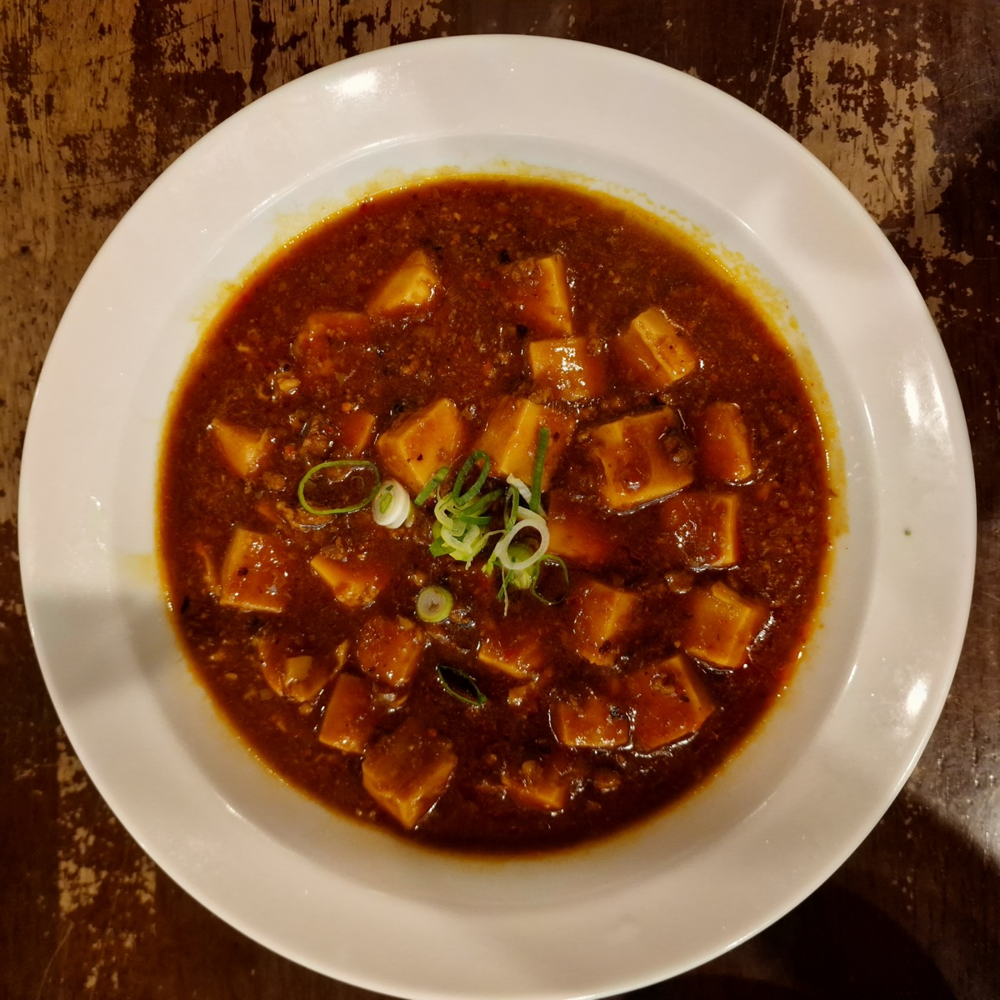
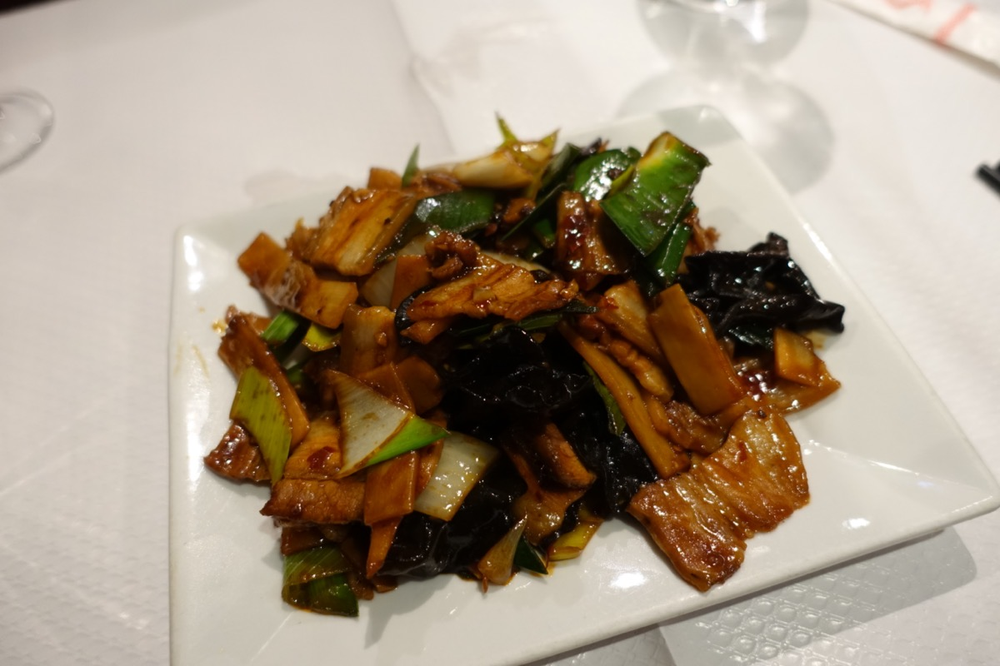
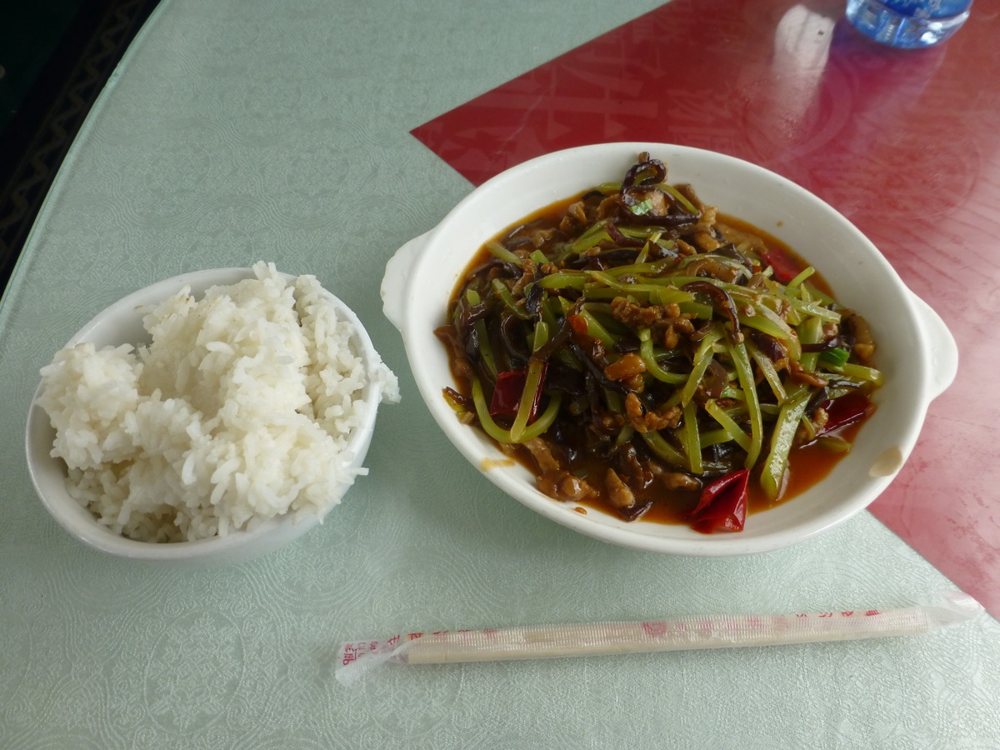
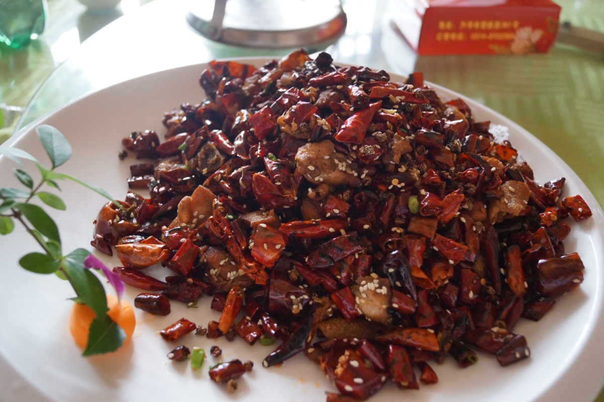
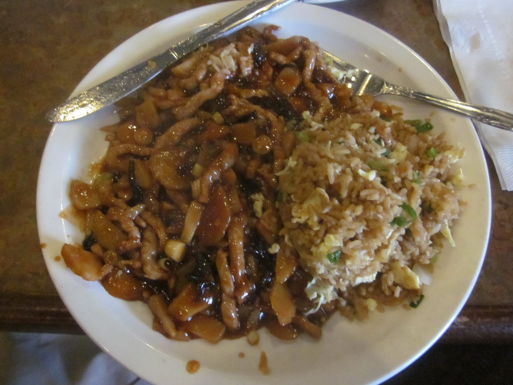
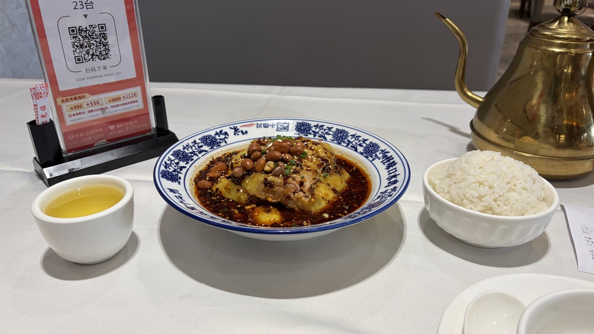
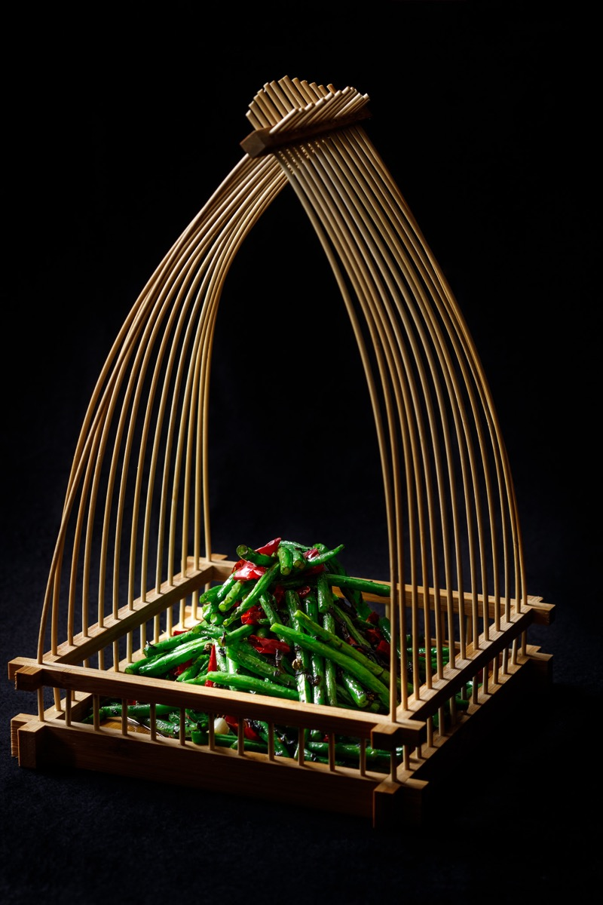

# 第五部 - 川菜（杭州口味友好版）

杭州人爱吃川菜，但又怕过燥过腻。这章写的是**减麻减油但保留川菜灵魂**的家常版：花椒少放一半，红油薄薄一层，不下油锅炸而用平底锅煎。

减法的哲学是这样的：

- **麻**减一半就够。花椒不是越多越正宗，是要刚好让舌尖有一丝麻意，不抢食材本味
- **辣**保留但偏香不偏躁。豆瓣酱炒出红油，比直接放干辣椒末更柔
- **油**减到家常水平。传统川菜炸辣椒下大油，家常版用平底锅煎或薄油，减一半到三分之一
- **甜**这条杭州人本来就有，川菜里鱼香肉丝、宫保鸡丁本身就有糖，跟杭州口味天然兼容

调整后的川菜，麻意还在、辣香还在、灵魂没丢，但吃完不会齁不会燥不会腻。下面 10 道是给爱吃川菜又不想顿顿出馆子的家庭做的。

家里要常备的川菜调料：郫县豆瓣酱、花椒（或藤椒）、干辣椒、生抽、镇江醋、白糖、料酒、姜蒜。这些都好买，不需要泡椒、剁椒、自制红油这些进阶货。

{ width="480" .center }

## 历史与地理

四川盆地是个被群山围起来的湿热碗：北边秦岭挡冷空气，南边大巴山挡南风，中间长江、嘉陵江、岷江交汇。这种地形造成两个长期问题：一是潮湿（年降水多、蒸发慢），二是缺日照。当地人很早就发现辛香料能驱湿、能开胃，先有的是花椒（《诗经》里就有，原产中国），后来才有辣椒。

辣椒原产美洲，明代后期通过海路传入中国，先在江浙、福建一带做观赏花用，真正普及到食用是十七世纪到十八世纪。川菜被人记住的"麻辣"形象，其实是清末才定型的。乾嘉时期的川菜还以鱼羊鲜、河鲜为主，辣椒用量很少。真正把麻辣推到主流的，是十九世纪末到民国初年的成都餐饮业：陈麻婆豆腐（1862 年成都北郊万福桥）、夫妻肺片（1930 年代）、宫保鸡丁定型，都集中在那六十年。

川菜的内部分流也是地理决定的。**上河帮**（成都、乐山）靠近平原，菜路精致工整、刀工细，是宴客菜的代表。**下河帮**（重庆、万州）靠长江航运和码头工人文化，重盐重辣重油，江湖菜（毛血旺、火锅、辣子鸡）就是这一支。**小河帮**（自贡、内江）是盐场地区，历史上盐工劳动强度大、需要重口下饭，"盐帮菜"独立出一种"嗜辣"的风格。

川菜厨师有个说法叫"百菜百味"，分类的味型有 24 种（鱼香、麻辣、家常、怪味、糊辣、红油、椒麻、煳麻、酸辣...）。这个分类不是营销话术，是真存在的：每种味型有固定的调料组合和比例。这章选的 10 道菜覆盖了其中六七种，调到杭州口味后味型骨架还在，只是麻和油减半。

---

## 麻婆豆腐

{ width="360" .center }

### 起源

清同治元年（1862 年）成都北郊万福桥头的"陈兴盛饭铺"出品。掌勺的是老板娘陈刘氏，脸上有麻子，码头脚夫和挑油工常来吃饭，店主就照他们的口味重麻重辣重油，方便配饭下力气。脚夫们后来直接喊这道豆腐"陈麻婆豆腐"，"麻婆"指的是店主的脸，不是花椒的麻。这道菜后来定型出"麻、辣、烫、香、酥、嫩、鲜、活"八字诀，是清末成都餐饮业把麻辣推上主流的标志菜之一，跟同时代北方的家常烧豆腐区别在于豆瓣酱炒红油打底加花椒粉收尾。**杭州口味友好版调整：花椒减一半、红油薄一层、豆瓣酱减三分之一**。麻还在但不抢豆腐的嫩，辣还在但不烧嘴。

### 食材

2-3 人份：

- 嫩豆腐 1 块 400 g（**嫩豆腐不是内酯豆腐**，要能成块的那种）
- 牛肉糜或猪肉糜 80 g
- 郫县豆瓣酱 15 g（**减量版**，传统版用 25 g）
- 干辣椒粉 3 g
- 花椒粒 2 g + 花椒粉 1 g（**减半版**，传统版花椒粒 4 g）
- 蒜末 8 g、姜末 5 g、葱白末 5 g
- 生抽 8 ml
- 白糖 2 g（平衡咸辣）
- 高汤或清水 250 ml
- 油 15 ml（传统版 25 ml）
- 玉米淀粉 8 g + 水 25 ml（勾芡用，分两次勾）
- 葱花 5 g（最后撒）

### 步骤

1. 豆腐切 2 cm 见方块，**温盐水（40°C，1% 盐）泡 5 分钟**：去豆腥 + 让豆腐结实不易碎
2. 烧水 500 ml 加 2 g 盐，水温 80°C 时下豆腐**焯 1 分钟**捞出（这步关键，让豆腐里外热度均匀，烧的时候不出水）
3. 锅烧热下油 15 ml，下肉糜**煸到肉变焦黄出油**（约 2 分钟，肉粒分散不抱团）
4. 转小火，下豆瓣酱**慢慢炒 1 分钟**炒出红油（豆瓣酱必须慢炒，急火会苦）
5. 下姜蒜末、辣椒粉、花椒粒，炒 20 秒出香
6. 加高汤 250 ml + 生抽 + 糖，烧开
7. 下豆腐，**用锅背轻推不要用铲子翻**（豆腐易碎），中火烧 3 分钟入味
8. 第一次勾芡：淀粉水的一半倒入，轻推让芡均匀，烧 30 秒
9. 第二次勾芡：剩下的淀粉水倒入，再烧 30 秒（**两次勾芡是麻婆豆腐挂汁的关键**，一次勾不住）
10. 关火，撒花椒粉 + 葱白末 + 葱花

### 关键

- **豆腐要嫩豆腐 + 焯水**：嫩豆腐才有那个口感，焯水后豆腐结实不出水
- **豆瓣酱小火慢炒**：豆瓣酱的香要慢慢炒出来，急火会发苦
- **两次勾芡**：一次勾不住芡会化，两次勾豆腐挂汁亮汪汪
- **花椒粉最后撒**：花椒粉跟豆瓣酱同炒会失香，关火撒在面上才有麻香
- **杭州口味版花椒减一半**：从 4 g 减到 2 g，麻意刚好不抢戏

### 常见错误

- 用内酯豆腐：一推就碎，成豆腐羹
- 豆腐不焯水：烧的时候出水，汤汁被稀释
- 豆瓣酱大火炒：发苦
- 一次勾芡：芡水化掉，豆腐裸露
- 花椒粉跟豆瓣酱一起炒：麻香全没了

---

## 回锅肉

{ width="360" .center }

### 起源

回锅肉的根在四川人过年祭祖的"刀头肉"，整块带皮二刀肉先白水煮熟供在祖宗牌位前，礼毕再切片下锅炒，"回锅"二字就从这来。这种"煮过再炒"的做法本来只是节日处理剩肉的办法，清末郫县豆瓣酱普及之后，加豆瓣加甜面酱重炒成了固定味型，才从节令菜变成成都人家一周吃两回的日常下饭菜。煸出"灯盏窝"是这道菜的工艺特征，肉片在煸的过程中边缘卷起、油析出，跟江浙红烧肉的"焖到化"是完全相反的思路：一个靠脂肪释放出香气，一个靠脂肪保留住嫩度。**杭州口味友好版调整：瘦肉比例稍高、油减到家常水平、青蒜苗代替部分蒜苗**。肉香、豆瓣香都在，但不会一盘下来全是油。

### 食材

2-3 人份：

- 五花肉 350 g（**三分肥七分瘦的二刀肉最好**，比传统对半肥瘦减腻）
- 蒜苗 100 g（**白色根部和绿色叶分开切**）
- 青椒 1 个 80 g（切菱形片，可省）
- 郫县豆瓣酱 15 g
- 甜面酱 5 g（**这是回锅肉的隐藏 key**，不能省）
- 豆豉 5 g（剁碎）
- 生抽 5 ml
- 白糖 3 g
- 姜 3 片、蒜 2 瓣（切片）
- 油 10 ml（**减量版**，传统版 20 ml，因为肉本身会出油）
- 黄酒 5 ml

### 步骤

1. 五花肉冷水下锅 + 姜片 + 黄酒，水开**煮 15 分钟到 7 成熟**（筷子能戳进去但还硬），捞出**冷藏 20 分钟**（冷藏后好切薄片）
2. 冷却的肉切**1.5 mm 薄片**（**手切要薄**，刀不利就切 2 mm）
3. 蒜苗白根斜切 3 cm 段、绿叶 3 cm 段，分开放
4. 锅烧热下 10 ml 油，下肉片**中火煸 2 分钟到肉片卷起、边缘焦黄出油**（这步叫"煸出灯盏窝"，传统功夫）
5. 把肉片推到一边，**用煸出来的油** + 豆瓣酱小火炒 30 秒出红油
6. 下豆豉、姜蒜片、甜面酱炒匀
7. 下蒜苗白根 + 青椒，大火炒 30 秒
8. 下蒜苗叶、生抽、糖，颠 5 下出锅

### 关键

- **肉煮到 7 成熟再切**：生肉切不薄，全熟肉炒出来散
- **肉冷藏后再切**：热肉切容易烂，冷藏后挺括
- **煸出灯盏窝**：肉片卷边、边缘焦黄出油的状态，是回锅肉的标志
- **用煸出来的肉油炒豆瓣酱**：这步香气最足，比另起油锅好十倍
- **甜面酱不能省**：纯豆瓣酱版咸辣，加甜面酱后甜咸辣平衡
- **杭州口味版肉切薄一点 + 蒜苗多一点**：减少肥腻感

### 常见错误

- 肉直接生切：切不薄，或切薄一炒就碎
- 肉片煸不够：还是煮肉片，没回锅肉的香
- 豆瓣酱大火炒：发苦
- 蒜苗一起下：白根没熟绿叶已经塌
- 不放甜面酱：味道单薄

---

## 鱼香肉丝

{ width="360" .center }

### 起源

鱼香味型相传出自民国初年的成都人家，主妇做烧鱼剩下一碗调料（泡红辣椒、姜末、蒜末、葱花、糖、醋、酱油），第二天舍不得倒掉，拿来炒猪肉丝，没想到味道反而比烧鱼还下饭，"鱼香"这个名字就这么传出去。它的核心是调味结构，不是食材：泡椒提供的发酵酸辣加糖醋的甜酸再加葱姜蒜的辛香，组合出一种类似糟卤烧鱼的香气，但锅里其实没有任何鱼。这是川菜 24 味型里最讲"借味"的一种，跟糖醋里脊只甜酸、酸辣肉丝只酸辣的单线条调味完全不同。**杭州口味友好版调整：泡椒不易买，用郫县豆瓣酱 + 一点点辣椒酱代替；糖醋比例对杭州人天然友好**。是入门川菜的最佳选择。

### 食材

2-3 人份：

- 猪里脊 250 g（**切细丝 5 mm**，加 5 ml 生抽、3 g 淀粉、5 ml 水抓匀腌 15 分钟）
- 木耳 30 g（泡发后切丝，约 60 g 泡发后重量）
- 胡萝卜 80 g（切细丝）
- 笋 80 g（切细丝，可用罐头笋丝）
- 郫县豆瓣酱 10 g（代替泡椒）
- 蒜瓣 3 个、姜 3 片（**全部切末，鱼香味的核心**）
- 葱花 10 g（最后撒）

**鱼香碗芡**（**关键**，提前调好）：

- 生抽 10 ml
- 镇江醋 15 ml（**比生抽多，鱼香的酸香**）
- 白糖 15 g
- 玉米淀粉 6 g
- 水 30 ml
- 黄酒 5 ml

### 步骤

1. 肉丝按上面腌好
2. 木耳、胡萝卜、笋切丝，胡萝卜和笋**冷水下锅焯 1 分钟**捞出
3. **碗芡提前调好**：上面所有调料倒一个碗里搅匀（这是这道菜不翻车的关键，下锅后没时间慢慢调味）
4. 锅烧热下油 15 ml，下肉丝**滑炒 30 秒**到变白，盛出
5. 锅里留底油，下豆瓣酱小火炒 30 秒出红油
6. 下姜蒜末，炒 20 秒出香
7. 下木耳、胡萝卜丝、笋丝，大火炒 1 分钟
8. 肉丝回锅，**碗芡再搅一下倒入**（淀粉沉底要搅）
9. 大火快速翻炒 30 秒，芡汁变浓亮挂在丝上即可
10. 撒葱花出锅

### 关键

- **碗芡提前调好**：鱼香肉丝下锅到出锅一共 2 分钟，没时间调味
- **糖醋比例 1:1**：鱼香的甜酸特征，糖少了不甜、醋少了不香
- **姜蒜末必须细**：大颗的姜蒜抢戏，鱼香要靠姜蒜末融在芡汁里
- **肉丝先滑后回锅**：直接跟其他料炒会老
- **杭州口味版用豆瓣酱代替泡椒**：泡椒家里不常备，豆瓣酱是合理替代

### 常见错误

- 边做边调味：来不及，肉老菜塌
- 糖醋比例错：不像鱼香，像糖醋肉丝或酸辣肉丝
- 姜蒜切片不切末：鱼香味出不来
- 肉丝跟着炒到底：老硬
- 醋一开始就放：醋香气挥发掉

---

## 宫保鸡丁

{ width="360" .center }

### 起源

丁宝桢是贵州人，山东巡抚出身，光绪二年（1876 年）调任四川总督。他在山东当官时家厨做的"酱爆鸡丁"用的是甜面酱加葱白爆炒，他到了成都后家厨入乡随俗，把甜面酱换成郫县豆瓣，加进川菜里常用的干辣椒和花椒，再撒一把油酥花生米提脆，糊辣味型的"宫保鸡丁"就这么定型了。丁宝桢死后被追赠"太子太保"，民间习惯把太子少保也尊称为"宫保"，这道家厨菜就借了主人的衔头叫开。它跟传统鲁菜酱爆鸡丁的差别就在那一把干辣椒和花椒，是山东味道入川改良的标本。**杭州口味友好版调整：花椒减半、干辣椒减半、油减一半**。但糖醋花生这条线杭州人天然喜欢，是川菜里最好下口的之一。

### 食材

2-3 人份：

- 鸡腿肉 300 g（**鸡腿肉嫩、鸡胸肉柴**，切 1.5 cm 见方丁）
- 花生米 60 g（**油炸过的或烤过的**，超市买现成的最方便）
- 干辣椒 4 个（**减量版**，传统 8 个，剪成 2 cm 段去籽）
- 花椒粒 2 g（**减量版**，传统 4 g）
- 大葱 1 根 80 g（**只用葱白**，切 1.5 cm 段）
- 蒜 3 瓣、姜 3 片（切片）
- 油 15 ml（**减量版**，传统 25 ml）

**鸡丁腌料**：

- 生抽 5 ml
- 黄酒 5 ml
- 玉米淀粉 5 g
- 水 5 ml

**宫保碗芡**（提前调）：

- 生抽 8 ml
- 老抽 3 ml
- 镇江醋 12 ml
- 白糖 12 g
- 玉米淀粉 5 g
- 水 25 ml

### 步骤

1. 鸡腿肉切丁，按腌料腌 15 分钟
2. 干辣椒剪段去籽（**去籽是减辣的关键**，籽是辣源）
3. 碗芡提前调好
4. 锅烧热下油 15 ml，下花椒粒 + 干辣椒**小火慢炒 20 秒**到辣椒变深红冒香（**别炒糊**，糊了苦）
5. 下姜蒜片爆香，下鸡丁**大火滑炒 1.5 分钟**到鸡丁变白八成熟
6. 下葱白段炒 20 秒
7. 碗芡再搅一下倒入，大火翻炒 30 秒收汁
8. 关火，下花生米拌匀（**花生米最后下保持脆**）

### 关键

- **鸡腿肉而不是鸡胸**：鸡胸炒老了发柴，鸡腿肉嫩
- **干辣椒去籽 + 减半**：辣意保留但不烧嘴，杭州口味友好
- **花生最后下**：跟着炒会受潮变软，关火后下保持脆
- **碗芡提前调**：跟鱼香肉丝同理，下锅没时间调
- **干辣椒花椒小火慢出香**：大火立刻糊苦，小火耐心 20 秒

### 常见错误

- 鸡胸肉：柴
- 干辣椒不去籽：辣到失去理智
- 花生跟着一起炒：软了
- 干辣椒大火炒糊：整盘苦
- 葱用葱绿：宫保鸡丁要葱白的爽脆，葱绿会塌

---

## 蒜泥白肉

{ width="360" .center }

### 起源

蒜泥白肉的雏形是满族祭祀的"跳神肉"，整块白水煮的猪肉切片蘸盐吃，清初随八旗入关流到北方，再随移民进川。四川人在清末把蘸料换成本地的红油加蒜泥加复合酱油，"白肉"两个字保留了原本白水煮、不加酱色的做法，但味型已经彻底变成川式。它跟北方的白片肉蘸蒜酱区别就在那勺红油和复合酱油，跟回锅肉同样是煮过的二刀肉，一个再下锅煸到出油，一个直接切薄片冷拌，是同一块肉的两种走向。这道菜没有锅气可以掩盖，肉本身的水准、刀工的薄厚、酱汁的层次三件事全摆在面上。**杭州口味友好版调整：红油薄一层、蒜泥酱里加一点点糖中和咸辣**。简单到不能再简单，但每一步都不能糊弄。

### 食材

2-3 人份：

- 五花肉 400 g（**带皮三层、整块不切**，长方形最好）
- 黄瓜 1 根 200 g（切薄片垫底）
- 葱 2 段、姜 4 片、八角 1 颗（煮肉用）
- 黄酒 15 ml
- 花椒粒 5 g（煮肉用，不入菜）

**蒜泥红油汁**（这道菜的灵魂）：

- 蒜瓣 6 个（**捣成泥**，**不是切末**，泥才出味）
- 生抽 20 ml
- 镇江醋 10 ml
- 白糖 8 g（**杭州口味友好版加糖**，平衡咸辣）
- 红油 10 ml（**减量版**，传统版 20 ml）
- 香油 5 ml
- 花椒粉 1 g（**减量版**，传统 2 g）
- 凉白开 15 ml（稀释酱汁）

### 步骤

1. 五花肉**冷水下锅** + 葱姜八角花椒 + 黄酒，**大火烧开后转小火煮 30 分钟**（筷子能戳穿即可）
2. 关火**让肉在汤里浸 15 分钟**（这步是肉嫩多汁的关键，立刻捞出会发柴）
3. 捞出肉**放冰水里激 5 分钟**（**冰水激是切薄片的关键**，肉收紧好切）
4. 蒜瓣捣成蒜泥（**用蒜臼或刀面拍碎再剁**，破坏纤维出蒜素）
5. 调蒜泥红油汁：把上面所有调料拌匀，**静置 10 分钟让蒜泥出味**
6. 黄瓜切**1 mm 薄片**铺盘底
7. 五花肉**切 1.5 mm 薄片**（**越薄越好**，刀利的话能透光），码在黄瓜上
8. 淋蒜泥红油汁，**不要全淋上**，留一半在小碗里蘸着吃

### 关键

- **冷水下锅煮肉**：让肉慢慢热起来，肉质均匀
- **关火浸 15 分钟**：肉嫩多汁不柴的关键
- **冰水激**：肉收紧才能切薄片
- **蒜捣成泥不切末**：蒜素只有破坏纤维才出，切末出味少一半
- **酱汁静置 10 分钟**：蒜泥跟酱融合的过程
- **杭州口味版加糖 + 减红油花椒**：保留麻辣味，但回甘多一点不那么躁

### 常见错误

- 热水下锅：肉外熟内生
- 直接捞出来切：肉柴
- 切片厚：嚼不动
- 蒜切末：味道差一截
- 红油花椒按传统量：杭州人会觉得太冲

---

## 凉拌口水鸡

{ width="360" .center }

### 起源

口水鸡的前身是川南乐山一带的"白砍鸡"，清末民初的做法就是白水煮鸡剁块淋复合酱油加红油。"口水鸡"这个名字相传来自郭沫若 1957 年发表的《洪波曲》，他写到家乡乐山的凉拌鸡时说"想起来还口水长流"，菜馆觉得这名字活泼又勾人，就把白砍鸡改叫口水鸡推出去。它属于川菜"红油味型"的代表，特征是糖、醋、酱油、红油、花椒粉、蒜末按固定比例调成的复合酱，跟广东白切鸡只蘸姜葱油、跟江南醉鸡靠绍酒浸出味的路数都不一样。盆地夏天闷热出汗多，凉菜要靠麻辣开胃和酸甜回味才下得了饭，这道菜就是在这个气候底下长出来的。**杭州口味友好版调整：红油从浮一层减到薄一层、加白芝麻和黄瓜增加层次**。夏天吃最好。

### 食材

2-3 人份：

- 鸡腿 2 个 500 g（**带骨鸡腿肉嫩**，鸡胸肉太柴）
- 黄瓜 1 根（切丝铺底）
- 熟花生米 30 g（拍碎撒面）
- 白芝麻 5 g（炒香）
- 香菜 10 g（切段，可省）

**煮鸡水**：

- 葱 2 段、姜 4 片、料酒 10 ml、花椒 3 g

**口水鸡酱**（这道菜的灵魂）：

- 生抽 25 ml
- 镇江醋 12 ml
- 白糖 10 g（**杭州口味版多一点糖**）
- 蒜末 10 g
- 姜末 3 g
- 红油 15 ml（**减量版**，传统 25 ml）
- 花椒粉 1.5 g（**减量版**，传统 3 g）
- 香油 5 ml
- 煮鸡的鸡汤 30 ml（稀释 + 加鲜）
- 葱花 5 g

### 步骤

1. 鸡腿冷水下锅 + 葱姜花椒 + 料酒，水开**转小火煮 15 分钟**
2. 关火**让鸡腿在汤里浸 10 分钟**（肉嫩多汁的关键）
3. 捞出**放冰水里激 5 分钟**（皮 Q 弹的关键）
4. 鸡汤留 30 ml 备用调酱
5. 鸡腿**去骨切块**（2 cm 见方块，**带皮**）
6. 黄瓜切丝铺盘底
7. 鸡块码在黄瓜上
8. 调口水鸡酱：把所有调料 + 鸡汤拌匀
9. 淋酱在鸡块上，撒花生碎、白芝麻、香菜、葱花

### 关键

- **鸡腿不是鸡胸**：鸡胸柴成柴，鸡腿嫩
- **关火浸 10 分钟 + 冰水激**：嫩肉 + Q 皮的双保险
- **鸡汤入酱**：很多人省略这步，但鸡汤稀释酱汁同时加鲜，是层次的关键
- **花生芝麻最后撒**：拌进酱里就软了，撒面才脆
- **杭州口味版红油花椒减半**：传统版麻辣很冲，减半后底味出来

### 常见错误

- 鸡胸肉：柴
- 煮太久：肉散
- 不冰激：皮塌
- 不加鸡汤：酱过浓味单薄
- 红油按传统量：辣到流泪不是流口水

---

## 干煸四季豆

{ width="360" .center }

### 起源

干煸是川菜里独有的一种工艺，特征是少油、长时间、不勾芡，把食材里的水分慢慢逼出来，让纤维收紧、表皮起皱、香气浓缩。这跟"干炸"完全不是一回事：干炸是大油锅高温短时间把外层炸脆，里面还是水嫩的；干煸是中小火靠时间和翻动让食材自身脱水，吃起来干香有嚼头但不油。这道菜相传起源于民国时期的成都小馆子，用的是当时最便宜的四季豆配肉糜和宜宾芽菜（或榨菜），是道平民下饭菜。它后来跟干煸鳝鱼、干煸牛肉丝并称"干煸三样"，是川菜厨师考工艺的入门题。**杭州口味友好版调整：用平底锅干煎代替油炸，省一锅油**。家庭做法做得对一样香、皮一样起皱。

### 食材

2-3 人份：

- 四季豆 400 g（**选嫩的、掐头去尾去筋**）
- 猪肉糜 80 g
- 榨菜 20 g（切末）
- 干辣椒 3 个（切段去籽）
- 蒜末 8 g、姜末 3 g
- 葱花 5 g
- 生抽 10 ml
- 白糖 3 g
- 油 15 ml（**家常版减量**，传统油炸版 200 ml）
- 盐 1 g（最后调）

### 步骤

1. 四季豆掐头去尾去筋，**切 5 cm 长段**（不切短）
2. 四季豆**洗净后用厨房纸擦干**（湿的下锅会溅油 + 不易煎出皱）
3. 平底锅烧热下油 15 ml（**用平底锅不用炒锅**，平底面积大煎得均匀）
4. 下四季豆**铺平不要堆**，**中火干煎 8 分钟**，期间**翻动 3-4 次**让每一面都接触锅
5. 四季豆**表皮起皱、颜色变深绿带焦点**就是煎到位了，盛出
6. 锅里留底油 5 ml，下肉糜煸到肉粒散开焦黄
7. 下榨菜末、干辣椒、姜蒜末，炒 30 秒
8. 四季豆回锅，加生抽、糖，颠炒 1 分钟
9. 撒葱花出锅

### 关键

- **平底锅干煎代替油炸**：家庭版省油的核心，平底锅面积大煎得均匀
- **四季豆必须擦干**：湿的煎不出皱，会变成蒸的
- **中火 8 分钟 + 多翻**：表皮起皱才算干煸成功
- **榨菜末是隐藏 key**：肉糜配榨菜是干煸四季豆的标志，少了榨菜味道单薄
- **必须断生**：四季豆生吃有毒，皱皮深绿才是熟透

### 常见错误

- 四季豆没擦干：煎不出皱
- 火太大：外焦内生
- 一次堆太多：温度下降，蒸的状态出不来皱
- 没放榨菜：少了川味
- 四季豆没断生：吃了拉肚子（四季豆生有毒，必须充分加热）

---

## 青椒肉丝

### 起源

青椒肉丝在川菜里属于"小煎小炒"那一路，跟鱼香肉丝、糖醋里脊一样是民国成都小饭馆的标配快炒，给短工和学生当过午饭。辣椒明末传入中国先在江浙做观赏，到清代中期才在四川大面积入菜，但本地人很快发现温和的青辣椒（杭椒、二荆条、螺丝椒）配肉丝最家常，重辣的朝天椒反而留给江湖菜用。这道菜的川味底色靠郫县豆瓣那一勺红油打出来，跟湖南的擂辣椒炒肉用生青椒舂烂出汁、跟江浙的尖椒炒肉直接用生抽糖水路数都不同。它是川菜里最容易被外地人接受的一道，本身就不重麻不重辣。**这道菜本来就不算重口味川菜，杭州口味友好版调整：少量豆瓣酱代替没有豆瓣酱的版本，川味更明显**。15 分钟搞定。

### 食材

2 人份：

- 猪里脊 200 g（切细丝 5 mm，加 5 ml 生抽、3 g 淀粉、5 ml 水腌 15 分钟）
- 青椒 2 个 200 g（**杭椒或螺丝椒，不要太辣的**，切细丝）
- 蒜 2 瓣切片、姜 2 片切丝
- 郫县豆瓣酱 5 g（**少量**，川味的提示）
- 生抽 5 ml
- 白糖 2 g
- 黄酒 5 ml
- 油 15 ml（分两次）

### 步骤

1. 肉丝按上面腌好
2. 青椒去籽切细丝（**和肉丝一样粗细**，口感协调）
3. 锅烧热下油 10 ml，下肉丝**滑炒 1 分钟**到变白，盛出
4. 锅里再下油 5 ml，下豆瓣酱小火炒 30 秒出红油
5. 下姜蒜片爆香
6. 下青椒丝大火炒 1 分钟（**青椒要保持脆**，不要炒塌）
7. 肉丝回锅，加生抽、糖、黄酒
8. 颠炒 30 秒出锅

### 关键

- **肉丝先滑后回锅**：跟其他菜一起炒会老
- **少量豆瓣酱**：不是麻辣的青椒肉丝，是有川味底色的家常炒
- **青椒保持脆**：炒塌了变软的青椒就败了
- **粗细一致**：肉丝和青椒丝粗细相同口感才协调
- **杭州口味友好版用 5 g 豆瓣酱**：川味底色出来但不抢戏

### 常见错误

- 青椒炒太久：塌软发蔫
- 肉丝跟青椒一起炒：肉老
- 用尖椒太辣：杭州口味版用螺丝椒、杭椒
- 豆瓣酱放多：变成川版而不是友好版

---

## 醋溜白菜

### 起源

醋溜是鲁菜传统技法，山东厨师用醋和淀粉勾出晶亮挂汁的薄芡，叫"溜"。清末民初大批山东厨师南下入川，把这套技法带进成都的"南馆"和"北馆"，川菜厨师在原有基础上加进花椒粒和干辣椒煸香的环节，做成了带糊辣味的川式醋溜白菜。它跟北方醋溜白菜的区别就在那粒花椒和那段干辣椒，不重不抢戏，但少了就不是川味。白菜帮子靠盐杀出水分再快炒，是为了让芡汁不被白菜本身的水稀释。这道菜在川菜分类里属于"小荤小素"的素菜组，跟鱼香茄子、麻婆豆腐一样靠味型撑场。**杭州口味友好版调整：糖醋比例对杭州人天然友好，红辣椒少量点缀**。一道清爽的川式凉菜风格热菜，下饭神器。

### 食材

2-3 人份：

- 大白菜 400 g（**只用菜帮**，菜叶留着另做别的菜）
- 干辣椒 1 个（切段，可省）
- 花椒粒 1 g（**少量**）
- 蒜 2 瓣（切片）
- 油 15 ml

**碗芡**（提前调）：

- 镇江醋 25 ml
- 白糖 15 g
- 生抽 8 ml
- 老抽 2 ml
- 玉米淀粉 5 g
- 水 30 ml
- 盐 1 g

### 步骤

1. 大白菜帮子**斜刀片成大薄片**（这样切横截面大，吸味多）
2. **白菜片用 5 g 盐抓 5 分钟杀水**，挤干（这步关键，让白菜吸味不出水）
3. 碗芡提前调好
4. 锅烧热下油，下花椒粒 + 干辣椒**小火炒 15 秒**出香（**花椒和干辣椒要捞出**或不下，**杭州口味版可只下蒜片**）
5. 下蒜片爆香
6. 下白菜片**大火炒 1 分钟**
7. 碗芡再搅一下倒入，大火快速翻炒 30 秒到芡汁挂在白菜上
8. 出锅

### 关键

- **白菜杀水挤干**：不杀水会出大量水稀释芡汁
- **斜刀片大片**：横截面大吸味多
- **碗芡提前调**：醋和糖的比例是这道菜的灵魂，下锅没时间调
- **大火快炒**：白菜要保持脆，慢炒就塌了
- **杭州口味版减少花椒辣椒**：只用蒜爆香也很好

### 常见错误

- 白菜不杀水：成菜汤
- 白菜炒太久：塌软发黄
- 醋糖比例错：太酸或太甜
- 用菜叶：菜叶炒不出脆
- 边炒边调味：来不及，必须碗芡

---

## 红油抄手

### 起源

"抄手"是四川对馄饨的叫法，名字相传源自这种面食包好后两端往中间一拢的动作，像人冬天袖手抱臂。成都的"龙抄手"创于 1941 年悦来场，是这道菜定型推广的标杆店。红油抄手的味型属于川菜"红油味"，复合酱油加红油加蒜泥加少许花椒粉，跟江浙馄饨清汤撒紫菜虾皮的清淡路数是两条线：江浙吃皮薄馅鲜的本味，川式靠红油酱拌出复合层次，馅本身只是个载体。盆地冬天阴冷潮湿，一碗带红油的热抄手既驱寒又开胃，是从前码头工人和学生当夜宵的快食。**杭州口味友好版调整：红油薄一层、增加香醋和糖、配清汤底而不是干拌**。一碗下肚不会齁，比纯辣味红油抄手温和得多。

### 食材

2 人份：

- 馄饨皮 30 张（超市买现成的）
- 猪肉糜 200 g（三分肥七分瘦）
- 葱姜水 30 ml（葱姜泡水 10 分钟过滤）
- 生抽 8 ml、盐 2 g、白糖 1 g、白胡椒粉 1 g、香油 3 ml、玉米淀粉 5 g（馅料调味）

**红油碗底**（**杭州口味友好版**）：

- 红油 8 ml（**减量版**）
- 生抽 12 ml
- 镇江醋 10 ml（**比传统多**，增加醋香减麻辣冲击）
- 白糖 5 g
- 蒜末 5 g
- 花椒粉 0.5 g（**减量版**）
- 香油 3 ml
- 葱花 5 g
- 煮馄饨的汤 80 ml（**杭州口味版加汤**，传统是干拌，这里半汤半拌更温和）

### 步骤

1. 调馅：肉糜放碗里，**葱姜水分 3 次加入**，每次朝一个方向搅打到吸收（这步让肉馅嫩多汁）
2. 加生抽、盐、糖、胡椒、香油、淀粉，继续搅 2 分钟到上劲
3. 馅料**冷藏 20 分钟**让味道融合
4. 包馄饨：馄饨皮放手心，中间放 8 g 馅，对角折成三角形，再把两个角往中间捏（"抄手"的形状）
5. 调红油碗底：把上面除汤外的所有调料调一个碗里
6. 大锅水烧开（**水量要多**，一锅 20 个抄手），下抄手**水开后再煮 3 分钟**到浮起
7. 取一勺煮抄手的汤倒入红油碗底（约 80 ml）
8. 抄手捞入碗，撒葱花

### 关键

- **葱姜水分次加**：让肉馅嫩多汁的关键，一次加入吸收不了
- **馅料冷藏 20 分钟**：让调料和肉融合，不冷藏味道散
- **杭州口味版半汤半拌**：纯红油干拌对杭州人太冲，加 80 ml 煮抄手的汤进去成半汤状态
- **煮抄手的汤而不是开水**：抄手汤里有面粉的香，比开水更顺
- **红油花椒减半**：底味在但不躁

### 常见错误

- 葱姜水一次加：吸收不了，馅料松散
- 馅料不冷藏：味道散
- 煮抄手水太少：粘连
- 红油按传统量：杭州人会觉得太麻太辣
- 不加汤：纯干拌对家常餐桌过于刺激

---

## 文化与场景

### 时令与节气

四川盆地夏湿冬冷，这种气候直接塑造了川菜的味觉骨架。辣椒和花椒不是为了好吃才放，是为了祛湿驱寒。所以川菜的"辣季"其实是入秋开始，立秋到来年清明这段时间是辣菜最旺的几个月。夏天四川人反而吃得清淡，凉拌、蒸菜、清炒为主，蒜泥白肉、凉拌口水鸡、醋溜白菜都是夏季菜，靠醋和蒜开胃，不靠辣。

入秋头一桩事是泡菜下缸，立秋后白菜、萝卜、豇豆、青椒大量上市，每家泡菜坛子开始翻新。泡菜不是几天就能吃，老坛要养，新坛要养老水，这是个常年功夫。鱼香肉丝里的泡椒、回锅肉里的豆瓣，本质上都是泡菜系统的延伸。

冬天进入腊货季，川式腊肠跟广式腊肠完全不同，川腊肠麻辣，广腊肠甜口，做法和味型走两条路。冬至前后到春节是腊肠、腊肉、烟熏豆腐做得最多的几周，柏树枝熏出来的腊味是川菜冬季的标志气味。

春天吃野菜、春笋、春韭，干煸四季豆这一类菜要等夏初豆角下来才地道，冬天用冷藏豆角做出来口感差一档。

### 餐桌格局

四川家常餐桌一个明显特征是"泡菜碟"。一桌饭，无论几菜几汤，桌角必摆一碟泡菜，泡萝卜、泡豇豆、泡椒、泡仔姜，吃饭中间夹一筷泡菜清口、解辣、开胃。这个习惯江浙、广东、北方都没有，是川菜独有的桌面规矩。

主食是白米饭，四川盆地是稻米产区。但跟江浙比，四川人吃面食的比例更高，担担面、抄手、燃面、甜水面、宜宾燃面都是日常主食的一部分，午饭一碗面晚饭吃饭是常见格局。重庆和川东吃面比成都多，川北吃馍头比川南多，省内也有南北差异。

汤在川菜餐桌上不是主角，多数家常饭桌就是几个炒菜配米饭，需要喝汤的时候多是清汤（萝卜排骨、冬瓜丸子）平衡桌上的麻辣。这跟广东汤为主角的逻辑刚好相反。

饮品方面，吃饭配茶为主，盖碗茶是四川茶馆文化的核心，但家里多用三花、毛峰、绿茶。酒以白酒为主，五粮液、泸州老窖、剑南春都是川酒，家常下酒菜配花生米、凉拌、卤味，成都人喝酒慢，一桌人能从晚饭喝到深夜。

### 节庆与仪式

春节四川桌上必有香肠、腊肉（自家熏的）、烟熏豆腐、回锅肉、肝腰合炒、鱼香肉丝、麻婆豆腐。鱼是必上的，水煮鱼或豆瓣鱼最常见。年夜饭还要有汤圆（甜口）和年糕（碗豆汤年糕，川南做法）。

清明吃艾馍馍、青团（川版青团比江浙小一号）。端午吃椒盐粽和红糖粽（川式独有，把红糖块包进糯米粽里），跟江南咸肉粽、广东大粽路数都不一样。中秋吃椒盐月饼或鲜肉月饼，川式椒盐月饼是少有的咸辣口月饼，跟广式甜口、苏式酥皮各成一派。

婚宴四川走"九大碗"（也叫"田席"），是乡村流水席的格局，必有蒸笼系列：蒸肉、烧白（梅菜扣肉的川版）、咸烧白、酥肉、墩子（粉蒸肉）、清蒸鸡、清蒸鱼、丸子汤。九大碗以蒸为主，几十桌同时开席靠蒸笼周转得过来。这套格局跟江浙婚宴炒菜为主的路数不同，反映了川菜里"蒸"作为大宴主力的传统。

### 跟邻近菜系的边界

川菜对内分上河帮（成都、乐山）、下河帮（重庆、川东）、小河帮（自贡、内江）三家。上河帮温润，麻辣有节制，宫保鸡丁、回锅肉、麻婆豆腐都是成都路数的代表。下河帮重麻重辣重油，毛血旺、辣子鸡、水煮鱼是重庆江湖菜的代表。小河帮咸鲜重，盐帮菜在自贡一带，跷脚牛肉、水煮牛肉是这路的代表。

跟湘菜的边界最容易混。湘菜辣，但走"鲜辣"路线，辣椒为主，花椒少甚至不放，所以湘菜没有"麻"的层次。剁椒鱼头是湘菜代表，对应川菜豆瓣鱼，两道菜原料差不多，但剁椒鱼头是单纯辣，豆瓣鱼是麻辣鲜香复合。

跟鄂菜（湖北）的边界则在于川菜重油，鄂菜清淡偏鲜，鄂菜有大量蒸菜和鱼菜（武昌鱼、清蒸鳜鱼），跟川菜的重红油完全不是一条路。跟贵州菜的边界更窄，贵州酸辣（酸汤鱼、糟辣椒）是川菜不会做的，川菜的酸来自醋和泡菜，贵州酸来自发酵米浆，路数不同。
