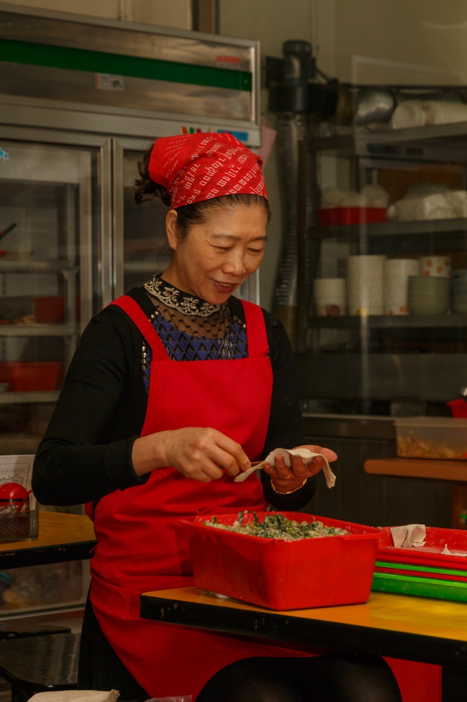
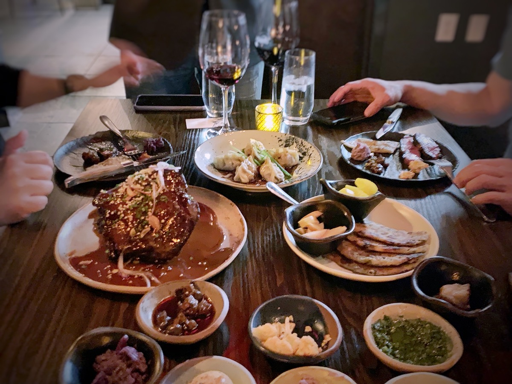
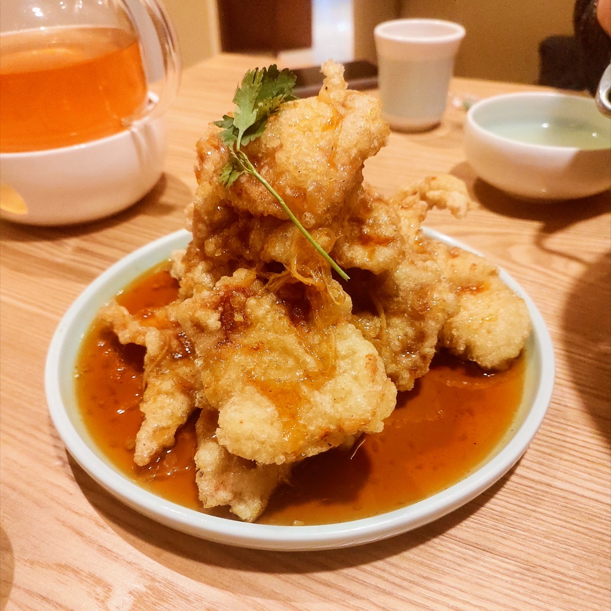
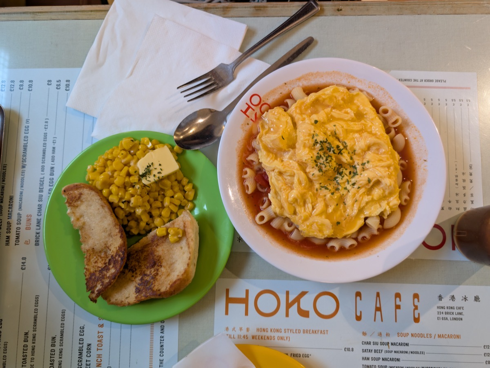
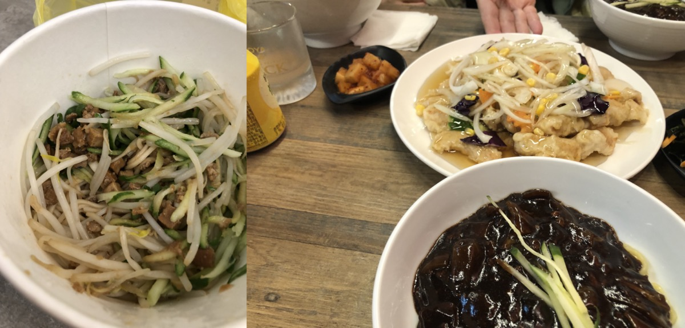

# 第六部 - 北方家常

北方家常的味觉底色是面、酱、葱、醋、肉，跟杭州那套鲜清微甜不在同一个坐标系里。但这不意味着北方菜在这本书里就要写成铺天盖地的咸和酱色，那是馆子做法。家里做北方菜的目标，是把饺子煮到皮韧馅鲜、把炸酱面拌到酱香裹面、把锅包肉炸到外脆里嫩，剩下的盐糖比例可以稍微往杭州那边偏一点点（少 10-15% 盐，加一小撮糖回甘），不会丢北方味，反而吃完不齁不口干。

这章选的 10 道是北方家庭真正天天做的：饺子、面、炖菜、家常小菜。不写羊蝎子、烤全羊那些馆子菜，也不写酸菜白肉锅那种一年做两次的硬菜。日常吃的，写到位。

{ width="480" .center }

## 历史与地理

中国饮食有一条南北分界线，大致在淮河 - 秦岭一线。线以北是麦作区，主食是面条、饺子、馒头、烙饼；线以南是稻作区，主食是米饭。这条分界线两千年没怎么动过，由降水量、积温、土壤决定，文化只是结果。「北方家常」这章写的，就是这条线以北、长城以南这一大片土地上的家常菜。

北方饮食的第二个历史层是汉胡融合。从东汉末年到隋唐，匈奴、鲜卑、突厥、契丹这些游牧民族陆续进入华北，带来了羊肉、奶制品、葱、蒜、孜然、香菜的食用习惯。今天涮羊肉、葱爆羊肉、馕、烧饼这些菜的存在，是这一千多年文化层叠的结果。鲁菜作为北方菜系的代表，从齐鲁地区沿着运河北上影响了北京宫廷菜，明清两朝御膳房里鲁菜底子最重，连「酱」「卤」「爆」这些最基础的北方做法都是鲁菜定型的。

东北菜是另一条线。清代「闯关东」（约 1860-1930）让大量山东、河北农民进入东北，把鲁菜的酱、炖、烧带过去；满族原住民贡献了腌菜、酱菜、白肉血肠的传统；俄罗斯人在哈尔滨留下了大列巴、红肠、罗宋汤的影子；朝鲜族带来辣白菜、冷面。今天东北家常菜里小鸡炖蘑菇、锅包肉、酱骨头这些，都是这场多源融合的产物。

西北菜（陕西、甘肃、宁夏）是丝绸之路的活化石。羊肉泡馍、油泼面、肉夹馍、抓饭，这些菜路里既有汉地农耕的麦作底子，又有西域回民的清真习惯，还能看到中亚游牧文化的痕迹。

北方家常的味觉特征是「咸鲜重酱」：酱油重、葱蒜重、油重。这些不是因为北方人重口，而是因为冬天长、新鲜蔬菜少，发酵酱料、腌菜、咸肉是必须的存储手段，吃习惯了就成口味基线。

---

## 猪肉白菜饺子

{ width="360" .center }

### 起源

饺子起源于中原，相传东汉医圣张仲景在南阳冬天发"祛寒娇耳汤"治冻耳朵，把羊肉花椒包在面皮里煮汤分给穷人，"娇耳"演化成"饺耳""饺子"。因为黄河流域是小麦带，冬天蔬菜稀缺、肉要发面包起来才能匀出量，所以包馅水煮的吃法在北方扎根，成为过年除夕守岁的食俗，取"更岁交子"的谐音。猪肉白菜是华北最经典的搭配，因为白菜耐储，整个冬天家家窖里都有。跟馄饨的区别在皮厚馅大、要蘸醋吃，跟汤圆的区别在咸馅、面皮非糯米。北方家庭里饺子是常态而不是仪式，周末包一锅冻起来吃一周。

### 食材

3-4 人份，约 50 个：

**面皮：**
- 中筋面粉 500 g
- 凉水 250 ml（夏天用冷水、冬天用 30°C 温水）
- 盐 3 g（让面更筋道）

**馅料：**
- 猪肉糜 400 g（三肥七瘦，**手剁的最好**，机器绞的也行）
- 大白菜 500 g（取菜帮和嫩叶，不要老梆子）
- 大葱 80 g（葱白部分，切末）
- 姜 15 g（切末）
- 花椒 10 粒（泡水用）
- 生抽 25 ml
- 老抽 5 ml
- 黄酒 10 ml
- 香油 15 ml
- 盐 4 g（先放一半）
- 白糖 3 g（北方做法不放，这本书加一点回甘）
- 白胡椒粉 1 g

### 步骤

**和面醒面：**

1. 面粉加 3 g 盐，250 ml 水分 3 次倒入，用筷子搅成絮状
2. 上手揉成团，揉到面团光滑（约 8 分钟，**面光、手光、盆光**三光为准）
3. 盖湿布或保鲜膜醒 **30 分钟以上**（醒得越久越好擀，**这步不能省**）

**调馅：**

4. 花椒 10 粒用 80 ml 开水泡 10 分钟，**晾凉**，得到花椒水
5. 白菜切末（**先切丝再切末**，不要剁成泥），撒 5 g 盐拌匀**腌 15 分钟**杀水
6. 白菜末用纱布或手挤干水分（**挤到能攥成团不滴水**），白菜水留一点备用
7. 肉糜放大碗，加生抽、老抽、黄酒、姜末、糖、白胡椒粉
8. 花椒水分 4 次倒入肉糜，**每次都朝一个方向搅到水吸进去再加下一次**（这步是肉馅嫩多汁的关键）
9. 加葱末、香油、剩 2 g 盐，再朝一个方向搅 1 分钟到上劲
10. 拌入挤干的白菜末，轻拌均匀（白菜不要过度挤压，保留一些清甜水分）

**包饺子：**

11. 醒好的面再揉 1 分钟，搓成长条，分成约 10 g 一个的小剂子
12. 剂子按扁，擀成**中间略厚边缘略薄**的圆皮，直径 7-8 cm
13. 放馅 15-20 g 在皮中央，对折，从中间捏紧
14. **从中间向两边捏褶子**，每边 3-4 个褶（家常版捏成月牙形，不强求花式）
15. 包好的饺子摆在撒了薄面粉的盖帘上，**互不相挨**

**煮饺子：**

16. 大锅烧水，水量要多（约饺子体积 4 倍），大火烧到**剧烈翻滚**
17. 饺子下锅，**用勺背沿锅边推一圈**防粘底
18. 盖盖煮到再次沸腾，**点一次凉水**（约 100 ml）
19. 再次沸腾，**再点一次凉水**
20. 第三次沸腾，饺子**全部浮起、肚子鼓胀**就熟了（一般 6-8 分钟）
21. 漏勺捞出，配蒜泥醋汁

### 关键

- **醒面 30 分钟起步**，没醒的面擀不开、煮了硬
- 白菜**先杀水后挤干**，不杀水包不住、馅出汤把皮泡破
- 花椒水**分次打入肉馅**是嫩的核心，一次倒进去肉馅吸不住会泻
- **朝一个方向搅**让肉上劲，乱搅就散
- 煮饺子**点三次凉水**让皮均匀受热，皮韧不破
- 水量要足、要剧烈翻滚，少水会粘连成一坨

### 常见错误

- 面没醒：擀皮回缩，煮出来硬芯
- 白菜不挤干：馅出汤，包不住、皮破
- 肉馅不打水：肉柴，咬下去发干
- 不点凉水煮：皮糊烂、馅没熟
- 包好不撒粉：粘盖帘上提起来就破
- 皮擀得均匀厚度：边缘煮糊中间还硬

---

## 葱爆羊肉

{ width="360" .center }

### 起源

葱爆羊肉是北京老饭庄的招牌爆菜，定型于清末民初的牛街、东来顺、烤肉宛一带的回民聚居区，鲁菜"爆"字诀北上进京后跟回民羊肉做法合流的产物。北方多牧区，羊肉在汉胡融合后成为华北冬季主肉源，山东章丘大葱跟河北、内蒙的羊腿肉都在京城集市常年供应，所以这道菜能成为家常。做法上靠的是猛火短炒 90 秒，因为羊肉一旦慢炒就出水变腥，必须高温瞬间锁鲜，葱段在油里走一道香气逼出来裹着肉。跟羊肉串的区别在不用孜然辣椒压味、走葱香一路，跟涮羊肉的区别在熟成方式，前者油爆后者水汆。

### 食材

2 人份：

- 羊腿肉或羊里脊 250 g（**逆纹切薄片** 2 mm 厚）
- 大葱 200 g（**葱白为主**，斜切 4 cm 段）
- 姜 5 g（切丝）
- 蒜 3 瓣（切片）
- 生抽 12 ml
- 老抽 3 ml
- 黄酒 10 ml
- 镇江醋 5 ml
- 白糖 4 g
- 盐 1 g
- 油 25 ml
- 孜然粉 1 g（可省，加了北方味重一点）

**腌肉料：**
- 生抽 5 ml、黄酒 5 ml、淀粉 5 g、油 5 ml、白胡椒粉 0.5 g

### 步骤

1. 羊肉**逆纹**切薄片，加腌料抓匀腌 15 分钟（最后加油锁水）
2. 大葱斜切段，葱白和葱绿分开放
3. 碗里调好料汁：生抽、老抽、黄酒、糖、盐、半勺水搅匀备用
4. 锅烧到冒烟，下 15 ml 油烧到**七成热**（油面冒烟），下羊肉**快速划散**
5. 羊肉**变色立刻盛出**（约 30 秒，不要全熟）
6. 锅里再下 10 ml 油，下姜蒜葱白爆香 10 秒
7. 羊肉回锅，倒料汁，**大火翻 20 秒**
8. 下葱绿，沿锅边淋醋，撒孜然粉，再翻 10 秒出锅

### 关键

- 羊肉**逆纹切**，顺纹切咬不断
- 腌肉**最后封油**，下锅时肉片不沾连
- **油要冒烟**才下肉，温度不够羊肉出水变煮
- 羊肉**先滑炒后回锅**，全程一锅炒到底必老
- 葱白先下、葱绿后下，葱绿要保留一点脆度
- 醋**沿锅边淋**，遇热气化出香

### 常见错误

- 顺纹切肉：咬不动
- 锅不够热：羊肉出水成炖肉
- 羊肉一炒到底：老硬
- 葱量太少：成了炒羊肉不是葱爆
- 醋直接倒进锅里：失香只剩酸

---

## 锅包肉

{ width="360" .center }

### 起源

锅包肉出自清末哈尔滨道台府，1907 年前后由府内主厨郑兴文改创。郑兴文是辽宁人，师承鲁菜，原本拿手的是咸鲜口的"焦烧肉条"。当时道台府要常年接待沙俄外交人员和中东铁路工程师，俄国人不吃咸鲜重酱、口味偏酸甜，郑兴文就把咸口的焦烧肉条改成糖醋汁，"焦烧"变"锅爆"，再讹成"锅包"，于是这道菜定型。这也解释了为什么东北菜里突然冒出一道带欧式酸甜的炸肉，本质是鲁菜技法跟俄式口味在边境城市的合流。东北原版用白醋白糖走清亮酸甜，吉林一带后来改用番茄酱演变出"溜肉段披番茄酱"的红版，两条路线至今并行。这本书写白醋糖版，外脆里嫩、酸甜利口。

### 食材

2-3 人份：

- 猪里脊 350 g（切 0.5 cm 厚、5 cm 长片）
- 土豆淀粉 100 g（**必须土豆淀粉，玉米淀粉不脆**）
- 水 80 ml（调淀粉糊用）
- 油 500 ml（炸用，可重复利用）

**糖醋汁：**
- 白醋 50 ml（**米醋偏酸柔，白醋更冲**，传统用白醋）
- 白糖 55 g（杭州偏好略减糖，原版可加到 60 g）
- 生抽 8 ml
- 盐 1 g
- 水 20 ml

**配料：**
- 姜 10 g（切丝）
- 葱白 20 g（切丝）
- 胡萝卜 30 g（切丝，配色）
- 香菜 1 棵（切段，可省）

### 步骤

1. 里脊切片，加 5 ml 生抽、5 ml 黄酒、1 g 盐抓匀腌 10 分钟
2. **调挂糊**：土豆淀粉 100 g + 水 80 ml，搅匀后**静置 30 分钟让淀粉沉底**
3. 静置后倒掉**上层清水**，留底下湿淀粉糊（**这步是糊厚薄的关键**）
4. 糖醋汁所有料调匀备用
5. 锅里油烧到**六成热**（180°C，竹筷子插入冒小泡），肉片**逐片裹糊**下锅
6. 中火炸 2 分钟到**外壳金黄定型**，捞出
7. 油温升到**八成热**（210°C，烟很明显），肉**复炸 30 秒到外壳焦脆**
8. 捞出沥油
9. 另起锅，留 10 ml 底油，下姜葱胡萝卜丝爆香
10. **倒入糖醋汁烧到冒大泡**（汁开始挂勺）
11. 肉**立刻入锅**，**大火颠 5 下让汁裹满肉片**（不能多炒，多炒壳软）
12. 撒香菜出锅

### 关键

- **必须土豆淀粉**，玉米淀粉炸出来发硬不脆
- 淀粉糊**静置 30 分钟倒清水**留湿糊，糊太稀挂不住、太干壳厚
- **复炸是脆的灵魂**，一次炸壳软会回潮
- 糖醋汁**烧到冒大泡再下肉**，汁稀肉壳就泡软了
- 颠锅**5 秒结束**，多炒一秒壳就软

### 常见错误

- 玉米淀粉代替：壳硬不脆
- 不复炸：放 5 分钟壳就软
- 汁不烧开就下肉：壳泡软成糊
- 颠锅时间长：壳变绵
- 糖少醋多：成糖醋肉，不是锅包肉的酸甜均衡

---

## 西红柿打卤面

{ width="360" .center }

### 起源

打卤面是山西、河北、北京一带的传统面食，原版"老北京三鲜打卤"用黄花、木耳、口蘑加猪肉片勾厚芡，要熬高汤、过油、勾两遍芡，是请客菜。番茄民国前后从山东、天津口岸进入华北家庭菜单，因为产量大、出沙快、本身带酸鲜不需要熬汤，主妇们就拿它替了传统三鲜，演化出这道西红柿打卤面。它能在 20 世纪后半叶迅速普及，是因为给小孩、上班族、工地工人吃的快面只需要 15 分钟，番茄酸味又能解面食的腻。跟山西原版打卤面的区别在不用高汤、芡薄一档，跟江浙番茄面的区别在勾芡、面单煮分浇而非煮在汤里。

### 食材

2 人份：

- 挂面或手擀面 200 g
- 番茄 3 个（约 500 g，**完全熟透发软的**）
- 鸡蛋 3 个
- 葱花 10 g
- 蒜 3 瓣（切末）
- 生抽 15 ml
- 老抽 3 ml
- 白糖 6 g（**平衡番茄酸**，杭州做法的影响）
- 盐 3 g
- 油 25 ml（分两次）
- 水或鸡汤 400 ml
- 水淀粉 15 ml（淀粉 5 g + 水 10 ml）
- 香油 5 ml（最后淋）

### 步骤

1. 番茄顶部划十字，开水烫 30 秒去皮，切小块
2. 鸡蛋打散加 1 g 盐
3. 锅烧热下 10 ml 油，下蛋液**5 秒划散半凝固盛出**
4. 锅里再下 15 ml 油，下蒜末爆香
5. 下番茄块大火炒，**用铲压碎让番茄出沙**
6. 加糖、生抽、老抽、剩余盐，番茄成酱状（约 5 分钟）
7. 倒水或鸡汤 400 ml，烧开
8. **缓缓淋入水淀粉**勾薄芡，汤变略稠
9. 蛋回锅，关火淋香油、撒葱花，卤就好了
10. 另起锅煮面到刚熟，捞入碗，浇卤

### 关键

- 番茄要**熬出沙**，半生番茄块成不了卤
- 加水**先烧开再勾芡**，冷水淀粉直接进锅会结疙瘩
- 蛋**第一次半熟即可**，回锅靠余温熟透，二次开火会老
- 一点糖**平衡番茄酸**，没糖卤会发涩
- 面**不要在卤里煮**，分开煮分开装，煮在卤里面糊汤稠

### 常见错误

- 番茄不熟透：硬芯出不了沙
- 不勾芡：清汤寡水挂不住面
- 不放糖：酸到发涩
- 面在卤里煮：成糊汤
- 蛋炒过头：第二次回锅就老成蛋皮

---

## 炸酱面

{ width="360" .center }

### 起源

炸酱面是老北京的市井招牌面，定型于清末民初的胡同人家。北京周边盛产黄豆，六必居、天源酱园这些老字号把黄豆酱做成日常调料，于是夏天用酱拌面成了北京家常。北京黄豆酱走咸鲜回甘一路，发酵期长、咸度高、豆香浓；天津、河北一带偏好甜面酱，糖色重、口感软；老北京炸酱用黄豆酱六成兑甜面酱四成调和，咸里带一点回甜，这是它跟周边面酱面的核心区别。做法上讲究"小碗干炸"，油多酱少、小火慢炸八分钟到出沙起油花，急火会糊。20 世纪初山东华侨把这道菜带到仁川，跟当地焦糖洋葱合流演化出韩式甜辣炸酱面（짜장면），跟北京原版已经是两道菜。

### 食材

3 人份：

- 手擀面或粗碱水面 300 g
- 五花肉 200 g（切 0.5 cm 见方小丁）
- 黄豆酱 80 g
- 甜面酱 70 g（**两酱比例可调**：偏咸用 6:4 黄豆酱多、偏甜用 4:6 甜面酱多）
- 葱 30 g（切末，葱白多）
- 姜 5 g（切末）
- 黄酒 10 ml
- 白糖 8 g
- 油 40 ml（炸酱要用油多）
- 水 80 ml（澥酱用）

**配菜（任选 3-4 样）：**
- 黄瓜丝、豆芽（焯水）、心里美萝卜丝、青毛豆（焯水）、芹菜末（焯水）、蒜瓣

### 步骤

1. 黄豆酱 + 甜面酱混合，加 80 ml 水**澥开**（搅成稀酱状，不澥的酱直接下锅会糊）
2. 配菜准备：豆芽、毛豆开水焯 1 分钟过凉，黄瓜萝卜切丝
3. 锅里下 40 ml 油，**冷油**下五花肉丁
4. 中火慢慢煸，肉丁**出油变金黄**（约 5 分钟）
5. 下姜末爆香，倒黄酒
6. **转小火**倒入澥好的酱，**不停搅拌防糊底**
7. 小火**慢炸 8 分钟**到酱出油起沙（酱变深红色，油浮在表面）
8. 加糖搅匀，下葱末再搅 30 秒关火（葱不能久煮）
9. 另起锅煮面，煮到刚熟，过凉水（手擀面冬天可不过水）
10. 面入碗，舀 2 大勺酱、码配菜，吃前自己拌匀

### 关键

- 酱**必须先澥开**，干酱下锅瞬间糊底变苦
- 五花肉**冷油下锅慢煸出油**，热油下肉外焦里生不出油
- **小火慢炸 8 分钟**是出沙的核心，急火会糊
- **酱出油起沙**才到位，没出沙的酱稀汤寡水
- 葱末**最后下**，久煮就臭
- 面煮**刚熟过凉水**，凉水让面 Q 弹（夏天必过、冬天可不过）

### 常见错误

- 酱不澥直接下：糊底发苦
- 大火炸酱：表面焦黑里面没透
- 没出油起沙就关火：酱味没出来
- 葱跟肉一起下：葱黑掉发臭
- 面煮过头：拌酱成糊
- 配菜不焯：豆芽生腥

---

## 小鸡炖蘑菇

### 起源

小鸡炖蘑菇是东北铁锅炖系列里最家常的一道，源自长白山、大小兴安岭一带的山民食俗。东北林海里盛产野生榛蘑，秋天采下来阴干能存一冬天，散养的笨鸡也是农家院里常备，凑在一起就是冬天最现成的硬菜。"闯关东"以后山东移民把鲁菜的炖、烧带到东北，跟当地满族人的铁锅一锅出做法合流，演化出这道一锅到底的炖菜。做法靠的是榛蘑泡发的汤跟鸡油融合，小火炖一小时让鸡肉脱骨、蘑菇吸饱汤汁，再下红薯粉条收汁。必须用榛蘑而非香菇平菇，因为榛蘑独有的森林菌香是这道菜的灵魂，换了菌种就成另一道炖鸡。家里没有铁锅用炒锅或砂锅也行。

### 食材

3-4 人份：

- 三黄鸡或散养鸡 1 只 1.5 kg（剁 4 cm 块）
- 干榛蘑 50 g（**温水泡 1 小时**，挤干，泡蘑菇水留着）
- 红薯粉条 80 g（**温水泡软**）
- 葱 30 g（切段）
- 姜 6 片
- 蒜 5 瓣
- 八角 2 颗
- 干辣椒 2 个（可省）
- 生抽 30 ml
- 老抽 8 ml
- 黄酒 30 ml
- 冰糖 15 g
- 盐 3 g（先放一半）
- 油 25 ml

### 步骤

1. 干榛蘑温水泡 1 小时（**水别倒**，沉淀后取上层清水入菜），粉条温水泡 30 分钟到软
2. 鸡块冷水下锅 + 姜片 + 10 ml 黄酒，水开焯 3 分钟，捞出冲净沥干
3. 锅烧热下油 + 冰糖小火炒糖色，**红棕色**时下鸡块翻炒裹色
4. 加葱姜蒜八角干辣椒，下黄酒、生抽、老抽炒香 1 分钟
5. 加榛蘑 + **泡蘑菇水**（沉淀过的清汤）+ 适量热水没过鸡块
6. 大火烧开转小火**炖 40 分钟**
7. 下泡软的粉条，**继续炖 15 分钟**到粉条吸饱汤汁
8. 尝咸淡，加盐调，**留一些汤汁**不要全收（粉条会继续吸）

### 关键

- **必须榛蘑**，香菇平菇做出来不是这个味
- **泡蘑菇水沉淀后取清水入菜**，蘑菇香都在那盆水里
- 粉条**先泡软再下锅**，干粉条直接炖会成糊
- 粉条**最后 15 分钟**下，下早会全化
- 留汤汁不要收干，粉条会吸、炖菜本来要带汤
- 鸡块**焯水冲冷水**没关系，炖菜不像煎肉怕收紧

### 常见错误

- 用平菇香菇：味道完全不对
- 泡蘑菇水倒掉：浪费了核心香味
- 粉条不泡直接炖：糊烂结块
- 粉条下太早：化成粉糊
- 收汁太干：粉条干硬没汤
- 鸡块切太大：1 小时炖不透

---

## 拍黄瓜

### 起源

拍黄瓜的根在山东，是鲁菜冷盘传统的代表，明清时期黄瓜从西域传入华北后，胶东、济南一带的家庭最早把它跟蒜泥香醋拌在一起当夏季凉菜。"拍"这个动作是关键，刀面拍裂让黄瓜断面不规则、纤维松散，出汁多、能挂住调料，所以比刀切的更入味，这是这道菜独立于其他凉拌黄瓜的核心做法特征。鲁菜传出后随着山东移民走遍华北、东北、华东，各地按自家口味调整，但骨架不变。北方做法蒜要多、醋要冲，加点花椒油提麻香；南方有的版本会加香油糖走柔和路线，山东本地最简，蒜醋盐三样足矣。家家做法不同，没有定本，10 分钟一道凉菜，下酒下饭都行。

### 食材

2 人份：

- 黄瓜 2 根（约 400 g，**带刺嫩黄瓜**最好）
- 蒜 5 瓣（**这道菜蒜要多**）
- 干辣椒 1 个（切碎，可省）
- 镇江香醋 20 ml
- 生抽 10 ml
- 白糖 5 g
- 盐 2 g
- 香油 5 ml
- 花椒油 3 ml（可省，加了北方味）

### 步骤

1. 黄瓜洗净，**用刀面拍裂**（不是拍碎），裂开后**用手撕成不规则块**（撕出来比切的入味）
2. 撒 2 g 盐拌匀**腌 10 分钟**杀水
3. 倒掉腌出的水，**轻轻挤一下**（不挤干，留一点黄瓜清水）
4. 蒜剁成末（或捣成蒜泥更好），干辣椒切碎
5. 调汁：醋、生抽、糖、香油、花椒油，搅到糖化开
6. 蒜末、辣椒碎放黄瓜上，浇调好的汁
7. **拌匀腌 5 分钟入味**再吃

### 关键

- **拍裂手撕**断面不规则、入味多
- 盐**先杀水**，否则吃时一咬黄瓜出汁稀释调料
- 杀水后**轻挤不挤干**，留一点清水跟调料合
- 蒜要多、要新拍的，老蒜末发苦
- 调料**拌完腌 5 分钟**让黄瓜回吸味

### 常见错误

- 黄瓜切片：断面平整不入味
- 不杀水：吃几口就稀汤
- 挤太干：拌出来干巴
- 蒜放少：拍黄瓜的灵魂没了
- 拌完立刻吃：调料浮在表面没进去

---

## 醋溜土豆丝

### 起源

醋溜土豆丝是黄土高原的家常底菜，山西、陕西、甘肃一带最为常见。土豆是 16 世纪后从美洲经欧洲传入中国，到 18 世纪在山陕高寒地区大面积推广，因为耐旱耐贫瘠、产量稳定，成了贫农冬季主菜。这两省又是中国醋的核心产区，山西老陈醋、陕西岐山香醋都是当地家庭常备，于是土豆遇上醋就有了这道菜。做法上要切细丝、漂水去淀粉、全程大火 90 秒翻炒，因为土豆含淀粉高，不漂水会粘锅成糊，慢炒会软塌不脆，必须靠急火短时把外层断生、内里保留脆度。醋分两次下，前期入味后期出香，是山陕家庭代代传下来的细节。跟东北酸辣土豆丝的区别在不放辣椒糖、纯靠醋本身的香酸。

### 食材

2 人份：

- 土豆 2 个（约 400 g，**黄心土豆**口感更脆）
- 干辣椒 2 个（切段）
- 花椒 10 粒
- 蒜 3 瓣（切片）
- 葱白 1 段（切丝）
- 镇江香醋 25 ml（**分两次下**）
- 盐 3 g
- 白糖 3 g（杭州做法的回甘）
- 生抽 5 ml（北方做法不放，可省）
- 油 20 ml

### 步骤

1. 土豆去皮**切丝**（2 mm 粗细，越细越好），**冷水冲洗 2-3 遍到水变清**
2. 切好的土豆丝**泡冷水 10 分钟**，捞出**沥干**
3. 锅烧到冒烟，下油，下花椒**小火**煸出香（花椒变深褐立刻捞出**扔掉**）
4. 转大火，下干辣椒、蒜片、葱白爆香 5 秒
5. 下土豆丝**大火快炒 30 秒**
6. 沿锅边淋一半醋（约 12 ml），翻炒 20 秒
7. 加盐、糖、生抽（如果加），翻炒 20 秒
8. 出锅前沿锅边淋剩下的醋（13 ml），颠 3 下出锅

### 关键

- **土豆丝漂水**去淀粉，不漂炒出来发粘成糊
- 漂完**沥干**，湿土豆下锅成蒸土豆
- 花椒**煸完扔掉**，留在锅里咬到发苦
- 醋**分两次下**，前期入味后期出香
- **全程大火快炒 90 秒**，慢了土豆丝软不脆
- 不要加生抽老抽（**杭州可加 5 ml 生抽找一点鲜**），原版纯粹靠醋

### 常见错误

- 土豆丝不漂水：粘锅成糊
- 漂完不沥干：成蒸土豆
- 花椒留锅里：吃到苦颗粒
- 醋一次下：失香只剩酸
- 炒太久：脆度全失，软塌
- 切太粗：1 分钟炒不熟

---

## 韭菜盒子（家常烫面版）

### 起源

韭菜盒子是华北民间最古老的烙制面食之一，山东、河北、河南、京津家家都做，可以追溯到明清。北方麦作区把面食玩出了煮、蒸、烙、煎多条路线，韭菜盒子走的是"烫面 + 平底锅干烙"这一路。烫面用沸水烫过半数面粉破坏面筋，包出来的皮软糯易消化、放凉了不硬，是它跟饺子皮的核心区别，饺子用冷水面追求煮后筋道，盒子要烙后柔软，工艺取向相反。馅料用韭菜鸡蛋虾皮粉条，因为韭菜春天鲜嫩、廉价易得，跟蛋香虾鲜配在一起本身就是华北家庭的味觉记忆。做法上韭菜要先淋香油锁水、盐最后放，否则一杀水馅就泻成韭菜汤包不住。早餐午餐都能吃，是北方人最有共识的家常面食之一。

### 食材

3 人份，约 8 个：

**烫面：**
- 中筋面粉 300 g
- 开水 100°C 100 ml（烫面用）
- 凉水 70 ml（调温用）
- 盐 2 g
- 油 5 ml

**馅料：**
- 韭菜 250 g（**洗净彻底晾干**）
- 鸡蛋 3 个
- 虾皮 15 g（**温水泡 5 分钟去咸**，挤干）
- 红薯粉条 30 g（泡软切碎，可省）
- 香油 15 ml（**这道菜的灵魂**，不能少）
- 油 10 ml（炒蛋用）
- 盐 3 g（**最后拌进馅前才放**）
- 白胡椒粉 1 g
- 生抽 5 ml

**煎制：**
- 油 适量

### 步骤

**和烫面：**

1. 面粉加盐，**先倒 100 ml 开水**，用筷子快速搅成絮状（开水把一半面烫熟）
2. 再倒 70 ml 凉水，搅匀后上手揉
3. 加 5 ml 油揉到面团光滑（**烫面比冷水面软**，是正常的）
4. 盖湿布醒 30 分钟

**调馅：**

5. 鸡蛋打散，锅里下 10 ml 油，**蛋液下锅快速划散成小颗粒**（炒老一点没关系），盛出**晾凉**
6. 韭菜切 0.5 cm 末（不要太碎），虾皮泡完挤干切碎，粉条切 1 cm 段
7. 韭菜先**淋香油拌匀**（**这步是关键**：香油给韭菜上一层膜，防止盐杀水）
8. 加入晾凉的炒蛋、虾皮、粉条、白胡椒粉、生抽
9. **吃之前再加盐**拌匀（提前加盐韭菜出大量水）

**包煎：**

10. 醒好的面分成 8 等份，每份擀成 16 cm 圆皮（**比饺子皮大、比馅饼皮小**）
11. 馅放一半，对折成半月形
12. 边缘**用叉子按一圈**压实，或捏花边
13. 平底锅刷薄油烧热，盒子下锅**中火煎 2 分钟一面**到金黄
14. 翻面再煎 2 分钟
15. **盖盖焖 1 分钟**让中间馅熟透
16. 出锅趁热吃

### 关键

- **烫面 100 ml 开水 + 70 ml 凉水**的比例，纯烫面太软包不住、纯冷水面凉了硬
- 韭菜**先淋香油锁水**再拌其他料，不锁水拌完馅就出汤
- **盐最后下**，盐先碰韭菜立刻杀水
- 鸡蛋**炒完晾凉再拌**，热蛋拌韭菜会蔫
- 煎的时候**中火加盖**，大火外焦里生
- 边缘**压实**，煎的时候馅汁不外漏

### 常见错误

- 用纯冷水面：凉了发硬
- 韭菜不锁油：包到一半馅出汤
- 提前加盐：包之前馅就成韭菜汤
- 蛋热的拌进去：韭菜蔫掉变黄
- 大火煎：外面焦了里面馅没熟
- 边缘没压实：煎到一半漏馅

---

## 凉拌粉丝

### 起源

凉拌粉丝是北方夏天最常见的家常凉菜，主料绿豆粉丝出自山东烟台龙口一带，明末清初当地农户把绿豆磨浆、漏粉、晒干做成粉丝，"龙口粉丝"由此得名，到清末已经是北方各省集市的常备货。绿豆粉丝下水煮三分钟透明、过凉水后爽滑不粘，正适合夏天做凉菜，所以这道菜在华北、东北、山东半岛家家都做。做法上靠的是热油激蒜末出香，再用镇江醋、生抽、糖、辣椒油兑成酸辣汁，因为绿豆粉丝本身寡淡，必须靠浓汁挂味。配黄瓜胡萝卜增脆、花生米增香，最后撒花生才不被泡软。跟川式酸辣粉的区别在不用红油郫县豆瓣、不带麻辣冲口的厚重感，走清爽酸辣一路。10 分钟一盘，下酒下饭都行。

### 食材

2-3 人份：

- 绿豆粉丝 80 g（**干重，泡发后约 200 g**）
- 黄瓜 100 g（切丝）
- 胡萝卜 50 g（切丝，焯 30 秒过凉）
- 花生米 30 g（油炸或烤过）
- 香菜 1 棵（切段）
- 蒜 4 瓣（剁末）
- 干辣椒 2 个（切段，可省）

**调料：**
- 镇江香醋 25 ml
- 生抽 15 ml
- 白糖 8 g
- 盐 2 g
- 香油 8 ml
- 辣椒油 10 ml（可省）
- 花椒油 3 ml（可省）

### 步骤

1. 烧一锅水，**水开**下粉丝煮 3 分钟到透明（**别煮过**，软了不弹）
2. 粉丝立刻捞出**过冷水 2-3 遍**到完全凉透（这步让粉丝爽滑不粘）
3. 沥干后**剪短**（厨房剪剪 10 cm 段，不剪太长一夹起来全是一团）
4. 黄瓜切丝，胡萝卜切丝**焯 30 秒过凉**，香菜切段
5. 花生米压碎或整颗
6. 蒜末 + 干辣椒（如果用）放小碗，热油 15 ml 烧到冒烟**淋上去**激出香
7. 加醋、生抽、糖、盐、香油、辣椒油、花椒油搅匀
8. 大碗里放粉丝、黄瓜、胡萝卜、香菜，倒调料汁拌匀
9. 撒花生米**最后放**（先放会被汤汁泡软）

### 关键

- 粉丝**水开下、煮 3 分钟到透明**，时间过了软成糊
- **过冷水 2-3 遍**让粉丝爽滑不粘成团
- **剪短**便于夹起，长粉丝拌起来一坨
- **热油激蒜**比生蒜末香 10 倍，是凉拌菜的小秘诀
- 花生**最后撒**保持脆，提前放就软
- 拌好**立刻吃**或冷藏 10 分钟入味，放久粉丝吸汤变咸

### 常见错误

- 粉丝煮过头：软糊不弹
- 不过冷水：粉丝粘成一坨
- 不剪短：夹起来全是长串
- 蒜末不激油：生蒜冲不香
- 花生提前撒：泡软失脆
- 拌好放半小时：粉丝吸汤变齁咸
