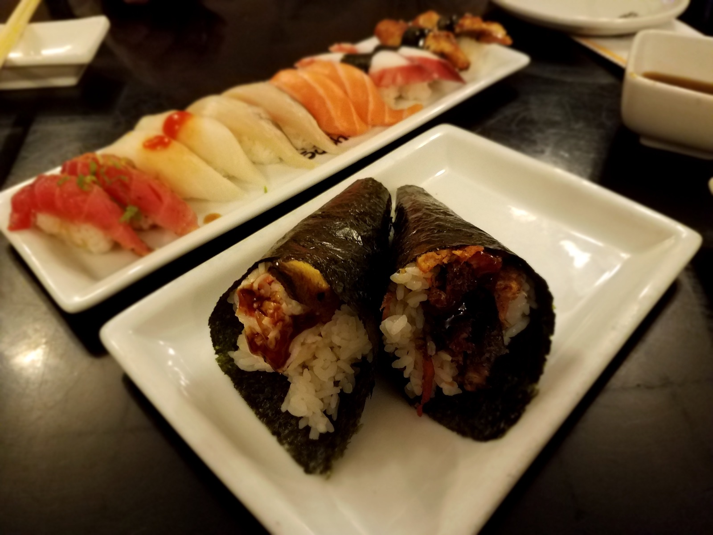

# 第七部 - 日韩

日料的核心是「清」- 高汤、米饭、海鱼、清酒，每样东西的味道都尽量不被盖掉。这跟杭州口味是同一频率：底色是鲜，调味是放大不是改造。一锅一番出汁端上来跟一碗腌笃鲜的逻辑是一样的，只是换了昆布和鲣鱼花做底。

韩餐另一回事。辣椒粉、辣酱、蒜、芝麻油这套调味系统跟日料完全不同，但放在杭州人家里也走得通：辣度可以收，鲜度不能丢。这章韩国菜的辣度按家里能接受的来 - 部队锅、辣豆腐汤保留辣味但不到舌头麻木那种程度。

日料假名后面会给中文意译。韩餐的辣酱（gochujang，韩式辣椒酱，国内大超市能买到「韩式辣椒酱」就是它）、辣椒粉（gochugaru，韩式粗粒辣椒粉，颜色鲜红、辣度温和、带回甘）这些专有食材会在第一次出现时解释。这章选了 10 道家常做得来的，从最基础的醋饭和高汤开始。

{ width="480" .center }

## 历史与地理

日本是岛国，三面环海，山地占了七成国土，可耕地稀缺。这两个条件决定了日料的基本盘：海鱼、海带、贝类是主蛋白质来源，米是奢侈品（江户时代以前普通农民吃糙米和杂粮），蔬菜以山菜和腌菜为主。从弥生时代（公元前 300 年到公元 300 年）水稻传入开始，到平安时代（794-1185）贵族饮食的精致化，到镰仓 / 室町时代禅宗影响下精进料理（素斋）的成型，日料一直在做减法。

江户时代（1603-1868）是日料平民化的关键阶段。江户城（今东京）人口在 18 世纪超过百万，街头出现了三种现做现吃的快餐：寿司（屋台/路边摊版的「握寿司」就是这时候定型的）、天妇罗、鳗鱼蒲烧。今天进高级店吃的握寿司，本质是当年路边摊吃法的精致化版本。同时期，鲣鱼花和昆布的二段萃取也定型成「出汁」体系，成了日料几乎所有汤、煮、炖菜的味觉骨架。

朝鲜半岛是另一种环境。三面有山有海，北方寒冷、南方温和，发酵食品是过冬的核心解决方案：泡菜（始于三国时代的腌菜传统）、大酱（된장）、辣椒酱（고추장）、酱油（간장）都是发酵年代久的食物。辣椒是十六世纪末通过日本传入朝鲜的（一说葡萄牙人经九州转运），到十八世纪韩餐才开始普遍使用，今天看到的「红色韩餐」其实只有三百年历史。

韩式辣椒酱（gochujang）跟单纯的辣椒粉是两个东西。它是糯米粉、大豆、辣椒粉、麦芽糖发酵几个月做出来的复合调味，鲜味（umami）跟辣味同时存在，这就是为什么辣豆腐汤和拌饭吃起来是「圆」的辣，不是干燥的躁辣。

部队锅（부대찌개）是当代菜，源于 1950 年代朝鲜战争后驻韩美军基地的剩余物资：火腿、罐头香肠、奶酪、午餐肉。韩国家庭把这些西式食材丢进辣酱锅里煮，意外成了一道经典。这道菜历史不到 80 年，但代表了战后韩餐对外来食材的快速吸收。

日料追求「减」，韩餐追求「全」。一桌韩餐摆几十个 banchan（小菜）才显丰盛，一份日式怀石可能就一勺白米加三筷子腌渍。这两种哲学的差异，是这一章里两国菜路的根本分野。

---

## 寿司饭基础（醋饭）

### 起源

日本人家里包寿司、做饭团、做散寿司（chirashi，散在饭上的那种）的米饭基础。寿司饭不是白米饭加醋，是煮饭和拌醋的方式都不同。家里掌握了寿司饭，剩下的事就是把鱼和菜切好放上去。

### 食材

3-4 人份：

- 日本短粒米 300 g（**必须短粒米**，越光、秋田小町、ひとめぼれ「一目惚」都行；不能用泰国香米或东北长粒米）
- 水 330 ml（米水比 1 : 1.1，比平时煮饭略少）
- 昆布 1 小片 5 cm（可省，加了米饭带海味）
- 寿司醋（自己调）：
  - 米醋 40 ml
  - 白糖 20 g
  - 盐 4 g

### 步骤

1. 米**洗 3 次**：第一次水浑了立刻倒掉（米吸第一次水最快，浑水会被吸进去），后两次轻轻搅几下倒掉，水变半清就行
2. 洗好的米**沥水 15 分钟**（这步让米表面干、煮的时候吸水均匀）
3. 米入电饭锅或砂锅，加水 330 ml，放昆布片，按煮饭键
4. 同时调寿司醋：米醋 + 糖 + 盐小火加热到糖盐融化（**别烧开**），放凉
5. 饭煮好后**焖 10 分钟**再开盖，取出昆布
6. 饭倒入大平盘或木盆（**不要用金属盆**，金属遇醋有金属味）
7. 寿司醋**绕圈淋在饭上**（一次淋完，不要分次）
8. 用**饭勺竖切翻拌**（像切刀一样切下去再翻起来），同时**用扇子或纸板扇风**，让饭快速降温到体温（约 35 度）
9. 饭粒变得有光泽、粒粒分明就是好的，盖湿布备用

### 关键

- **必须短粒米**- 长粒米淀粉结构不对，做寿司饭散得一塌糊涂
- **沥水 15 分钟**- 这步决定米煮出来粒粒分明还是糊
- **切翻不能压**- 用勺压会把饭压成年糕，要用切的动作
- **边拌边扇风**- 扇风让醋香气锁住、饭快速降温变亮，热饭拌醋会发闷
- 饭温度到体温就停手- 凉透了发硬，太热会发软

### 常见错误

- 用长粒米：黏性不对，散
- 米没沥水直接煮：饭糊
- 用铲子压拌：成饭团泥
- 不扇风：饭闷发黄
- 寿司醋加热过头：醋味挥发掉

---

## 日式高汤 dashi 一番出汁（一番だし）

### 起源

日料几乎所有汤、酱、煮物的底子。「一番出汁」是第一道汤、最清最香，用来做清汤、茶碗蒸、出汁蛋。煮过的昆布和鲣鱼花还能再煮一遍出「二番だし」，味道浓但清香没了，用来做味噌汤或炖煮物。家里一次熬一升，分装冷藏 3 天用完。

### 食材

成品约 1 升：

- 昆布 10 g（**真昆布或日高昆布**最好，国内进口超市能买到「北海道昆布」也行）
- 鲣鱼花（katsuobushi，かつおぶし，**木鱼花**）20 g（薄削片，进口超市买的成品包装）
- 水 1000 ml（**矿泉水或纯净水**，不用自来水，水里的氯味会进汤）

### 步骤

1. 昆布表面用湿厨房纸**轻轻擦一遍**（**不要洗**，表面白色粉末是鲜味）
2. 昆布泡冷水中 30 分钟（家里赶时间可以省）
3. 锅放水 + 昆布，**最小火慢慢加热**（升温到 60 度约 10 分钟）
4. 水边缘开始冒小气泡（**不能煮开**，开了昆布会发黏出腥味），**立刻捞出昆布**
5. 水转中火烧开，**关火**
6. 水温降到 80 度左右（约 1 分钟），下鲣鱼花
7. 鲣鱼花**沉底就过滤**（约 1-2 分钟，不要搅拌、不要挤压）
8. 用细网筛 + 厨房纸过滤（**绝对不能挤鲣鱼花**，挤了出腥味），得清亮琥珀色汤

### 关键

- **昆布不能煮开**- 开了出黏液和腥味，整锅毁
- **鲣鱼花关火后下**- 高温煮鲣鱼花会涩
- **不挤压、不搅拌**- 挤了苦腥味全出来
- **快、不能久煮**- 鲣鱼花在水里 2 分钟以内，超过就开始释放杂味
- 出汁颜色应该是**清亮的浅琥珀**- 浑浊或深色就是煮过了

### 常见错误

- 昆布煮开：汤发黏发腥
- 鲣鱼花在沸水里煮：苦
- 用筷子挤鲣鱼花：腥味
- 用自来水：氯味毁汤
- 高汤储存超过 3 天：味变

---

## 茶碗蒸（ちゃわんむし）

### 起源

日本家庭最常见的小菜之一，「茶碗」是茶杯，「蒸」就是蒸。一杯出汁加蛋液蒸成滑嫩的蛋羹，里面藏几样配料（虾、鸡肉、香菇）。比中式蒸蛋的水蛋更细腻，因为底子是出汁不是水。

### 食材

3 杯（小茶碗）：

- 鸡蛋 2 个（约 100 g）
- 一番出汁 300 ml（蛋液与出汁 1 : 3 的比例）
- 淡口酱油 5 ml（usukuchi，颜色浅的酱油，没有可用普通生抽 3 ml 代替）
- 味淋（mirin，みりん，甜料酒）5 ml
- 盐 1 g
- 配料（每杯各放一点）：
  - 虾仁 3 个（小虾，开背去虾线）
  - 鸡腿肉 30 g（切小丁，提前用 2 ml 酱油 + 几滴清酒腌 5 分钟）
  - 干香菇 1 朵（提前泡发切片）
  - 三叶（mitsuba，类似中国香菜的日式叶菜，可省，也可用嫩芹菜叶替代）

### 步骤

1. 鸡蛋打散，**不要打到起泡**（起泡会让蒸出来表面有蜂窝）
2. 出汁加酱油、味淋、盐拌匀，温度降到温热（不能烫，烫了倒进蛋液里直接结块）
3. 蛋液和出汁混合，**用筛网过滤 2 次**（这步是滑嫩的关键）
4. 配料分到 3 个茶碗，倒入蛋液 8 分满
5. 每个碗**盖一层保鲜膜或锡纸**（防止水滴进去打坏表面）
6. 蒸锅水烧开，放入碗，**转最小火盖盖留缝**（保持 80-85 度，不能大火滚）
7. 蒸 12-15 分钟，**用牙签插中心拔出来不带液体**就好
8. 撒三叶或芹菜叶

### 关键

- **蛋液 : 出汁 = 1 : 3** - 比例错了要么太硬要么不成形
- **过滤 2 次** - 滤掉蛋筋和泡沫，蒸出来才镜面光滑
- **小火留缝盖** - 大火蒸出来表面坑坑洼洼成蜂窝
- 出汁要温的不能烫 - 烫的出汁倒进蛋液立刻结块
- **盖膜防水** - 蒸锅顶上的水滴下来打坏表面

### 常见错误

- 蛋液打起泡：表面蜂窝
- 不过滤：粗糙不滑
- 大火蒸：表面坑洼，里面老
- 出汁热的下蛋液：直接成蛋花汤
- 蒸太久：水分析出，碗底一汪水

---

## 亲子丼（おやこどん）

### 起源

「亲子」是父母和孩子，鸡和蛋的关系。一锅煮鸡腿肉和蛋盖在白米饭上，是日本家庭和食堂最普及的盖饭之一。10 分钟的事，日式高汤打底所以味道清而深。

### 食材

1 人份（家里一锅做一份最稳）：

- 鸡腿肉 150 g（去骨带皮，切 2 cm 见方）
- 鸡蛋 2 个
- 洋葱 1/4 个（约 50 g，顺纹切薄片）
- 白米饭 1 大碗（**热的**，刚煮好的最好）
- 调味汁：
  - 一番出汁 100 ml
  - 酱油 20 ml
  - 味淋 20 ml
  - 清酒 10 ml（没有可省）
  - 白糖 5 g
- 葱花 少许
- 七味粉（shichimi，しちみ，日式七味辣椒粉，可省）

### 步骤

1. 调味汁所有材料下小煎锅（**直径 18-20 cm 的小锅最合适**，太大锅汁太浅煮不到蛋）烧开
2. 下洋葱片，煮 1 分钟变软
3. 下鸡腿肉，**铺平不重叠**，中火煮 4 分钟（鸡肉变白熟透）
4. 鸡蛋打散，**只搅 5 下**（蛋白蛋黄半融合的状态最好，不要打太匀）
5. 蛋液**绕圈淋在锅里**（不是倒一坨），盖盖**焖 30 秒**（蛋液 7 分熟，表面还湿润）
6. 关火，再焖 15 秒（余温把蛋焖到 8 分熟，**蛋黄还要流心**）
7. 米饭装碗，把整锅滑到饭上（**带汁一起**），撒葱花和七味粉

### 关键

- **小锅做** - 大锅汁不够，蛋会煮得太干
- **蛋打 5 下不打散** - 半融合的蛋色泽好看、口感层次有
- **绕圈淋蛋液** - 倒一坨会成蛋饼
- **8 分熟出锅** - 蛋全熟就成蛋饼盖饭，亲子丼的灵魂是流心蛋
- 米饭要热的 - 凉饭浇汤会吸不进味

### 常见错误

- 鸡蛋打太匀：成蛋饼
- 蛋焖到全熟：失去流心
- 大锅煮：汁淹不到蛋
- 米饭凉的：汁汤没法渗入
- 没有出汁直接酱油加水：味浅一截

---

## 日式煎蛋卷 出汁玉子焼き（だしたまごやき）

### 起源

日本早餐和便当里最常见的菜。「玉子」是蛋、「焼き」是煎。家庭版有甜咸两派：关东偏甜（加糖多）、关西偏咸（出汁多）。这版本是关西做法，出汁打底带甜咸均衡，吃起来像是会爆汁的蛋卷。日本家里有专用方形煎蛋锅（玉子焼き器），家里没有的话用 18 cm 圆形不粘锅一样能做。

### 食材

2 人份：

- 鸡蛋 4 个
- 一番出汁 60 ml（出汁 : 蛋 ≈ 1 : 4）
- 淡口酱油 5 ml（或普通生抽 3 ml）
- 味淋 10 ml
- 白糖 5 g
- 盐 1 g
- 油 适量（**用菜籽油或玉米油**，橄榄油有自己的味）

### 步骤

1. 蛋打散，加出汁、酱油、味淋、糖、盐，**用筷子搅匀但不要起泡**，过筛滤掉蛋筋
2. 锅烧热到中小火，刷一层薄油（**油不要多**，多了会煎出炸蛋的感觉）
3. 倒入 1/4 蛋液**铺满锅底**（薄薄一层）
4. 蛋液 7 分熟（表面还湿）时，**从锅远端往近端卷起来**（用铲子或筷子，卷成 3 折）
5. 把卷好的蛋卷推到锅远端，**锅底再刷油**
6. 倒入第二份 1/4 蛋液铺满，**把蛋卷抬起让蛋液流到下面**
7. 蛋液 7 分熟时把整个蛋卷**从远端卷回近端**（蛋卷裹了第二层）
8. 重复第 3 次、第 4 次（每次都让新蛋液流到蛋卷下面，再一起卷）
9. 卷好出锅，趁热**用寿司帘或保鲜膜包成长方形**定型，放凉切 2 cm 厚片

### 关键

- **出汁 : 蛋 = 1 : 4** - 多了卷不起来，少了不嫩
- **每次只倒 1/4 蛋液** - 一次倒太多卷不动
- **每层蛋液都要让它流到蛋卷下面** - 这样层与层之间粘在一起不分离
- **7 分熟卷** - 全熟了卷就裂，没熟没法卷
- **趁热定型** - 凉了形状定不住

### 常见错误

- 蛋液一次全倒：成厚蛋饼，不是蛋卷
- 火太大：表面焦底层没熟
- 蛋液起泡：成型不光滑
- 卷的时候蛋全熟：裂
- 不用出汁：寡

---

## 石锅拌饭（비빔밥 / bibimbap）

### 起源

韩国国民菜。石锅烧热放饭，铺各色蔬菜和牛肉，中间一颗生鸡蛋（或半熟），淋韩式辣椒酱拌着吃。石锅底会形成锅巴（누룽지 nurungji），是这道饭的精华。家里没有石锅可以用厚底铁锅或砂锅代替。

### 食材

2 人份：

- 米饭 2 大碗（隔夜饭最好，新饭水分太多）
- 牛肉糜或牛肉丝 100 g（**用牛里脊或牛肩肉**，腌料：酱油 5 ml、糖 3 g、蒜末 2 g、芝麻油 5 ml、胡椒少许，腌 10 分钟）
- 蔬菜（每样准备好分别炒）：
  - 黄豆芽 80 g
  - 菠菜 80 g
  - 胡萝卜丝 50 g
  - 香菇丝 50 g
  - 西葫芦丝 60 g
- 鸡蛋 2 个（生的或半熟煎蛋皆可）
- 韩式辣椒酱 gochujang 30 g（**韩式辣椒酱**，红色发亮的酱状物，国内进口超市或网购）
- 芝麻油 10 ml（拌饭时淋）
- 烤白芝麻 5 g
- 蔬菜调味：每样炒的时候用一点盐 + 蒜末 + 芝麻油

### 步骤

1. 黄豆芽**冷水下锅煮 5 分钟**（**盖锅煮**，不盖会有豆腥），捞出沥干，加蒜末 1 g、盐少许、芝麻油 3 ml 拌匀
2. 菠菜**焯水 30 秒**捞出过冷水挤干，切段，加蒜末 1 g、盐少许、芝麻油 2 ml 拌匀
3. 胡萝卜丝、香菇丝、西葫芦丝**分别用油炒 1 分钟**，每样加一点盐
4. 牛肉用平底锅大火炒到熟，盛出
5. 鸡蛋单面煎成糖心蛋（蛋黄流心），或不煎当生蛋待会放
6. 石锅或厚底铁锅**烧到很烫**（5 分钟空烧），锅底刷一层芝麻油
7. 米饭压实平铺锅底
8. 蔬菜按颜色分块铺在饭上（黄豆芽、菠菜、胡萝卜、香菇、西葫芦各占一块），中间放牛肉，最中间打一颗生蛋或放煎蛋
9. 韩式辣椒酱放在蛋旁边（让吃的人自己拌），淋一圈芝麻油，撒芝麻
10. 上桌后**自己用勺子拌匀**，**不要立刻吃**，让锅底饭跟石锅接触 1-2 分钟形成锅巴

### 关键

- **石锅必须烧到很烫**- 不烫起不了锅巴，锅巴是这道饭的灵魂
- **蔬菜分别炒、分别调味**- 一锅炒所有菜会串味，颜色也糊
- **隔夜饭比新饭好**- 新饭水分多，烫锅底会糊不会脆
- **辣酱放旁边不预拌**- 让吃的人按口味调辣度
- **黄豆芽要盖盖煮**- 不盖盖出豆腥

### 常见错误

- 锅不够烫：没锅巴
- 一锅炒所有蔬菜：颜色糊、味道串
- 用新饭：底层是糊不是锅巴
- 辣酱预拌：每个人接受辣度不同
- 蔬菜不挤干水：饭底湿成糊

---

## 部队锅（부대찌개 / budae jjigae）

### 起源

朝鲜战争时期美军基地附近的韩国人把美军剩下的火腿、香肠、罐头豆和韩式辣酱、泡菜炖在一起，形成了这道菜。一锅大杂烩看起来不讲究，但味道是辣 + 鲜 + 烟熏味的奇妙融合。家里冬天做特别合适，一锅配米饭吃饱。辣度按家里能接受的来。

### 食材

3-4 人份：

- 火腿肠 150 g（切 1 cm 厚片）
- 午餐肉（spam）100 g（切 1 cm 厚片）
- 韩式年糕条 100 g（圆柱形，提前泡 30 分钟）
- 嫩豆腐 200 g（切 2 cm 厚片）
- 金针菇 100 g（撕开）
- 老泡菜 200 g（**发酵足够的酸泡菜最好**，新泡菜不够味）
- 大葱 1 根（斜切段）
- 洋葱 1/2 个（切丝）
- 蒜末 10 g
- 即食方便面 1 包（出锅前下，**面饼不要调料**）
- 起司片 1 片（最后铺顶，可省）
- 高汤 800 ml（鸡汤、猪骨汤或一番出汁、二番出汁都行；没有就用清水 + 少许鸡精）
- 调味酱（先调好）：
  - 韩式辣椒酱 gochujang 25 g
  - 韩式辣椒粉 gochugaru 10 g（**韩式粗粒辣椒粉**，红色粗粒，国内进口超市或网购；不能用川辣椒粉代替，川辣椒粉太辣不带甜）
  - 酱油 15 ml
  - 清酒 10 ml
  - 白糖 5 g
  - 蒜末 5 g
  - 黑胡椒 少许

### 步骤

1. 调味酱所有材料拌匀
2. 浅锅或砂锅，**先把所有食材按区域摆好**（这是部队锅的视觉重点）：泡菜放一边、火腿肠和午餐肉一边、年糕一边、豆腐一边、金针菇一边、洋葱大葱铺底
3. 调味酱挖一勺放正中央
4. 倒入高汤，**汤量到食材 2/3 高**（不要全淹，部队锅是炖不是煮）
5. 大火烧开，转中火**煮 10 分钟**（让所有味道融合）
6. 出锅前 2 分钟下方便面饼，铺顶上让汤泡软
7. 关火前铺起司片（如果用）
8. 上桌**直接连锅端**（部队锅就是要锅咕嘟咕嘟冒泡的状态吃）

### 关键

- **泡菜要老的**- 新泡菜没酸味，部队锅就没了那股发酵的鲜
- **gochujang + gochugaru 都要**- 辣酱给浓稠和发酵香、辣椒粉给辣度和颜色
- **食材分区摆放**- 不要乱炖，分区摆出来视觉好看每口吃到什么自己挑
- **方便面最后下**- 早下成糊
- **汤不要全淹食材**- 部队锅是浓炖不是清汤

### 常见错误

- 用川辣椒粉代替 gochugaru：太辣、味道不对
- 新泡菜：没酸鲜
- 方便面早下：糊烂
- 汤太多：成了泡菜火腿汤
- 没有 gochujang 只用辣椒粉：缺浓稠和发酵香

---

## 韩式海鲜葱饼（해물파전 / haemul pajeon）

### 起源

韩国家常下酒菜。「파」是葱、「전」是煎饼。一张大葱铺底、海鲜点缀、面糊浇上去煎成金黄煎饼。下马格利酒（韩国米酒）是绝配，家里配啤酒清酒都行。雨天韩国人特别爱吃这个，说雨打屋顶的声音和煎饼下锅的滋滋声很像。

### 食材

2-3 人份（一张大饼）：

- 小葱或细葱 200 g（**用细葱不用大葱**，切 10 cm 长段）
- 海鲜组合（任选 2-3 样，总量 200 g）：
  - 鲜虾仁 100 g
  - 鱿鱼圈 80 g
  - 蛤蜊肉 50 g（去壳的）
- 鸡蛋 1 个（搅散，最后淋面用）
- 面糊：
  - 普通面粉 100 g
  - 玉米淀粉 30 g（**这是脆皮的关键**，全用面粉会软）
  - 冰水 180 ml（**必须冰水**，凉水让面筋不发达，煎出来更脆）
  - 盐 2 g
  - 鸡蛋 1 个
- 油 50 ml（**这道菜真的需要这么多油**，少油不脆）
- 蘸酱：
  - 酱油 15 ml
  - 米醋 10 ml
  - 白糖 3 g
  - 韩式辣椒粉 gochugaru 1 g
  - 烤白芝麻 少许
  - 葱花 少许

### 步骤

1. 面糊：面粉 + 淀粉 + 盐过筛，加冰水和鸡蛋拌成**略稀的面糊**（比酸奶稍稀），放冰箱 10 分钟
2. 海鲜洗净沥干（**虾仁开背、鱿鱼圈划几刀**入味用），切大块的切小一点
3. 蘸酱所有材料拌匀
4. 平底锅（直径 24-28 cm）烧热，下 30 ml 油**铺满锅底**
5. 葱段**铺满锅底**（一根挨一根，铺一整层），上面撒海鲜
6. 倒入面糊**盖住葱和海鲜**（不要太厚，刚刚盖住即可）
7. 中火煎 3-4 分钟，**底面金黄边缘脆**了
8. 把搅散的鸡蛋**淋在面糊表面**（增加蛋香和颜色）
9. **翻面**（用大盘子盖锅倒扣过来，再滑回锅里），锅边再淋 20 ml 油
10. 中火再煎 3 分钟，两面金黄出锅
11. 切块装盘，配蘸酱

### 关键

- **冰水和面** - 冰水让面筋不发达，煎出来脆
- **淀粉 + 面粉混合** - 全面粉会软，纯淀粉不成型
- **油要够** - 这道菜油量是脆的关键，少油就成软饼
- **葱铺满整层** - 韩式煎饼的灵魂是葱，葱要密
- **翻面用倒扣法** - 直接铲翻会散

### 常见错误

- 用温水或常温水：面筋发达，不脆
- 不用淀粉：软塌塌
- 油太少：底层不脆
- 葱铺得稀：一口咬下去全是面
- 火太大：外焦里生

---

## 韩式辣豆腐汤（순두부찌개 / sundubu jjigae）

### 起源

韩国家庭最常见的辣汤之一。「순두부」是嫩豆腐（绢豆腐），「찌개」是炖菜。一砂锅辣红汤里炖一块整嫩豆腐，最后打个生蛋。10 分钟搞定，配米饭吃饱。家庭做辣度可以收，但不能不辣 - 那不是 sundubu jjigae 了。

### 食材

2 人份：

- 嫩豆腐（绢豆腐）400 g（**整盒一起下**，不要切块）
- 牛肉糜或猪肉糜 80 g（牛肉更地道）
- 老泡菜 100 g（切碎）
- 蛤蜊 8 个（可省，加了汤更鲜）
- 鸡蛋 1 个
- 大葱 1 段（斜切）
- 蒜末 5 g
- 高汤或清水 500 ml（**用煮过昆布的水或鸡汤**最好）
- 芝麻油 10 ml
- 辣酱底（先炒）：
  - 韩式辣椒粉 gochugaru 15 g
  - 韩式辣椒酱 gochujang 10 g
  - 油 15 ml

### 步骤

1. 砂锅或厚底锅烧热，下 15 ml 油 + 韩式辣椒粉**小火炒 30 秒**（**炒出红油**，是这锅汤红亮的关键，注意别炒糊）
2. 下肉糜**炒变色**
3. 下泡菜碎、蒜末、辣椒酱炒 1 分钟（炒到发酵香气出来）
4. 加高汤大火烧开
5. 嫩豆腐**整盒倒进去**，用勺背把豆腐压成大块（不要碎成泥），下蛤蜊
6. 中火炖 5 分钟（蛤蜊壳张开就熟了）
7. 下大葱段
8. 关火前打入鸡蛋（让蛋在余温里半熟，蛋黄流心）
9. 淋几滴芝麻油上桌

### 关键

- **辣椒粉先炒出红油** - 没炒过的辣椒粉直接下汤是漂红水，炒过的才是红汤
- **嫩豆腐整盒下不切** - 切块就成豆腐汤了，sundubu 的灵魂是大块豆腐用勺挖
- **蛋最后打入靠余温** - 全熟成蛋花汤，半熟蛋黄流心才对
- **必须 gochugaru 不能用川辣椒粉** - 川辣椒粉太辣不带甜
- **泡菜要老的** - 新泡菜不够味

### 常见错误

- 辣椒粉不炒：颜色淡、味道散
- 豆腐切块：失去整块滑嫩感
- 蛋早下：成蛋花汤
- 用川辣椒粉：辣到舌头麻，不是这个味
- 没有 gochujang：缺发酵深度

---

## 泡菜炒饭（김치볶음밥 / kimchi bokkeumbap）

### 起源

韩国家庭剩饭剩泡菜的最佳出路。一勺老泡菜 + 一碗隔夜饭 + 一颗蛋，10 分钟搞定。重点是泡菜要够老够酸，新泡菜炒出来没那个发酵的鲜。

### 食材

2 人份：

- 隔夜白米饭 400 g（**必须隔夜或至少凉透**，热饭炒会糊）
- 老泡菜 200 g（切小块）
- 泡菜汁 30 ml（**别扔，是味道的关键**）
- 五花肉或培根 80 g（切小丁，可省，但加了香一档）
- 洋葱 1/4 个（切丁，约 50 g）
- 鸡蛋 2 个（一颗打散炒进饭、一颗最后煎流心蛋盖顶）
- 韩式辣椒酱 gochujang 10 g
- 酱油 8 ml
- 白糖 3 g（**很重要，平衡泡菜酸**）
- 芝麻油 10 ml（**最后淋，不要炒制**）
- 油 15 ml
- 烤白芝麻 少许
- 海苔丝 少许（可省）
- 葱花 少许

### 步骤

1. 五花肉丁锅里小火煸出油，盛出
2. 锅里留底油 + 加 15 ml 油，下洋葱炒 1 分钟到半透
3. 下泡菜炒 2 分钟（**炒到泡菜边缘焦化**，发酵香气出来）
4. 加 gochujang 和糖炒匀，下五花肉回锅
5. 倒入隔夜饭，**用铲子压散饭团**，大火快炒 2 分钟让饭粒粒分明
6. 沿锅边淋酱油 + 泡菜汁（**沿锅边的目的是激出酱油香**）
7. 把饭推到一边，锅另一边下一颗散蛋液炒到 7 分熟，跟饭炒在一起
8. 关火，淋芝麻油拌匀
9. 装盘，另起锅煎一颗流心蛋盖顶
10. 撒芝麻、海苔丝、葱花

### 关键

- **隔夜饭** - 这是炒饭粒粒分明的根本，热饭怎么炒都糊
- **泡菜炒到边缘焦** - 焦化让发酵的酸味变成香味
- **泡菜汁不要扔** - 是这道饭的味道核心
- **加糖** - 平衡泡菜的酸，让味道圆润不刺
- **芝麻油最后淋** - 高温炒会失香
- **顶上一颗流心蛋** - 视觉和口感都加分，戳破后蛋黄拌进饭里

### 常见错误

- 用热饭：糊成一团
- 泡菜不炒透：生酸味没变成香
- 不加糖：只剩酸不香
- 芝麻油下锅炒：失香
- 没有 gochujang：缺浓度
