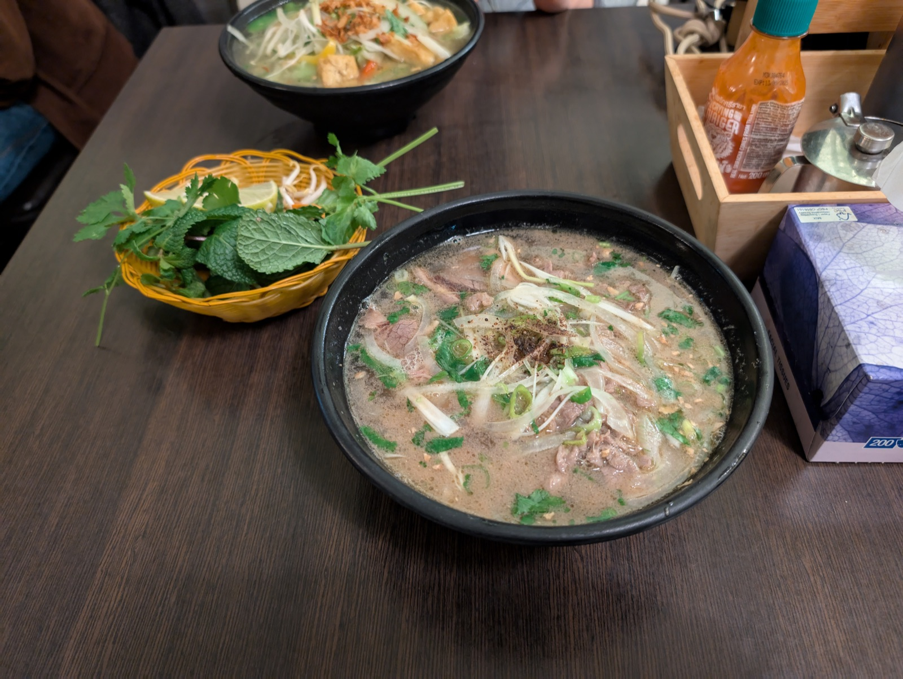
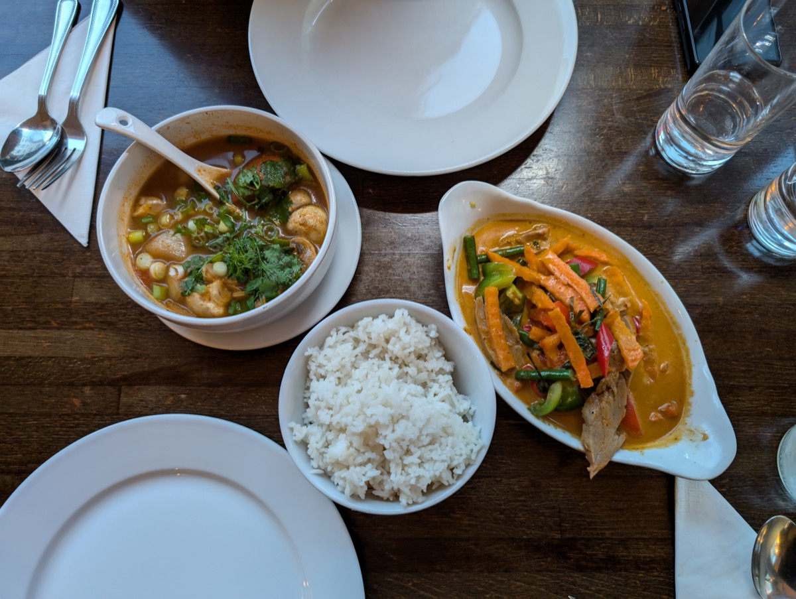
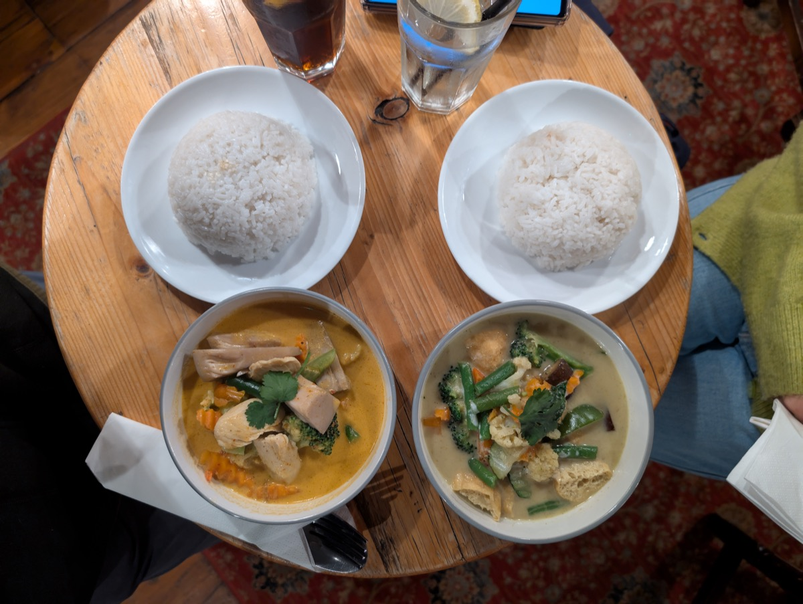
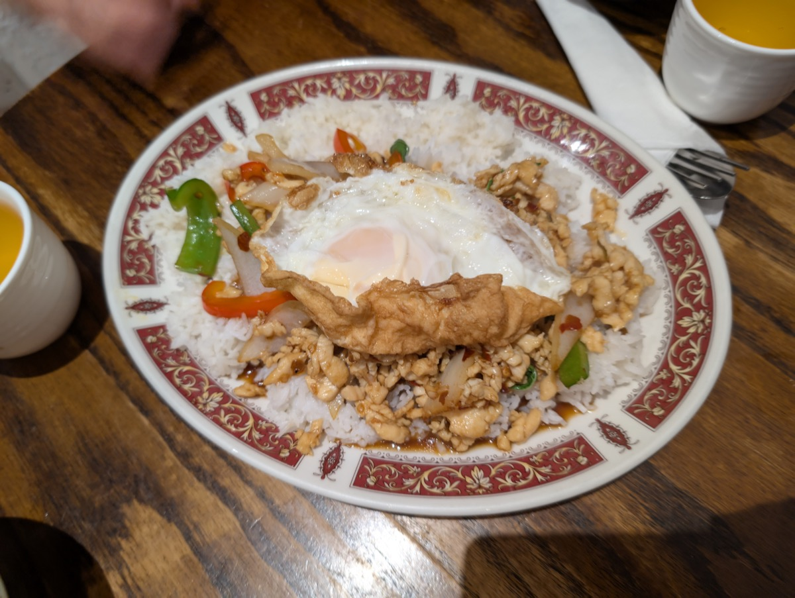
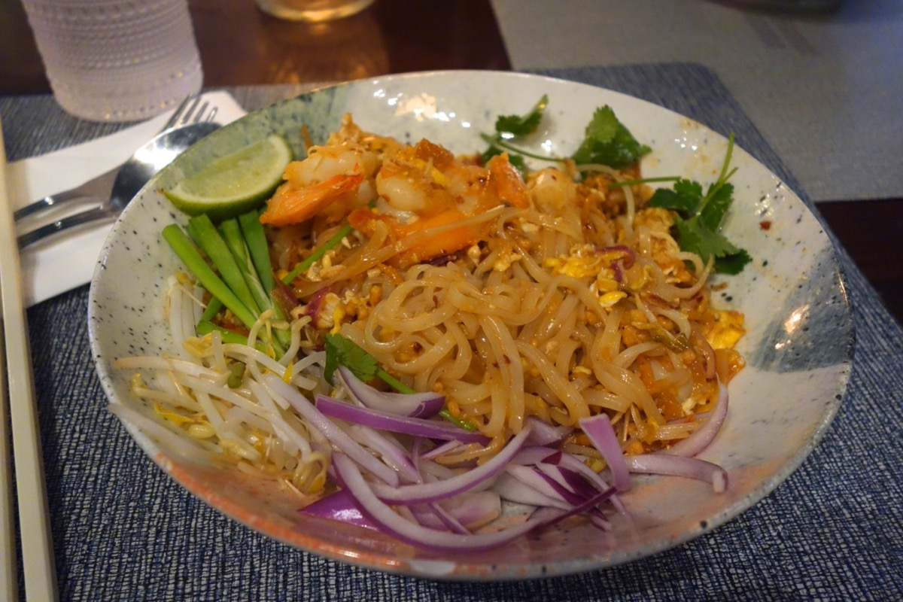
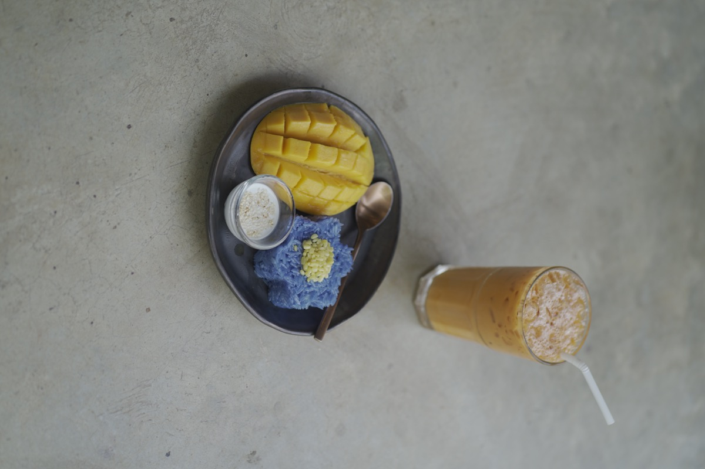
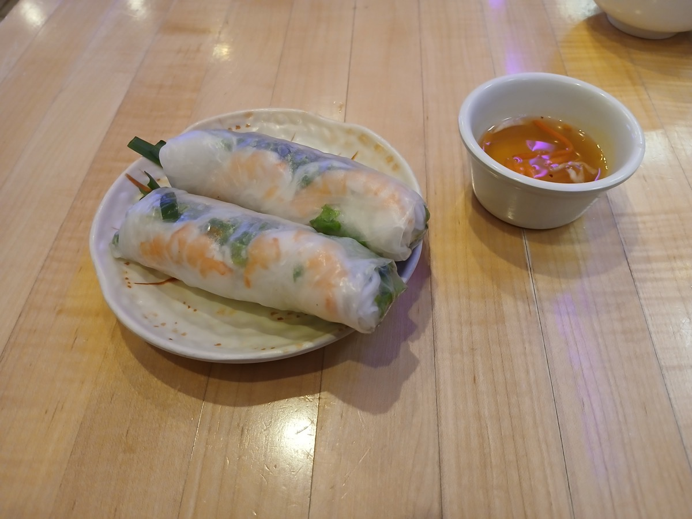
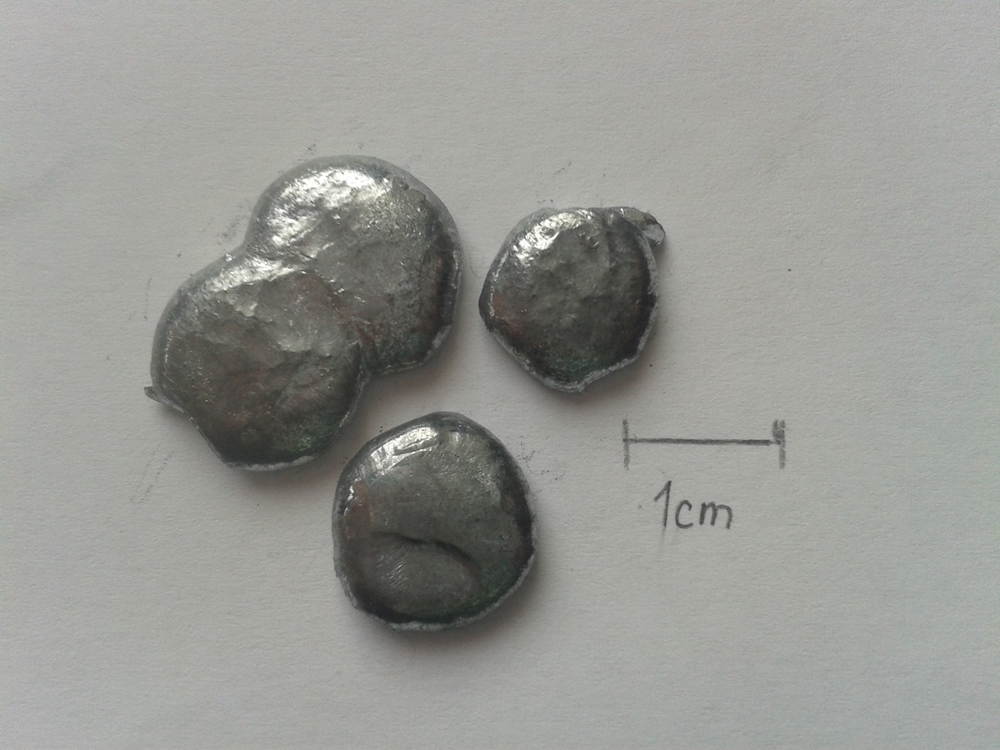
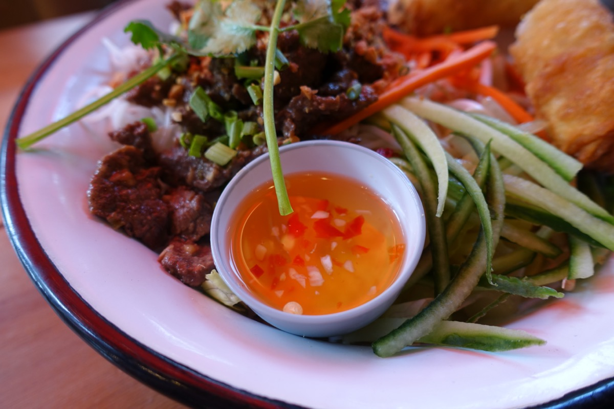
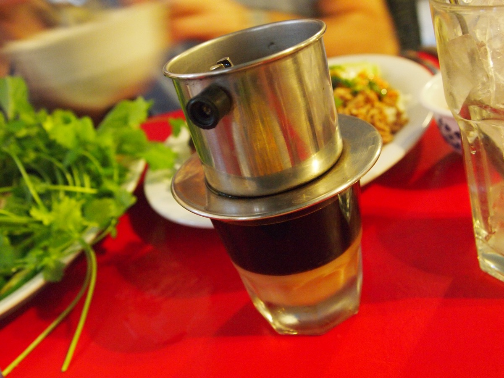

# 第八部 - 东南亚（泰/越）

东南亚菜的味觉骨架是**酸、甜、咸、辣、鲜**五味同时在场，谁也不压谁。这跟杭州偏清淡、单味托底的逻辑不一样，但杭州人吃东南亚菜并不违和。原因是：东南亚菜里其实有大量**清汤路线**（pho、tom yum 的清汤版、芒果糯米饭的椰浆甜），这些跟杭州的「清」是相通的；真正辣到呛的反而是少数。

家里做东南亚菜，最大的问题是**香料**。香茅、南姜、青柠檬叶（kaffir lime leaf）、鱼露、椰浆，这些是味觉指纹，少一样都不像。这章每道菜都会写清楚：哪些是必须有的、哪些可以替代、替代之后味道差多少。能买到正经货当然好，买不到也别硬凑，做不出原版味道就承认，做个「家常改良版」也不丢人。

这章 10 道菜：泰式 5 道、越式 5 道。基本覆盖在家做的常见需求 - 一碗汤面（pho、tom yum）、一份带饭主菜（青咖喱鸡、罗勒猪肉碎饭、越南鸡饭）、一份炒粉（pad thai）、一份开胃菜（生春卷）、一份甜品（芒果糯米饭）、一杯饮料（越南冰咖啡），加上一份独立列出的**鱼露蘸汁**（nuoc cham），因为它是大半越南菜的灵魂。

辣度方面，杭州人接受度最高的是**汤系**（pho、tom yum 清汤版），其次是**椰浆系**（青咖喱），椰浆能压辣。罗勒猪肉碎饭和泰式炒粉杭州人也吃得下来，但鸟眼椒（朝天椒）的量建议**减一档** - 泰国人放 6 个，咱放 2-3 个就够了。

{ width="480" .center }

## 历史与地理

中南半岛和马来群岛被季风切成两半：每年 5-10 月西南季风带雨水，11-4 月东北季风带干燥。这种气候适合稻作，但不适合长期保存食物。蛋白质要么趁鲜吃，要么发酵成鱼露 / 虾酱长期保存，要么用大量香料 + 辣椒在煮的过程中杀菌。今天看到的东南亚菜里那些复杂香料组合（香茅、南姜、青柠檬叶、罗望子、椰浆、鱼露），骨子里都是热带湿热环境逼出来的食物保存与味觉解决方案。

香料贸易是另一条决定性的历史线。从公元一世纪开始，印度商人就通过海路把胡椒、姜黄、孜然带到东南亚；阿拉伯商人在七世纪把丁香、肉豆蔻沿海运西输；到十五世纪葡萄牙、荷兰、英国相继来争夺香料群岛（今印尼摩鹿加群岛）。这一千多年里，东南亚一直是香料世界的中心，菜里的味觉层次也是这种贸易交汇的副产品。

华人移民是东南亚菜里另一条藏得很深的线。从十七世纪开始，潮汕、闽南、广府人陆续到泰国、越南、马来、新加坡谋生，把面、米粉、酱油、豆腐、甜咸搭配的概念都带过去。今天泰国的「粿条」（kway teow）、越南的「pho」（河粉）、新马的「肉骨茶」，源头都能追到中国南方。Pad Thai 这道菜的米粉技法是十九世纪潮汕移民带去的，不是泰国本土的发明。

法国殖民越南（1887-1954）留下了几样跨文化痕迹：法棍（bánh mì 三明治用）、咖啡（越南成为世界第二大咖啡出口国）、炼乳（鲜奶在热带难保存所以用炼乳代替）、各类法式甜点（焦糖布丁 bánh flan）。Pho 这碗汤的形态据说跟法国 pot-au-feu 牛肉清汤有渊源，但骨架还是中国式的：清汤、米粉、香料调味。

宗教在饮食上的影响很显眼。泰国是上座部佛教国家，"不杀生"原则下大量素菜和椰浆菜（用椰奶代替奶油）；越南受大乘佛教影响有「素菜餐厅」传统，但日常饮食荤素都吃；马来印尼以伊斯兰教为主，不吃猪肉，海鲜和牛羊为主蛋白。

东南亚菜的"五味同时在场"听起来是味觉哲学，背后其实是地理（湿热）+ 贸易（香料路线）+ 移民（华人 / 印度人）+ 殖民（法国 / 葡萄牙）四条历史线层叠出来的结果。

---

## 冬阴功汤（Tom Yum Goong）

{ width="360" .center }

### 起源

泰国国汤，相传源自中部湄南河流域的宫廷与河畔渔村，"tom" 是煮、"yum" 是泰式酸辣凉拌、"goong" 特指河虾，所以 Tom Yum Goong 就是河虾版。中部水网密布，河虾产量大，又身处热带湿热气候，所以厨师靠香茅、南姜、青柠檬叶这三件套压腥提香、靠酸辣开胃逼汗，形成了泰餐"酸甜咸辣鲜五味同时在场"的味觉公式。十九世纪后这道汤从宫廷下沉到街边，分出清汤版（tom yum nam sai）和加椰浆的奶汤版（tom yum nam khon），本书写清汤版，因为更接近杭州人对汤的期待，清亮见底、酸辣开胃。跟泰国另一道酸汤 tom kha 的区别在于，tom kha 主调是椰浆配南姜，奶感重；tom yum 主调是青柠汁配香茅，酸感冲在前面。

### 食材

2-3 人份：

- 鲜虾 12 只（中等大，约 250 g，**剥壳留头**，虾头和虾壳单独留着熬汤底）
- 香茅 2 根（拍裂切 5 cm 段。**国内买不到鲜的就用干香茅 10 g，不要用香茅粉**，粉是另一种东西）
- 南姜（galangal）30 g（切片。**南姜不是生姜**，气味更辛香带松脂感。买不到南姜就用生姜 15 g + 一小撮花椒粒替代，气味会差一档但不会错）
- 青柠檬叶（kaffir lime leaf）4 片（撕开下锅。这是**箭叶橙**的叶子，跟普通柠檬不是一回事 - 普通柠檬叶没这股清香，**完全不能替代**。买不到就省略，或用 1 g 干青柠叶碎）
- 草菇或白蘑菇 100 g（切两半）
- 小番茄 6 个（对半切）
- 红葱头（shallot）3 颗（拍裂）
- 鸟眼椒 2-3 个（拍裂，**杭州减辣版**。原版 5-6 个）
- 鱼露 30 ml（**泰国 / 越南鱼露**，国内超市常见品牌如 Squid、三蟹牌都行）
- 青柠汁 30 ml（**新鲜青柠**挤的，**柠檬替代不了**，柠檬偏苦青柠偏清香）
- 白糖 5 g（平衡酸辣）
- 香菜 一小把（切碎撒面）
- 水 1000 ml

### 步骤

1. 虾剥壳留头，虾肉背部开刀去虾线，**虾头虾壳别扔**
2. 锅里 5 ml 油烧热，下虾头虾壳压出虾油，炒到壳变红、虾头出红油（2 分钟）
3. 加 1000 ml 水，大火烧开转中火**煮 10 分钟**熬虾汤
4. 滤掉虾壳，留下清亮的虾汤底
5. 虾汤回锅，下香茅、南姜、青柠檬叶、红葱头、鸟眼椒，**中火煮 5 分钟**让香料出味（不要大火滚，香料的香会跑）
6. 下草菇、小番茄，煮 2 分钟
7. 下虾肉，**煮 1 分钟**虾肉变红弯曲就关火（再煮就老）
8. **关火后**才加鱼露、糖、青柠汁（**青柠汁不能煮**，煮过会变苦）
9. 撒香菜上桌

### 关键

- **虾头熬汤底**是这汤的鲜度来源 - 直接用清水煮虾汤就单薄了
- 香茅 + 南姜 + 青柠檬叶**三件套**是味觉指纹，少一样都像缺角
- **关火后再放青柠汁**是这道菜最容易翻车的点 - 高温让青柠汁变苦
- 鸟眼椒数量自己掌控 - 杭州人 2-3 个起，慢慢加
- 香料**不要大火滚** - 中火慢煮才出香

### 常见错误

- 用普通柠檬叶或柠檬汁：完全不是一个味
- 香茅粉代替香茅：粉是粗糙的辛辣感，没有香茅的清香
- 青柠汁下锅一起煮：发苦
- 虾煮过头：肉柴
- 直接清水煮：虾汤单薄没鲜味

---

## 泰式青咖喱鸡（Gaeng Khiao Wan Gai）

{ width="360" .center }

### 起源

泰国中部家常咖喱，最早能追到拉玛六世（二十世纪初）前后宫廷食谱里的"绿汤"，后来下沉到家家户户的灶台。"gaeng" 是咖喱、"khiao wan" 字面是"绿色的甜"、"gai" 是鸡，名字里"甜"指的不是糖，而是椰浆带来的回甘。翠绿底色来自舂在咖喱酱里的青色泰椒、香茅、青柠皮、香菜根，椰浆负责压辣、提甜、把香料的脂溶性香气拉出来，所以哪怕辣度不低，杭州人也比较容易接受。跟红咖喱（用干红辣椒，色深、辣度直接）和黄咖喱（加姜黄和孜然，受印度影响、味道更厚）相比，青咖喱是三色咖喱里最清新的一支，香气走草本路线，颜色和味道都偏亮。家里做最关键是用罐装青咖喱酱而不是从零起调，因为传统配方里香料种类多到十几样，从零做不划算。

### 食材

2-3 人份：

- 鸡腿肉 400 g（去骨切 3 cm 块，**腿肉比胸肉好**，咖喱炖久胸肉柴）
- 青咖喱酱 50 g（**罐装的就行**，Maesri、Mae Ploy 是常见牌子。**不要用咖喱粉**，咖喱粉是印度的体系）
- 椰浆 400 ml（**全脂的**，低脂版咖喱不浓 - Aroy-D、Chaokoh 是好牌子）
- 椰奶 200 ml（**椰浆是浓的、椰奶是稀的**，两个都要 - 椰浆煸酱、椰奶调汤稠度）
- 泰国茄子（pea eggplant 或 Thai eggplant）100 g（圆球状的小茄子。买不到就用国内长茄子 1 根切滚刀块）
- 青柠檬叶 4 片（撕开）
- 罗勒叶（**泰式罗勒 / 九层塔**，国内菜市场有 - **意大利罗勒叶**香气不一样，差一档但能用）一小把
- 红辣椒 1 根（切丝，提色不增辣）
- 鱼露 20 ml
- 棕榈糖 15 g（**棕榈糖比白糖回甘柔**，没有用红糖 10 g 替代）
- 鸡汤或水 100 ml
- 配米饭

### 步骤

1. 椰浆**先取上层最浓的 100 ml**（罐装椰浆静置后上层是浓油），中火加热到**油水分离**冒泡（5 分钟）
2. 下青咖喱酱，**小火炒 2 分钟**到酱出香、颜色变深绿（这步是咖喱香气的关键 - 咖喱酱必须用油煸透）
3. 下鸡块翻炒 3 分钟到表面变白
4. 加剩余椰浆 + 椰奶 + 鸡汤，下青柠檬叶，烧开转中小火**炖 15 分钟**
5. 下泰国茄子（或长茄子），再煮 5 分钟到茄子软
6. 加鱼露、棕榈糖调味，尝一下平衡（应该是**咸鲜回甘微辣**，不应该齁咸或齁甜）
7. 关火前撒罗勒叶、红辣椒丝拌匀（**罗勒叶余温烫熟就够**，煮久会黑）
8. 配白米饭吃

### 关键

- **椰浆煸咖喱酱**这步是泰式咖喱的核心技法 - 直接加水煮咖喱酱不出香
- **椰浆 + 椰奶分开用** - 浓的煸酱、稀的调汤
- **罐装咖喱酱**而不是咖喱粉 - 完全不是一个体系
- 罗勒**最后下**，余温烫熟保持翠绿
- 鸡腿肉比鸡胸好，炖煮不柴

### 常见错误

- 用咖喱粉代替咖喱酱：味道完全不对，那是印度味
- 椰浆没煸透就加水：咖喱酱生味重
- 用低脂椰浆：咖喱稀薄不浓
- 罗勒叶提前下：发黑无香
- 用甜罗勒（意大利罗勒）当主香：差一档，能用但不正

---

## 泰式罗勒猪肉碎饭（Pad Krapow Moo）

{ width="360" .center }

### 起源

泰国国民街边盖饭，"pad" 是炒、"krapow" 是圣罗勒（holy basil）、"moo" 是猪肉，所以名字直译就是"炒圣罗勒猪肉"。这道菜的普及跟二十世纪中叶城市化有关，当时大量农民进城打工，街边推车需要一种 15 分钟出餐、又下饭又便宜的快炒，圣罗勒加蒜辣爆肉糜配白米饭加炸蛋的组合就这样在曼谷写字楼楼下扎了根，今天泰国人随便走进一家路边摊都能点到。圣罗勒叶（krapow）跟意大利甜罗勒不是同一种，前者叶子小、有丁香和胡椒的辛辣气，必须高温激出味道；后者偏茴芹甜香，下锅就疲软，所以用甜罗勒做的版本风味会差一档。配的炸蛋（kai dao）也有讲究，是高温油里炸出蛋白边缘焦脆、蛋黄半流的版本，不是煎蛋，戳破淋在饭上是这道菜的标准吃法。

### 食材

2 人份：

- 猪肉糜 300 g（**别太瘦**，三七开最好）
- 圣罗勒（holy basil / krapow）一大把约 30 g（**圣罗勒是这道菜的名字来源**，没有的话用泰式罗勒 / 九层塔代替，差一些但可接受。意大利罗勒最差但能用）
- 蒜 6 瓣（拍碎）
- 鸟眼椒 3-4 个（**杭州减辣版** 2 个，剁碎）
- 鱼露 15 ml
- 蚝油 10 ml
- 老抽 5 ml（上色）
- 生抽 8 ml
- 白糖 5 g
- 油 25 ml（炒肉用）+ 200 ml（炸蛋用）
- 鸡蛋 2 个
- 长粒米饭 2 碗（**茉莉香米最好**）

### 步骤

1. 蒜和辣椒一起剁碎成蒜辣蓉（**用刀剁，别用蒜泥器** - 蒜泥器出泥，剁的有颗粒感）
2. 鱼露、蚝油、老抽、生抽、糖在小碗里调好
3. 锅里 200 ml 油烧到 8 成热（**冒大烟**），蛋打入碗里**贴着油面滑入**，炸 30 秒到**蛋白边缘焦脆翘起、蛋黄还流动**，捞出沥油
4. 炸蛋的油倒出（留下次用），锅留底油 25 ml
5. 大火烧热，下蒜辣蓉**爆 5 秒**（不能久，蒜会糊）
6. 立刻下肉糜，**用铲子压散**，大火炒到肉变白出油（3 分钟）
7. 倒入调好的酱汁，**大火翻炒 1 分钟**收一点汁
8. 关火，**罗勒叶撒下去翻拌余温烫熟**（10 秒）
9. 装盘配米饭，**炸蛋盖在最上面**

### 关键

- **炸蛋是这道菜的灵魂** - 不是煎蛋是炸蛋，油要烫到冒烟，蛋白边缘要焦脆
- **罗勒最后下，余温烫** - 提前下罗勒发黑无香
- 蒜辣蓉**用刀剁**有颗粒感，蒜泥器太细碎
- 肉糜要**压散** - 团成块的话调料挂不上
- **吃的时候戳破蛋黄拌进去** - 这是这道菜的标准吃法

### 常见错误

- 用普通鸡蛋煎蛋代替炸蛋：风味失一半
- 罗勒提前下：发黑发苦
- 蒜爆太久：糊苦
- 油不够热炸蛋：蛋白软塌不脆
- 肉炒成大块：调料挂不上、口感不对

---

## 泰式炒河粉（Pad Thai）

{ width="360" .center }

### 起源

Pad Thai 是 1930 年代由泰国总理銮披汶（Plaek Phibunsongkhram）政府自上而下推动的"国菜"。当时泰国稻米过剩、又赶上二战缺粮，政府鼓励国民把多余的米加工成米粉再炒着吃，用来减少大米消耗、同时塑造一种区别于中国和马来邻居的"泰式身份"，所以名字直接叫"pad thai"，字面就是"泰式炒"。技术骨架其实是潮汕移民带来的炒粿条，用扁平米粉加酱油糖快炒，銮披汶政府把潮州酱油换成更具本土色彩的鱼露，又加进罗望子酱（tamarind）的酸和棕榈糖的甜，配虾、豆芽、韭菜、花生碎、青柠角，凑成酸甜咸三角加坚果脆的味觉指纹。跟它最像的潮州炒粿条相比，pad thai 酸味突出、糖度更高、必有花生碎和青柠，整体偏热带；潮州版本则靠酱油和猪油立骨，更咸鲜厚重。家里做最关键是罗望子酱，没有的话这道菜的酸做不出来。

### 食材

2 人份：

- 干河粉（pad thai noodle）150 g（**宽度约 5 mm 的扁平河粉**，**温水泡软 30 分钟**而不是煮 - 煮会糊）
- 鲜虾 8 只（剥壳留尾巴，开背去虾线）
- 鸡蛋 2 个
- 豆芽 100 g（绿豆芽，**别去尾**这道菜要原样豆芽）
- 韭菜 50 g（切 4 cm 段，**普通韭菜就行**，别用韭黄）
- 蒜 4 瓣（剁末）
- 红葱头 2 颗（剁末）
- 干虾米 10 g（**泡软切碎**，是这道菜的鲜味来源 - 没有可省）
- 萝卜干（preserved radish）10 g（剁碎，**泰国超市有卖**没有可省）
- 花生碎 30 g（**生花生干锅烘香再压碎**，市售烤花生味道差一档）
- 油 30 ml
- 配料：青柠角 4 块、辣椒粉 适量、糖 适量（吃的时候自己加）

调味（小碗预先调好）：
- 罗望子酱（tamarind paste）30 g（**泰国超市有罐装的浓稠膏状**。没有用 15 ml 米醋 + 10 g 红糖 + 5 ml 鱼露代替，差一些但能凑）
- 棕榈糖 25 g（红糖代替）
- 鱼露 25 ml
- 水 30 ml

### 步骤

1. 河粉温水泡 30 分钟到**捏起来软但有韧性**，沥干
2. 调味料在小碗里搅匀
3. 锅烧热下 15 ml 油，下虾**两面煎 30 秒**到变红，盛出
4. 锅里再下 15 ml 油，下蒜末、葱头末、虾米碎、萝卜干碎**爆香 30 秒**
5. **把材料推到锅一边**，空出来的锅底打入鸡蛋，**戳散半凝固**
6. 下河粉，**翻炒 30 秒**让河粉裹上油
7. 倒入调好的酱汁，**大火快速翻炒** 1 分钟到河粉吸汁变色
8. 下虾、豆芽、韭菜，**翻 30 秒**就关火（豆芽要保留脆感）
9. 装盘，撒花生碎，配青柠角、辣椒粉

### 关键

- **河粉温水泡不煮** - 煮的河粉炒的时候会糊成一团
- **罗望子酱**是 pad thai 的味觉签名 - 那种独特的酸甜感是别的酸味替代不了的
- **豆芽和韭菜最后下** - 保留生脆感
- 蛋要**戳散半凝固**就拌进河粉，蛋全熟成蛋皮就分家了
- **吃前挤青柠汁**才是完整体验，别省

### 常见错误

- 河粉煮过：成糊
- 用米醋代替罗望子：酸但不是那个酸
- 豆芽炒久：塌软出水
- 韭菜下太早：发黄
- 不挤青柠：味道扁平没层次

---

## 芒果糯米饭（Khao Niao Mamuang）

{ width="360" .center }

### 起源

源自泰北和老挝接壤的"糯米带"（湄公河中游的伊森地区和琅勃拉邦一带），那一片以糯米为主食已经一千多年，平时手抓糯米饭就菜吃，逢年过节才把糯米拌椰浆做成甜版本。"khao niao" 是糯米、"mamuang" 是芒果，名字就是"糯米芒果"。芒果在泰国的成熟季是 4 到 6 月雨季前的尾巴，正好跟新季糯米的余粮接上，所以这道甜品天然带着雨季前的时令属性。糯米用椰浆加糖加一小撮盐拌匀，配熟透的 Nam Dok Mai 黄芒果切片，再淋一勺带咸味的浓椰浆酱，咸甜对冲是它跟广东椰汁糯米糍那种纯甜系甜品的关键区别。家里做最关键是糯米要用泰国长粒糯米（thai sticky rice），不是国内圆粒糯米，因为长粒糯米支链淀粉结构不同，蒸出来粒粒分明又软糯，圆粒蒸出来则容易糊成糕。

### 食材

2 人份：

- 泰国长粒糯米 200 g（**国内进口超市或网购**。没有用国内圆糯米代替，质感差一档但味道对）
- 椰浆 250 ml（**全脂**）
- 白糖 50 g
- 盐 3 g（**这点咸是关键，平衡甜**）
- 玉米淀粉 5 g（调椰浆酱用）
- 熟透芒果 1-2 个（**芒果必须熟透**，金煌芒、台农芒、Nam Dok Mai 都行 - 半熟的芒果酸涩毁整道菜）
- 烤白芝麻或绿豆 一小撮（撒面，可省）

### 步骤

1. 糯米**冷水泡 4 小时**（泰国糯米必须泡，干蒸蒸不透）
2. 沥干，铺在**纱布或蒸笼布上**（直接放蒸笼底容易粘），**大火蒸 25 分钟**到糯米半透明软糯
3. 蒸糯米的时候熬椰浆酱：椰浆 200 ml + 糖 + 盐**小火加热搅拌**到糖溶化（不要煮沸，沸了椰浆出油分离）
4. 糯米蒸好趁热倒进大碗，**淋入热椰浆汁的 2/3**，盖盖闷 10 分钟（让糯米吸饱椰浆）
5. 剩 1/3 椰浆 + 玉米淀粉**小火搅拌**到稍稠（这是上桌前淋面的酱）
6. 芒果削皮切块或片
7. 装盘：糯米一坨在中间、芒果摆旁边、淋一勺浓椰浆酱在糯米上、撒芝麻

### 关键

- **泰国长粒糯米不能用圆糯米代替**（如果一定要用，质感会偏黏糕）
- **糯米必须先泡 4 小时再蒸** - 不泡蒸不透
- **椰浆里加盐**是这甜品的灵魂 - 没有这点咸，甜就是傻甜
- 芒果**必须熟透** - 半熟酸涩毁整盘
- 椰浆酱**别煮沸** - 沸了油水分离

### 常见错误

- 用圆糯米：质感像糍粑不像 sticky rice
- 不泡米直接蒸：硬芯
- 不放盐：甜得发腻
- 用半熟芒果：酸涩
- 椰浆煮沸：分层难看

---

## 越南河粉（Phở Bò / Phở Gà）

{ width="360" .center }

### 起源

越南国汤面，二十世纪初诞生在河内城北南定省一带，是法国殖民和华人移民共同催生的混血儿。在法国人来之前，越南人很少吃牛肉，水牛主要是耕地工具；殖民政府引入西式屠宰、需要大量牛骨牛肉做 pot-au-feu（法式蔬菜炖牛肉），剩下的边角料和骨头被当地小贩接手，配上潮汕移民带来的扁平米粉，再以中式手法吊清汤、加八角桂皮丁香调香，于是出来一碗骨架是中式米粉、灵魂带法式清汤底气的 phở。"phở" 这个字一说源自法语 "feu"（火），从街边推车的小炭炉而来，一说源自广东"粉"，至今没定论。1954 年南北分治后，大量北方人南下，把这碗面带到西贡，南方版本更甜更花哨、配菜堆得像小花园，北方原版则清汤寡水、靠汤头说话。这里写牛肉版 phở bò，鸡肉版（phở gà）做法类似。

### 食材

3-4 人份：

- 牛骨 1 kg（**牛筒骨 + 牛尾**混合最好。汤的浓郁来自骨髓）
- 牛腱子或牛胸肉 500 g（炖软切片放面里）
- 生牛肉片 200 g（牛里脊或菲力，**切薄片冷冻保鲜**，吃的时候铺在碗里靠热汤烫熟）
- 干河粉（pho noodle）300 g（**扁平的越南河粉**，**温水泡 30 分钟**煮 30 秒就熟）

汤底香料：
- 黄洋葱 1 个（**带皮直接烤** - 烤焦是 pho 的灵魂）
- 老姜 1 大块约 50 g（**带皮直接烤**）
- 八角 4 颗
- 桂皮 1 段（5 cm）
- 丁香 4 颗
- 草果 1 颗（拍裂）
- 香菜籽 5 g（**锅烘香**）

调味：
- 鱼露 60 ml
- 冰糖 15 g
- 盐 适量

配料（每人一份）：
- 香菜、薄荷叶、泰式罗勒（**这三种是 pho 的标配**，国内菜市场买齐有点难，至少要香菜 + 罗勒）
- 豆芽 一把
- 青柠角 1 块
- 鸟眼椒切圈 几片
- 海鲜酱 + 辣椒酱（**海鲜酱 hoisin 和 sriracha 辣酱**，是吃 pho 时碗边自己加的，不是煮在汤里的）

### 步骤

1. 牛骨**冷水下锅煮开 5 分钟**焯出血沫，捞出**温水冲净**
2. 洋葱、姜**带皮放烤盘 / 干锅**，**烤到表皮焦黑** - 这步是 pho 汤色金黄、香气深邃的关键。家里没烤箱用干锅小火烙 10 分钟，外皮黑了内里烫透
3. 香料（八角桂皮丁香草果香菜籽）**干锅小火烘 2 分钟**出香
4. 大锅放牛骨 + 牛腱 + 烤好的洋葱姜（连焦皮一起，洗一下表面就行）+ 香料 + 4 L 水
5. **大火烧开撇浮沫**，转最小火**炖 3 小时**（汤要清亮见底，全程小火 - 大火汤会浊）
6. 1.5 小时时捞出牛腱（**腱子炖久了发柴**），晾凉切薄片
7. 3 小时后**滤汤** - 滤掉所有香料和骨头，得清亮金黄汤
8. 汤里加鱼露、冰糖、盐调味（**汤要鲜咸偏淡**，因为吃的时候配菜会再加味）
9. 河粉温水泡 30 分钟，吃前**沸水里烫 30 秒**捞起
10. 装碗：河粉打底 → 铺熟牛腱片 + 生牛肉片 → 浇**滚烫的汤** （生牛肉靠热汤烫熟）→ 撒葱花
11. 配菜单独装盘：豆芽、香菜罗勒薄荷、青柠角、辣椒、海鲜酱辣酱
12. 吃的时候自己加配菜、挤青柠

### 关键

- **洋葱姜烤焦** 是 pho 风味的核心 - 没烤焦的 pho 就只是清汤面
- **小火炖 3 小时** - 大火炖汤会浊，pho 的标志是清亮见底
- **生牛肉片靠热汤烫熟** - 别先煮熟，肉柴
- **配菜单独装盘自己加** - pho 是 DIY 体验，不是端上来直接吃
- 鱼露 + 冰糖 + 盐**调味要克制** - 留余地给配菜的青柠和辣酱

### 常见错误

- 洋葱姜不烤：汤淡而无层次
- 大火炖汤：汤浊，不是 pho
- 牛腱炖到底：发柴
- 生牛肉提前煮熟：失去 pho 的标志吃法
- 配菜全省略：pho 没了灵魂

---

## 越南生春卷（Gỏi Cuốn）

{ width="360" .center }

### 起源

越南南部经典凉菜，二十世纪在湄公河三角洲一带定型，"gỏi" 是凉拌、"cuốn" 是卷，所以名字就是"凉拌卷"。米纸（bánh tráng）是把米浆摊在竹席上日晒制成的薄片，南越湿热多雨，米纸在常温下能放很久，又不需要任何加热，完全契合"夏天不开火"的家庭需求，于是成了这道菜的载体。卷里铺生菜、米粉、虾、薄荷、香菜、韭菜段，蘸花生海鲜酱，**整道菜完全不油炸**，这是它跟另一个版本 chả giò（北方叫 nem rán，炸春卷）最关键的区别，后者用米纸或威化纸包猪肉碎下油锅炸到金黄，是寒季暖菜，跟生春卷一冷一热各占一边。跟中式炸春卷比，越南生春卷的灵魂是米纸的薄韧透明加生鲜香草，吃的是清爽和层次感，而不是面皮的酥脆。蘸料的花生海鲜酱组合则跟潮汕福建移民带去的甜面酱体系明显有亲缘。

### 食材

3-4 人份（约 10 卷）：

- 越南米纸（rice paper / banh trang）10 张（**圆形 22 cm 的**，**温水泡 5 秒**就软，泡久了会破）
- 鲜虾 10 只（煮熟剥壳，**纵向片成两半**铺平）
- 五花肉 150 g（煮熟切薄片。**不喜欢猪肉用鸡胸丝代替**）
- 干米粉（细的）50 g（**煮 3 分钟**捞出冲冷水，沥干）
- 生菜叶 10 片（**奶油生菜或波士顿生菜**，软的好卷）
- 韭菜 10 根（4 cm 段，**摆在卷里像两根天线**，部分露出来）
- 薄荷叶 一小把
- 香菜 一小把
- 泰式罗勒 一小把（**有就放，没有省略也行**）

花生酱蘸料：
- 海鲜酱（hoisin sauce）40 g
- 花生酱（无糖光滑型）30 g
- 椰浆 30 ml（**没有用温水代替**）
- 蒜末 5 g（**炒香**）
- 鱼露 5 ml
- 青柠汁 5 ml
- 烤花生碎 撒面用 10 g
- 鸟眼椒 切圈撒面（可选）

### 步骤

1. **先准备所有内馅**：虾煮 1 分钟剥壳片半、五花肉冷水下锅煮 20 分钟切薄片、米粉煮 3 分钟冲冷水、生菜叶撕成手掌大小、香菜薄荷韭菜洗净沥干
2. 蘸料：小锅 5 ml 油下蒜末爆香，加海鲜酱 + 花生酱 + 椰浆，**小火搅拌 2 分钟**到顺滑，加鱼露和青柠汁。装碗后撒花生碎、辣椒
3. 浅盘装**温水**（不烫手的温水）
4. 米纸**双手平拿浸入水里 5 秒**，立刻取出平铺在湿砧板上 - **米纸捞出来时还有点硬，别多泡** - 米纸在砧板上会继续软化，等卷的时候刚好软
5. 米纸下半部铺：1 片生菜叶 → 一撮米粉 → 几片肉 → 几根薄荷 / 香菜 → 1 根韭菜（让它伸出右边）
6. 米纸上半部铺：2 片虾**红色面朝下**（这样卷起来后透过米纸看是粉红色，颜值担当）
7. 卷法：先**从下往上卷一圈**包住下半部馅 → **左右两边折进来**（韭菜露出右边一截）→ **继续往上卷到底**，米纸有点黏会自动封口
8. 卷好放盘子上**别叠放**（米纸会黏在一起），切两半或整根，配蘸料

### 关键

- **米纸只泡 5 秒** - 超过 10 秒会软到破。米纸到砧板上还会继续吸水
- **虾红面朝下** - 颜值担当，透过米纸能看到粉红色
- 馅料**沥干** - 湿馅料卷出来米纸破洞
- 韭菜**留一截在外** - 是越南生春卷的视觉签名
- 卷好后**别叠放** - 互相粘连撕不开

### 常见错误

- 米纸泡久：软烂破洞
- 馅料没沥干：米纸湿透破
- 一次卷太多馅：包不拢
- 虾随便摆：颜值掉一档
- 卷好叠放：粘连

---

## 越南鸡饭（Cơm Gà）

{ width="360" .center }

### 起源

越南南部家常饭，源头能追到十九世纪末到二十世纪初海南和潮州移民经海路南下西贡、堤岸（今胡志明市华人区），把海南鸡饭的做法带过去再被本地化的过程。"cơm" 是米饭、"gà" 是鸡，海南原版讲究白切鸡配鸡油饭加姜葱蓉、酱油、辣椒酱三种蘸料，到了越南后走向分岔，因为越南人偏好炭火和鱼露的香气，白切鸡换成烤鸡或煎鸡腿（cơm gà nướng）、姜葱蓉换成鱼露蘸汁（nước chấm）、米饭里加黄姜粉染成金黄、再配一勺酸甜的腌萝卜胡萝卜丝（đồ chua），整盘就从清淡白切走向了带焦香、带酸辣的南越风格。这道菜在会安一带还衍生出加香茅、薄荷、青木瓜的版本（cơm gà Hội An），但西贡这一支最常见，也是本书写的版本。家里做最关键是腌萝卜胡萝卜丝那一勺酸甜清爽，没有这一勺整盘饭就闷。

### 食材

2 人份：

- 鸡腿 4 个（**带骨带皮**，去骨后保留皮）

腌料：
- 鱼露 15 ml
- 蚝油 10 ml
- 蒜末 5 g
- 红葱头末 5 g
- 黄糖 10 g
- 五香粉 1 g
- 黑胡椒 1 g
- 油 10 ml

黄姜饭：
- 茉莉香米 200 g
- 鸡汤或水 300 ml
- 黄姜粉（turmeric）2 g（**给饭染金黄色**）
- 蒜 2 瓣（剁末）
- 洋葱 1/4 个（剁末）
- 油 10 ml
- 盐 2 g

腌萝卜胡萝卜（do chua）：
- 白萝卜 100 g（切细丝或切薄片）
- 胡萝卜 50 g（切细丝）
- 米醋 60 ml
- 白糖 30 g
- 盐 3 g
- 温水 60 ml

蘸汁：见下一道菜「Nuoc Cham 鱼露蘸汁」

配菜：
- 黄瓜片、香菜、薄荷叶 几片

### 步骤

1. **腌萝卜先做**（**至少提前 30 分钟**，最好 2 小时）：温水 + 醋 + 糖 + 盐搅匀到糖溶化，加萝卜胡萝卜丝，放冰箱腌 30 分钟以上
2. 鸡腿**用刀划几刀**到骨头（让腌料入味），加所有腌料抓匀腌 30 分钟
3. 黄姜饭：锅里下油，下蒜末洋葱末**炒香**（1 分钟），下大米**翻炒 1 分钟**让米吸油，加黄姜粉炒匀变金黄
4. 加鸡汤 + 盐，**烧开转小火盖盖焖 12 分钟**，关火**焖 10 分钟**（不开盖）
5. 平底锅下少许油**中火**，鸡腿**皮面朝下**先煎 5 分钟到皮金黄焦脆 - 这步靠耐心，不要翻动
6. 翻面再煎 4 分钟，转小火加盖再焖 3 分钟到鸡肉熟透
7. 鸡腿出锅**静置 3 分钟**再切（让肉汁回收）
8. 装盘：黄姜饭一坨 → 鸡腿摆上 → 旁边一勺腌萝卜胡萝卜 → 黄瓜片香菜 → **淋一勺 nuoc cham 蘸汁**或单独装小碗蘸

### 关键

- **腌萝卜要提前做** - 腌不够时间没酸甜味
- **鸡腿皮面先煎、不要翻动** - 翻早了皮还没结壳就脆不起来
- 黄姜粉**炒过再加水** - 直接撒进汤里有粉感
- 鸡腿出锅**静置 3 分钟** - 直接切肉汁全跑光
- 米**先炒再焖** - 米粒分明不黏

### 常见错误

- 腌萝卜临时做：没腌透没酸甜
- 鸡皮没煎脆：失去这道菜灵魂
- 黄姜粉直接下水：粉感重
- 鸡腿出锅就切：肉柴汁少
- 不配蘸汁：味道扁

---

## 越南鱼露蘸汁（Nước Chấm）

{ width="360" .center }

### 起源

越南菜的灵魂蘸汁，大半越南菜都配它，鸡饭、生春卷、炸春卷、米粉、烤肉米线（bún thịt nướng）都靠它定味。"nước" 是水、"chấm" 是蘸，字面意思就是"蘸的水"。它的源头是越南中部沿海（富国岛、芽庄一带）千年的渔业传统，鱼多到吃不完，渔民就用海鱼加海盐发酵成 nước mắm（鱼露），这种发酵液本身咸鲜浓烈不能直接入口，于是产生了用水稀释、再用糖、青柠、蒜、辣椒平衡的家常做法，逐步定型成今天这碗五味同时在场的蘸汁。配方核心是鱼露的咸加糖的甜加青柠的酸加蒜辣加水的稀释，这套"咸甜酸辣鲜"五味公式就是越南菜的味觉指纹，跟泰国菜偏酸辣冲、泰式蘸汁（nam jim）糖度更高的路线明显不同。它单独列一道，是因为它出现频率太高，又是越南菜味觉哲学最浓缩的样本，值得专门讲一次。

### 食材

约 200 ml（够一顿 2-3 人份用）：

- 越南鱼露 60 ml（**越南鱼露 nước mắm 比泰国鱼露淡一点 - 没有的话泰国鱼露也行**）
- 温水 80 ml（**温水让糖更容易化** - 凉水也行只是要搅久一点）
- 白糖 30 g
- 青柠汁 30 ml（**新鲜青柠**，约 1 个半青柠的量。**柠檬替代不了，差太远**）
- 蒜 3 瓣（**剁极细末**或拍成蓉）
- 鸟眼椒 1-2 个（**剁碎**，不去籽辣度更足）
- 胡萝卜丝（可选，30 g 切细丝。摆盘时漂在汁面上）

### 步骤

1. **温水 + 糖** 在小碗里搅到糖完全溶化（**先溶糖再加别的** - 糖不化的话整碗汁底有颗粒）
2. 加鱼露搅匀
3. 加青柠汁搅匀
4. 加蒜末和辣椒末，**蒜末浮在表面是正常的**，是这道汁的视觉签名
5. 尝一下，五味平衡：**咸（鱼露）、甜（糖）、酸（青柠）、辣（辣椒）、鲜（鱼露）**。不平衡就微调 - 太咸加水、太甜加青柠、太酸加糖、太冲加水
6. 加胡萝卜丝（如果用）
7. 室温放 10 分钟让味道融合再用

### 关键

- **先溶糖** - 糖不化整碗有颗粒
- **温水稀释** - 鱼露原液太咸，水的比例 1:1.3 接近水
- 五味平衡靠**尝着调**，比例只是起点
- 蒜末**浮在表面**是正常的，是越南做法的视觉签名
- **青柠不是柠檬** - 这点很重要，柠檬偏苦青柠偏清香

### 常见错误

- 不溶糖直接搅：底部颗粒
- 鱼露原液不稀释：齁咸
- 用柠檬代替青柠：味道偏苦
- 蒜没剁细：颗粒太大蘸不上
- 一次做太多：放冰箱过夜青柠汁会变苦，最好现做现用（最多保存 1-2 天）

---

## 越南炼乳冰咖啡（Cà Phê Sữa Đá）

{ width="360" .center }

### 起源

"cà phê" 是咖啡（来自法语 café）、"sữa" 是奶、"đá" 是冰。1857 年法国传教士把咖啡苗带进越南，殖民政府很快发现中部高原（达叻、邦美蜀一带）的红土和气候特别适合种植耐病又高产的罗布斯塔豆，于是把越南改造成了一个咖啡出口国，今天越南依然是世界第二大咖啡出口国，仅次于巴西。但热带气候保存不了鲜奶，殖民地家庭买不到也存不住牛奶，雀巢式的甜炼乳成了唯一稳定的奶源，于是被动接受的炼乳反而沉淀成越南咖啡的味觉指纹，咖啡液一滴一滴落进杯底的炼乳里，喝前搅匀加冰，又苦又甜又冰。这道饮料家里做最关键是越南滴滤壶（phin）和罗布斯塔豆，不能用阿拉比卡，因为罗布斯塔苦度高、油脂重、咖啡因含量是阿拉比卡两倍，跟炼乳的甜咸厚配得上；阿拉比卡偏花香酸度，跟炼乳一搅就违和。

### 食材

1 杯：

- 越南咖啡粉 20 g（**罗布斯塔豆研磨**，**中粗研磨度** - 像粗盐颗粒。Trung Nguyen 中原咖啡是常见牌子）
- 沸水 100 ml
- 炼乳 25-30 ml（**甜度自己调**，越南标准是 25 ml 起）
- 冰块 一杯量

工具：
- **越南滴滤壶（phin）** 1 个（**网购 30 块钱一个，专门做这咖啡用，没法替代**。意式咖啡机 / 摩卡壶做出来不是这个味）
- 玻璃杯 1 个

### 步骤

1. 玻璃杯**杯底先倒炼乳**（25-30 ml）
2. phin 滤壶组装：**底盘 → 主体 → 咖啡粉 → 压片 → 盖**
3. 主体放在玻璃杯口上（炼乳在杯底等着）
4. 咖啡粉 20 g 倒入主体，**用压片轻轻压平**（**别压太紧** - 太紧滴不下来，太松又会漏）
5. 先倒**少量沸水（约 20 ml）润粉 30 秒**（让咖啡粉吸水膨胀，这步是萃取的关键）
6. 倒入剩余沸水 80 ml，盖盖
7. **滴滤 4-5 分钟** - 咖啡液一滴一滴落进炼乳上层（**别催**，慢滴出来才浓）
8. 滴完后揭开 phin，咖啡和炼乳此时**分层**（咖啡浮在炼乳上）
9. **用长勺搅匀**到颜色均一的浅棕色
10. **加满冰块**（杯子约 8 分满冰），搅 5 秒就可以喝

### 关键

- **必须罗布斯塔豆** - 阿拉比卡花香酸度跟炼乳不配
- **必须 phin 滤壶** - 慢滴出来的浓度跟其他方式做的完全不一样
- **咖啡粉别压太紧** - 压紧滴不下来或滴速过慢导致过萃发苦
- **润粉 30 秒**这步是萃取关键 - 直接灌满水的咖啡偏淡
- **冰最后加** - 提前加冰会稀释咖啡

### 常见错误

- 用阿拉比卡豆：又酸又花香，跟炼乳违和
- 用美式咖啡 / 意式 espresso 代替：浓度和质感都不对
- 咖啡粉压太紧：滴 15 分钟还在滴 + 过萃发苦
- 不润粉直接灌水：浓度不够
- 炼乳放在咖啡上面而不是杯底：搅不匀
- 冰先放：咖啡刚滴下来就被稀释

---

## 文化与场景

### 时令与节气

东南亚没有四季，只有雨季和旱季两段，5 到 10 月西南季风带雨水、11 到 4 月东北季风带干燥，食材跟着这条线走。雨季前的 4 到 6 月是芒果季，泰国 Nam Dok Mai 黄芒果熟透，糯米饭加椰浆配芒果是这两个月的家常甜品；雨季中段（6 到 8 月）是榴莲季，金枕、猫山王、青尼分批上市，街边摊堆成小山，价钱也最低。旱季尾巴 3 到 4 月是河虾最肥的时候，冬阴功汤里那只河虾要这时候吃才到位。雨季蔬菜水气重，家家把空心菜、通菜、嫩茄子做成快炒；旱季水果脱水浓缩，山竹、红毛丹、菠萝蜜的甜度顶到峰值。

节庆食物绑得更紧。泰国宋干节（4 月 13-15 日）是泼水的新年，那几天家家煮 khao chae（冰镇花香饭），白米饭泡在茉莉花香水里配腌芒果、糖渍葱头吃，是宫廷传下来的消暑做法。越南春节（Tết，农历正月初一）必须有 bánh chưng（北方方粽）和 bánh tét（南方圆粽），糯米裹绿豆和五花肉用芭蕉叶包好煮 8 到 10 小时。中元节（农历七月十五）越南人摆素菜祭祖，泰国 Loy Krathong（11 月月圆）放河灯时配糖煮南瓜和椰汁糯米。

### 餐桌格局

泰国家宴所有菜同时上桌，米饭摆中间，咖喱、汤、炒菜、蘸酱围一圈，每人一个浅盘扣一勺米饭再从公碗里夹菜回来，吃几口换一样。泰国人**用勺叉不用筷子**，右手拿勺左手拿叉，叉子负责把菜推到勺子里，勺子才入口，筷子只用来吃面（这是华人移民带来的）。蘸酱碟（nam pla prik，鱼露加辣椒蒜）人手一碟，谁觉得味淡自己加。

越南家常一桌的标配是一锅汤、几碟主菜、一筐生菜香草、一碗鱼露蘸汁、人手一碗白饭。汤摆中间整桌共喝，主菜或炒或炖，生菜筐里堆着薄荷、紫苏、鱼腥草、生菜叶，吃肉时撕一片菜包着、蘸鱼露。越南人**用筷子**，这点跟泰国分家，是中越千年共享的痕迹。一锅一汤几碟菜的格局跟杭州人家其实很像。

### 节庆与仪式

泰国宋干节除了 khao chae，寺庙清晨摆「tak bat」化缘饭，居民跪在路边把糯米团、咖喱、水果放进僧侣的钵里，是一年里积德最正式的一次。Loy Krathong 那晚放完河灯回家吃 khao tom mat（蕉叶糯米卷），用蕉叶裹甜糯米加香蕉蒸熟，象征把祈愿包进去送出。寺庙逢初一十五供素，泰国素菜叫「jay」（齋），整个 10 月还有为期 9 天的素食节（Tesagan Gin Je），全国素菜摊挂黄旗。

越南年节最重的是 bánh chưng 和 bánh tét，方粽代表大地、圆粽代表天圆，年三十全家围着炭炉守一夜煮粽子，是一年里最长的家庭仪式。忌日（giỗ）祭祖，桌上必须有素菜素饭，因为佛家不杀生，三碗白饭三杯清水三道素菜，烧香完才动筷。中部顺化人讲究，连祭祖的碗碟摆几个、朝哪边都有家传规矩。

### 跟邻近菜系的边界

泰国和越南都属东南亚，但味觉路线分得很清。泰式甜辣强烈，糖度高、辣度足、椰浆椰糖压一切，青咖喱黄咖喱红咖喱都靠椰浆走脂溶性香气；越南则清淡草本，**几乎不用椰浆**（南部偶尔用，但不是骨架），靠生薄荷紫苏鱼腥草和清汤撑场面，pho 那碗清汤就是越南菜的代表逻辑。泰式调味用棕榈糖加罗望子加鱼露三角，越南用鱼露加青柠加糖加水稀释。

往周边看，老挝菜跟泰国伊森地区基本同源（糯米饭加凉拌生鱼 laap），但更原始、辣度更直接、不用椰浆；柬埔寨菜的 prahok（发酵鱼酱）比泰国虾酱发酵更深，又因为受印度影响更早，咖喱粉系（kroeung）里有姜黄孜然，跟泰式青咖喱的草本路线不同；马来西亚和印尼以伊斯兰教为主，没有猪肉，主蛋白是牛羊和海鲜，咖喱里加 belacan（虾酱砖）和 sambal（参巴辣酱），还会拌椰浆煮米饭（nasi lemak），是另一套椰浆体系。同一片热带，菜路差着一整层香料和半本宗教史。
