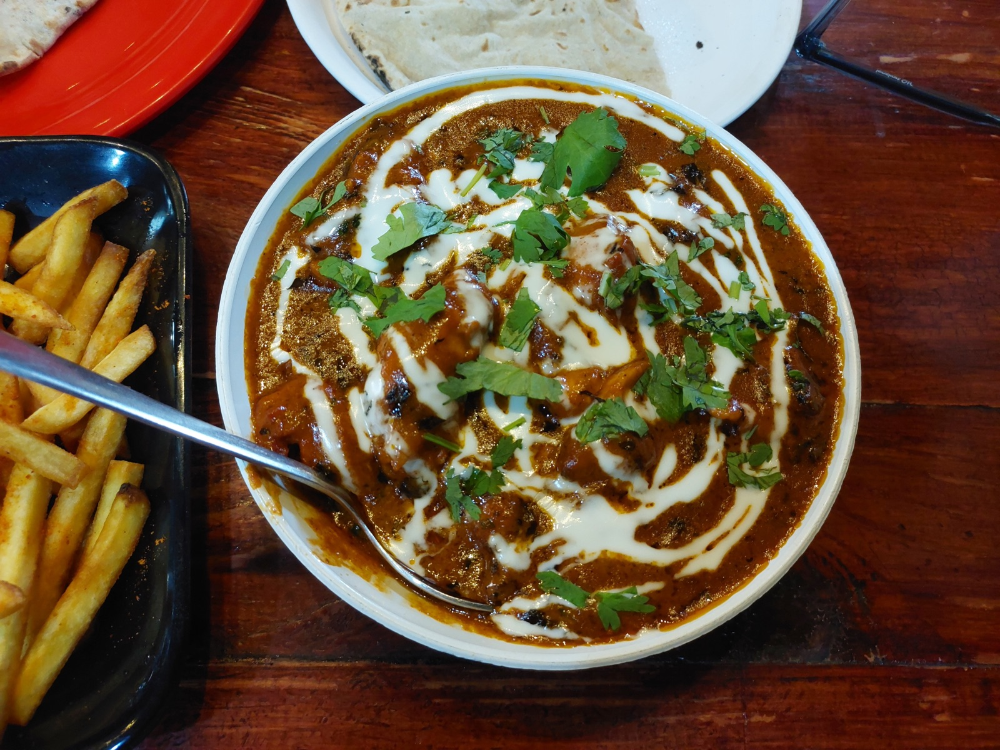
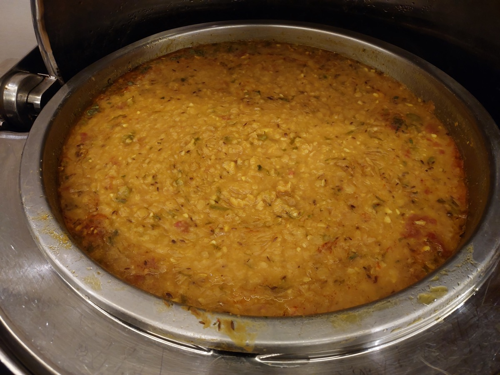
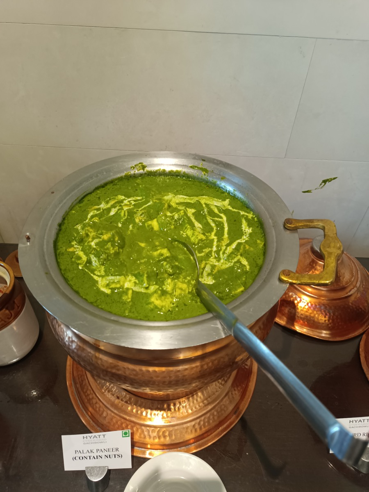
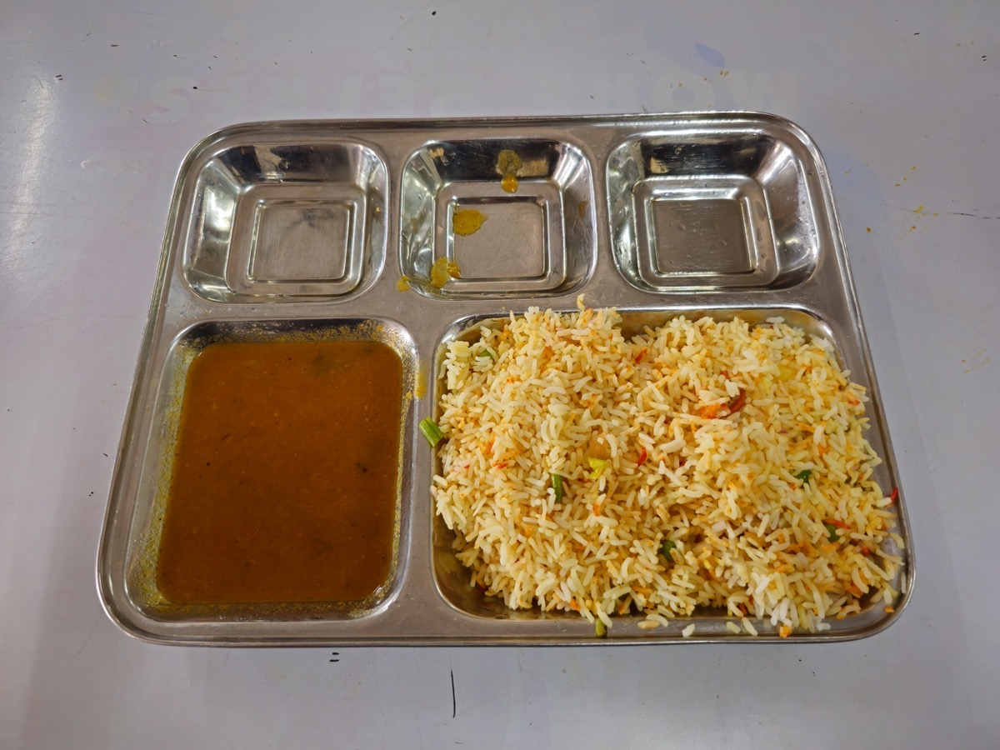
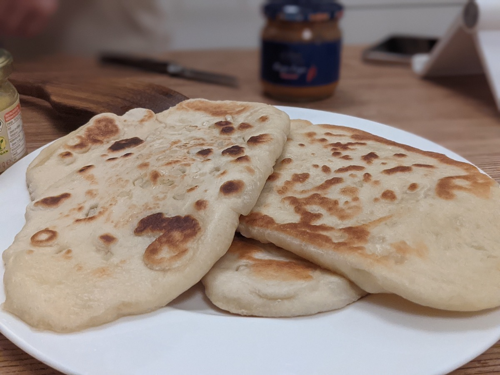

# 第九部 - 印度

印度菜的核心不是辣，是**香料**。一道咖喱的灵魂不在咖喱粉那一勺，而在于香料下锅的顺序、时机、油温。整粒香料用油爆出香气（tadka / tempering），磨粉香料后期下锅避免焦苦，姜蒜泥要炒到水分收干、油重新析出（这步在印度厨房叫 "bhuna"，是判断咖喱底子做没做够的标准）。这些动作做对了，普通家庭灶头也能做出馆子味。

这章按杭州口味的基线做了三个调整：

1. **油减 30%** - 印度家常本来就重油（黄油 + 植物油双下），这章统一改单油，重要的奶油类也从 cream 换 yogurt 或减半。结果不会失味，只是不那么腻
2. **奶制品替换** - paneer 国内难买，本章给"高水分硬豆腐 + 柠檬汁"的家做版；naan 没有 tandoor 高温土窑，给平底锅版本（家庭烤箱 220 度配铸铁锅也可以接近）
3. **香料用整粒 + 现磨** - 超市的 garam masala 成品粉放久了味道散，最后一道给完整配方让你自己炒，做一次能用两三个月

关于香料采买：**淘宝 / 山姆 / 进口超市**都能买齐。整粒香料（小茴香籽、香菜籽、绿豆蔻、丁香）保质期长，建议囤；磨粉香料（姜黄、辣椒粉、garam masala）开封后 3 个月内用完。

关于米：印度香饭（biryani）必须用 basmati 长粒米，**不能换中国大米**。原因下文具体展开，但简单说：basmati 的直链淀粉比例高、米粒细长，蒸煮后粒粒分明、不黏；中国大米支链淀粉高，煮出来粘成一坨，整道 biryani 就毁了。

{ width="480" .center }

## 历史与地理

印度次大陆几乎是个独立大陆：北边喜马拉雅山、东西两边海，气候从北部温带到南部热带，物产差异极大。这种地理决定了**北印度和南印度是两套饮食系统**：北印是麦作（饼类为主，naan、roti、paratha），南印是稻作（米饭为主），两边的主菜、烹饪方式、调味配比都不同。这本书选的菜偏北印一些，因为国内 / 海外能买到的食材也偏北印路线。

印度菜的香料用法可以追到公元前两千年的印度河流域文明（哈拉帕文明）。考古证据显示当时已经在用姜黄、姜、芥末籽。后来佛教兴起（公元前 6 世纪）带动素食传统，《吠陀》和《阿育吠陀》医学体系把食物按"性味"分类，每种香料对应特定健康功能 ， 姜黄消炎、孜然助消化、丁香防腐 ， 这套体系两千多年来塑造了印度家厨的香料配比直觉。

莫卧儿王朝（1526-1857）是印度饮食的另一个分水岭。莫卧儿帝国是中亚突厥-蒙古血统的伊斯兰王朝，从波斯和中亚带来了奶油、坚果、藏红花、玫瑰水、酸奶腌肉的做法，跟印度本土的素食和香料传统融合，催生了今天的"莫卧儿菜系"（Mughlai cuisine）：butter chicken、biryani、kebab、kofta、korma 都是这一支的产物。北印高级餐厅菜谱基本都是莫卧儿的延续。

香料贸易是印度跟世界连接的主轴。罗马帝国时期印度的胡椒就是奢侈品；大航海时代欧洲人绕过非洲找的就是印度的香料；十六世纪葡萄牙人从美洲把辣椒带到果阿（Goa），三百年内辣椒在印度普及到比香料还基础。今天印度菜的"辣"主要来自辣椒（chilli），不是黑胡椒，跟川菜的辣椒进入路径其实是同一条线。

宗教对印度饮食的影响是结构性的：印度教徒大多不吃牛肉（牛是神圣动物），穆斯林不吃猪肉，耆那教徒连根茎类（土豆、洋葱、大蒜，因为采集时会"杀死"植物）都不吃，佛教徒吃素。一个印度家庭的饮食图谱，先是宗教决定吃什么不吃什么，再是地区决定主食和味型，最后才是个人口味。

印度菜的"复杂"经常被外国人误解。它不是"放越多香料越正宗"，而是每种香料各司其职：整粒香料先用热油爆出脂溶性香气（tadka），磨粉香料后期下锅出味，最后用酸奶或奶油把所有味道融合。这套层次跟川菜"百味"和法菜"层次"是同一种思维方式 ， 不堆，而是叠。

---

## 黄油咖喱鸡 Butter Chicken

{ width="360" .center }

### 起源

1948 年由新德里 Moti Mahal 餐厅老板 Kundan Lal Gujral 发明，是印巴分治后从拉合尔逃难到德里的厨师为了挽救一批卖剩的 tandoori 烤鸡腿做出来的二次创作。烤鸡放过夜会发柴，他把鸡块浸进番茄、黄油、奶油熬的酱里回温，乳脂回锁住水分，干肉重新软嫩，反而比刚出炉的还好吃，菜单上一炮而红。这道菜的丝滑番茄底承袭了莫卧儿宫廷"奶油 + 坚果 + 香料"的厚酱传统，跟更早的 korma 一脉相承，但去掉了腰果泥，靠番茄的天然果酸平衡奶味。和后来的 chicken tikka masala 区别在于：butter chicken 的鸡只用 tandoor 烤过、不带焦黑斑，酱以黄油和奶油主导，酸度低、奶味重；tikka masala 的鸡块边缘要烤焦，酱里红甜椒粉更多、酸度更明显。今天它是全球印度餐厅出现率最高的菜，"印度国菜"的非官方代表。

### 食材

2-3 人份：

- 去骨鸡腿肉 500 g（切 3 cm 块）
- **腌料**：原味酸奶（无糖）100 g、姜蒜泥 15 g、姜黄 1 g、辣椒粉 3 g、garam masala 3 g、盐 3 g、柠檬汁 5 ml
- 番茄 400 g（切大块，**完全熟透软的那种**）
- 洋葱 100 g（切碎）
- 姜蒜泥 15 g
- 黄油 25 g（**比传统版减了一半**）
- 油 15 ml
- 原味酸奶 50 g（**代替部分淡奶油，减腻**）
- 淡奶油 50 ml（保留一半，给那个标志性的丝滑）
- 葛缕子 / 小茴香籽 cumin 2 g
- 干辣椒 1 个
- 葛兰姆马萨拉 garam masala 2 g（最后撒）
- 盐 4 g（先放一半）
- 干葫芦巴叶 kasuri methi 1 g（**这个有就放，是 butter chicken 的灵魂香气**，淘宝搜"kasuri methi"）
- 糖 3 g（平衡番茄酸）

### 步骤

1. 鸡块用所有腌料抓匀，**冷藏腌 2 小时**（最少 30 分钟）
2. 锅烧热下 10 ml 油，鸡块**煎到表面焦黄**（每面 2 分钟，里面不必全熟），盛出
3. 同一锅下黄油 + 5 ml 油，下小茴香籽 + 干辣椒爆 10 秒出香
4. 下洋葱碎中火炒到金黄软塌（5 分钟）
5. 下姜蒜泥炒 1 分钟到生味去掉
6. 下番茄块，加 50 ml 水，加盖中火煮 10 分钟到番茄完全软烂
7. 关火，**用料理棒打成顺滑酱汁**（或冷却后倒进料理机），打完倒回锅
8. 重新烧开，下鸡块 + 鸡块腌料剩下的汁，中小火**煮 10 分钟**到鸡熟透
9. 关火前加酸奶 + 淡奶油 + 糖 + garam masala，搅匀
10. 双手搓 kasuri methi 撒进去（搓一下香气才出来）
11. 尝咸淡

### 关键

- **腌料的酸奶不能省**，酸奶里的乳酸把鸡肉纤维松开，腌过的鸡比没腌的嫩一档
- 鸡块**先煎再炖**，煎过的焦香面是这道菜的层次来源，水煮的鸡腥
- 番茄要**打成顺滑酱**，butter chicken 的标志就是丝滑无颗粒，番茄块没打就成 chicken curry 了
- **kasuri methi 搓一下再放**，叶子干燥状态香气锁着，搓碎释放，直接撒香气出不来
- 酸奶和奶油**关火后下**，大火煮酸奶会结块分层

### 常见错误

- 鸡块不腌直接下锅：肉柴、不入味
- 番茄不打：成颗粒状的 chicken curry，不是 butter chicken
- 奶油 / 酸奶大火下锅：结块
- 不加 kasuri methi：少了那股标志性香气
- 黄油用太多：齁腻（家常版不要追求餐厅那种重油）

---

## 黄豆泥 Dal Tadka

{ width="360" .center }

### 起源

Dal 是印度素食饮食结构的基底，承担印度教、耆那教、佛教吃素人群的蛋白来源，几千年来稳坐北印饭桌"每天必吃"的位置，相当于中国家庭的米饭。"Dal" 泛指各种去皮豆瓣（toor、chana、masoor、moong），"tadka" 是印度厨房的核心工艺，指把整粒香料丢进热油爆出脂溶性香气，再连油带香料浇到熟食上。豆子本身味淡，必须靠 tadka 那一勺把香料的精油分子激活、再借滚油的温度爆开浇下去的"嘶"声把香气压进豆泥。这套工艺跟广东师傅做白切鸡最后浇热葱姜油是同一个逻辑，热油是香气的载体，温度不到香料就只是浮在表面。家常版本里 tadka 用酥油 + 小茴香籽 + 蒜片 + 干辣椒，节庆版会加阿魏粉和芥末籽，配方大同小异但工序顺序决定成败。

### 食材

3-4 人份：

- 黄扁豆 toor dal 或印度黄豆 chana dal 200 g（**淘宝搜"印度黄豆瓣 toor dal"**，国内绿豆/黄豆替代不像）
- 水 800 ml
- 姜黄粉 turmeric 2 g
- 番茄 1 个（150 g，切碎）
- 盐 4 g
- **Tadka 香料油**：
  - 酥油 ghee 或黄油 15 g + 油 10 ml
  - 小茴香籽 cumin seed 2 g
  - 芥末籽 mustard seed 1 g（可省）
  - 干辣椒 2 个（掰开）
  - 蒜 5 瓣（切片）
  - 阿魏粉 hing 1 撮（**可省，有的话香气加一档**，淘宝搜"asafoetida"）
  - 红辣椒粉 1 g
  - 香菜末 5 g（最后撒）

### 步骤

1. Dal 提前**冷水泡 30 分钟**（缩短炖煮时间），泡好后冲洗 2 次到水变清
2. 泡好的 dal 放锅里，加 800 ml 水 + 姜黄粉 + 番茄 + 1 g 盐
3. **高压锅 15 分钟** / **普通锅 45 分钟**到 dal 完全软烂能用勺背压成泥
4. 用勺子或料理棒**部分压成泥**（保留一些颗粒，全打成糊也可以但口感单一）
5. 加剩下的盐，按口味调稠稀（太稠加热水）
6. **另起小锅做 tadka**：
   - 下酥油 + 油，烧到油热但不冒烟（中火）
   - 下小茴香籽 + 芥末籽，**爆 5 秒到籽噼啪响**
   - 下干辣椒 + 蒜片，炒 20 秒到蒜片金黄
   - 关火，下阿魏粉 + 红辣椒粉，立刻搅匀（**关火再下辣椒粉，不然秒糊**）
7. **滚烫的 tadka 直接浇到 dal 上**（会"嘶"一声，香气爆出来）
8. 撒香菜末，搅匀

### 关键

- **Dal 必须泡水**，不泡的话煮 1 小时还硬芯
- **Tadka 要单独做**，这是 dal tadka 的灵魂，不能直接把香料丢进 dal 里煮
- **辣椒粉关火后才下**，红辣椒粉 100 度以上 5 秒就糊苦
- **Tadka 浇下去要"嘶"一声**，油不够热就只是油 + 香料，没那个爆香的瞬间
- 阿魏粉量极少，一撮就够，多了一股袜子味（确实是它的描述）

### 常见错误

- Dal 不泡：煮不烂
- Tadka 跟 dal 一起煮：香料煮老，香气全跑
- 辣椒粉跟着小茴香一起爆：糊苦，整锅毁
- Tadka 油不够热浇下去：没"嘶"声，香气出不来
- 用绿豆代替 toor dal：味道和质地都不对（绿豆煮糊散，toor dal 煮成奶油状）

---

## 鹰嘴豆咖喱 Chana Masala

### 起源

北印度 Punjab 地区的招牌素菜，家常和街边小吃两栖：在德里和孟买的早市摊位上，chana masala 配油炸蓬松面饼 bhatura 组成的 chole bhature，是北印最经典的早餐组合之一。鹰嘴豆（chickpea）在印度种植史超过四千年，是耆那教和印度教素食人群最重要的蛋白来源之一，扎实有嚼劲、能吸味，比绿豆红豆耐炖。这道菜的标志酸味来自芒果粉 amchur，把未熟青芒果晒干磨粉，是北印特有的酸味剂，跟南印用罗望子（tamarind）形成对照。做法上洋葱要炒到深金棕色才出甜味，番茄要 bhuna 到出油才算底做够，这两步偷工的话整道菜就薄了。比起糊状的 dal，chana masala 保留豆子完整形态，汤汁也更浓，是素菜里最有"肉感"的那一档。

### 食材

3-4 人份：

- 鹰嘴豆（干）200 g（**前一晚泡水 8 小时**，或罐头鹰嘴豆 2 罐 / 800 g 沥干）
- 洋葱 200 g（切碎）
- 番茄 300 g（切碎）
- 姜蒜泥 20 g
- 青辣椒 1 个（切碎，可省或减半）
- **香料**：
  - 小茴香籽 cumin 2 g
  - 月桂叶 1 片
  - 黑色小豆蔻 black cardamom 1 个（拍裂，**可省**）
  - 姜黄粉 1 g
  - 香菜籽粉 coriander 3 g
  - 红辣椒粉 1 g
  - 葛缕子 / 茴香粉 2 g
  - garam masala 2 g（最后下）
  - 芒果粉 amchur 2 g（**有就放，标志性的酸**，可用 5 ml 柠檬汁代替）
- 油 20 ml（**比传统减了 30%**）
- 盐 4 g
- 香菜末 10 g（撒面）

### 步骤

1. 干鹰嘴豆泡水 8 小时，捞出加新水煮 1 小时（**或高压锅 25 分钟**）到能用手指压扁但不散
2. **保留鹰嘴豆煮汤 200 ml**（这是后面调稠度的关键），鹰嘴豆沥干备用
3. 锅烧热下油，下小茴香籽 + 月桂叶 + 黑豆蔻爆 10 秒
4. 下洋葱碎中火炒到**深金棕色**（**这步要 8-10 分钟**，急不得，是这道菜的颜色和甜味来源）
5. 下姜蒜泥 + 青辣椒炒 1 分钟
6. 下番茄碎，加姜黄、香菜籽粉、红辣椒粉、葛缕子粉，**炒到番茄完全软烂出油**（油从酱里渗出来才算完成，5-7 分钟，这步印度厨房叫 "masala bhuna"）
7. 下鹰嘴豆 + 鹰嘴豆煮汤，搅匀加盖小火**煮 15 分钟**让豆子吸味
8. 加盐、garam masala、芒果粉
9. 用勺背压一些鹰嘴豆增加汤汁稠度
10. 撒香菜末

### 关键

- **洋葱要炒到深金棕色**，浅金色和深棕色差 5 分钟时间，但味道差一倍
- **Masala bhuna 那步**，番茄炒到出油是判断咖喱底做没做够的标准，这步偷工减料整道菜没厚度
- **保留豆煮汤**，鹰嘴豆煮汤里有淀粉和豆香，比加水强
- 干豆比罐头的好，口感更扎实，但赶时间罐头也行
- **芒果粉 amchur 是标志味**，印度家常 chana 的酸来自这个，没有用柠檬汁代替

### 常见错误

- 洋葱炒不够：颜色浅、味道单薄
- 番茄不出油就下豆：底子薄，再炖也补不回
- 用罐头不冲洗：罐头水有股金属味
- 红辣椒粉跟小茴香一起爆：糊苦
- 不加 amchur 或柠檬：少了那点酸，平淡

---

## 菠菜咖喱奶酪 Saag Paneer

{ width="360" .center }

### 起源

北印 Punjab 的代表冬季素菜。Punjab 五河平原冬天 5-15 度，露天能种菠菜、芥菜叶（sarson）、葫芦巴叶（methi）这些深绿叶菜，于是当地形成了把混合叶菜炖煮加奶制品的传统，"saag" 在 Punjabi 语里就是这类深绿叶菜的统称。Paneer 是印度自制的凝乳奶酪，做法是热牛奶加柠檬汁或醋让酪蛋白凝结，挤干水后压成块，不发酵不熟成，所以味道清淡只有奶香，跟意大利 ricotta 的最大区别在于 paneer 压得更紧、能切块煎制不化形，ricotta 是松散的湿酪、不耐高温。这道菜的经典搭配是 makki ki roti（玉米面饼），冬季 Punjab 家家户户的灶头标配，菠菜的铁、paneer 的蛋白、玉米饼的碳水构成完整一餐。和南印用椰浆的绿菜咖喱（如 thoran）比，saag paneer 走的是奶制品厚酱路线，奶味盖叶菜的青涩感，是北印莫卧儿系"乳脂 + 蔬菜"思路的素食版本。

### 食材

2-3 人份：

- 菠菜 500 g（**洗净后焯水 30 秒过冷水保色**）
- Paneer 200 g（**国内替代见关键栏**）
- 洋葱 80 g（切碎）
- 番茄 1 个（100 g，切碎）
- 姜蒜泥 15 g
- 青辣椒 1 个（切段）
- 油 15 ml + 黄油 10 g（比传统减了一半奶量）
- 小茴香籽 1 g
- 姜黄粉 1 g
- 香菜籽粉 2 g
- garam masala 2 g
- 盐 3 g
- 原味酸奶 30 g（**代替 cream，减腻**）
- 柠檬汁 3 ml

### 步骤

1. 菠菜烧开水**焯 30 秒**，立刻捞出过冷水（保翠绿色），挤干，料理机打成顺滑泥
2. Paneer 切 2 cm 见方块，平底锅 5 ml 油**煎到四面金黄**（每面 1 分钟，**别煎过会硬**），盛出
3. 锅里下剩下的油 + 黄油，下小茴香籽爆 10 秒
4. 下洋葱碎炒 5 分钟到金棕
5. 下姜蒜泥 + 青辣椒炒 1 分钟
6. 下番茄 + 姜黄 + 香菜籽粉，炒到番茄软烂出油（5 分钟）
7. 下菠菜泥 + 50 ml 水，搅匀**中小火煮 5 分钟**
8. 下煎好的 paneer，再煮 3 分钟（让 paneer 吸味）
9. 加盐、garam masala、酸奶、柠檬汁
10. 关火搅匀

### 关键

- **菠菜焯水后过冷水**，保住翠绿色，没过冷水颜色发暗黄成深绿色
- **Paneer 国内替代**：买**老豆腐 / 北豆腐**（**水分越少越好**），切块后撒少许盐 + 5 ml 柠檬汁腌 10 分钟，纸巾压去更多水分，再煎。这版本不是 1:1 还原但 80% 像
- Paneer 煎过再下锅，直接下煮成豆腐汤，没有那种焦香面
- 酸奶**关火后下**，开火下酸奶会结块
- **菠菜要打成顺滑泥**，不打成泥就成菠菜炒奶酪，不是 saag

### 常见错误

- 菠菜不焯水或不过冷水：颜色发黄
- Paneer 直接下锅不煎：没层次感，软塌塌
- 用嫩豆腐代替：一炒就碎
- 酸奶大火下：结块
- 菠菜泥打得太粗：成菠菜碎，少了那个绵密感

---

## 土豆花椰菜咖喱 Aloo Gobi

### 起源

北印度家常素菜里出现频率最高的一道，"aloo" 是土豆、"gobi" 是花椰菜，两个食材都是晚到印度的舶来品：土豆由葡萄牙人 16 世纪从南美带到果阿，到 19 世纪英国殖民期才在印度北部普及；花椰菜也是英国人 1822 年才引入。两个新食材进入印度后被既有的香料体系吸收，跟 16 世纪辣椒进入印度的路径完全一样，外来作物 + 本土香料 = 新经典。这是一道干式咖喱（dry curry），没有汤汁、香料糊裹在土豆和花椰菜表面，跟需要泡饼蘸汁的湿式咖喱（butter chicken、chana masala）形成功能上的互补，一桌印度家常菜通常一干一湿配一份 dal。每家做法略有差异但姜黄 + 小茴香籽 + 香菜籽粉是固定底，标志性的颜色来自姜黄。比起 dal 那种长时间炖煮，aloo gobi 强调快炒锁味，花椰菜要保留咬劲，土豆要起沙不能煮散。

### 食材

3-4 人份：

- 土豆 300 g（切 2.5 cm 块）
- 花椰菜 400 g（掰小朵，**别切**，切的话边缘碎成渣）
- 洋葱 100 g（切碎）
- 番茄 1 个（120 g，切碎）
- 姜蒜泥 15 g
- 青辣椒 1 个（可省）
- 油 20 ml
- **香料**：
  - 小茴香籽 2 g
  - 姜黄粉 1.5 g
  - 香菜籽粉 3 g
  - 红辣椒粉 1 g
  - garam masala 2 g
  - 芒果粉 amchur 1 g（可省）
- 盐 4 g
- 香菜末 10 g

### 步骤

1. 花椰菜掰小朵，**先焯水 1 分钟**捞出沥干（家常做法跳过这步直接炒，但焯过的颜色更好且熟得更均匀）
2. 土豆切块**直接生的下锅**（生土豆吸油吸味比焯过的好）
3. 锅烧热下油，下小茴香籽爆 10 秒
4. 下洋葱碎炒到金棕（6 分钟）
5. 下姜蒜泥 + 青辣椒炒 1 分钟
6. 下番茄 + 姜黄 + 香菜籽粉 + 红辣椒粉，炒到番茄软烂（4 分钟）
7. 下土豆块翻炒 2 分钟裹上香料
8. 加 100 ml 水 + 2 g 盐，**加盖中小火焖 10 分钟**到土豆筷子能轻松插透
9. 下花椰菜 + 剩下的盐，**翻炒不加盖再煮 5 分钟**到花椰菜熟但还有咬劲
10. 加 garam masala + 芒果粉，颠两下出锅
11. 撒香菜末

### 关键

- 花椰菜**先焯水或后下锅**，花椰菜熟得快，跟土豆同时下锅花椰菜烂土豆还硬
- **整个过程基本不加水或少加水**，这是干式咖喱，最后应该是土豆花椰菜裹着香料糊，不是汤
- 花椰菜**掰不切**，切的话边缘碎成米
- 土豆块大小要均匀，不均匀的话有的烂有的硬

### 常见错误

- 花椰菜跟土豆一起下：烂成泥
- 加水太多：成咖喱汤不是 aloo gobi
- 翻太频繁：花椰菜碎成渣
- 红辣椒粉烧太久：糊苦
- 火太大：底糊上面没熟

---

## 家常版印度香饭 Chicken Biryani

{ width="360" .center }

### 起源

Biryani 是莫卧儿王朝（1526-1857）从波斯-中亚带到印度的菜，词源是波斯语 "birian"（油煎）和 "birinj"（米），最早是宫廷宴席菜。莫卧儿君主从中亚带来了藏红花、玫瑰水、坚果、酸奶腌肉的工艺，跟印度本土的香料和长粒 basmati 米结合，催生了这道层次复杂的米饭菜。流传过程中分化出三大流派：Hyderabad biryani（南印海得拉巴尼扎姆王朝传统）用生米生肉一起 dum 焖，辣度高、米饭染色斑驳；Lucknow / Awadhi biryani（北印勒克瑙宫廷）米和肉分开煮再分层焖（pakki 工艺），味道清雅、米色一致；Kolkata biryani（加尔各答，源自被流放的 Awadh 王室）特征是加土豆和煮蛋。正宗 dum 法用面团把锅边封死，炭火上下夹烤一小时，靠水蒸气循环让香料分子均匀渗透；家常做法跳过封口、保留分层，本版属于 Lucknow 路线的简化版。米必须用 basmati，因为它的直链淀粉比例高、米粒细长，蒸完粒粒分明、不黏，换中国大米支链淀粉高，整道菜就糊成一坨。

### 食材

3-4 人份：

- **米**：basmati 长粒香米 300 g（**不能换中国大米**，原因见关键栏）
- 鸡腿肉 500 g（带骨更香，去骨也行，切大块）
- **腌料**：原味酸奶 100 g、姜蒜泥 15 g、姜黄 1 g、辣椒粉 2 g、garam masala 3 g、盐 3 g、柠檬汁 5 ml
- 洋葱 200 g（**切薄丝，要炸成金黄洋葱酥 birista**）
- 油 30 ml（炸洋葱用，其中 20 ml 后续可重复利用）
- **整粒香料（煮饭水里）**：
  - 月桂叶 2 片
  - 绿豆蔻 green cardamom 4 个
  - 黑豆蔻 black cardamom 1 个（**可省**）
  - 丁香 clove 4 个
  - 桂皮 cinnamon 1 段（3 cm）
  - 八角 1 个（南印做法的特征）
  - 小茴香籽 2 g
  - 盐 5 g
- **整粒香料（炒鸡用）**：
  - 月桂叶 1 片
  - 绿豆蔻 2 个
  - 桂皮 1 段（2 cm）
- 番茄 1 个（120 g，切碎）
- 薄荷叶 5 g（**有就放，biryani 的标志香气**）
- 香菜末 10 g
- 藏红花 1 撮（**可省**，泡 30 ml 温牛奶 10 分钟，最后浇饭上染色）
- 酥油 / 黄油 15 g

### 步骤

**鸡肉腌制（提前）**：
1. 鸡块用酸奶 + 姜蒜泥 + 香料腌料抓匀，**冷藏腌 2 小时**

**炸洋葱酥（biryani 灵魂）**：
2. 洋葱**切极薄丝**（越薄越脆），**用纸巾彻底吸干水分**
3. 锅里下 30 ml 油，**中小火**，下洋葱丝**炸 8-10 分钟**到深金棕色（**别炸黑会苦**）
4. 捞出洋葱酥沥油，铺到纸巾上散开（凉了会更脆）

**煮米**：
5. Basmati 米**冷水泡 30 分钟**（**这步必须做**），泡好沥干
6. 大锅烧 2 L 水，水开下整粒香料 + 盐，煮 2 分钟出味
7. 下泡好的米，**煮 5-6 分钟到米七分熟**（咬一下中间还有 1 mm 白心）
8. 立刻沥干（**别煮全熟**，后面还要焖）

**煮鸡**：
9. 锅里留 15 ml 炸过洋葱的油，下整粒香料（月桂、豆蔻、桂皮）爆 10 秒
10. 下番茄碎，炒到软烂出油（4 分钟）
11. 下腌好的鸡肉 + 腌料汁，加盖中小火煮 15 分钟到鸡肉熟透汁稠

**分层焖**：
12. 厚底锅（铸铁锅最佳）锅底刷一点酥油
13. 鸡肉连汁铺底
14. 鸡上撒一半薄荷 + 香菜 + 一半洋葱酥
15. 沥干的米**全部铺上面**（米饭层比鸡肉层厚）
16. 米上撒剩下的薄荷、香菜、洋葱酥
17. 浇上藏红花牛奶（如果有）+ 剩下的酥油
18. **盖盖，最小火焖 15 分钟**（**或盖紧后包一圈面团密封 dum 法**，家庭做法直接最小火够了）
19. 关火**焖 5 分钟再开盖**（让米吸完最后的水汽）
20. **吃的时候从底铲上来翻个面装盘**，鸡肉酱汁裹着染了香的米，是 biryani 该有的样子

### 关键

- **必须 basmati**，中国大米支链淀粉高，煮出来粘成一坨；basmati 直链淀粉高、米粒细长，蒸完粒粒分明。这道菜的口感关键是"米粒清晰、鸡肉裹味"，黏米直接毁掉
- **米煮七分熟立刻捞**，后面还焖 15 分钟，煮全熟最后会过软
- **洋葱酥 birista 是 biryani 灵魂**，炸 birista 慢一点，深棕但不黑，凉透才脆
- **分层不搅**，焖好后才翻面装盘，搅过了米就乱
- **最小火焖**，大火底糊上面没透气
- 想做 dum 法封口：揉一团面（面粉 + 水）封锅边，焖完气都不漏。家常做法不必，盖紧就够

### 常见错误

- 用中国大米：粘成一坨，不是 biryani
- 米不泡水：受热不均，外软内硬
- 米煮过头：最后焖完成米糊
- 洋葱炸得太黑：苦
- 焖的时候火太大：底糊
- 焖之前搅匀：分层意义没了，成乱炖
- 不腌鸡：鸡硬、不入味

---

## Naan（家庭烤箱版）

{ width="360" .center }

### 起源

Naan 起源于波斯，词源是波斯语 "nān"（饼），随莫卧儿王朝从中亚和波斯传入印度，主要在宫廷和上层穆斯林家庭流行。它跟 chapati / roti 的核心区别是：chapati / roti 是无酵的全麦薄饼、家家户户在平底铁板（tawa）上现烙，是印度普通老百姓的日常主食；naan 用精白面粉 + 酸奶发酵，需要专门的 tandoor 炭火土窑（炉壁温度 450-500 度）把面饼贴在窑壁上烤 1 分钟，所以历史上一直是餐厅菜或宫廷菜，普通家庭很少做。酸奶的乳酸 + 蛋白质让面团有韧劲又柔软，发酵 1.5 小时让面筋松弛产生气孔，烤的时候水蒸气瞬间撑开成大泡，外焦里软。今天印度餐厅的 naan 仍然走 tandoor 路线，家庭版没法复制 500 度土窑，但用铸铁锅 + 烤箱顶温 220 度配合刷水模拟蒸汽，能做出 80% 接近的版本。

### 食材

4 张 naan：

- 中筋面粉 250 g
- 原味酸奶 60 g（**这个是 naan 软的关键**）
- 温水 80 ml
- 牛奶 30 ml
- 干酵母 3 g
- 糖 5 g
- 盐 4 g
- 油 10 ml
- 黄油 20 g（**烤好后刷面**）
- 蒜末 5 g（可选，蒜香 naan 用）
- 香菜末 3 g（可选）
- 黑种草籽 nigella seeds（可选撒面）

### 步骤

**和面**：
1. 温水 + 糖 + 酵母搅匀，静置 5 分钟到表面起泡（酵母是活的）
2. 大碗里放面粉 + 盐，加酸奶、酵母水、牛奶、油
3. 揉成光滑面团（约 8 分钟），**面团应该比饺子皮软一点，比馒头硬一点**
4. 盖湿布**发酵 1.5 小时**到两倍大（冬天可以放温水浴，水温 30 度）
5. 发好面团排气，分 4 等份揉圆，**饧 10 分钟**
6. 每份擀成椭圆形（厚 3-4 mm），**别太薄会硬**

**版本 A：平底锅版（家常推荐）**：

7. 铸铁锅或厚底平底锅烧到**很热**（滴水秒蒸发），调中大火
8. Naan 一面**轻轻刷水**（这是模拟土窑那一甩水的效果，水分让面饼贴锅鼓泡）
9. 刷水那面贴锅，盖盖 30 秒（**会鼓起大泡**），不刷水那面有焦斑时翻面
10. 翻面后再烤 30 秒，焦斑出现就出锅
11. 黄油融化（蒜末 naan 把蒜末加进黄油），刷在 naan 上，撒香菜

**版本 B：烤箱版（更接近餐厅）**：

7. 烤箱 + 铸铁锅 / 烤盘**一起预热到 220 度**（**预热 20 分钟**让锅烧透）
8. Naan 表面刷水
9. 取出预热好的烤盘，**naan 直接甩上去**（小心烫），放回烤箱**最上层**烤 3-4 分钟到鼓起焦斑
10. 出炉立刻刷融化的黄油

### 关键

- **酸奶不能省**，酸奶里的乳酸 + 蛋白质让 naan 内部柔软有韧劲，纯水版本是死面
- 面团要**软**，硬面团烤出来是硬饼不是 naan
- **刷水模拟土窑**，这是家庭版的关键技巧，没刷水的 naan 鼓不起泡，平的
- 平底锅必须烧到**很热**，温度不够 naan 不鼓泡，慢慢烤成硬饼
- 烤箱版**铸铁锅必须预热透**，20 分钟才能蓄够热量，模拟土窑
- 黄油**烤好后刷**，烤前刷会糊

### 常见错误

- 不放酸奶：成硬死面
- 面团太硬：烤出来硬邦邦
- 锅 / 烤箱不够热：不鼓泡，平的
- 不刷水：表面干，不像 naan
- 烤过头：硬干裂
- 黄油烤前涂：表面糊黑

---

## 黄瓜酸奶 Raita

### 起源

Raita 是印度饭桌上的必备凉盘，几乎所有辣菜、油重菜、米饭菜旁边都会出现一小碗。它的功能是热带气候下的体温调节剂：印度大部分地区年均温 25 度以上，夏季常超 40 度，重香料、重辣的菜配滚烫的米饭一起下肚体温会迅速攀升，酸奶的乳酸菌和低温能压住辣椒素引发的痛觉、奶蛋白能裹住辣油分子缓解灼烧感。阿育吠陀医学体系把酸奶归为"凉性"食物，配"热性"的 garam masala 形成阴阳平衡，这套思路在印度家常餐桌的搭配逻辑里随处可见。北印版本的 raita 通常加擦丝黄瓜 + 烤过磨碎的小茴香粉 + 香菜 + 薄荷，南印版本会加洋葱碎、青芒果丁或番茄。和西餐的 tzatziki（希腊酸奶黄瓜酱）相比，raita 更稀、调味更淡、追求清爽消暑而不是浓郁，用法也不同：tzatziki 是蘸酱，raita 是直接配饭吃的小碗凉菜。配 biryani 和辣咖喱的时候是固定搭档，米饭舀一勺、raita 浇一勺，是吃印度餐的基本姿势。

### 食材

3-4 人份：

- 黄瓜 200 g（**去皮 + 去籽 + 擦丝 + 挤干水**）
- 原味酸奶（无糖）400 g（**全脂的最好，希腊式酸奶也行**）
- 小茴香籽 cumin 2 g
- 盐 3 g
- 黑胡椒 1 g
- 红辣椒粉 1 撮（撒面）
- 香菜末 5 g
- 薄荷叶 5 g（切碎，**有就加**）

### 步骤

1. 黄瓜去皮，纵切对半挖掉籽（**籽会出大量水**），用粗孔擦菜板擦丝
2. 黄瓜丝撒一点点盐，**静置 10 分钟出水**，**用手挤干水**（这步偷工的话整碗成水）
3. 小茴香籽**干锅小火炒 1 分钟到香气出来颜色加深**（**别炒糊**），晾凉用擀面杖压成粗粉
4. 大碗里放酸奶，搅打到顺滑（必要时加 1-2 大勺凉牛奶调稀）
5. 加挤干的黄瓜丝、小茴香粉、盐、黑胡椒、薄荷、香菜末，搅匀
6. 撒一点红辣椒粉装饰
7. **冷藏 30 分钟**让味道融合
8. 吃时再搅一下

### 关键

- **黄瓜必须去籽 + 挤干水**，不挤干静置半小时碗底全是水
- **小茴香现炒现磨**，炒过的小茴香比直接撒粉香一倍
- 酸奶要**全脂**，脱脂的太薄不够浓
- **冷藏**，刚做的 raita 味道散，冰过的才融合
- 红辣椒粉**撒面装饰**，不搅进去，是为了视觉对比和入口的辣点

### 常见错误

- 黄瓜不挤水：成黄瓜酸奶汤
- 小茴香不烤直接用粉：香气出不来
- 酸奶用甜的：成甜品不是配菜
- 加太多调料：raita 应该清爽，重调料反而盖住消暑功能

---

## Chicken Tikka Masala

### 起源

严格说这是英印混血菜，相传 1971 年由苏格兰格拉斯哥 Shish Mahal 餐厅的孟加拉裔厨师 Ali Ahmed Aslam 创造，故事版本是一位顾客抱怨 chicken tikka 太干，他临时把一罐金宝汤的番茄奶油浓汤加香料倒进去做成酱，结果意外受欢迎、被其他英国印度餐厅大量模仿。2001 年英国前外交大臣 Robin Cook 在演讲中称它为"真正的英国国菜"，把它当成英国多元文化的象征。和印度本土的 butter chicken 长得像但思路不同：butter chicken 的鸡只在 tandoor 烤过、不带焦黑斑，酱以番茄 + 黄油 + 奶油主导、酸度低、奶味厚；tikka masala 的鸡块边缘必须烤出焦黑斑（"tikka" 的核心特征），酱里加红甜椒粉（paprika）给标志性的橘红色，孜然和香菜籽粉用量更大、奶味比 butter chicken 轻，酸度更明显。这道菜在印度本土菜单上反而少见，是迎合英国人口味改造的产物，但今天反向输出回印度，已经成为全球印度餐厅必备项目之一。

### 食材

2-3 人份：

- 去骨鸡腿肉 500 g（切 3 cm 块）
- **腌料**：原味酸奶 100 g、姜蒜泥 15 g、姜黄 1 g、辣椒粉 3 g、小茴香粉 2 g、香菜籽粉 3 g、garam masala 3 g、盐 3 g、柠檬汁 5 ml、油 5 ml
- 洋葱 150 g（切碎）
- 番茄 350 g（切碎）
- 姜蒜泥 15 g
- 红甜椒粉 paprika 3 g（**这是 tikka masala 区别于 butter chicken 的标志**）
- 小茴香粉 2 g
- 香菜籽粉 2 g
- 红辣椒粉 1 g
- garam masala 2 g
- 油 20 ml + 黄油 10 g
- 番茄膏 tomato paste 15 g（**有的话加，颜色和浓郁度都加分**）
- 淡奶油 50 ml
- 原味酸奶 50 g
- kasuri methi 1 g（可省，跟 butter chicken 一样的灵魂）
- 盐 3 g
- 柠檬汁 5 ml（最后挤）
- 香菜末 10 g

### 步骤

**腌 + 烤鸡（提前）**：
1. 鸡块用所有腌料抓匀，**冷藏腌至少 2 小时**（最好过夜）
2. 烤箱 220 度预热
3. 鸡块铺烤盘（带烘焙纸），**烤 12-15 分钟到边缘焦黑**（**这层焦黑是 tikka 的标志**，少了就成普通鸡块）
4. 烤好取出备用

**或没烤箱用大火煎**：
3'. 平底锅烧到很热下 5 ml 油，鸡块**单层不重叠**，每面**煎 3 分钟到焦黑斑出现**（中间不必全熟），盛出

**做酱**：
5. 锅里下油 + 黄油，下洋葱碎中火炒到金棕（6 分钟）
6. 下姜蒜泥炒 1 分钟
7. 下番茄碎 + 番茄膏 + 红甜椒粉、小茴香粉、香菜籽粉、红辣椒粉，**炒到番茄完全软烂出油**（5-7 分钟，masala bhuna）
8. 加 200 ml 水煮开
9. **冷却到不烫，用料理棒打成顺滑酱**（要的是丝滑质地）
10. 重新烧开，下烤好的鸡块 + 烤盘里的鸡汁，中小火煮 8 分钟让鸡入味
11. 关火加酸奶 + 淡奶油 + garam masala + 盐
12. 搓 kasuri methi 撒进去
13. 挤柠檬汁
14. 撒香菜末

### 关键

- **鸡块烤出焦黑斑**，这是 tikka 跟 butter chicken 的最大区别，少了焦痕就只是奶咖喱鸡了
- **红甜椒粉 paprika 是颜色和味道的关键**，比辣椒粉柔和，给酱标志性的橘红色
- **番茄膏（tomato paste）加分**，浓缩的番茄味，让酱更厚
- 酸度比 butter chicken 高，柠檬汁不能省
- 酱要**打成顺滑**，颗粒感的话变成 chicken curry

### 常见错误

- 鸡块不腌：嫩度差一档
- 鸡块不烤焦：变成 butter chicken 不是 tikka masala
- 不打酱：颗粒感重
- 红甜椒粉换成红辣椒粉：辣度过高，味道也不对
- 奶油 / 酸奶大火下：结块

---

## Garam Masala 香料配方（印度菜的灵魂复合香料）

### 起源

"Garam" 在印地语 / 乌尔都语里是"warm / 温热"的意思，"masala" 是"香料组合"，合起来指的是按阿育吠陀医学分类能让身体产生"暖性"的复合香料。阿育吠陀把食物分成寒、凉、温、热四性，garam masala 的核心成员（黑胡椒、丁香、桂皮、豆蔻、肉豆蔻）在体系里都属于"温热"类，传统认为冬天和体寒的人多吃能驱寒、助消化、促进血液循环。这套配方没有标准答案，每户人家、每个地区都不同：北印偏好黑豆蔻和桂皮主导的烟熏深沉味，南印同类香料组合叫 sambar masala，多加干辣椒和咖喱叶味更酸辣，孟加拉地区的版本则强调五香（panch phoron）。和英国人 19 世纪发明的 curry powder（咖喱粉）完全不是一回事，咖喱粉是英国殖民期为了在本土仿做印度菜调出来的固定混合粉、以姜黄打底，印度家庭厨房里根本不存在"咖喱粉"这个概念。自己炒磨比超市成品香一倍，因为香料里的挥发性精油接触空气 3-6 个月就散得差不多了，成品粉放久基本只剩颜色。

### 配料

成品约 50 g，够做 20+ 道菜：

- 小茴香籽 cumin seed 15 g（**主体**，淘宝搜"孜然籽"）
- 香菜籽 coriander seed 15 g（**主体**，淘宝搜"芫荽籽"）
- 黑胡椒粒 5 g
- 绿豆蔻 green cardamom 8 个（约 4 g，**剥壳取籽更好但整个也行**）
- 黑豆蔻 black cardamom 2 个（**可省**，但加了更深沉的烟熏味，淘宝搜"黑豆蔻"）
- 丁香 clove 1.5 g（约 15 个，**这个比例不能多**，多了齁苦）
- 肉桂 / 桂皮 cinnamon 5 g（一段约 5 cm）
- 月桂叶 2 片
- 小茴香 fennel seed 3 g（南印偏好，可省）
- 干姜片 1 g（**可省**）
- 肉豆蔻 nutmeg 1/4 个（用刨子刨成屑，**最后才加，不下锅炒**）
- 八角 1 个（**可省**，南印做法用）

### 制作

1. 准备一个**厚底干锅**（铸铁或不锈钢，**不要不粘锅**，香料炒制温度高伤涂层）
2. 锅烧到**中小火热**（手放锅上方 10 cm 能感到热但不烫），**没有油**
3. 下小茴香籽 + 香菜籽（这两个量最大、需要时间最久）
4. 持续**翻炒 2 分钟**到颜色加深 + 香气强烈飘出（**别炒到冒烟**会苦）
5. 下黑胡椒粒、绿豆蔻、黑豆蔻、丁香、桂皮、月桂叶、小茴香、干姜（**所有耐烤的香料一起**）
6. 继续翻炒 1-2 分钟到所有香料受热均匀，颜色加深
7. **关火**离锅，倒到平盘上散热（在锅里继续受热会过头）
8. **完全凉透**（30 分钟）
9. 凉透的香料 + 肉豆蔻屑放入**专用磨豆机 / 香料磨**（**别用平时磨咖啡那个**，印度香料的味道会留在机器里），磨成细粉
10. 没有香料磨用**石臼**或**擀面杖**：装进密实袋砸成粗粉再用筛子筛细的部分
11. 装入**深色玻璃罐**密封，放阴凉处

### 关键

- **必须先炒后磨**，直接磨生香料只有 50% 香气，炒过的精油激活后磨，香气满
- **干锅、中小火**，不放油，火太大外焦内生，火太小香料不出味
- **完全凉透才磨**，热的香料磨完会受热结块
- **储存：玻璃罐 + 阴凉处 + 3-6 个月用完**，挥发性精油会随时间散失，半年后味道就不一样了
- 一次别做太多，50 g 是普通家庭 2-3 个月用量，做太多最后扔
- **肉豆蔻最后加不下锅**，肉豆蔻香气娇贵，下锅炒会失味

### 常见错误

- 不炒直接磨：香气只有一半
- 火太大炒糊：苦，整批毁
- 用磨咖啡的机器：印度香料味会渗进塑料件，下次咖啡有咖喱味
- 没凉透就磨：受潮结块
- 装不密封罐子：3 周就散味
- 配方里加咖喱粉：garam masala 不是 curry powder，咖喱粉是英国发明的混合姜黄粉，跟 garam masala 是两回事
