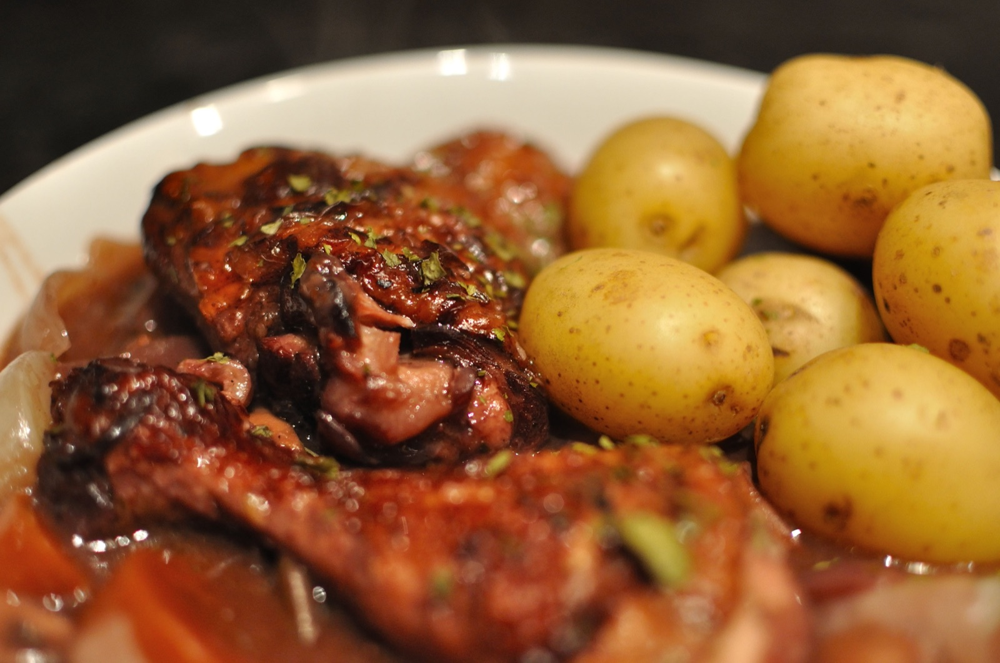

# 第十部 - 法国家常

法国家常菜不是米其林餐厅那一套，不需要 demi-glace 浓缩高汤吊三天、不需要发酵黄油 cultured butter、不需要自己拉酥皮。法国人家里做菜跟杭州人家里做菜一样：周末有时间炖一锅、平日 30 分钟搞定一道主菜配点沙拉就完事。

这章选的 8 道菜按家庭灶头 + 烤箱能做的标准筛过。法菜整体偏油偏奶，按杭州口味基线做减法：黄油减 20-30%、淡奶油用一半牛奶替代不影响成菜，酒选能喝的红酒就行不要"料酒红酒"那种糖精货。Bouillabaisse 这种海鲜汤本来要地中海特定鱼种，国内买不到的部分用鲈鱼、石斑、虾、蛤蜊代替，味道一样到位。

{ width="480" .center }

## 历史与地理

法国饮食的地理基础是温带海洋 + 大陆 + 地中海三种气候在一国之内并存。北部（诺曼底、布列塔尼）海岸线长，奶油、海鲜是底子；东部（勃艮第、阿尔萨斯）跟德国接壤，红酒和重肉炖菜是主线；南部（普罗旺斯、朗格多克）地中海气候，橄榄油、番茄、香草（百里香、迷迭香、罗勒）取代了北方的黄油。法国人讲的「**地方菜**」（cuisines régionales）不是营销概念，是真实的地理决定的菜系网络。

法国餐饮真正成型有几个关键时点。**中世纪到路易十四**（17 世纪）这段时间，法国宫廷菜是欧洲贵族标杆，意大利文艺复兴时期 Catherine de Medici 嫁到法国（1533）带来佛罗伦萨的厨子和叉子使用，法国菜从这时开始有了精致的形态。**法国大革命**（1789）把贵族厨师从家厨制推向公共餐厅 —— 失业的宫廷厨师在巴黎开起餐厅服务新兴的资产阶级，今天「Restaurant」这个词的现代含义就是从那时起的。**Antonin Carême**（1784-1833）是第一代真正意义上的"名厨"，他系统化了酱汁体系（五大母酱），写了第一本系统的法菜烹饪书。**Auguste Escoffier**（1846-1935）在 19 世纪末把酒店厨房改造成现代分工模式（brigade de cuisine），他写的《Le Guide Culinaire》（1903）至今还是法菜的圣经。今天高端法餐的基本框架，是 Escoffier 那一代定下来的。

但「家常法菜」是另一回事。法国人在家做菜其实跟在中国家庭差不多平民：一锅炖菜（pot-au-feu、coq au vin、boeuf bourguignon）配土豆 / 面包，一份蔬菜（ratatouille、salade niçoise），周末偶尔做个 quiche 或者 gratin。这些菜的源头多半是十九世纪到二十世纪初地方农家的省钱菜，跟宫廷菜没什么关系。

法菜的味觉指纹是「**fond**」（锅底）。煎过肉的锅底有焦糖化的褐色物质（Maillard reaction 的产物），用酒或高汤刮下来熬，是法菜最常见的酱汁起手式。这个动作跟中餐的"炝锅"是不同的逻辑：中餐用大火激发油脂里的香气（脂溶性香料），法菜用文火萃取焦化物里的鲜味（水溶性氨基酸）。两种思维都对，只是方法论不同。

新世界食材（番茄、土豆、玉米、辣椒、可可、咖啡）十六世纪才陆续进入法国，今天看起来"法国"得不行的薯条、可可热饮、番茄基底的普罗旺斯菜，其实都是相对年轻的传统。这一点上法菜跟川菜一样，"经典"的东西其实没多少年历史。

---

## 红酒炖鸡 / Coq au Vin

### 起源

勃艮第和卢瓦尔河谷的传统炖菜，原版是用**老公鸡**（coq）炖三小时，肉柴需要红酒慢炖到酥软。家常版用普通整鸡或鸡腿，炖 1 小时就够。法国人周末做一锅，配一块面包蘸汤，下半瓶剩下的红酒。

### 食材

3-4 人份：

- 鸡腿 6 个（约 900 g，带骨带皮，剁大块也可整只）
- 培根（lardons）120 g（切 1 cm 小段，没有就用厚切五花培根）
- 红酒 500 ml（**能喝的干红就行**，黑皮诺/赤霞珠/西拉都行，别用做菜专用红酒）
- 鸡汤或清水 200 ml
- 洋葱 1 个（切丁）
- 胡萝卜 1 根（150 g，切滚刀块）
- 蒜 4 瓣（拍裂）
- 蘑菇 200 g（褐蘑菇/口蘑切四瓣）
- 小洋葱 200 g（pearl onions，没有就普通洋葱切大块）
- 番茄膏 15 g（tomato paste）
- 面粉 20 g（裹鸡块用）
- 黄油 25 g（家常版减量，原版要 50 g）
- 橄榄油 15 ml
- 百里香 3 枝、月桂叶 2 片
- 盐、黑胡椒 适量
- 欧芹碎 少许（最后撒，可省）

### 步骤

1. 鸡腿用厨房纸**彻底擦干**，撒盐黑胡椒，薄薄裹一层面粉
2. 铸铁锅烧热下橄榄油 + 一半黄油，下培根煸到出油变焦，捞出留底油
3. 鸡块皮面朝下下锅，**中火煎到金黄**（每面 3-4 分钟，**别急着翻**，皮没结壳一翻就破），盛出备用
4. 锅里下洋葱丁、胡萝卜、蒜，**用煎鸡的底油炒 5 分钟**到洋葱变软微焦
5. 加番茄膏炒 1 分钟（炒掉生涩味）
6. 倒红酒，**大火烧开刮锅底焦渣**（这步是味道厚的关键，焦渣全融进酒里）
7. 鸡块和培根回锅，加鸡汤、百里香、月桂叶，汤要没过鸡的 2/3
8. 烧开后转小火加盖**炖 50 分钟**，中途翻一次面
9. 另起锅化剩余黄油，下小洋葱煎 5 分钟到表面金黄，下蘑菇炒 3 分钟，盐胡椒调味
10. 炖好的锅里加入煎好的洋葱蘑菇，开盖大火**收汁 10 分钟**到酱汁稠到能挂在勺背上
11. 尝味，淡了加盐，撒欧芹碎

### 关键

- **鸡块擦干 + 裹面粉**，擦干才能煎出焦皮，面粉是后期酱汁稠化的来源（家常版不用 beurre manié 调浓酱汁）
- **红酒一定要烧开刮锅底**，焦渣（fond）是这道菜风味的核心，不刮就浪费了
- **蘑菇洋葱单独煎**再回锅，一起炖会糊烂没形状
- 红酒选能喝的，糖精料酒做出来酱汁发涩有怪味
- 隔夜更香，炖好放冰箱第二天回锅，肉更入味

### 常见错误

- 鸡块没擦干直接下锅：煎不出焦皮，皮塌烂
- 红酒不烧开刮焦渣：风味单薄
- 蘑菇跟着炖一小时：化成泥
- 用做菜专用红酒：酱汁发苦发涩
- 收汁不够：酱汁稀稀的挂不住

---

## 普罗旺斯杂烩 / Ratatouille

### 起源

法国南部普罗旺斯的农家菜，夏末番茄、茄子、西葫芦、彩椒丰收时一锅炖。传统做法是各种菜分开炒过再一起炖（不是一股脑下锅），最后是带橄榄油香的浓郁蔬菜炖菜。配米饭、面包、烤肉、煎鱼都行，常温吃更香。

### 食材

3-4 人份：

- 茄子 1 个（300 g，切 2 cm 见方块）
- 西葫芦 1 个（250 g，切 2 cm 见方块）
- 红椒 1 个（切 2 cm 块）
- 黄椒 1 个（切 2 cm 块）
- 洋葱 1 个（切丁）
- 蒜 5 瓣（切片）
- 番茄 4 个（约 600 g，**完全熟透发软**，去皮切块）
- 番茄膏 15 g
- 橄榄油 60 ml（**这道菜真的需要**，少油不香）
- 普罗旺斯香草 (herbes de Provence) 5 g（百里香 + 迷迭香 + 牛至混合，没有就单用百里香 3 g）
- 月桂叶 2 片
- 盐、黑胡椒 适量
- 罗勒叶 几片（最后撒，可省）

### 步骤

1. 茄子切块后**撒盐 5 g 拌匀静置 20 分钟**，挤掉渗出的水，用厨房纸吸干（去苦水 + 防过吸油）
2. 番茄顶部划十字，开水烫 30 秒剥皮，切块
3. 平底锅烧热下 20 ml 橄榄油，**茄子单独煎**到表面金黄微焦（约 5 分钟），盛出
4. 锅里再下 10 ml 油，西葫芦煎 3 分钟到表面金黄，盛出
5. 锅里再下 10 ml 油，红黄椒炒 4 分钟到边缘焦，盛出
6. 锅里下剩余 20 ml 油，下洋葱小火炒 5 分钟到透明
7. 下蒜片再炒 1 分钟，加番茄膏炒 1 分钟
8. 下番茄块、香草、月桂叶，中小火**炒 8 分钟**到番茄成酱
9. 所有蔬菜回锅，盐黑胡椒调味，**最小火加盖焖 20 分钟**（基本不用加水，蔬菜自己出水）
10. 开盖再焖 5 分钟收一下汁，关火静置 10 分钟让味道融合
11. 撒罗勒叶

### 关键

- **茄子先腌出水**，不腌的茄子下锅会狂吸油（一根能吸 50 ml），腌过的吸油量减半
- **每种菜分开煎**，一起下锅出大量水成炖蔬菜泥，分开煎每样都有形状有焦香
- 番茄要**熬成酱**再下其他菜，半生番茄块漂在汤里不是 ratatouille
- **常温吃比烫吃更香**，做好放凉到温热，橄榄油香和蔬菜甜味才出来
- 隔夜更入味，做一锅吃两天

### 常见错误

- 茄子不腌：吸油成油泡茄子
- 所有菜一锅下：变成蔬菜糊
- 番茄不剥皮：嘴里卡皮
- 油放少：清淡寡味，没法国南部那股橄榄油香
- 趁烫吃：味道没出来

---

## 洛林乡村咸派 / Quiche Lorraine

### 起源

法国东部洛林地区的农家派，传统派皮是手做酥皮（pâte brisée），家常版用**现成冷冻酥皮或派皮**完全没问题，法国超市里也卖现成派皮，巴黎家庭主妇一样用。馅料就三样：培根、蛋液、奶油。简单到出奇但极满足，配沙拉就是一顿。

### 食材

直径 24 cm 派盘 1 个（4 人份）：

- 现成冷冻派皮（pâte brisée 或 puff pastry）1 张（约 250 g，提前室温解冻 15 分钟）
- 培根（lardons）200 g（切 1 cm 段，烟熏培根更香）
- 鸡蛋 4 个
- 淡奶油 100 ml + 全脂牛奶 100 ml（**家常版用一半牛奶替代纯奶油**，原版是 200 ml 全奶油）
- 格鲁耶尔奶酪 (Gruyère) 80 g（擦丝，没有就用埃曼塔尔 Emmental 或马苏里拉混切达）
- 肉豆蔻粉 (nutmeg) 1 小撮（约 0.5 g，**这是 Quiche 的灵魂香料**）
- 黑胡椒 适量
- 盐 几乎不用（培根和奶酪自己出咸）
- 黄油 5 g（涂派盘）

### 步骤

1. 烤箱预热 180°C
2. 派皮室温解冻到能展开但还冰凉的状态，铺进派盘，**边缘按实，底部用叉子戳满小洞**（防鼓起）
3. 派皮上铺一层烘焙纸，压上烘焙豆或干豆子（盲烤防底部生），180°C 先烤 12 分钟，取出豆子和纸再烤 5 分钟到底部微干
4. 培根冷锅下，**中火煸到出油变焦黄**（约 6 分钟），用厨房纸吸去多余油
5. 大碗打散鸡蛋，加奶油 + 牛奶、肉豆蔻、黑胡椒，搅匀（**不要打到起泡**，起泡烤完会蓬松塌陷不平整）
6. 烤好的派底铺一半奶酪丝，撒上培根，倒入蛋奶液（**留 5 mm 不要倒满**，烤的时候会膨胀），表面撒剩余奶酪
7. 180°C 烤 30-35 分钟到表面金黄、中心轻晃还有一点点颤动（**晃一下中心还没完全凝固**就出炉，余温会继续凝固）
8. 出炉静置 15 分钟再切，刚出炉切会塌

### 关键

- **派皮一定要盲烤**，直接倒蛋液烤，底部永远是湿生的
- **派皮戳洞**，不戳烤起来会鼓成大泡
- 培根要**煸出油吸干**再放，湿培根带水，蛋液烤完会分层
- 蛋液**不要打起泡**，起泡烤完表面坑坑洼洼
- **肉豆蔻不能省**，这是 Quiche 区别于其他咸派的关键香料，撒一小撮就够，多了发苦
- **静置 15 分钟再切**，刚出炉太软，会瘫成一摊

### 常见错误

- 派皮不盲烤：底部湿生粘牙
- 派皮不戳洞：烤完底部像气球
- 培根不煸：蛋液出大量水分层
- 蛋液打起泡：表面凹凸难看
- 烤过头中心完全凝固：出炉后干硬不嫩
- 现切：塌成一摊

---

## 马赛海鲜汤 / Bouillabaisse

### 起源

法国南部马赛港的渔民菜，原版用 5-6 种地中海特定鱼（rascasse 鲉鱼、conger eel 海鳗等），国内根本买不到。家常版用国内能买到的鲈鱼/石斑/虾/蛤蜊替代，核心不是用什么鱼，是用**至少 3 种海鲜**和**藏红花 + 茴香 + 番茄**做出的那股地中海汤底。配烤面包片抹蒜泥蛋黄酱（rouille）泡汤吃。

### 食材

3-4 人份：

- 鲈鱼或石斑鱼 1 条 600 g（让鱼贩处理好留鱼骨，**鱼骨别扔**，吊汤用）
- 大虾 8 只（约 200 g，去虾线留壳）
- 蛤蜊或青口贝 300 g（盐水吐沙 1 小时）
- 番茄 3 个（约 450 g，去皮切块）
- 番茄膏 20 g
- 洋葱 1 个（切丁）
- 韭葱（leek）1 根（白色部分切丝，没有就用 2 段大葱白）
- 蒜 6 瓣（切片）
- 茴香头（fennel bulb）1/2 个（切丝，**这是 bouillabaisse 的关键蔬菜**，没有就用茴香籽 3 g + 多放点芹菜代替）
- 藏红花 (saffron) 1 小撮（约 0.3 g，**贵但不能省**，没有就别叫这个名字了）
- 橙皮 1 小条（5 cm 长，用刀刨下黄色部分别带白瓤）
- 月桂叶 2 片、百里香 3 枝
- 橄榄油 30 ml
- 干白葡萄酒 100 ml（能喝的就行）
- 水 1.2 L
- 盐、黑胡椒 适量
- 法棍面包 8 片（烤脆配汤）
- 蒜 1 瓣（生的，搓面包用）

### 步骤

1. 鱼切大块（约 5 cm），虾去虾线，蛤蜊吐沙
2. **熬鱼汤底**：锅里下 15 ml 橄榄油，下鱼骨煎 3 分钟微焦，加水 1.2 L、月桂叶、百里香、几片洋葱，**大火滚 20 分钟**得到鱼汤底，过滤鱼骨备用
3. 另起一锅下 15 ml 橄榄油，下洋葱、韭葱、茴香丝、蒜片**中小火炒 8 分钟**到全部变软出甜味
4. 加番茄膏炒 1 分钟，下番茄块炒 5 分钟到番茄成酱
5. 倒干白酒，大火烧开 2 分钟挥发酒精
6. 倒入鱼汤底、藏红花、橙皮，盐黑胡椒调味，**大火滚 10 分钟**
7. 下鱼块（**最厚的部分先下**），煮 4 分钟
8. 下虾和蛤蜊，加盖煮 4 分钟到蛤蜊全开口（**没开口的扔掉**，可能死了）
9. 关火，**让汤静置 5 分钟**让味道融合
10. 法棍切片烤脆，用切开的生蒜面**搓面包面**（在面包上磨蒜香），配汤吃

### 关键

- **鱼骨吊底**，直接清水煮鱼汤是清汤不是 bouillabaisse，鱼骨煎过煮汤是浓白汤底的来源
- **藏红花不能省**，这是这道汤独特橙黄色和那股微苦花香的来源，0.3 g 一小撮就够
- **茴香头**是地中海汤的灵魂蔬菜，茴香籽是替代品但味道差一档
- **海鲜分批下**，鱼最先（4 分钟）、虾蛤蜊后（4 分钟），全部一起下要么鱼烂要么蛤蜊不开
- **蛤蜊没开的扔掉**，可能是死的，吃了拉肚子
- 国内鱼用鲈鱼/石斑，肉紧不散、煮汤不腥

### 常见错误

- 没有鱼骨吊底：成清水煮海鲜
- 省了藏红花：颜色味道全错
- 蛤蜊没吐沙：吃出沙
- 海鲜一锅下：鱼煮烂蛤蜊还闭着
- 海鲜煮过头：肉柴
- 用海里捕的"做汤鱼"剩货：腥味重

---

## 牛排薯条 + 黑椒汁 / Steak Frites + Sauce au Poivre

### 起源

法国 bistro 国民菜，几乎每家小馆都有。牛排煎到中等程度（à point）配现炸薯条 + 黑椒奶油汁，简单到极致也满足到极致。家常版关键是**牛排选对部位 + 锅烧到冒烟 + 黑椒汁不分汤**。

### 食材

2 人份：

**牛排 + 薯条：**

- 西冷或眼肉牛排 2 块（每块 220 g，2.5 cm 厚，**至少冰箱拿出来回温 30 分钟**）
- 土豆 600 g（中等淀粉量，黄心土豆或荷兰薯）
- 油 1 L（炸薯条用，可重复使用）
- 黄油 15 g
- 蒜 2 瓣（拍裂）
- 百里香 2 枝
- 海盐、现磨黑胡椒 适量

**黑椒汁 (Sauce au Poivre)：**

- 黑胡椒粒 15 g（**整粒粗碎**，不是粉，粉会发苦）
- 干邑或威士忌 30 ml（家常版用白兰地或料酒也凑合）
- 牛肉汤 100 ml（没有就用 100 ml 水 + 1/2 块浓汤宝）
- 淡奶油 80 ml（**家常版减量**，原版要 120 ml）
- 黄油 10 g
- 第戎芥末 5 g（可选，提味）
- 盐 适量

### 步骤

**薯条（双炸法）：**

1. 土豆去皮切 1 cm 见方长条，**冷水泡 20 分钟**洗淀粉，沥干**用厨房纸彻底擦干**（湿薯条下油爆炸）
2. 油烧到 150°C（**第一次炸**），下薯条**炸 6 分钟**到表面微黄但还没脆，捞出沥油静置 10 分钟
3. 油升到 190°C（**第二次炸**），薯条**复炸 2-3 分钟**到金黄酥脆，捞出撒海盐

**牛排：**

4. 牛排两面用厨房纸**彻底擦干**，撒大量海盐和现磨黑胡椒，按压让调料贴肉
5. 铸铁锅或厚底锅**烧到冒烟**（不夸张，真冒烟），下 5 ml 油
6. 牛排下锅，**别动**，2.5 分钟一面（中等熟），翻面再 2.5 分钟
7. 翻面后下黄油 + 蒜 + 百里香，**用勺子不断舀融化的黄油浇在牛排上**（arroser，30 秒）
8. 牛排盛出，**铝箔纸盖上静置 5-7 分钟**（醒肉，肉汁回流，不静置切开汁全流光）

**黑椒汁（用煎牛排的锅，里面焦渣是味道）：**

9. 锅里留底油 + 焦渣，下黑胡椒粗碎**小火炒 30 秒**出香
10. 离火倒入干邑（**离火很重要**，干邑遇明火会燎），回炉点燃挥发酒精（家庭版可省略 flambé，用大火烧 30 秒到酒精挥发）
11. 加牛肉汤，刮锅底焦渣融进汁里，大火滚 2 分钟收一半
12. 加奶油 + 第戎芥末，转小火**煮 3 分钟**到能挂勺背，关火加黄油搅匀（蒙特黄油 monter au beurre 让汁亮）
13. 尝盐，焦渣自带咸，不一定要再加

### 装盘

14. 牛排切片或整块，淋黑椒汁，旁边堆薯条，撒海盐

### 关键

- **牛排回温 30 分钟**，冰箱直接下锅外面焦了里面还冰
- **锅烧到冒烟**，温度不够煎不出焦壳，肉汁全流出来
- **2.5 分钟一面别动**，一直翻没法形成焦壳
- **arroser 浇油**是 bistro 厨师的招数，黄油香 + 蒜香渗进牛排
- **静置醒肉 5-7 分钟**，这步省了切开汁全流光，肉柴
- 薯条**双炸**，一次炸里熟外不脆，二次炸才酥
- 薯条**冷水泡 + 擦干**，泡掉淀粉防互粘，擦干防爆油
- 黑椒汁用**煎牛排的锅 + 焦渣**，干净锅做的酱汁味单薄
- **黑胡椒整粒粗碎不用粉**，粉发苦没层次

### 常见错误

- 牛排不回温：外焦里冰
- 锅没烧到冒烟：煎成水煮牛肉
- 频繁翻面：永远没焦壳
- 不静置直接切：汁全流盘子里
- 薯条没擦干：油爆 + 软塌
- 一次炸薯条：里软外不酥
- 黑椒用粉：发苦发糊
- 黑椒汁用干净锅：风味单薄

---

## 焗烤洋葱汤 / Soupe à l'Oignon Gratinée

### 起源

巴黎 bistro 经典，原本是市场工人凌晨喝的暖身汤，后来进了餐厅。核心是**洋葱炒到深焦糖色**，这步要 45 分钟以上，急不得。汤面盖一片烤面包 + 大量奶酪丝送进烤箱焗到金黄起泡，用勺子破开奶酪壳的瞬间是这道汤的全部仪式感。

### 食材

3-4 人份：

- 黄洋葱 1.2 kg（**4-5 个大洋葱**，听起来多但炒完只剩 1/4 体积）
- 黄油 30 g（**家常版减量**，原版要 50 g）
- 橄榄油 15 ml
- 白糖 5 g（**帮助焦糖化**）
- 面粉 15 g
- 干白葡萄酒 100 ml（没有就用普通白酒或干雪莉）
- 牛肉汤 1.2 L（**家常版用浓汤宝调**：1.2 L 水 + 2 块浓汤宝；有时间自己熬最好）
- 月桂叶 2 片、百里香 3 枝
- 盐、黑胡椒 适量
- 法棍 8 片（切 1.5 cm 厚，烤箱烤到两面焦脆）
- 格鲁耶尔奶酪 (Gruyère) 200 g（擦丝，**奶酪要够多才是 gratinée**）
- 蒜 1 瓣（生的搓面包用）

### 步骤

1. 洋葱**全部纵向切丝**（顺纤维切丝比横切丁炒后口感更好）
2. 厚底锅或铸铁锅烧热下黄油 + 橄榄油，下洋葱**中小火炒**
3. **耐心阶段**：前 10 分钟洋葱出水变软；20 分钟变浅黄；30 分钟开始变金黄；**40-45 分钟变深棕焦糖色**，全程偶尔搅一下别糊底，**不要开大火加速**（开大火只会炒焦不会焦糖化）
4. 洋葱炒到位时撒白糖 + 一小撮盐，再炒 2 分钟
5. 撒面粉炒 1 分钟（让汤稠一点）
6. 倒白酒，大火滚 2 分钟挥发酒精
7. 倒牛肉汤、月桂叶、百里香，烧开后**小火炖 25 分钟**入味
8. 试味，盐黑胡椒调，捞出月桂叶百里香枝
9. **焗烤**：烤箱开 220°C 上火（broiler/grill 模式）
10. 法棍片用切开的生蒜搓面，烤到两面焦脆
11. 烤碗（**耐高温陶瓷碗**）盛汤 8 分满，盖 2 片面包，**铺厚厚一层奶酪丝**完全盖住面包
12. 烤箱**最上层**烤 5-8 分钟到奶酪融化金黄起焦泡（盯着烤别走开，奶酪从金黄到焦糊就 30 秒）
13. 出炉端上桌，**小心烫嘴**

### 关键

- **洋葱炒 40-45 分钟**，这是这道汤唯一的难点，急不得，全程中小火
- **大火加速会失败**，洋葱外面焦内部还白，没焦糖化的甜味
- **撒白糖**辅助焦糖化，糖在 160°C 焦糖化产生那股甜香
- **奶酪要够多**，少了没法盖住面包焦不出壳
- **碗要耐高温**，普通瓷碗 220°C 会裂
- 面包要**烤过**再下汤，直接下汤泡烂成糊
- 烤箱**最上层**，离上火近才能焗出焦壳

### 常见错误

- 洋葱炒不够：汤甜味不够，是洋葱清汤不是焦糖汤
- 大火炒洋葱：外焦里生，必败
- 奶酪放太少：焗不出壳
- 面包不烤先下汤：泡烂没结构
- 碗不耐高温：220°C 裂
- 烤箱中下层：上火不够奶酪焦不了
- 烤过头：奶酪烧焦发苦

---

## 焦糖布丁 / Crème Brûlée

### 起源

法国甜点经典，**烤制蛋奶冻 + 表面焦糖脆壳**。家常做法的核心：蛋奶比例对、低温水浴烤、表面糖用喷枪烤焦（没有喷枪用烤箱 broiler 也行）。一勺敲开焦糖壳那一刻是这道甜点的全部意义。

### 食材

6 个浅烤盅（每个直径 10 cm，3-4 人份）：

- 淡奶油 300 ml + 全脂牛奶 200 ml（**家常版用 60% 奶油 + 40% 牛奶**，原版是纯奶油）
- 蛋黄 5 个
- 白糖 50 g（蛋奶液用）
- 香草豆荚 1/2 根（**剖开刮籽**）或香草精 5 ml
- 黄糖或白糖 30 g（**表面焦糖用**，黄糖焦化味道更深）
- 盐 1 小撮

### 步骤

1. 烤箱预热 150°C（**低温水浴烤是关键**，高温会让蛋奶冻起泡 + 表面有蜂窝孔）
2. 锅里倒奶油 + 牛奶 + 香草籽和豆荚，**小火加热到边缘冒小泡**（约 70-80°C，**不要烧开**），关火静置 10 分钟让香草入味
3. 大碗打散蛋黄 + 白糖 + 盐，搅到**糖完全融化变浅黄**（不要打到起泡，起泡烤完表面有泡眼）
4. **奶液慢慢倒入蛋液**，边倒边搅（**慢倒**，太快蛋会被烫熟成蛋花）
5. 混合液**过筛 2 次**（去除蛋黄系带和气泡），捞出香草豆荚
6. 静置 5 分钟，用勺子撇掉表面气泡
7. 烤盅放进深烤盘，倒入蛋奶液 8 分满
8. 深烤盘**注入热水**到烤盅 1/2 高度（**水浴烤**，温度均匀防开裂）
9. 150°C 烤 30-35 分钟到**轻晃中心还有点颤动**就出炉（中心完全凝固说明烤过头）
10. 取出晾凉到室温，**冰箱冷藏至少 4 小时或过夜**（冷透才会形成布丁质感）
11. **焗焦糖**：吃前撒一薄层黄糖均匀盖住表面，**喷枪从 5 cm 距离烤糖**到融化变焦糖色（约 30 秒）；没喷枪就放烤箱顶层 broiler 模式 2-3 分钟（盯着烤）
12. 静置 1 分钟让焦糖冷却变脆

### 关键

- **奶液不能烧开**，烧开蛋奶比例就变了，烤出来发硬
- **慢倒蛋液**边倒边搅，奶液有 70°C，快倒蛋会熟成蛋花
- **过筛 2 次**，是表面光滑无颗粒的关键
- **水浴烤**，直接烤会从底部开裂，水浴温度均匀
- **150°C 低温**，高温会起气泡蜂窝
- **中心还颤动就出炉**，冷却后会自然凝固，烤到全凝固出来是橡皮
- **冷藏 4 小时以上**，刚烤的布丁是软糊，冷透才是凝胶质感
- **焦糖现场烤**，提前烤焦糖壳放冰箱会回潮变软，失败

### 常见错误

- 奶液烧开：蛋奶比例改变，质感发硬
- 蛋液打起泡：表面坑坑洼洼
- 不过筛：表面有蛋黄筋膜
- 不水浴：边缘开裂中间生
- 高温烤：起气泡蜂窝
- 烤到完全凝固：橡皮口感
- 冷藏不够：还是软糊
- 焦糖提前做：吃时已回潮变软

---

## 甜薄饼 / Crêpes Sucrées

### 起源

布列塔尼地区的传统薄饼，街边小店现做现吃。家庭版面糊调好放冰箱**醒一晚**，第二天早上煎是早午餐神器。配 Nutella + 香蕉、柠檬糖、果酱、黄油糖、冰淇淋，怎么搭都行。

### 食材

约 12 张薄饼（3-4 人份）：

**面糊：**

- 中筋面粉 200 g
- 鸡蛋 3 个
- 全脂牛奶 500 ml
- 白糖 30 g
- 盐 2 g
- 融化的黄油 30 g（**家常版减量**，原版要 50 g）
- 香草精 5 ml（可选）
- 朗姆酒或橙花水 10 ml（可选，传统加一点提香）

**煎用：**

- 黄油 适量（每张薄饼用一点，约 3 g）

**配料（任选）：**

- Nutella 榛子巧克力酱 + 香蕉片
- 柠檬汁 + 白糖（**最经典**，挤半个柠檬撒一勺糖卷起来）
- 自制果酱
- 黄油 + 白糖（最简单的小孩版）

### 步骤

1. **调面糊**：大碗里筛入面粉，中间挖坑，加鸡蛋 + 糖 + 盐
2. **慢慢倒入牛奶**，从中心向外搅（**中心搅匀再慢慢扩大**，这样不结块）
3. 加融化黄油 + 香草精，搅到完全光滑没颗粒
4. 面糊**过筛 1 次**去除可能的小颗粒
5. **盖保鲜膜冰箱醒至少 1 小时，过夜更好**，醒过的面糊蛋白质松弛，煎出来薄饼柔软不韧
6. 煎之前再搅一下面糊（沉淀了），稠度应该是**像稀奶油，能挂勺但流动快**，太稠加点牛奶，太稀加点面粉
7. **煎薄饼**：平底锅（最好不粘锅，直径 24 cm）烧到中火，**用厨房纸蘸一点黄油涂锅**（不要太多）
8. 锅烧到滴一滴水会跳的程度，**舀一勺面糊（约 60 ml）倒入锅中央**，**立刻倾斜旋转锅**让面糊摊成薄薄一层圆饼
9. **煎 60-90 秒**到边缘翘起、底面金黄
10. 用扁铲翻面，再煎 30 秒（第二面比第一面快）
11. 出锅放盘子里，每张之间夹一张烘焙纸防粘
12. 重复以上步骤煎完所有面糊
13. **包馅**：薄饼上抹 Nutella + 摆香蕉片，对折两次成扇形；或挤柠檬汁撒糖卷成条；按个人爱好

### 关键

- **面糊要醒**，刚调的面糊煎出来发韧，醒过的柔软
- **慢慢加牛奶搅**，一次倒进去面粉结块永远搅不开
- **过筛**，保证薄饼表面光滑
- **黄油涂锅别太多**，油多了薄饼底部斑驳油花，不均匀
- **倒面糊后立刻旋锅摊开**，面糊一接触锅就开始凝固，慢一秒就摊不薄了
- **第一张通常会失败**，锅温没稳定，面糊用量不准，扔掉别心疼
- **面糊稠度**像稀奶油，稠了煎出厚饼，稀了破洞
- 煎好的薄饼**之间夹烘焙纸**，不夹会黏在一起撕不开

### 常见错误

- 面糊不醒：薄饼发韧像橡皮
- 牛奶一次倒：面粉结块煎出疙瘩
- 不过筛：薄饼有颗粒
- 黄油涂太多：油花不均
- 倒面糊不旋锅：摊不薄，成厚饼
- 第一张就上手：通常会失败，锅没稳定
- 面糊太稠：煎出小煎饼不是 crêpe
- 面糊太稀：一倒就破

---
