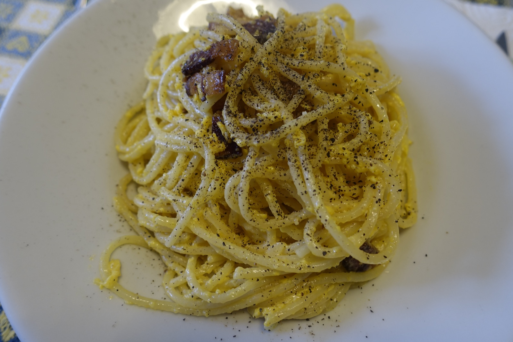
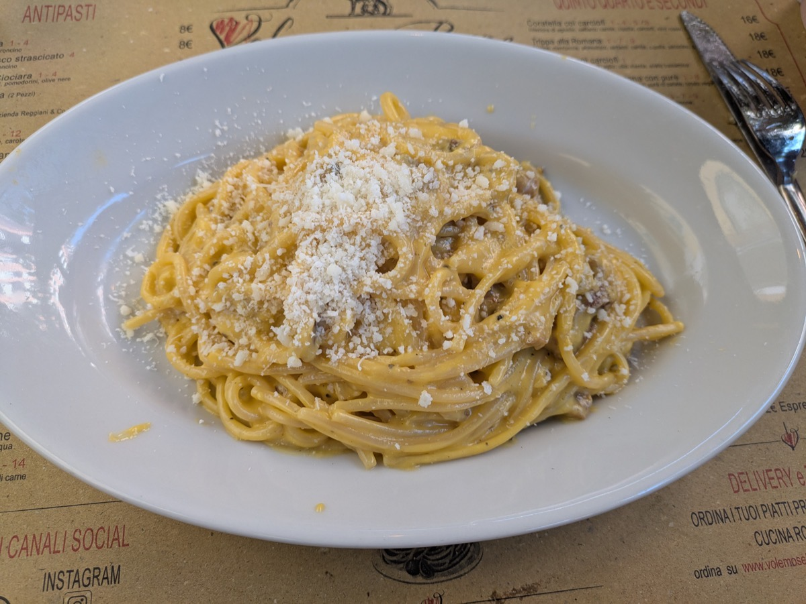
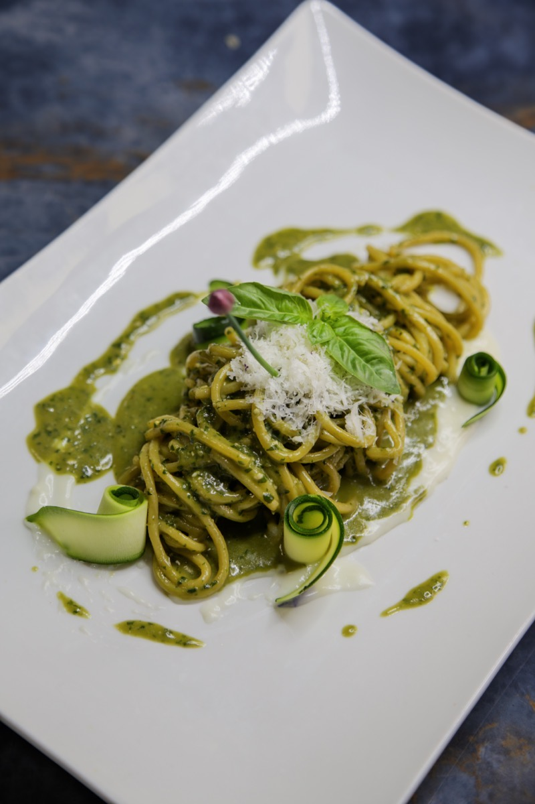
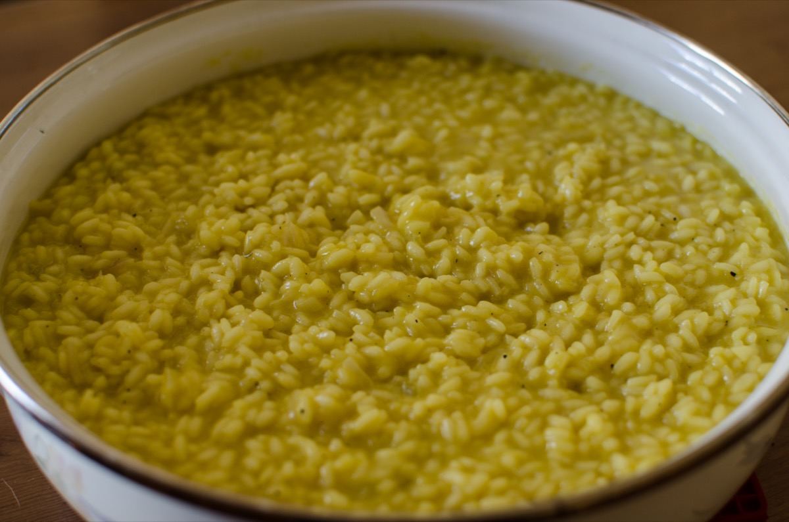
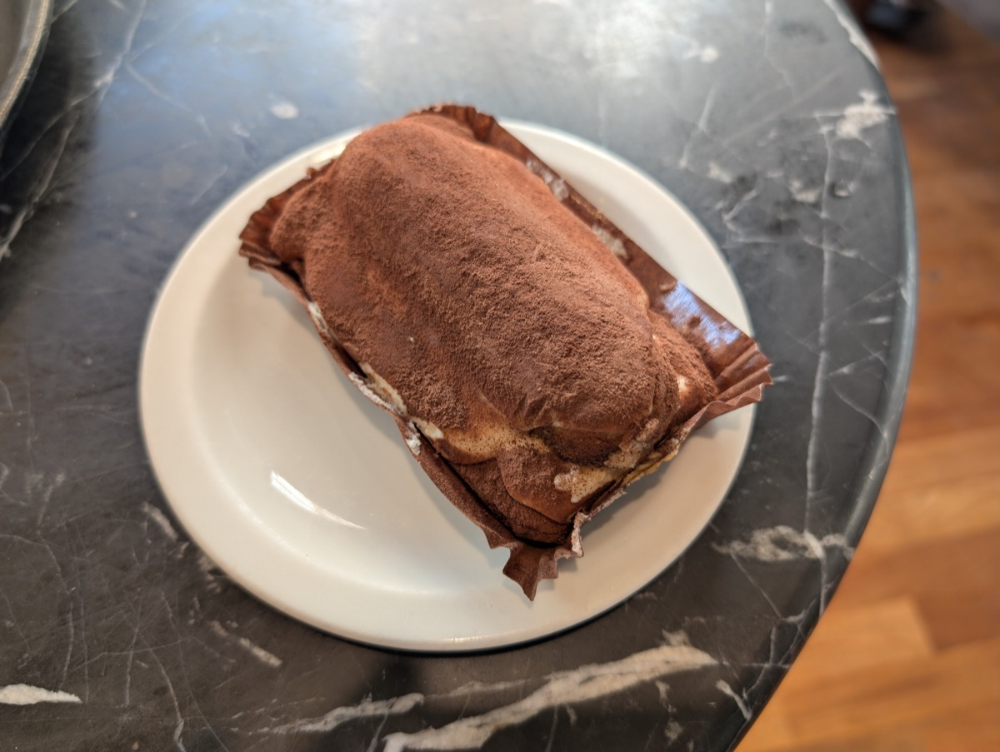

# 第十一部 - 意大利家常

意大利菜跟杭州菜其实是一脉的：少而精、重食材本味、不堆调料。一碗 carbonara 一共五样东西（面、蛋黄、芝士、培根、黑椒），一盘 caprese 一共四样（番茄、莫扎里拉、罗勒、橄榄油），跟一锅腌笃鲜（咸肉、鲜肉、笋）的逻辑完全一致。意大利老太太看见你往 carbonara 里加奶油，跟杭州老太太看见你往腌笃鲜里加味精是一个反应。

这章选 8 道家里炉灶 + 烤箱能做的家常菜。**这章基本不需要"杭州友好版改造"**，意大利家常本身就清淡。需要注意的是食材：意面用 De Cecco 或 Barilla 进口的（国产意面口感差一档）、Parmigiano Reggiano 必须用真的硬芝士（不是青色罐装的"芝士粉"那种工业品）、Mascarpone 不能用 cream cheese 替代、米必须用 Carnaroli 或 Arborio（东北米泰国米都不行，淀粉结构不对）。这些正经超市进口区都能买到，别在原料上省。

{ width="480" .center }

## 历史与地理

意大利半岛被亚平宁山脉从北到南切成两半，三面环海，气候从北方的阿尔卑斯山温带到南方西西里的地中海亚热带。这种地理决定了一件事：**意大利不存在"意大利菜"**，只有二十个大区的地方菜。北部的米兰、威尼托、皮埃蒙特用黄油、米、玉米粥；中部托斯卡纳、艾米利亚-罗马涅是意大利香料和肉类制品（帕尔马火腿、博洛尼亚肠）的中心；南部那不勒斯、卡拉布里亚、西西里用橄榄油、番茄、海鲜，是 pizza 和大量意面的发源地。把这二十个地区的菜混在一起叫"意大利菜"，是现代媒体的简化，意大利人自己不这么说。

历史上意大利长期处于分裂状态。罗马帝国西部公元 476 年崩溃后，半岛分裂成几十个城邦、王国、教皇国，**直到 1861 年意大利统一**，意大利人才有了统一的国家概念。换句话说：意大利菜的"区域差异"不是后来形成的，是这一千多年各地区独立发展的真实历史，每个城市都有自己的招牌菜和做法标准。

意面（pasta）的起源至今是个争议点。常见的"马可波罗从中国带回意大利"的说法是十九世纪美国小说家编的故事，没有历史依据。真正的考古证据显示，**地中海地区在伊特鲁里亚文明（公元前 4 世纪）就有干燥的面条**，阿拉伯文献里十二世纪西西里已经在做工业化的干意面（pasta secca），那时候马可波罗还没出生。意面是地中海本土食物，跟中国面条是平行发展的两条线。

新世界食材是意大利菜里另一条很关键的历史线。**番茄**十六世纪从美洲到欧洲，先是被当观赏植物，到十八世纪才在那不勒斯地区开始大量食用，今天意大利菜里的番茄酱（pomodoro）、番茄底披萨（margherita）的历史其实只有两三百年。**土豆、辣椒、玉米**也都是同一波过来的。意大利菜里那些"古老传统"，很多其实比明清时期的中国菜还年轻。

意大利菜的味觉指纹是「**留白**」。一道菜通常只有 4-6 种食材，每种都能尝出来。这跟法菜的"层叠"是不同思路：法菜用酱汁把多个味道融成一个新的味道，意大利菜让每个食材保持自己的味道并列在一起。这一点意大利菜跟广东菜其实更像，不是法菜。

---

## Carbonara（罗马蛋黄培根意面）

{ width="360" .center }

### 起源

罗马拉齐奥大区的招牌意面，跟 Cacio e Pepe、Amatriciana、Gricia 并称罗马四大经典。这道菜在 1944 年之前的食谱里完全没有记录，相传起源于二战末期：美军带来大量培根和鸡蛋，跟罗马本地的硬芝士、意面一拼，就成了这道融合菜。"Carbonara"字面是"烧炭工人的"，因为粗磨黑胡椒撒上去像炭灰。它跟法式 quiche lorraine 同样是"培根 + 蛋"的组合，但路径完全相反：法国用奶油和黄油把蛋液变成烤布丁的质地，罗马则坚持用蛋黄加 Pecorino 加煮面水自己乳化出酱，因此**正宗 carbonara 不放奶油**，加奶油就滑向了法式系统。家里用 pancetta 或培根代替 guanciale 可以妥协，奶油这条红线不能越。

### 食材

2 人份：

- 意面 200 g（spaghetti 或 rigatoni，**De Cecco 或 Barilla**）
- 培根 100 g（pancetta 最好，普通厚切培根也行；**guanciale 国内难买，培根代替**）
- 蛋黄 4 个 + 全蛋 1 个（**只用蛋黄不用蛋清**，蛋清会结块成蛋花）
- Pecorino Romano 50 g（细擦丝，**没有用 Parmigiano Reggiano 替代**）
- 黑胡椒 现磨 2-3 g（**必须现磨，黑胡椒粉不行**）
- 盐 煮面水用，菜本身不加盐（培根 + 芝士已经够咸）
- 油 不用，培根自己出油

### 步骤

1. 培根切 5 mm 厚条（**不要太薄**，太薄炒糊没口感）
2. **冷锅下培根**，开小火慢慢煸，让油慢慢出来，培根边缘金黄微脆（约 5-6 分钟），关火，培根连油留在锅里
3. 蛋黄 + 全蛋打散，加 40 g Pecorino（留 10 g 最后撒）+ 现磨黑胡椒，搅成浓稠蛋糊
4. 大锅烧水，水开加盐（**比平时煮面咸一点**，这是唯一的盐来源），下意面按包装时间煮，**比包装少煮 1 分钟**（al dente，咬下去面芯有 1 mm 白心）
5. 煮面快好时，**舀出 200 ml 煮面水留着**
6. 面捞出沥干，**立刻倒入培根锅**（不开火，靠余温），淋 50 ml 煮面水，颠匀让面裹上培根油
7. **关键步骤**：锅离火 30 秒（让锅温度降到 70°C 左右），倒入蛋糊，**快速颠拌**让蛋黄裹住每根面（蛋黄遇高温会成蛋花，遇低温不熟，70°C 是窗口）
8. 觉得稠了加一点煮面水调，最终状态是**蛋黄酱裹在面上、盘底有一点流动的酱**
9. 装盘，撒剩下的 Pecorino + 黑胡椒

### 关键

- **绝对不加奶油**，这是 carbonara 的底线。奶油加进去就是另一道菜，叫"奶油培根面"，不叫 carbonara
- **锅离火再加蛋**，直接在火上加蛋黄会瞬间凝固成蛋花。70°C 是蛋黄变浓稠但不结块的临界点
- **煮面水是乳化剂**，里面的淀粉是让蛋黄、芝士、培根油融成酱的关键，别倒掉
- **面要 al dente**，意面靠嚼劲，软面拌不出 carbonara 的口感
- 培根冷锅下小火慢煸，油才能慢慢出，大火培根焦了油还没出来

### 常见错误

- **加奶油**：意大利人会跟你拼命，这是底线
- 蛋直接在火上加：成蛋花面（最常见的失败）
- 用全蛋不用蛋黄：蛋清结块、酱不浓稠
- 用青色罐装"芝士粉"：那是工业品，没有真芝士的咸鲜
- 面煮过头：糊烂没嚼劲
- 不留煮面水：酱拌不开，干硬

---

## Cacio e Pepe（黑椒奶酪意面）

### 起源

罗马另一道经典，三个食材：面、Pecorino、黑胡椒。简单到一句话能写完，但简单的菜最考验功夫，跟杭州炒青菜一个道理。"Cacio"是芝士、"Pepe"是胡椒，名字就是配方。难点全在乳化：怎么让芝士和煮面水融成酱挂在面上，而不是一坨一坨结块。

### 食材

2 人份：

- 意面 200 g（**Tonnarelli 最正宗，没有用 spaghetti**）
- Pecorino Romano 100 g（细擦丝，**必须真芝士**）
- 黑胡椒 现磨 3-4 g（**这道菜黑椒是主角，要多**）
- 盐 煮面水用

### 步骤

1. Pecorino 提前细擦成丝，放大碗里
2. 黑胡椒整粒在干锅里**小火烘 30 秒**（释放香气），取出粗磨
3. 锅烧水，水开加盐（比平时煮面少一点，因为 Pecorino 很咸），下意面
4. 面煮的时候，**舀 50 ml 煮面水**到 Pecorino 碗里，搅成糊状（**水不要太烫，70°C 左右**，开水会让芝士结块）
5. 加大部分黑胡椒到芝士糊里搅匀
6. 面比包装时间少煮 1 分钟，**再舀 100 ml 煮面水**留着，面捞出沥干
7. 面入芝士糊碗里，**快速颠拌**让面裹上芝士酱
8. 觉得稠了一点点加煮面水（**慢慢加，每次 20 ml**），最终状态是奶状酱挂在面上
9. 装盘，撒剩下的黑胡椒

### 关键

- **煮面水温度是关键**，开水会让 Pecorino 瞬间结块成一团，70°C 才能融成酱
- **Pecorino 要细擦丝**，粗擦的丝化不开
- **黑胡椒先烘再磨**，香气出来了才配得上当主角
- 煮面水**慢慢加**，一次加多了酱稀如水，慢慢加才能控制稠度
- 不要加油不要加黄油，这道菜只有面 + 芝士 + 胡椒，加任何东西都是错的

### 常见错误

- 直接用开水冲 Pecorino：芝士结成一坨，面在底下挂不上酱
- Pecorino 擦得粗：化不开，吃出芝士颗粒
- 用 Parmigiano 代替：味道偏淡偏甜，少了 Pecorino 的咸鲜冲劲
- 加奶油 / 加黄油：又是奶油那条红线
- 黑椒放少：这道菜叫"奶酪黑椒面"，黑椒是主角

---

## Aglio e Olio（蒜油意面）

### 起源

那不勒斯传统的"穷人菜"，半夜饿了用厨房永远有的三样东西做：蒜、油、辣椒。意大利人凌晨 2 点的宵夜面，跟杭州人凌晨 2 点煮个葱油拌面是一个性质。15 分钟搞定，比方便面还省事，但比方便面好吃十倍。

### 食材

2 人份：

- 意面 200 g（spaghetti，**De Cecco**）
- 大蒜 6-8 瓣（**切薄片不要拍碎**，薄片才能慢慢出香）
- 特级初榨橄榄油 60 ml（**这道菜油是主角，必须好油**）
- 干辣椒 2 个（peperoncino，国产小米椒也行，去籽切碎）
- 欧芹 一小把（fresh parsley 切碎，**没有可以省，干欧芹不要用**）
- 盐 煮面水用
- Parmigiano Reggiano 30 g（**可选**，传统派认为这道菜不放芝士）

### 步骤

1. 大锅烧水煮面，水开加盐，下意面按包装少煮 1 分钟
2. 煮面同时，平底锅**冷油下蒜片**，开**最小火**慢慢煸（约 4 分钟），蒜片**微金黄就关火**（继续会苦）
3. 关火后下干辣椒（**热油里下，靠余温出香**，在火上下辣椒会糊）
4. 煮面快好时舀出 150 ml 煮面水
5. 面捞出沥干，倒入蒜油锅，**开小火**，淋 60 ml 煮面水
6. 颠拌 30 秒让面吸蒜油 + 煮面水乳化（**油 + 煮面水 = 一层薄薄的酱挂在面上**）
7. 撒欧芹碎，再颠几下出锅
8. 装盘，可选撒 Parmigiano

### 关键

- **蒜片不是蒜末**，蒜末小火也容易糊，蒜片可以控制
- **冷油下蒜小火慢煸**，大火蒜外焦里没出香，小火蒜的香气慢慢进油里（跟葱油拌面一个道理）
- **蒜微金黄就关火**，发深褐色就苦了，整锅毁
- **乳化是关键**，煮面水 + 油颠匀后会变一层奶状的酱，不是清油挂面
- 用好橄榄油，这道菜没别的味道，油不好整盘塌

### 常见错误

- 大火煸蒜：蒜糊苦，整锅丢掉重来
- 用蒜末：必糊
- 不留煮面水：油挂不到面上，干油面
- 用便宜橄榄油：油是主角，便宜油全盘没味
- 加生抽 / 蚝油 / 别的酱：那就不是 aglio e olio 了，是中式意面

---

## Pesto alla Genovese（青酱意面）

{ width="360" .center }

### 起源

热那亚（Genova）的青酱，七样东西：罗勒、松子、大蒜、Parmigiano、Pecorino、橄榄油、海盐。传统是石臼捣的，家里用料理机也行，**但料理机有个坑**，刀片高速转动会让罗勒发热氧化变黑。诀窍是分次短时间打 + 提前把罗勒和料理杯冰一下。

### 食材

2 人份青酱（多余的密封冷藏 1 周）：

- 新鲜罗勒叶 50 g（**只要叶子，梗扔掉**，梗有苦味）
- 松子 30 g（pine nuts，**干锅小火烘 2 分钟**出香）
- 大蒜 1 瓣（**只放 1 瓣**，热那亚做法蒜很少）
- Parmigiano Reggiano 30 g（细擦丝）
- Pecorino Sardo 或 Pecorino Romano 15 g（细擦丝）
- 特级初榨橄榄油 80 ml
- 海盐 一小撮（粗盐最好）
- 意面 200 g（**Trofie 或 Linguine 最配**，spaghetti 也行）

### 步骤

1. 罗勒叶洗净**用厨房纸彻底擦干**（湿叶子打出来发黑），料理杯放冰箱冷冻 10 分钟
2. 松子干锅**小火烘 2 分钟**到微金黄出香，凉一下
3. 料理机放罗勒、松子、蒜、海盐，**点动 3-4 次**（每次 2 秒），不要持续打，刀片不发热
4. 加两种芝士，再点动 2 次
5. 边点动边慢慢倒橄榄油，最终状态是**有颗粒感的浓酱**（不是顺滑的糊，传统青酱有颗粒）
6. 大锅烧水煮面，水开加盐，按包装时间煮 al dente
7. 舀 100 ml 煮面水，面捞出沥干（**不要冲冷水**）
8. 大碗里放 4 大勺青酱 + 50 ml 煮面水，搅成稀一点的酱
9. 面入碗拌匀，需要的话再加煮面水调稀度
10. **不要再加热**，青酱一加热就氧化发黑发苦，**冷酱拌热面是对的**

### 关键

- **罗勒只用叶子**，梗有强烈苦味，毁整锅
- **罗勒擦干 + 料理杯冰过**，防止打的时候罗勒发热氧化变黑
- **点动不持续打**，持续打罗勒被刀片摩擦升温，颜色发黑、味道变苦
- **青酱不加热**，加热就是毁掉。冷酱拌热面，靠面的余温是恰好的温度
- 蒜只放 1 瓣，热那亚传统蒜很少，多了盖罗勒香

### 常见错误

- 罗勒打成顺滑糊：颜色发黑，味道发苦（持续打的结果）
- 用罗勒梗：苦
- 把酱倒锅里加热：颜色发黑变苦
- 蒜放多：成蒜泥酱不是青酱
- 用预制瓶装青酱：那是另一种食物
- 松子换核桃 / 花生：味道完全跑偏

---

## Risotto alla Milanese（米兰藏红花烩饭）

{ width="360" .center }

### 起源

米兰传统，金黄色来自藏红花（saffron）。传说是 16 世纪一个画家学徒用染玻璃的藏红花染米饭恶作剧，结果好吃成了名菜。这道是米兰下雪天的深冬菜，金灿灿一盘端上桌跟暖色的灯光一起就是冬天的画面。家里做的难点不在食材，在**搅拌的耐心**，必须站在锅边搅 18 分钟。

### 食材

2 人份：

- 意大利米 200 g（**Carnaroli 最佳**，Arborio 次之；**绝对不能用东北米 / 泰国米**，淀粉结构不对，做不出 risotto 的奶状质地）
- 藏红花 一小撮（约 0.2 g，10-15 根丝）
- 鸡高汤 800 ml（**热的**，全程保持小火加热状态）
- 洋葱 半个（约 80 g，切极细末）
- 黄油 30 g（分两次：10 g 炒、20 g 收尾）
- 白葡萄酒 60 ml（**干白**，没有可以用清酒或省略）
- Parmigiano Reggiano 50 g（细擦丝）
- 盐 适量
- 黑胡椒 少许

### 步骤

1. 藏红花放小碗里，舀 50 ml 热鸡汤泡着，让颜色和香气出来（10 分钟以上）
2. 鸡高汤在另一个小锅里**保持小火热着**，冷高汤倒进米里会让米降温中断淀粉释放
3. 洋葱切**极细末**（不切细会留口感）
4. 大锅或厚底锅中火融 10 g 黄油，下洋葱末**炒到透明不上色**（约 3 分钟）
5. 下米**翻炒 1 分钟**，每粒米被黄油裹住、边缘略透明（这步叫 tostatura，是 risotto 的基础）
6. 倒白酒，颠几下让酒精挥发（约 30 秒，闻不到酒味）
7. 开始加热高汤：**每次一大勺**（约 80 ml），用木铲不停搅拌，等汤被吸收快干时再加下一勺
8. 加到第 4 勺时倒入泡好的藏红花水，米饭开始变金黄
9. 持续加汤搅拌，**约 18 分钟**米从硬变到 al dente（咬下去米芯有一丁点硬），这步叫 mantecatura 的前奏
10. 关火，加 20 g 黄油 + Parmigiano 50 g，**用力搅拌 1 分钟**让米饭变浓稠奶状（这步是 mantecatura）
11. 盖盖**静置 2 分钟**，调盐和黑胡椒
12. 装盘要"波浪状"，盘子拍一下，米饭流成均匀的一层（**all'onda**，米兰人评价 risotto 的标准）

### 关键

- **必须 Carnaroli 或 Arborio**，这两种米淀粉含量高、结构特殊，搅拌时淀粉慢慢释放成奶状酱。东北米 / 泰国米淀粉不够，做出来是稀饭不是 risotto
- **高汤必须热**，冷汤倒进去米降温，淀粉释放节奏被打断
- **每次加一勺，吸收完再加**，一次倒进去就成煮饭了，risotto 的奶状感来自慢慢搅出的淀粉
- **Mantecatura 是灵魂**，关火后加冷黄油 + 芝士搅拌，让脂肪和淀粉乳化成奶酱
- **搅拌不能停**，18 分钟站锅边的耐心是这道菜的代价

### 常见错误

- 用普通米：做出来是稀饭，没有 risotto 的奶状口感
- 加冷高汤：节奏断、口感差
- 一次性把汤都倒进去：变成煮饭
- 不做 mantecatura：少了那层奶酱质地
- 米煮过头：成糊烂粥
- 藏红花直接撒进去：颜色不均、香气出不来，必须先泡

---

## Osso Buco（炖牛膝）

### 起源

米兰另一道传统名菜，"Osso Buco"字面意思是"带骨洞的"，指牛小腿的横切片，中间有骨髓。慢炖 2 小时，骨髓化进酱里、肉酥到一抿就散。传统配 Risotto alla Milanese 一起上。家里用国产牛腱（带骨横切的那种）替代小牛腱完全可以。

### 食材

3-4 人份：

- 牛腱 1.2 kg（**带骨横切**，每片 4 cm 厚，4 片左右；让肉店切好）
- 面粉 30 g（裹肉用）
- 油 20 ml
- 黄油 20 g
- 洋葱 1 个（约 150 g，切小丁）
- 胡萝卜 1 根（约 100 g，切小丁）
- 西芹 2 根（约 100 g，切小丁）
- 大蒜 3 瓣（拍裂）
- 番茄罐头 200 g（**整颗去皮的，用手捏碎**；San Marzano 最佳）
- 干白葡萄酒 200 ml
- 牛高汤 或 鸡高汤 400 ml
- 月桂叶 2 片
- 迷迭香 1 小枝（fresh，干的也行）
- 盐、黑胡椒 适量

Gremolata（最后撒，提味的关键）：

- 柠檬皮屑 1 个柠檬的量
- 大蒜 1 瓣（极细末）
- 欧芹 一小把（切碎）

### 步骤

1. 烤箱预热 160°C
2. 牛腱**用厨房纸彻底擦干**，两面撒盐 + 黑胡椒，**用棉线绕一圈系住**（防止炖久了肉散开离骨）
3. 牛腱两面薄薄拍一层面粉
4. 厚底铸铁锅或耐烤的炖锅中大火烧热，下油 + 黄油，黄油融化后下牛腱**煎到两面金黄**（每面 3-4 分钟），盛出
5. 锅里下洋葱、胡萝卜、西芹丁，中火**炒 5 分钟到软**，下蒜
6. 倒白酒，**用铲子刮锅底**（锅底的焦化层是味道的关键），煮 2 分钟酒精挥发
7. 加番茄碎、月桂叶、迷迭香、高汤，烧开
8. 牛腱回锅，**汤汁要没过肉的 2/3**（不全没，骨头露出一点）
9. 加盖**入烤箱 160°C 炖 2 小时**（中途翻一次面）
10. 炖好后取出牛腱，剪掉棉线
11. 锅里的汤汁用**中火收 5 分钟**到稠（如果太多）
12. Gremolata：柠檬皮、蒜末、欧芹碎拌匀
13. 牛腱回锅或装盘浇汁，**最上面撒厚厚一层 Gremolata**（这步是这道菜的灵魂）
14. 配 Risotto alla Milanese 或硬一点的面包

### 关键

- **棉线系住**，炖 2 小时的牛肉容易离骨散开，系住保持形状
- **烤箱炖比炉灶炖好**，温度均匀稳定，2 小时不用看；炉灶炖要时不时检查防止糊底
- **Gremolata 不能省**，长时间炖煮的肉味道偏沉重，柠檬皮 + 生蒜 + 欧芹的清新一压，整道菜立起来。这步跟杭州红烧肉最后撒葱花是一个逻辑
- **番茄用整颗罐头**，番茄酱（tomato paste）味道太浓太工业，整颗罐头番茄味道清新
- **白酒后刮锅底**，锅底焦化层是浓郁味道的来源（deglaze）

### 常见错误

- 不裹面粉直接炖：表面不焦香，汤汁不浓稠
- 不系棉线：炖 2 小时肉散开成一锅烂肉
- 没有 Gremolata：味道沉闷压不住
- 用番茄酱代替番茄罐头：发酸发涩
- 用细切牛肉块：变成牛肉炖菜，不是 Osso Buco（横切带骨那个形状是这道菜的灵魂之一）
- 火太大：汤汁烧干肉糊底

---

## Caprese（番茄莫扎里拉沙拉）

### 起源

来自卡普里岛（Capri），白色 mozzarella + 红色番茄 + 绿色罗勒，意大利国旗的颜色。这是 4 样东西就能做的菜（番茄、莫扎里拉、罗勒、橄榄油），但每样食材的质量决定整盘菜，跟杭州凉拌黄瓜的逻辑一样，简单到不能再简单时，原料就是一切。

### 食材

2 人份：

- 番茄 2 个（约 350 g，**完全熟透发软的、最好是夏天的本地番茄**，不熟的番茄是这道菜的灾难）
- Mozzarella di Bufala 250 g（**水牛 mozzarella 最佳**，泡在水里那种球状的；**没有用 fior di latte 普通牛奶 mozzarella**，口感稍硬一些；**绝对不要用披萨用的低水分 mozzarella**，那是另一种食物）
- 新鲜罗勒叶 一小把（**只要叶子**）
- 特级初榨橄榄油 30 ml（**好油，主角之一**）
- 海盐 一小撮（**粗盐 / 海盐片最好**，能咬到颗粒的盐感）
- 黑胡椒 现磨少许
- 香醋（balsamic vinegar）**可选**，传统版不放醋，加了也没人骂你

### 步骤

1. Mozzarella 提前从冰箱拿出来**回温 30 分钟**，冷藏的 mozzarella 没味道，常温的香气才出来
2. 番茄切 8 mm 圆片（**别太薄**，太薄没存在感）
3. Mozzarella 切 8 mm 厚片
4. 盘子上**番茄片和 mozzarella 片交替排列**（一片番茄一片芝士），略微叠压
5. 罗勒叶撒在每两片之间或最上面（**整片叶子，别切碎**，切碎氧化发黑）
6. 撒海盐 + 黑胡椒
7. **临上桌前**淋橄榄油（提前淋油会让番茄出水，盘子稀了）
8. 想加香醋的话，沿盘子边淋几滴

### 关键

- **番茄必须熟透**，这是这道菜成败的第一关。不熟的番茄发酸发涩，整盘塌
- **Mozzarella 回温**，冰箱拿出来直接吃没味道，常温下奶香才出来
- **水牛 mozzarella vs 普通 mozzarella**：
  - **Mozzarella di Bufala**（水牛奶）：质地更柔软、汁水更多、奶香更浓，最正宗
  - **Fior di latte**（普通牛奶）：更结实、汁水少、味道更淡，价格便宜一半
  - **披萨用低水分 mozzarella**：橡胶感，不能用在 caprese
- **罗勒叶整片不切**，切碎接触空气快速氧化变黑
- **临上桌淋油**，提前淋盐和番茄都会出大量水

### 常见错误

- 番茄不熟：发酸毁全盘
- 用披萨 mozzarella：口感像橡胶
- Mozzarella 直接从冰箱拿出来：冷的没奶香
- 罗勒切碎：5 分钟就发黑
- 提前淋油 + 撒盐放半小时：盘底全是水
- 用普通食用盐：颗粒感不对，海盐片有咬感

---

## Tiramisù（提拉米苏）

{ width="360" .center }

### 起源

意大利北部威尼托大区的甜点，名字直译"把我提起来"，意思是咖啡 + 可可的咖啡因把人提神。家庭做法的核心是 **Mascarpone + 蛋黄霜 + 浸咖啡的手指饼干**，三层结构。市售提拉米苏经常用 cream cheese（奶油奶酪）冒充 Mascarpone，口感差一档不止。

### 食材

6 寸方盘 1 个（4-6 人份）：

- 手指饼干（Savoiardi / Ladyfingers）200 g（约 20 根，**国内进口超市能买到**）
- Mascarpone 500 g（**必须真 Mascarpone**，cream cheese 替代不行，质地酸度都不对）
- 蛋黄 4 个 + 蛋白 3 个（**蛋黄做酱、蛋白打发拌入**）
- 细砂糖 100 g（蛋黄霜 60 g + 蛋白霜 40 g，分两次）
- 浓缩咖啡 200 ml（**意式 espresso 最佳**；没有用 5 g 速溶咖啡 + 200 ml 热水超浓泡也行）
- Marsala 酒 或 朗姆酒 30 ml（**可选**，传统加，给小孩吃可省）
- 无糖可可粉 适量（撒面，**用纯可可粉，不是巧克力粉**）
- 一小撮盐（蛋白霜用）

**关于生蛋黄的安全提示**：传统提拉米苏用生蛋黄。如果担心生蛋安全，用 65°C 隔水加热的"煮过的蛋黄霜"（步骤里有写）。日本可生食蛋 / 信得过的鸡蛋也可以直接用生的。

### 步骤

1. 浓缩咖啡 + Marsala 酒混合凉透备用（**冷咖啡**，热咖啡会泡烂手指饼干）
2. **蛋黄霜**：蛋黄 + 60 g 糖在隔水加热的碗里（水温 65°C 左右），**不停搅打 5-7 分钟**到颜色变浅黄、体积膨胀 2 倍、温度达到 65°C（杀菌 + 让蛋黄熟）。离火继续打到凉
3. **Mascarpone 室温**软化，分 3 次拌入蛋黄霜，**用刮刀切拌**（别打圈，会消泡）成顺滑乳酪酱
4. **蛋白霜**：蛋白 + 一撮盐打到出粗泡，分 3 次加 40 g 糖，打到**硬性发泡**（提起打蛋器尖头挺立不弯）
5. 蛋白霜分 3 次切拌入 mascarpone 酱（**轻拌，保留蓬松感**）
6. 手指饼干**两面快速浸咖啡液**（**1-2 秒**，浸久了散架）
7. 6 寸方盘铺第一层浸过的饼干（紧密排列），**抹一半 mascarpone 酱**抹平
8. 铺第二层饼干，**抹剩下一半酱**抹平
9. 保鲜膜封盘，**冷藏至少 4 小时**（**过夜最好**，味道融合）
10. 上桌前用细网筛**均匀撒一层可可粉**（提前撒会被 mascarpone 酱吸潮变湿）

### 关键

- **必须真 Mascarpone**，cream cheese（奶油奶酪）质地更结实、酸度更高、奶香不对，做出来是另一种甜点。Mascarpone 国内进口超市能买到（盖朗多、Galbani 牌），别图省事用 cream cheese
- **隔水加热蛋黄霜到 65°C**，既杀菌（巴氏消毒）又让蛋黄霜稳定，膨胀有空气感。直接生蛋打不起来同样的体积
- **饼干浸咖啡 1-2 秒**，浸久了散架成糊。手指饼干吸水极快，是过一下不是泡
- **冷藏至少 4 小时**，刚做好的提拉米苏味道松散、饼干硬，冷藏让饼干吸饱湿气、味道融合
- **可可粉上桌前撒**，提前撒被吸潮成黑泥
- 蛋白霜切拌不打圈，保留蓬松感是口感的关键

### 常见错误

- 用 cream cheese 替代 Mascarpone：质地发酸发硬，不是提拉米苏
- 用热咖啡浸饼干：饼干瞬间烂成泥
- 饼干浸太久：底层全是糊
- 不加热蛋黄：要么有沙门氏菌风险（不安全鸡蛋），要么打不起体积（生蛋黄打不出蛋黄霜）
- 没冷藏够时间就切：饼干硬、味道散
- 提前撒可可粉：上桌时一片黑泥
- 用甜的可可粉（巧克力冲饮粉）：必须无糖纯可可粉，不然甜得发腻
