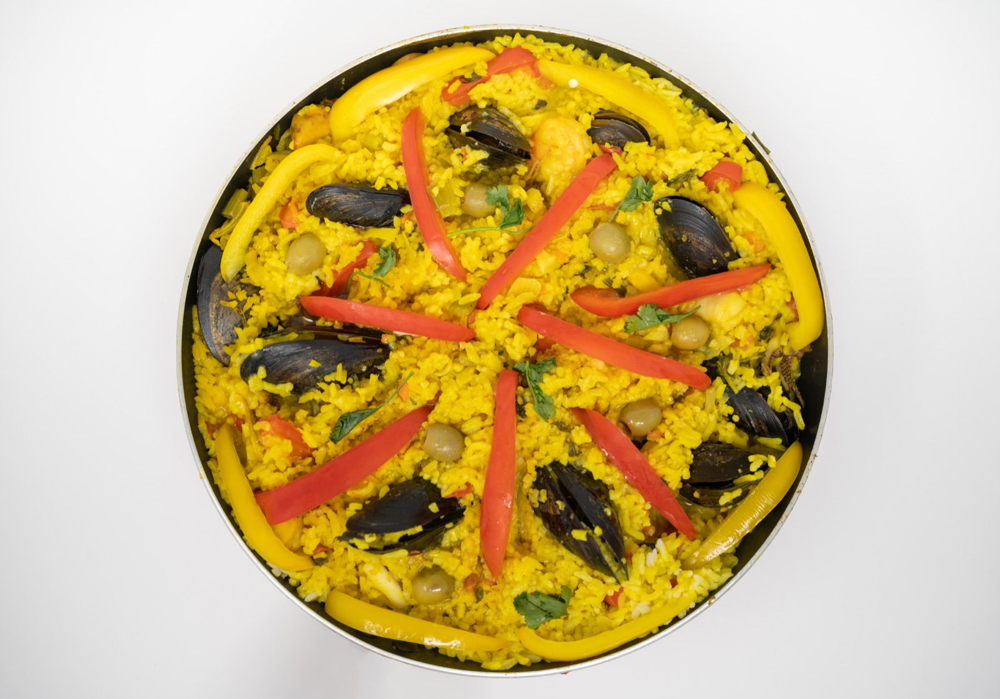
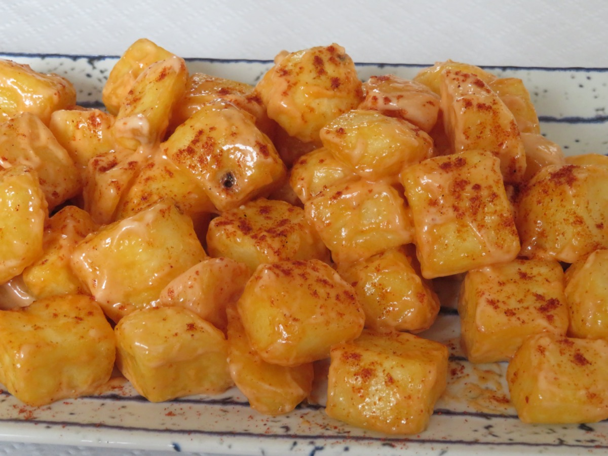
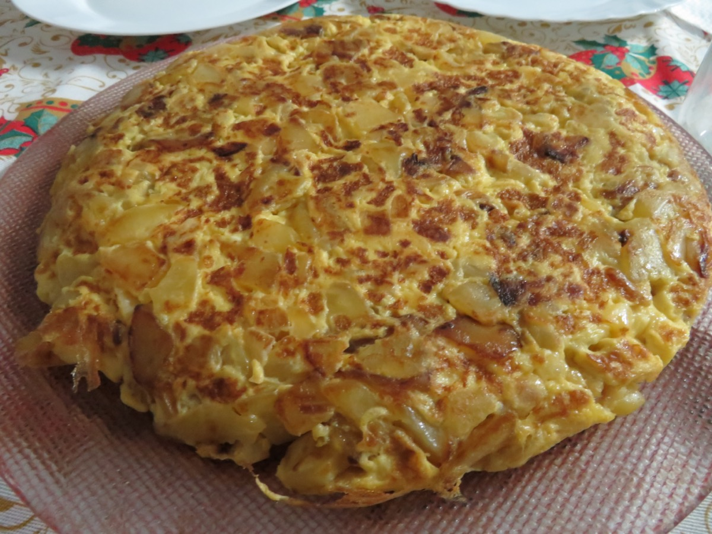
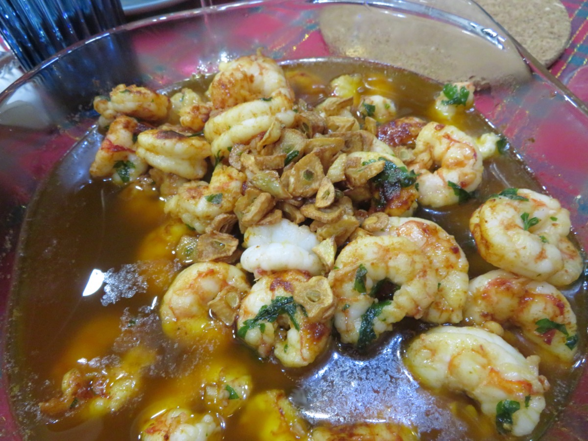
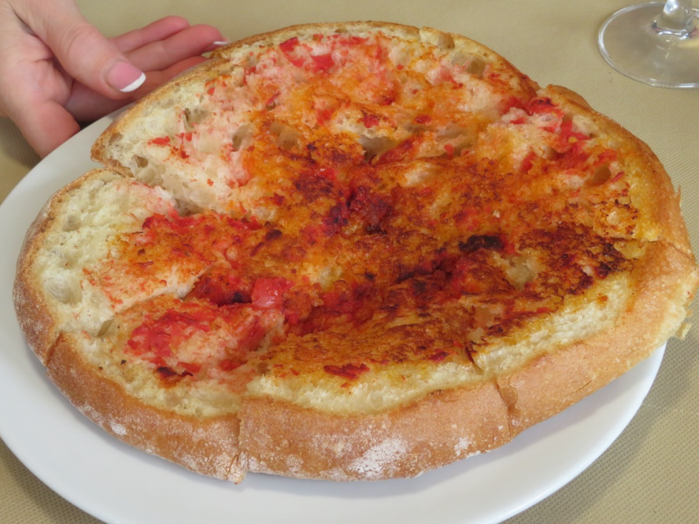
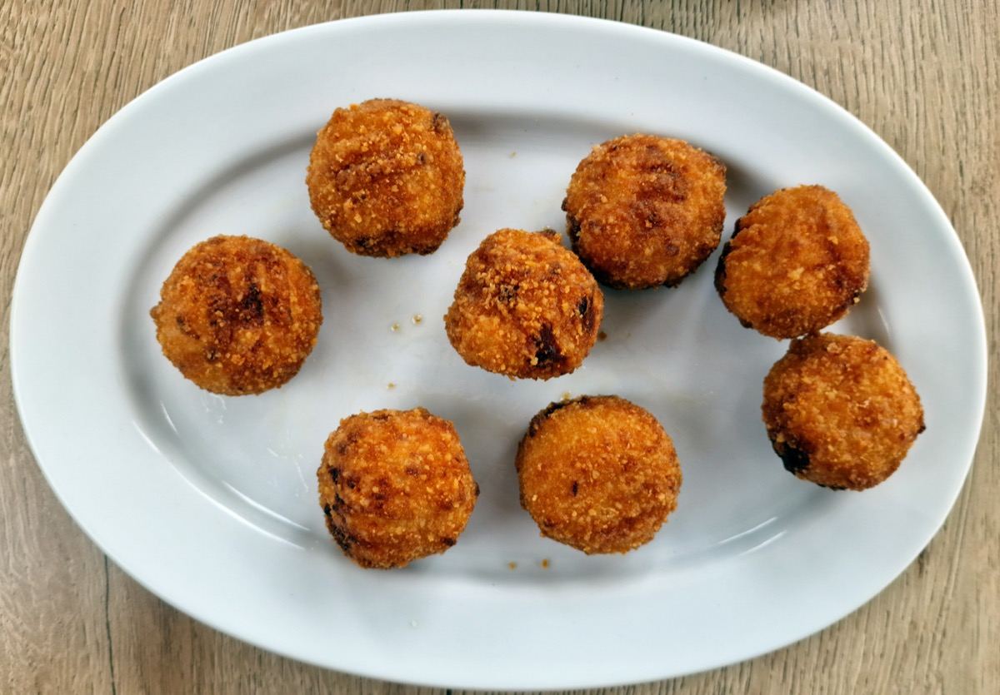
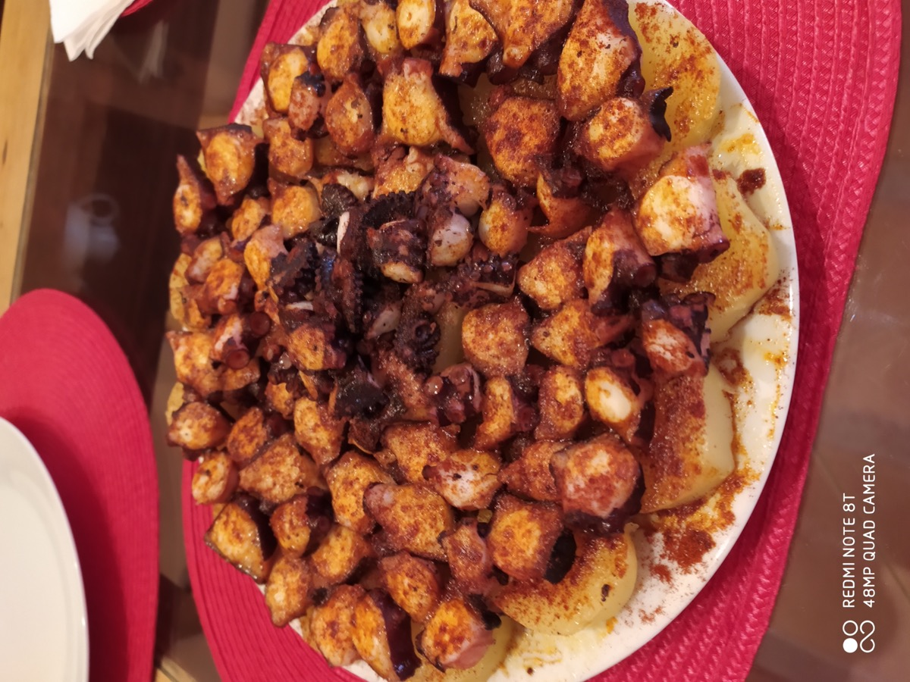
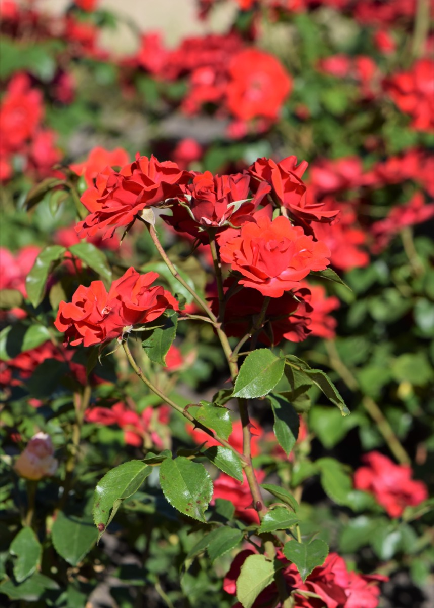

# 第十二部 - 西班牙 Tapas

西班牙菜的灵魂在 tapas - 一桌人不点正餐，每人面前一小盘小菜，配一杯酒或一壶 sangría，从傍晚六点慢慢吃到晚上十一点。"小份 + 多样"是这个体系的全部哲学：一道菜分量不大，但一桌摆五六道、八九道，每样夹一筷，每样都是不同质地、不同温度、不同主角。冷盘、热盘、油炸、生腌、海鲜、火腿、面包、炖菜，混在一桌不冲突，因为每道都很克制，都不抢戏。

这章选 7 道经典 tapas + 1 道 paella + 1 道 sangría。家常版本，国内进口超市能买到的食材为主。西班牙菜跟杭州口味的接近度中等：番茄面包、蒜油烩虾这类清爽合拍；火腿可乐饼、炸土豆偏油，但作为偶尔吃的小食可以保留。**关键是 pimentón（西班牙烟熏红椒粉）这一味必须有**，不能用普通辣椒粉代替 - 它不辣，是烟熏木香，整个西班牙菜的底色都是这个味道。

{ width="480" .center }

## 历史与地理

伊比利亚半岛被比利牛斯山从欧洲大陆切开，三面环海。北部（加利西亚、阿斯图里亚斯、巴斯克）大西洋气候湿润多雨，海产丰富，是章鱼、鳕鱼、贝类的世界；中部（卡斯蒂利亚、马德里）高原气候，烤乳猪、烤羊、炖菜是底子；南部（安达卢西亚）地中海气候干燥炎热，橄榄、葡萄酒、夏日冷汤（gazpacho）是日常；东部（巴伦西亚、加泰罗尼亚）平原临海，水稻和海鲜共存，paella 就是从巴伦西亚的稻田里长出来的。一国之内有四五种气候，西班牙菜的"区域差异"比意大利还显眼。

西班牙菜里最深的历史层是**摩尔人**（Moors，北非阿拉伯-柏柏尔人）。公元 711 年阿拉伯人渡海占领了大部分伊比利亚半岛，建立了安达卢西亚的阿拉伯文明（Al-Andalus），统治了将近八百年，到 1492 年格拉纳达陷落才彻底结束。这八百年里，阿拉伯人把**水稻、糖、杏仁、藏红花、肉桂、孜然、茄子、菠菜**带到了西班牙，paella 用米、用藏红花、用 sofrito（番茄洋葱蒜底子）的传统，根都在阿拉伯。今天西班牙南部的 gazpacho（番茄冷汤）、tortilla（煎蛋）、各种带杏仁的甜点，骨子里都有阿拉伯影子。

第二个历史层是**新大陆**。1492 年哥伦布从巴塞罗那出发，西班牙成为最早从美洲带回番茄、土豆、辣椒、可可、玉米的欧洲国家。十六世纪西班牙是世界上最有钱的帝国，新大陆食材通过塞维利亚和加的斯港涌入欧洲，然后再扩散到法国、意大利、其他地方。所以番茄进入欧洲菜的第一站是西班牙，**Pimentón**（烟熏红椒粉）就是西班牙人把美洲红辣椒在木火上烟熏干燥磨粉的产物，今天是西班牙菜最难替代的一味调料。

**Tapas**这个体系的起源有几种说法，最流行的是：南部安达卢西亚酒馆传统，给客人免费配一小片火腿或面包盖在酒杯上（tapa = "盖子"），既挡苍蝇又下酒。后来这个习惯演变成"点酒送小菜"的酒馆文化，再演变成今天点几道小菜配酒慢吃的完整就餐方式。Tapas 不是预先设计的菜系，是酒馆几百年里慢慢长出来的形态。

**伊比利亚火腿**（jamón ibérico）是另一项历史遗产。猪种是黑蹄伊比利亚猪（cerdo ibérico），饲料里至少有一段时间要让它在橡树林里散养吃橡子（bellota），杀后用海盐腌、悬挂风干一到三年。整个过程基本没变过，是欧洲最古老的火腿传统之一。

西班牙菜的味觉特征是「**油 + 烟熏 + 大蒜**」。橄榄油是底子，pimentón 给烟熏，大蒜（西班牙人均食用量在欧洲最高）给底味。这三样在很多 tapas 里都能尝到，是西班牙的味觉签名。

---

## Patatas Bravas（辣酱炸土豆）

{ width="360" .center }

### 起源

Patatas bravas 起源于 19 世纪的马德里酒馆，是西班牙首都最具代表性的 tapa。土豆是大航海后从美洲传入伊比利亚的舶来品，到 18 世纪末才在卡斯蒂利亚高原普及，酒馆借这种廉价淀粉做下酒小菜。Bravas 在西语里意为"勇敢"，专指淋在土豆上的那勺辣酱，因为当时的西班牙人吃辣远不如今天，敢吃这酱的人就被戏称"勇者"。这道菜的灵魂不在土豆而在两酱的对比，红色 bravas 走番茄加 pimentón 的烟熏辣路线，白色 alioli 走纯蒜油乳化的清爽路线，两酱不预先拌匀，靠食客自己在盘中调和。跟巴塞罗那同名版本不同，马德里派的酱基本不用番茄主导，靠红椒粉和辣油调出深红色，这也是辨别地域版本的关键。

### 食材

2-3 人份：

- 黄心土豆 600 g（粉质土豆，不要用蜡质的）
- 油 800 ml（深炸用，可重复利用）
- 盐 适量

bravas 辣酱：

- 番茄罐头（去皮整番茄）200 g
- 蒜 2 瓣（拍碎）
- pimentón dulce（甜烟熏红椒粉）5 g
- pimentón picante（辣烟熏红椒粉）2 g
- 雪利醋或白葡萄酒醋 5 ml
- 西班牙橄榄油 20 ml
- 盐 2 g

alioli 简化版：

- 蛋黄酱 60 g（市售 Hellmann's 即可）
- 蒜 1 瓣（磨成泥）
- 柠檬汁 3 ml
- 西班牙橄榄油 5 ml

### 步骤

1. 土豆去皮切 2.5 cm 见方块，**冷水泡 20 分钟**洗去表面淀粉（这步是外脆的关键）
2. 沥干，**用厨房纸彻底擦干**
3. 油加热到 150 度（中低温），**第一次低温炸 6 分钟**到土豆熟透但不上色，捞出沥油晾 5 分钟
4. 油升温到 190 度（高温），**第二次高温复炸 2 分钟**到金黄外脆，捞出撒盐
5. 同时做 bravas 酱：橄榄油下蒜末小火炒香 30 秒，加 pimentón 翻 5 秒（**别炒糊，红椒粉一糊就苦**），立刻加番茄、盐，小火煮 10 分钟，最后加醋调味，可用料理棒打成顺滑酱
6. alioli：蛋黄酱 + 蒜泥 + 柠檬汁 + 橄榄油搅匀
7. 装盘：炸土豆铺底，淋一勺 bravas 酱、一勺 alioli，两酱别拌匀让人自己挑

### 关键

- **两次炸**：第一次低温把土豆煮熟，第二次高温让外壳脆。一次炸要么外焦内生要么外软内熟
- **pimentón 不能换普通辣椒粉**：pimentón 是烟熏椒粉，木香烟熏味是整道菜的灵魂，普通辣椒粉只有辣没有烟熏
- **pimentón 下锅炒 5 秒就加水分**：红椒粉极易糊，糊了整锅苦
- 土豆**冷水泡 + 擦干**：泡去淀粉、擦干防溅油，两步缺一不可

### 常见错误

- 用普通辣椒粉代替 pimentón：味道完全不对，没有西班牙感
- 一次炸：外焦里生
- 土豆没擦干：油暴溅 + 外壳起泡不脆
- pimentón 在油里炒太久：苦味毁整锅酱
- 两酱拌匀：颜色变粉红色丢掉对比感

---

## Tortilla Española（西班牙土豆煎蛋）

{ width="360" .center }

### 起源

Tortilla española 的成型时间在 19 世纪初，地点是西班牙北部纳瓦拉（Navarra）地区。相传 1817 年第一次卡洛斯战争期间，将军 Tomás de Zumalacárregui 在前线急需一道便宜耐放又能让士兵吃饱的菜，当地一户农妇手头只有土豆、鸡蛋和橄榄油，临时把三样合在一锅煎成厚饼救急，从此在军队和乡村流传开。这道菜能成为国民食物，本质上是因为食材都是西班牙最便宜的家底，土豆来自新大陆、橄榄油是罗马人留下的传统、鸡蛋全国家家都有。跟法国 omelette 那种嫩滑半熟的薄煎蛋不同，tortilla 走的是厚实压秤的路线，土豆是主角而鸡蛋只是黏合剂，因此质感更接近一块切角的咸味蛋糕，常温吃最香。

### 食材

3-4 人份：

- 黄心土豆 500 g（去皮切 3 mm 薄片）
- 洋葱 1 个（约 200 g，切丝，**家常派加洋葱**，纯粹派只用土豆，看个人）
- 鸡蛋 6 个
- 西班牙橄榄油 250 ml（**真的需要这么多，会回收**）
- 盐 3 g

### 步骤

1. 平底锅（直径 22-24 cm 不粘锅最好）下橄榄油，中小火加热到 130 度（不冒烟，丢一片土豆有小气泡冒出）
2. 土豆片 + 洋葱丝下锅，**油要没过食材**，撒 1 g 盐
3. 中小火**慢煮 25 分钟**到土豆完全软透（用勺子能轻松压碎），中途偶尔翻动
4. **油过滤出来**（油可以留下次用），土豆和洋葱捞到大碗
5. 鸡蛋打散加 2 g 盐，倒入土豆碗，搅匀**静置 10 分钟**让土豆吸收蛋液
6. 平底锅留 15 ml 油烧到中火，倒入蛋液土豆混合物，铺平
7. 中小火煎 4-5 分钟到底面金黄边缘凝固
8. **关键翻面**：找一个比锅大的平盘子盖在锅上，左手按盘右手握锅柄，**快速倒扣**，土豆饼在盘子里
9. 锅里再下 5 ml 油，把饼**滑回锅里**，煎另一面 3-4 分钟
10. 出锅放木板上，**静置 5 分钟**再切（让中心稍微定型）

### 关键

- **油量大**：传统做法用油"煮"土豆而不是"煎"，土豆是被低温油炸熟而非煎熟，质感软糯。少油会变成炒土豆丝鸡蛋
- **中心要嫩**：好的 tortilla 切开中间应该还有点流动感（jugosa），不是干透。蛋液入锅静置 10 分钟让土豆吸饱蛋液是关键
- **翻面靠盘子倒扣**：直接用铲子翻必碎，用盘子倒扣是西班牙阿婆的标准操作
- **静置 5 分钟再切**：刚出锅切会塌

### 常见错误

- 油放太少：变成土豆丝煎蛋，不是 tortilla
- 土豆切太厚：25 分钟煮不软，咬上去硬芯
- 翻面用铲：碎成一锅
- 煎过头：中心干硬，失去 jugosa 感
- 大火：表面焦了里面没熟

---

## Gambas al Ajillo（蒜油烩虾）

{ width="360" .center }

### 起源

Gambas al ajillo 起源于安达卢西亚南部海岸，最迟在 19 世纪末已经是塞维利亚和加的斯酒馆里的固定 tapa。安达卢西亚靠近大西洋和地中海交汇处，红头小虾产量极大，又地处橄榄油主产区，加上摩尔人留下的重蒜传统，三样东西凑在一起就是这道菜的雏形。传统做法用一只巴掌大的素烧陶碗（cazuela de barro）直接上明火，陶器储热好、冷却慢，端上桌时油还在咕嘟冒泡，蒜片浸着虾的甜汁。剩下的蒜油不是浪费品，而是这道菜真正的主菜，要用乡村面包蘸光才算吃完，这也是跟法式蒜蓉黄油焗虾那种"虾是主角"的根本差异，西班牙人吃的就是那一锅油。

### 食材

2 人份：

- 大虾 250 g（**去壳留尾**，去虾线）
- 蒜 8 瓣（切薄片，**别切末**，片状慢慢释香）
- 西班牙橄榄油 80 ml（量大，是这道菜的精髓）
- 干辣椒 1 个（去籽掰碎）
- pimentón dulce 2 g（甜烟熏红椒粉）
- 雪利酒 10 ml 或干白 15 ml（可省）
- 盐 2 g
- 欧芹（parsley）2 g（切碎，最后撒）

### 步骤

1. 虾去壳留尾，**用厨房纸擦干**，撒一小撮盐腌 5 分钟
2. 小铸铁锅或厚底小锅，**冷油下蒜片**，开小火慢慢加热
3. 油温升到 110 度左右，蒜片开始冒小泡变浅金黄（约 3 分钟），下干辣椒
4. **蒜片刚变金黄立刻下虾**（再晚 30 秒蒜会焦），转中火
5. 虾入锅大约 60 秒翻面，再煎 60 秒（虾肉变红弯成 C 形即熟）
6. 撒 pimentón，**立刻**淋雪利酒（防止 pimentón 糊），盐，离火
7. 撒欧芹碎，连锅端上桌

### 关键

- **冷油下蒜小火慢熬**：蒜片在冷油中慢慢释放香气进油里。热油下蒜立刻焦黑，蒜油里会有焦苦味
- **蒜片不切末**：末状会糊，片状能保持金黄不焦
- **虾下锅前擦干**：湿虾入热油会爆，且油温骤降虾肉煮老
- **pimentón 最后撒**：先撒会糊。撒完立刻加酒或离火，红椒粉粘在虾上不糊
- **虾不要煎过**：60 秒一面够了，过头虾肉变橡皮

### 常见错误

- 热油下蒜：蒜焦，蒜油苦
- 蒜切成末：末容易糊
- 虾煎过头：橡皮口感
- pimentón 进锅太早：糊
- 用普通色拉油：橄榄油的果香是这道菜的底色，色拉油寡淡

---

## Pan con Tomate（番茄面包）

{ width="360" .center }

### 起源

Pa amb tomàquet 是加泰罗尼亚语原名，这道菜诞生于 19 世纪的加泰罗尼亚乡村，最早是农家早餐。农户手里常剩昨夜没吃完变硬的乡村面包，番茄又是地中海夏季泛滥的廉价食材，主妇就把番茄擦在硬面包上软化外壳，再淋自家压榨的橄榄油，一份饱腹的早饭就成了。这做法能流传开是因为它把"利用剩面包"这件穷人的事变成了主动的美味，番茄的酸汁和油的果香恰好让陈面包重新有了灵魂。跟意大利 bruschetta 是同一组食材但路数完全相反，bruschetta 是把番茄丁堆在面包上做成一个有形状的 topping，而 pa amb tomàquet 是把番茄擦碎渗进面包的孔隙里，最后盘子里只剩面包本体，没有任何配料的可见形状，这是加泰罗尼亚和意大利对同样食材的两种思路。

### 食材

2 人份：

- 乡村面包（ciabatta、baguette 或乡村酸种）4 片，约 2 cm 厚
- 成熟番茄 2 个（**必须熟透软到一捏出汁**，硬番茄做不出来）
- 蒜 2 瓣（去皮）
- 西班牙橄榄油 20 ml（**好油很关键**）
- 海盐（粗盐最好）适量

### 步骤

1. 面包片**烤到表面金黄微脆**（烤箱 200 度 5 分钟，或平底锅干烙两面，或烤面包机）
2. 面包出炉趁热，用蒜瓣**切面**在面包上来回擦 - 蒜被面包的粗面磨碎，香气直接进面包
3. 番茄从中间切开，**切面对着面包来回擦**（粗的一面，把番茄肉擦在面包上，皮和籽留手里弃掉），擦到面包变红微湿
4. 撒一小撮海盐
5. **大方淋橄榄油**（每片约 5 ml），让油渗进面包

### 关键

- **番茄必须熟透**：硬番茄擦不出肉，做出来只是湿面包。夏天的牛番茄、Roma 番茄熟透发软最好
- **面包要烤过**：脆面包擦番茄才能磨出番茄肉，软面包擦不动
- **蒜先擦面包再擦番茄**：顺序不对蒜的香进不去
- **橄榄油用好的**：这道菜就 5 样东西，油占大头，普通油寡淡有腥
- **粗海盐**比细盐好：颗粒感咬到嘴里有惊喜

### 常见错误

- 用硬番茄：擦不出来，做的是湿面包
- 面包没烤：擦不动番茄
- 油用色拉油：寡淡
- 加 mozzarella 或火腿：那是其他菜，pan con tomate 就这五样
- 番茄切片放面包上：完全不对，番茄要被擦碎渗进面包

---

## Croquetas de Jamón（火腿可乐饼）

{ width="360" .center }

### 起源

Croquetas 的根在法国，19 世纪初法国宫廷厨师把 béchamel 白酱裹粉油炸做成 croquette，作为高级宴席的开胃小食。西班牙伊莎贝尔二世时期，宫廷大量引入法式烹饪，croquette 跟着进入伊比利亚半岛，但西班牙人很快把馅料从原版的鸡肉、奶油改成了本地最常见的 jamón serrano 风干火腿、海鲜或鳕鱼。这种改造不是偶然，西班牙家家厨房年底都会剩下一堆切到骨头边的火腿碎和老硬边角料，厨娘们把这些碎末拌进白酱里炸成小卷正好物尽其用，于是 croquetas 从宫廷菜下沉成了家常菜。跟日本可乐饼那种以土豆泥为主的版本不同，西班牙 croquetas 的灵魂是浓厚到几乎流心的 béchamel 内馅，外壳一咬里头滚烫的奶酱要会涌出来，这种厚白汁的浓郁度在所有同源派生物里是最高的。

### 食材

约 18 个：

béchamel 馅：

- 黄油 50 g
- 面粉 60 g
- 全脂牛奶 500 ml（提前热到温热）
- Jamón Serrano 80 g（**切极小丁**，没有可用高品质风干火腿如意大利 prosciutto，**别用国产火腿肠**）
- 洋葱 半个（约 80 g，切极细末）
- 肉豆蔻粉 0.5 g
- 盐 2 g（火腿带咸，最后调）
- 黑胡椒 少许

裹粉：

- 鸡蛋 2 个（打散）
- 面粉 50 g
- 面包糠（panko 最好）100 g

炸：

- 油 800 ml

### 步骤

1. 黄油 + 洋葱末小火炒 8 分钟到洋葱透明软糯不上色
2. 加面粉，小火**搅拌 3 分钟**到面粉的生味散去（面糊呈淡金色，叫做 roux）
3. **温牛奶分 5 次加入**，每次加完用打蛋器搅到完全融合再加下一次（一次加完会结疙瘩）
4. 全部加完后小火继续搅 10 分钟到面糊浓稠到铲子划过能看到锅底
5. 加火腿丁、肉豆蔻、黑胡椒、盐（先少加，火腿出咸再调）
6. 馅倒进方盘，铺平 1.5 cm 厚，**贴面盖保鲜膜**（防结皮），冷藏至少 4 小时或过夜
7. 馅冷透后切 4 cm × 2.5 cm 的小块，**手沾水**搓成小圆柱
8. 三道裹粉：面粉 → 蛋液 → 面包糠（每道都要均匀，特别是面包糠要按紧）
9. 油 180 度，**每次炸 3-4 个**（多了油温降），炸 90 秒到金黄
10. 沥油，趁热吃

### 关键

- **面糊够稠**：搅到铲子能划出沟、沟不立刻合上才行。馅稀了搓不成型，炸时会爆
- **冷藏定型至少 4 小时**：白酱必须完全冷透变硬才能搓形，不然炸时会炸开
- **温牛奶 + 分次加 + 持续搅**：白酱不结疙瘩的三个铁律
- **三道裹粉缺一不可**：面粉吸湿、蛋液粘合、面包糠成壳。少一道炸时会破
- **真火腿**：Jamón Serrano、prosciutto 这类风干火腿才有那种发酵后的浓香。火腿肠肉味单薄，做出来索然无味
- 国内进口超市买不到 Jamón，prosciutto crudo 是最好的替代

### 常见错误

- 馅没冷透就搓：搓不成型，炸时全爆
- 牛奶冷的或一次加完：结疙瘩，过滤都救不回来
- pimentón 加进 béchamel：传统不放，加了味道乱
- 火腿丁切太大：咬到突兀的硬块
- 油不够热：吸油变腻

---

## Pulpo a la Gallega（加利西亚章鱼）

{ width="360" .center }

### 起源

Pulpo a la gallega 又叫 pulpo á feira（集市章鱼），出处颇为反直觉，它不是来自加利西亚的海岸渔村，而是在内陆山区 Lugo 省的圣诞节集市上成形的。19 世纪起加利西亚海岸的渔民会把章鱼晒干或盐腌后用骡车运进内陆贩售，集市上专门有一类摊主叫 pulpeiras，她们用大铜锅在露天煮章鱼现场切片卖。铜锅的导热性让水温稳定，章鱼皮不会被冲烂，这是这道菜定型的工艺关键。装盘用素木盘而非瓷盘，因为木头吸水让章鱼不会泡在汤里影响口感。最后那一撒 pimentón 烟熏红椒粉是大航海后才补上的元素，把美洲红辣椒在加利西亚的木火上烟熏磨粉，红色撒在章鱼皮的紫红上构成这道菜的标志视觉，少了这一味就只是水煮章鱼，不是 a la gallega。

### 食材

2-3 人份：

- 冷冻章鱼 800 g（**冷冻章鱼比新鲜的好**，冷冻打破了肌肉纤维让章鱼自然变嫩）
- 黄心土豆 400 g
- pimentón dulce 5 g
- pimentón picante 1 g（一小撮辣的，可省）
- 西班牙橄榄油 30 ml（淋面，要好的）
- 粗海盐 适量
- 月桂叶 1 片（煮章鱼用）

### 步骤

1. 章鱼提前一天**冷藏解冻**，洗净（眼睛、内脏、嘴部硬喙都要去除，市场买的一般已处理）
2. 大锅烧水（水量没过章鱼），加月桂叶，水沸后**章鱼"惊吓"三次**：手抓章鱼头部，提起入沸水浸 5 秒拎出，再浸再拎，做 3 次（**这步让章鱼皮缩紧定型不脱落**）
3. 第三次后章鱼整只放入沸水，**保持微沸**煮 35-40 分钟（800 g 章鱼）
4. 测试是否软嫩：**用尖刀刺章鱼最厚处**（触手根部），刀进出无阻力即熟
5. 关火**焖在汤里 10 分钟**让章鱼吸盐分
6. 同时另一锅水煮土豆：土豆带皮整个煮 20 分钟（或切 1.5 cm 厚片煮 12 分钟），软了去皮切 1 cm 厚片
7. 装盘：木板或粗陶盘最好，土豆片铺底
8. 章鱼出锅，**用厨房剪刀剪 1 cm 厚片**（剪比刀切好，刀切会压扁），摆在土豆上
9. 撒粗盐、pimentón dulce、一小撮 pimentón picante（如果要辣），**大方淋好橄榄油**

### 关键

- **冷冻章鱼比新鲜好**：冷冻冰晶破坏肌肉纤维，自然变嫩。新鲜章鱼反而要打上百下才软
- **三次惊吓**：让皮收缩贴肉，不至于煮的时候皮整片脱落（叫 asustar el pulpo）
- **微沸不大滚**：大滚章鱼皮被冲烂
- **关火焖 10 分钟**：章鱼最后阶段吸盐分入味
- **剪刀切片**：刀切会把章鱼压扁形变，剪刀垂直下剪保持圆片形
- **pimentón 撒在章鱼上**：传统装盘，红色撒在章鱼皮的红色上是这道菜的标志视觉

### 常见错误

- 不"惊吓"直接下锅：皮脱落，章鱼难看
- 大火滚煮：皮烂掉
- 煮过头：肉柴
- 煮不够：橡皮咬不动
- 用刀切：压扁失去圆片美感
- 用普通辣椒粉代替 pimentón：颜色对了味道不对

---

## Paella Valenciana（家常版瓦伦西亚海鲜饭）

{ width="360" .center }

### 起源

Paella 诞生于 19 世纪中叶的瓦伦西亚 Albufera 湖区稻田，最初是田间农民的午饭。瓦伦西亚的水稻是摩尔人 8 世纪带进伊比利亚后留下的遗产，到 19 世纪 Albufera 已是西班牙最大的稻米产区。农民收稻间歇就在田边架起浅口大铁锅，把手边能抓到的兔子、田鸡、蜗牛和菜豆扔进锅里跟米一起煮，木柴火把锅底那层米烧出焦香，吃完这一锅下午继续干活。锅本身在瓦伦西亚方言里就叫 paella，这道菜因器得名。今天家喻户晓的海鲜版（paella de marisco）其实是 20 世纪 60 年代旅游业起来后为迎合外国游客改造的，正宗瓦伦西亚人会强调海鲜版根本不算 paella valenciana。跟意大利 risotto 走奶白浓稠的路线相反，paella 的灵魂是米粒分明加锅底那层叫 socarrat 的焦香层，全程不能搅拌，这是它跟所有米饭菜的根本分界。

### 食材

3-4 人份：

- **Bomba 米或 Calasparra 米 300 g**（西班牙短粒米，**不能换意大利 Arborio 或国产米**：Arborio 出淀粉太多变 risotto 状，国产米吸不进汤）
- 大虾 8 只（带头带壳）
- 青口贝 250 g
- 鱿鱼圈 150 g
- 鸡腿肉 200 g（去骨切块，**家常版加点鸡肉吊汤**）
- 番茄 1 个（150 g，去皮磨成泥）
- 洋葱 半个（80 g，切极细末）
- 蒜 4 瓣（切末）
- 红甜椒 半个（50 g，切丁）
- 青豆 50 g
- 鱼汤或鸡汤 800 ml（**热的，分量约米的 2.7 倍**）
- 西班牙橄榄油 40 ml
- pimentón dulce 5 g
- 藏红花 0.2 g（一小撮，**真藏红花**，无可替代）
- 盐 适量
- 柠檬 1 个（切角，配吃用）
- 欧芹少许（最后撒）

### 步骤

1. 藏红花放小碗，加 30 ml 热水泡 10 分钟（水变金黄色）
2. 直径 28-32 cm 的平底锅或铸铁浅锅烧热，下橄榄油
3. 大虾下锅每面煎 30 秒（外壳变红即可，**别煎熟**），盛出备用
4. 鸡腿肉块下锅煎 5 分钟到表面金黄，盛出备用
5. 锅里下洋葱末 + 蒜末 + 红甜椒丁，中火炒 5 分钟到软透
6. 加番茄泥继续炒 5 分钟到番茄水分蒸干变浓稠（这一步叫 sofrito，是底味）
7. 加 pimentón 翻 5 秒（**红椒粉别炒糊**），立刻下米
8. **米下锅干炒 1 分钟**（每粒米裹上 sofrito 颜色变浅金）
9. 倒入热鱼汤 + 藏红花水，鸡肉回锅，加盐尝味（汤要稍咸于喝汤的咸度，因为米会吸）
10. **大火滚开 5 分钟**让米均匀分布在锅里，**全程不能再搅拌**（搅拌出淀粉变 risotto）
11. 转中火**煮 8 分钟**，期间均匀分布大虾、青口、鱿鱼圈、青豆在表面（贝壳张口朝上）
12. 转**小火再煮 8 分钟**到汤几乎收干（米表面有小气孔）
13. **最后大火 1-2 分钟**让锅底形成 socarrat 焦香层（听到滋滋声，闻到微焦但不糊的香气立刻关火）
14. 关火盖一块干净布**焖 5 分钟**让米完全吸饱
15. 撒欧芹，柠檬角放盘边

### 关键

- **米必须是 Bomba 或 Calasparra**：西班牙短粒米吸汤性极强（吸 3 倍水量），结构稳定。意大利 Arborio 出淀粉，国产米米心硬。在国内进口超市或淘宝可买
- **米下锅后绝不搅拌**：这是 paella 与 risotto 的根本区别。Risotto 要搅出淀粉变奶白，paella 要每粒米独立、锅底有焦层
- **socarrat 是灵魂**：锅底那层金黄焦香米是 paella 之所以为 paella。听锅底滋滋声，闻到将糊未糊的焦香就是了
- **藏红花真品**：那一抹金黄和那种特殊药草香无可替代。姜黄染的颜色有但没那个香
- **汤量精准**：米的 2.7 倍。多了 paella 是粥，少了底层米心硬
- **海鲜后下**：海鲜煮 5 分钟就熟，跟米一起 25 分钟早老成橡皮
- **平底锅一层**：米平铺一层 1.5 cm 厚最好，太厚煮不透，太薄变锅巴

### 常见错误

- 用 Arborio 米：米软糯出淀粉，做的是西班牙风味 risotto
- 用国产米：吸不进汤，米心硬，汤没吸尽
- 中途搅拌：淀粉出来变粥
- 没有 socarrat：少了灵魂层
- 用姜黄替代藏红花：颜色像了味道差远
- 海鲜跟米一起煮 25 分钟：海鲜橡皮口感
- 加酱油或其他亚洲调料：那是炒饭，不是 paella

---

## Sangría（夏日水果红酒）

{ width="360" .center }

### 起源

Sangría 的诞生地不在伊比利亚半岛而在 18 世纪的西印度群岛。当时英国和西班牙殖民者在加勒比岛屿上把廉价红酒、糖、水果和当地朗姆混在一起做成解暑凉饮，因为深红酒色像血，西语 sangre（血）派生出 sangría 这个名字。19 世纪殖民者回流伊比利亚，把这种喝法带回西班牙，正赶上西班牙南部安达卢西亚夏季酷热的气候，配 tapas 喝立刻流行开。1964 年纽约世博会西班牙馆把 sangría 推向全球，从此成了西班牙的国家符号。跟法国冬天的 vin chaud（热红酒，加丁香肉桂热饮驱寒）路数完全相反，sangría 是冷饮配冰块、水果切丁浸泡数小时让果香渗进酒里，喝的是夏天的清凉而不是冬天的暖意。家家比例不同，但万变不离红酒、水果、一点烈酒和一点甜这四样底子。

### 食材

1 大壶约 1.5 升（4-6 人份）：

- 西班牙红葡萄酒 750 ml（**Tempranillo 或 Garnacha**，干红，便宜的就行约 50-100 元一瓶，太贵反而浪费）
- 橙子 1 个（半个挤汁、半个切薄片）
- 柠檬 1 个（半个挤汁、半个切薄片）
- 苹果 1 个（去核切丁）
- 桃子或梨 1 个（去核切丁，应季水果）
- 草莓 5-6 颗（切半，可省）
- 白兰地或橙力娇酒（Cointreau / Triple Sec）30 ml
- 白糖 30 g 或蜂蜜 25 g（按红酒酸度调整，先少后加）
- 苏打水或气泡水 200 ml（**喝之前才加**，提前加气泡飞了）
- 大量冰块（喝之前加）
- 肉桂棒 1 根（可省，传统加这一味很香）

### 步骤

1. 苹果、桃子、橙片、柠檬片、草莓放入大壶
2. 撒糖，倒入白兰地，**用木勺压一压水果释放汁水**
3. 倒入红酒、橙汁、柠檬汁、肉桂棒
4. 搅匀，**冷藏至少 4 小时**（最好过夜）让水果味充分进酒
5. 喝之前**加大量冰块**，倒入苏打水搅一下
6. 倒进大酒杯，每杯舀几块水果

### 关键

- **冷藏 4 小时以上**：sangría 不是混合就喝的鸡尾酒，是浸泡饮品。水果味要时间渗进酒里
- **苏打水最后加**：提前加气泡跑光，喝起来平淡。喝之前 1 分钟加最好
- **红酒别用贵的**：好酒被水果掩盖太可惜，10-15 欧元（国内 50-100 元）的 Tempranillo 是绝配
- **白兰地或 Triple Sec 一点点**：增加层次和度数（红酒 12 度，加完约 14 度），多了变烈酒
- **水果用应季**：夏天桃子、西瓜、莓果；冬天换苹果、柑橘类

### 常见错误

- 不冷藏直接喝：水果味没渗出，就是兑了水果的酒
- 苏打水提前几小时加：气泡全飞，平淡
- 红酒用太好的：浪费
- 糖加太多：变果汁酒
- 用甜葡萄酒（Port、甜雪利）：本身就甜，加水果加糖齁死人
- 冰块提前加：化了稀释整壶

---

## 文化与场景

### 时令与节气

西班牙的食材时令跟极端气候直接绑定。夏天 6 月到 9 月安达卢西亚动辄 40 度以上，所以夏季食物全围绕消暑展开，番茄黄瓜青椒打成的冷汤 gazpacho 和 salmorejo 是日常午餐替代品；西瓜配伊比利亚火腿咸甜对冲解暑。橄榄要等到 10 月到次年 1 月才采，安达卢西亚的 Jaén 省是世界最大的橄榄油产区，新油 11 月底上市颜色发绿辣口。

秋冬是猪肉腌制季节，传统叫 matanza（屠猪节），从 11 月到次年 2 月乡村家庭霜降后宰一头自家猪，腿做火腿风干 2 到 4 年成 jamón，肉糜灌成 chorizo 和 morcilla。冬天马德里高原寒风呼啸，传统主菜是各种 cocido（肉菜锅），cocido madrileño 一锅煮鹰嘴豆培根香肠鸡肉牛肉卷心菜，分三道上桌：先喝汤、再吃豆和菜、最后吃肉。

### 餐桌格局

西班牙的餐饮文化里 tapas 是底层操作系统。tapas 不是一道菜的名字，是一种吃法：一桌人共享六到八小盘，配酒慢慢吃。这种吃法源于 19 世纪安达卢西亚酒馆传统，今天马德里、巴塞罗那、塞维利亚的老城区傍晚 7 点之后人们一家一家酒馆串（叫 tapeo），每家点一两道招牌 tapa 配一杯酒，整晚走五六家是常态。

西班牙的餐时间在欧洲算最晚的，午饭 2 到 4 点吃，晚饭 9 到 11 点吃。这跟它的纬度和气候有关，加上 1940 年代佛朗哥时代把全国时区往东挪了一个钟头沿用至今，西班牙人的"晚上 9 点"按太阳时间其实是 8 点。游客 6 点去餐厅会发现没开门。

午饭后的 sobremesa 是西班牙独有的传统，字面"在桌上"，指饭后所有人不离座喝咖啡或餐后酒，聊上 1 到 2 个小时甚至更久，是家庭和友人交流的核心时段，比餐本身更重要。午睡 siesta 是配套传统，下午 3 到 5 点商店关门，过去是体力劳动者的必需，现在大城市少见但小镇仍保留。

### 节庆与仪式

圣诞夜（Nochebuena，12 月 24 日晚）是全年最重的家庭聚餐，烤羊和烤乳猪是卡斯蒂利亚一带的标志，加利西亚和巴斯克吃海鲜大餐。甜点 turrón、polvorones、mazapán 都是阿拉伯人留下的传统。12 月 31 日跨年夜要在最后 12 秒之内吃 12 颗葡萄（las doce uvas）每颗代表一个月好运，这是 1909 年阿利坎特葡萄农大丰收推出的营销活动，意外成了全国传统。

1 月 6 日的 Three Kings Day（Día de Reyes）在西班牙比圣诞更隆重，孩子们这天才收礼物（不是 12 月 25 日），全家围吃 roscón de reyes，一种奶油夹心的圆环蛋糕，里面藏一颗小瓷偶和一颗蚕豆，吃到瓷偶的是当天的"国王"，吃到蚕豆的负责付钱买蛋糕。

地区圣徒节（fiestas patronales）是西班牙最热闹的传统，每个城镇有自己的主保圣人：潘普洛纳 7 月的 San Fermín 节有著名的奔牛活动；瓦伦西亚 3 月的 Las Fallas 烧巨型纸偶，吃 buñuelos 配热巧克力；塞维利亚复活节后的 Feria de Abril 通宵跳 sevillanas 配雪利酒和炸小鱼。

### 跟邻近菜系的边界

西班牙跟葡萄牙共享伊比利亚半岛，但同样的食材两边处理不同。鳕鱼干 bacalao 在西班牙是巴斯克菜的核心，做法是 al pil-pil（蒜油乳化酱）和 a la vizcaína（番茄椒酱炖）；同一种鳕鱼干在葡萄牙叫 bacalhau，做法据说有 365 种，处理更碎更家常。同样的猪肉腌制，西班牙 jamón ibérico 走橡子散养路线，葡萄牙 presunto 走盐腌烟熏路线，咸度和烟感都不同。

西班牙跟拉美的关系是反向殖民影响。16 世纪西班牙把番茄土豆辣椒可可玉米从美洲带回欧洲，是这些食材进入旧大陆的第一站。但反过来拉美菜也回流影响西班牙：墨西哥的 mole 酱用了西班牙修道院传过去的香料组合，秘鲁的 ceviche 是西班牙水手和印加食材的合体。两边甜点（churros、flan、arroz con leche）几乎共享。

西班牙菜的国内分立比意大利更明显。加泰罗尼亚受地中海影响重，多用番茄橄榄油海鲜，跟法国南部普罗旺斯菜更近。安达卢西亚受摩尔人八百年统治影响最深，gazpacho、油炸海鲜、杏仁糕点骨子里有阿拉伯气质。巴斯克独立性最强，pintxos、bacalao al pil-pil、txakoli 微泡白酒自成体系，巴斯克语本身跟西班牙语不同源。一个西班牙人会说"我吃加泰罗尼亚菜"或"巴斯克菜"，很少说"西班牙菜"。

---
